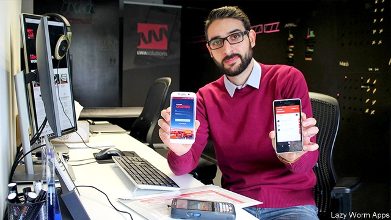

###### Darting, seizing, winning

# Obituary: Atta Elayyan was killed on March 15th 

##### The software developer, gamer and futsal goalie, a victim of the Christchurch gunman, was 33 

 

> Mar 21st 2019 

THE ONLY part of Atta Elayyan’s life that was lazy was his habit of starting the day when he felt like it. He was not a morning person. Once out of bed, though, he was unstoppable. He would fire up Trello to go through his to-do list, then dive into his emails to follow up conversations with clients, potential clients, partners and anyone else connected with his software-development company, Lazy Worm Applications, and its IT services arm, LWA Solutions. All that took care of the morning. The afternoon was filled with meetings over coffee to discuss how projects were going, then meetings to urge on the design and development teams. At night he had to check on deliveries and sales, before starting the protracted round of emails and conference calls with customers who, a long way from New Zealand time, were just waking up. 

Somewhere in there was dinner with the family, his wife Farah and two-year-old daughter Aya, who had a bib reading “My Dad rocks!” His more demanding baby, though, was Lazy Worm Apps, which since 2010 he and a classmate from Canterbury University, Mike Choeung, just two guys, one tall, one short, had built into a star turn on the Christchurch tech scene. Now there was a 14-man team, and they had moved into digs in Print Place with so much space that it gave him ideas immediately of how much bigger they could get. As it was they took on university interns every summer, and he often put out Twitter appeals for more. 

Everything had taken off when Mike got a Microsoft Windows Phone 7 and he fell in love with it, especially the colourful Live Tiles that linked at a touch to apps, functions and features, could be dragged around and added to, and updated in real time. He decided he too would specialise in Windows Phone apps and make user interfaces that delighted people, a word he used a lot. Within a few years Lazy Worm, with no outside investment, provided some of the most popular apps on the Windows Store and was nearly acquired by Google. He was truly stoked to think of that. 

Individual users were in his mind, too, when companies came to him for smart solutions. He liked to work alongside their employees for a while, so that he could tailor an app exactly to their routines. In 2016 he went for a week to Jordan on a contract for Aramex, the biggest transport and logistics company in the Middle East, and had a blast driving one of their red vans round Amman to find out what sort of software the company’s couriers needed. The answer was to turn their low-end phones into really accurate scanners, so that all their tasks—scanning the package, calling the customer, getting directions—were in one app and one click. There you had it: delight and empowerment at the same time. 

Microsoft had helped him win that contract, and his link stayed close, so close that using the rival Apple iPhone seemed like going back to the dark side. Month by month Microsoft’s latest devices turned up free in the office, new toys for the team to tinker with. So when he got deep into his latest passion, augmented, mixed and virtual reality, a HoloLens headset was right there waiting for him. He posed like a fighter in that awesome piece of tech. VR was at the core of Lazy Worm’s highly successful training app for pilots at the Port of Auckland, which simulated the hazardous process of climbing up a high rope ladder onto moving container ships. 

To succeed at VR he had to recruit 3D modellers and animators, but that world was second nature to him. For a few years after taking his computer-science degree he had been a professional gamer, tag Cr@zyArab, joining the New Zealand e-sports team NewType to win several tournaments of “Counter-Strike: Source”, which pitched soldiers against terrorists. They would play for six or seven hours a night. He posted the best moments on YouTube, including the one where, darting through the streets of some Arab town, he took on Top Gun (who was looking the wrong way) and destroyed him with a terrific burst of semi-automatic fire. 

Nimbly warding off opponents was quite a feature of his life. Somehow he fitted in another career as a goalie in the game of futsal, indoor football, and was so good that, as well as playing for Canterbury United Dragons and coaching at his old school, Christchurch Boys’ High, he was picked for the Whites, the national squad. Though he held citizenships from elsewhere—Kuwaiti from his birthplace, Palestinian from his father—and though he had spent his childhood in Oregon, he was proud to wear the silver fern on his shirt. He was not just the tallest in the team, with the best beard, but the only guy in elbow pads, knee pads, gloves and long trousers, prepared to leap, twist and dive to the solid floor to keep the opponents’ ball out of the net. Even at play, he couldn’t rest those lightning reflexes. If he once touched the ball, he had four seconds to pass it; no room to fail. 

The tech world, too, moved at such breakneck speed that he had to be aware of every opportunity, hungry, ready to grab. He watched colleagues leap on to Android and iOS before he could, when he was still moonlighting with Mike to try to get the company started. He tried many avenues that didn’t work, and wasn’t that surprised by the eventual demise of Windows Phones; he’d picked the underdog precisely because others hadn’t. Usually he kept the failures quick, and bought the team dinner whenever they had success. All through he kept up the punishing, exciting schedule of emails, meetings, project management, conference calls, coffee and more coffee. The only long regular break he took in the week was to go to Friday prayers. “On the Day of Assembly, hasten earnestly to the Remembrance of Allah, and leave off business. That is best for you, if ye but knew!” was the injunction in the Koran. 

The Al-Noor mosque next to Hagley Park was special to him for family reasons. His father, Mohammed, had co-founded it only a year after coming to New Zealand from America. In Corvallis, in Oregon, he had founded another, to help the Muslim community take root there. His mother had offered Arabic lessons. It seemed a family trait to want to grow things fast, as Atta wanted to grow his company and the high-school futsal team. He was an impatient guy, but he was still young. There was time. 

  

-- 

 单词注释:

1.dart[dɑ:t]:n. 飞镖, 投射 vt. 投射 vi. 疾走, 突进 

2.atta[]:abbr. 泰国旅行社协会（Association Of Thai Travel Agents） 

3.developer[di'velәpә]:n. 开发者 [计] 显影器 

4.gamer['ɡeimә]:n. 玩家, 博弈者 

5.futsal[]:[网络] 五人制足球；五人足球；室内足球 

6.goalie['^әjli]:n. 守门员 

7.Christchurch['kraist-tʃә:tʃ]:n. 克赖斯特彻奇 

8.gunman['gʌnmәn]:n. 枪手, 持枪的歹徒, 制造枪械者 [法] 持枪歹徒, 持枪抢劫或杀人者, 枪炮工人 

9.unstoppable[ʌnˈstɒpəbl]:a. 无法停止的, 不可阻碍的 

10.client['klaiәnt]:n. 客户, 顾客, 委托人 [计] 客户, 客户机, 客户机程序 

11.lwa[]: [计]= Last Word Address,末字地址 

12.protract[prәu'trækt]:vt. 延长, 拖延, 伸出, 绘制 [法] 延迟, 拖延, 延长 

13.zealand['zi:lәnd]:n. 西兰岛（丹麦最大的岛） 

14.Farah[]:n. 法拉赫, 阿富汗西部河流 pers. 法拉, 法拉赫 

15.aya[]:abbr. 美国AYA项目（Academic Year in America）；急性黄色肝萎缩（Acute Yellow Atrophy Liver） 

16.bib[bib]:n. 围涎 v. (使)大量喝酒 

17.APP[]:[计] 应用, 应用程序; 相联并行处理器 

18.canterbury['kæntәbәri]:n. 坎特伯雷(中世纪时宗教朝圣地) 

19.mike[maik]:vi. 偷懒, 游手好闲 n. 休息, 游手好闲, 扩音器, 话筒 

20.tech[tek]:n. 技术学院或学校 

21.twitter['twitә]:n. 啁啾, 唧唧喳喳声 vi. 啭, 啁啾, 颤抖 vt. 嘁嘁喳喳地讲, 抖动 

22.Microsoft[]:n. (美国)微软公司 [电] 微软公司 

23.colourful['kʌlәful]:a. 颜色丰富的, 鲜艳的, 艳丽的, 多色的, 丰富多彩的, 吸引人的, 引人入胜的 [计] 有色的 

24.tile[tail]:n. 砖瓦, 瓷砖, 瓦片 vt. 铺以瓦, 铺以瓷砖 [计] 平铺 

25.update[ʌp'deit]:vt. 更新, 使现代化 n. 更新 [计] 更新 

26.specialise['speʃә,laiz]:vt. 特加指明, 列举, 使专门化, 限定...的范围 vt.vi. (使)特化, (使)专化 vi. 成为专家, 专务, 专攻, 专门研究, 逐条详述 

27.interface['intәfeis]:n. 分界面, 接触面, 界面 [计] 接口, 界面 

28.google[]:谷歌；搜索引擎技术；谷歌公司 

29.stoke[stәuk]:v. 司炉, (使)大吃 

30.jordan['dʒɒ:dәn]:n. 约旦, 约旦河, 尿壶 

31.logistic[lәu'dʒistik]:a. 逻辑的, 后勤学的 

32.Amman[æ'mɑ:n]:n. 安曼(约旦首都) 

33.courier['kuriә]:n. 送快信的人, 伴游服务员 [法] 信使, 送急件者 

34.scanner['skænә]:n. 扫描仪, 扫描盘, 审视者 [计] 扫描器; 词法分析程序; 扫描程序; 扫视程序 

35.empowerment[ɪm'paʊəmənt]:n. 授权; 许可 

36.iphone[]:n. 苹果手机 

37.tinker['tiŋkә]:n. 补锅匠, 会做各种修补活计的人 vi. 做焊锅匠, 笨拙的修补 vt. 修补 

38.augment[ɒ:g'ment]:v. 增加, 增长 [计] 增加; 增量; 添加 

39.hololens['hɔlәulenz]:[计] 全息透镜 

40.headset['hedset]:n. (一副)耳机 [电] 头载机组 

41.vr[]:abbr. 虚拟现实（virtual reality） 

42.Auckland[ɒ:klәnd]:n. 奥克兰(新西兰港口) 

43.simulate['simjuleit]:vt. 模拟, 假装, 模仿 [法] 伪装的, 模拟的; 假装的, 伪装的, 冒充 

44.hazardous['hæzәdәs]:a. 危险的, 冒险的, 碰运气的 [法] 危险的, 冒险的, 碰运气的 

45.modeller[ˈmɒdələ(r)]:n. 塑像者; 分析员 

46.animator['ænimeitә]:n. 赋与生气者, 鼓舞者, 漫画制作者 

47.terrorist['terәrist]:n. 恐怖分子 [法] 恐怖份子, 恐怖主义 

48.youtube[]:n. 视频网站（可以让用户免费上传、观赏、分享视频短片的热门视频共享网站） 

49.nimbly['nimbli]:adv. 敏捷地, 机敏地 

50.squad[skwɒd]:n. 班, 小队, 小集团 vt. 编成班 

51.citizenship['sitizәnʃip]:n. 国籍, 市民权, 市民的身份 [法] 公民权, 公民资格, 公民身分 

52.Palestinian[,pælis'tiniәn]:[经] 巴勒斯坦的 

53.Oregon['ɒ:rigɒn]:n. 俄勒冈 

54.fern[fә:n]:n. 蕨类植物 [医] 蕨类植物 

55.trouser['trauzә]:a. 裤子的 

56.reflex['ri:fleks]:n. 反射, 反射光, 映像 a. 反射的, 折转的 vt. 使折转, 使折回 

57.breakneck['breiknek]:a. 要使颈骨折断似的, 非常危险的 

58.grab[græb]:n. 抓握, 掠夺, 强占, 东方沿岸帆船 vi. 抓取, 抢去 vt. 攫取, 捕获, 霸占 

59.android['ændrɒid]:n. 机器人 [医] 男性样的 [计] Google 公司设计的开源移动端操作系统 

60.IO['aiәu]:[计] 输入输出 

61.moonlight['mu:nlait]:n. 月光 a. 有月光的, 月夜的 

62.eventual[i'ventʃuәl]:a. 最后的, 终于的 

63.demise[di'maiz]:n. 崩, 薨, 死亡 vt. 让渡, 遗赠, 转让 

64.underdog[.ʌndә'dɒg]:n. 斗败了的狗, 失败者, 受害者 [法] 受压迫者, 在不健全的社会的受害者 

65.precisely[pri'saisli]:adv. 精确地, 明确地, 刻板地, 拘泥地, 正好, 恰恰, 对, 正是如此, 确实如此, 不错 

66.earnestly[]:adv. 诚挚地；认真地 

67.remembrance[ri'membrәns]:n. 回想, 记忆, 纪念品, 记忆力, 问候, 致意 

68.Allah['ælә]:n. 安拉 

69.injunction[in'dʒʌŋkʃәn]:n. 命令, 禁令, 劝告 [经] 指令, 禁令 

70.Koran[kɒ'rɑ:n]:n. <<可兰经>> 

71.mosque[mɒsk]:n. 清真寺 

72.hagley[]: [地名] [英国] 哈格利 

73.Mohammed[mu'hæmәd]:n. 穆罕默德(伊斯兰教创始人) 

74.Corvallis[]:科瓦利斯（美国俄勒冈州城市） 

75.Muslim['mjzlim; (?@) 'mʌzlem]:n. 伊斯兰教, 伊斯兰教教徒 

76.trait[treit]:n. 特征, 特性, 一笔, 少许 

