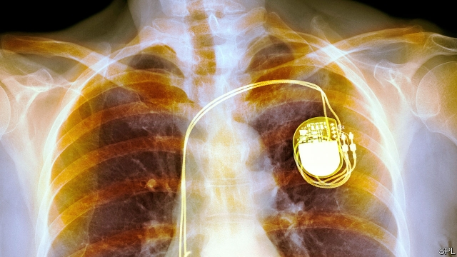

###### Medical devices

# A way to charge pacemakers using the heart’s own muscle 

##### A cleverly designed piezoelectric device seems to do the job 

 

> Mar 21st 2019 

FOR THOSE whose hearts occasionally go off rhythm, pacemakers are, quite literally, life savers. By providing a small electrical jolt at the right moment, they can keep a heart working at the appropriate pace. Their main drawback is that they use batteries. Even the best of them eventually run out of energy, and replacing the batteries requires surgery. 

Since surgery is generally best avoided, the search has been on for long-lasting power sources. Various options have been explored, including, in the 1970s, plutonium. Nuclear-powered pacemakers have thankfully fallen out of fashion and today, devices with lithium batteries last between 5 and 15 years. Zhang Hao of the Second Military Medical University, in Shanghai, and Yang Bin of Shanghai Jiao Tong University sought a way of recharging a pacemaker’s battery by scavenging energy from inside the body. As they report in the journal ACS Nano they have used the heart muscle itself to power a tiny generator. 

Previous attempts to use cardiac muscle power to run pacemakers relied on piezoelectric materials. These release electrons when deformed, and can be attached to beating hearts so that they are slightly bent with each heart beat, generating electricity. This has worked, but not well enough: the output has rarely exceeded five microwatts, while most pacemakers require at least ten. 

Dr Zhang and Dr Yang speculated that they could improve matters by arranging for their piezoelectric composites to be more dramatically deformed. First, they created a small capsule from a sheet of flexible polymer a tenth of a millimetre thick. After compression, this capsule would return to its original shape. They then attached strips of piezoelectric composite to either side of the capsule, attached electrodes to these strips, and covered the strips with a protective layer of silicone. This layout meant that the strips were slightly bent from the beginning and required only a tiny, brief pressure to generate 15 microwatts. 

The question was where to put the capsule, either in or on the heart, in order to get a similar effect. A study of cardiac anatomy suggested the pericardial sac, at the organ’s base, would be ideal. It would squeeze the capsule tightly as the heart contracted and still keep a firm grip on it when the heart was relaxed. 

To test this idea, the capsule’s electrodes were attached to a commercial pacemaker that had had its battery removed, and surgically implanted into a 50kg Yorkshire pig. The capsule generated enough power for the pacemaker to function normally. Whether such an arrangement will pass human trials remains to be seen. But if it does, the days of pacemakers that need battery replacements, with all their associated surgery, may be numbered. 

-- 

 单词注释:

1.pacemaker['peis.meikә]:n. 带步人, 标兵, 起搏器 [医] 起搏点, 起搏器 

2.cleverly[]:adv. 聪明地, 全然, 完全, 巧妙地 

3.piezoelectric[pai,i:zәui'lektrik]:[电] 压电的 

4.literally['litәrәli]:adv. 逐字地, 按照字面上地, 不夸张地 

5.saver['seivә]:n. 节省...的器具, 节约装置, 省俭的人 [化] 回收器; 收集器 

6.jolt[dʒәult]:n. 震摇, 摇动, 颠簸 vi. 颠簸而行, 震摇 vt. 使颠簸, 使慌张, 猛击 

7.plutonium[plu:'tәuniәm]:n. 钚 [化] 钚Pu 

8.thankfully['θæŋkfulli]:adv. 感激地；感谢地 

9.lithium['liθiәm]:n. 锂 [化] 锂Li 

10.zhang[]:n. 张, 章（中国姓氏） 

11.hao[hau]:n. 角（越南辅币, 等于1/10盾） 

12.yang[jɑ:ŋ,jæŋ]:n. 杨（姓氏） 

13.bin[bin]:n. (贮存谷物等的)容器, 箱子 [计] 二进制, 商业信息网 

14.jiao[dʒau]:n. 角（中国货币单位） 

15.tong[tɒŋ]:n. 钳子, 帮会 v. 用钳子钳起 

16.recharge[ri:'tʃɑ:dʒ]:vt. 再充电, 再装填, 再控告, 再袭击 vi. 再袭击 n. 再袭击, 再装填 

17.scaveng[s'kævɪŋ]:清除 

18.AC[]:公元前 [计] 存取周期, 累加器, 声耦合器, 交流, 应用控制, 自动检查, 自动计算机 

19.nano[]:[计] 纳, 毫微 

20.cardiac['kɑ:diæk]:n. 心脏病患者, 强心剂, 健胃药 a. 心脏的, (胃的)贲门的 

21.deform[di'fɒ:m]:vt. 使残缺, 使变形 vi. 变形 

22.microwatts[]:n. 微瓦特 

23.speculate['spekjuleit]:vi. 深思, 推测, 投机 [经] 投机 

24.composite[kәm'pɒzit]:a. 合成的, 混合成的, 菊科的 n. 合成物, 复合材料, 菊科 

25.dramatically[drә'mætikli]:adv. 戏剧地, 引人注目地, 突然地 

26.polymer['pɒlimә]:n. 聚合物, 聚合体 [化] 多聚体; 高分子; 大分子; 聚合物 

27.compression[kәm'preʃәn]:n. 压缩, 压紧 [计] 压缩 

28.electrode[i'lektrәud]:n. 电极 [化] 电极; 焊条; 电焊条 

29.silicone['silikәun]:n. 硅树脂 [化] 硅氧烷; 聚硅氧烷 

30.anatomy[ә'nætәmi]:n. 剖析, 解剖学, 骨骼, 结构 [医] 解剖学, 解剖 

31.pericardial[,peri'kɑ:diәl]:a. 心包的, 位于心脏周围的 [医] 心包的 

32.SAC[sæk]:n. 囊, 液囊, (美)战略空军司令部 [医] 囊, 袋 

33.tightly['taitli]:adv. 紧紧地, 坚固地 

34.surgically[]:adv. 如外科手术般地 

35.implant[im'plɑ:nt]:vt. 深植, 灌输, 嵌入 n. 植入物, 植入管 

36.Yorkshire['jɔ:kʃә]:n. 约克郡, 约克王朝 

37.replacement[ri'pleismәnt]:n. 归还, 更换, 代替者 [医] 复位, 置换 

