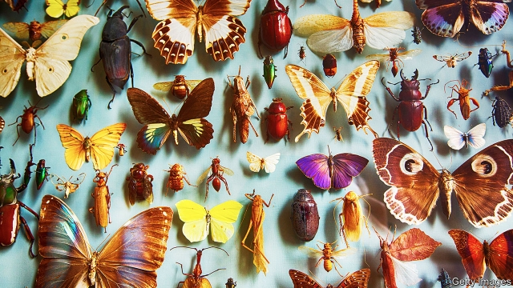
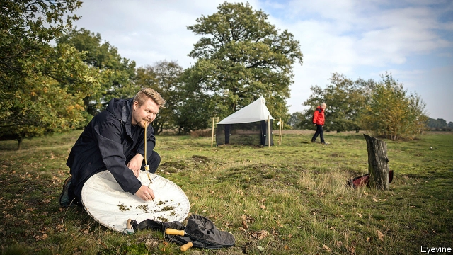

###### Cry of cicadas

# The insect apocalypse is not here but there are reasons for concern 

##### How real is insectageddon? 

 

> Mar 21st 2019 

“WE WERE SHOCKED,” says Brad Lister, of Rensselaer Polytechnic Institute in Troy, New York. “We couldn’t believe the first results. I remember [in the 1970s] butterflies everywhere after rain. On the first day back [in 2012], I saw hardly any.” Dr Lister is describing the Luquillo forest of Puerto Rico, where he recently carried out a census of insect life and found it had been almost wiped out in 40 years. But he could be talking about many other places. Over the past few years, scores of scientific studies have found declines in different measures of insect life and health, all of the order of 50-80%, in areas as far apart as Germany, California and Borneo. 

The findings have triggered alarm, almost panic. Animals, mostly insects, pollinate 87% of flowering plants, according to a recent study by the UN’s Food and Agriculture Organisation (FAO). Without insects, most plants could not reproduce. They break down and recycle the nutrients that plants need for photosynthesis. They decompose organic waste and feed a large proportion of all birds and bats. E.O. Wilson, an American biologist, calls insects “the heart of life on Earth.” 

The studies suggest that such life is in peril. One talks of “the dreadful state of insect biodiversity”. Its authors give warning of “the extinction of 40% of the world’s insect species over the next few decades”. If insects really do face extinction, it would be an immense environmental crisis. But how real is that possibility? What do the data actually tell us? 

In terms of the number of species, insects are by far the most abundant of life forms. Scientists have identified and described over 1m species of insect, compared with only about 6,000 mammals and 18,000 birds. Insects are so numerous that they contain three times as much mass as humans and 30 times that of all wild mammals. “To judge by his creation,” a geneticist, J.B.S. Haldane, once quipped “God must have an inordinate fondness for stars and beetles.” 

Little about this astonishing bounty is known. Using computer models of ecosystems, Nigel Stork of Griffith University, Queensland, estimates there are 5.5m species of insect and 6.8m of terrestrial arthropods (the wider category that includes spiders and crustaceans). That implies over 80% of insects remain undiscovered. Arthur Shapiro of the University of California, Davis, tells the story of travelling by bus across Patagonia, when he broke down in the middle of nowhere. In the two hours it took to mend the engine, and while he stayed within sight of the vehicle the whole time, he found three species of butterfly new to science. “That’s how little we know.” 

Even when individual species are described, the process yields only partial information. Scientists have little hard data on what the vast majority of insects eat, how mobile they are or what determines their reproductive success. There has been almost no long-term monitoring of their numbers. “Around and beneath our feet,” writes Dr Wilson, “lies the least explored part of the planet’s surface.” 

For many years, it did not seem possible or necessary to study insect populations. In their murmuring trillions, insects seemed safe from the pressures that were driving predatory mammals towards extinction. It was unimaginable that so many could disappear. As a haiku by Basho, a Japanese monk, puts it, “Nothing in the cry of cicadas suggests they are about to die.” 

In the 1970s a few disturbing signs of decline began to appear. Long-distance drivers across America and Europe reported that their windscreens were no longer splattered with bugs. Pilots in the Arctic Circle now describe the same thing. Urban streetlights are no longer enveloped by clouds of photophilous moths. Insect-eating birds began to disappear. But these signs could be explained away by, say, more aerodynamic car designs, or changes to farming. The evidence was anecdotal. 

There are, though, a few exceptions to the rule that no long-term databases of insect populations exist. The biggest is kept by Butterfly Conservation, a charity based in Dorset in southern England. It has records from 1690 but its most important data begin in 1976 when, concerned by the anecdotes of decline, two government scientists designed a simple monitoring system. Every week in summer, volunteer butterfly-spotters walk slowly along fixed paths, or “transects”, and log every butterfly and moth they see within 2.5 metres of their path. In Hethfelton Wood, near Wool, in Dorset, the path loops through a forest that, now partially felled, is reverting to heathland. Volunteers have logged 35 species of butterfly there since 2000, ranging from Graylings and White Admirals to thriving species such as the Silver-Washed Fritillary, which is rare elsewhere. 

The project, called the United Kingdom Butterfly Monitoring Scheme (UKBMS), proved such a hit with Britain’s amateur naturalists that the scientists were overwhelmed with data. Now, 2,000 volunteers monitor more than 2,500 sites and produce 3m records a year. It is by far the most detailed insect data set in the world and, unlike most, measures both whether a species occurs in an area and how abundant it is. It shows that between 1976 and 2014, 32 of Britain’s 56 native butterflies declined in numbers, 21 by more than 40%. The biggest falls were among species classed as habitat specialists, with limited ranges or which feed on a small number of plants. 

A second long-term set of data also monitors butterflies, is older and, heroically, is conducted by just one person. Every two weeks since 1972, Professor Shapiro of UC Davis has trekked along ten transects in central California, noting the butterflies he sees (159 species and subspecies). Since 1972, the number of species has fallen in half the transects and risen in one; 2017-18, he says, was “a terrible, perhaps even catastrophic butterfly year”. 

The third data set is kept by the Krefeld Entomological Association, a group of professional and amateur naturalists in a town near Dusseldorf in western Germany. Their headquarters is lined with wooden cases full of insect specimens found in the surrounding grasslands, dunes and woods, meticulously labelled. In 1989 the society began setting up so-called Malaise traps, large tent-like structures that trap flying insects, in local sites in spring and summer. There are now 63 sites. This collection method records the total biomass of insects in the trap, a good measure of the amount of food available to birds and other predators but which tells you nothing about which species are being caught or how many of each there are. More than half the traps have only been checked once since 1989 and even those that are checked more than once are not monitored in consecutive years. The results are not those of a classic longitudinal study. 

But when Caspar Hallmann of Radboud University in the Netherlands combed through the data in 2017, all doubts about their significance were silenced. Between 1989 and 2016 he found the biomass of flying insects in this corner of western Germany fell 77%, or over 5% a year. Making the results more remarkable is that the traps were set up in nature reserves which, though hardly pristine, are better protected from clouds of insecticides than most land in western Europe. “We were amazed,” says Dave Goulson of the University of Sussex, one of the co-authors. The study was the third most frequently cited scientific study (of all kinds) in the media in 2017 and pushed the governments of Germany and the Netherlands into setting up programmes to protect insect diversity. 

Since then, more surveys have confirmed the results. Early this year, Francisco Sánchez-Bayo of the University of Sydney and Kris Wyckhuys of the University of Queensland, reviewed all the studies they could find mentioning insect decline. Theirs was the first study of studies. The authors found that 53% of lepidoptera (butterflies and moths) were in decline; 49% of coleoptera (beetles) and 46% of hymenoptera (bees, wasps, ants and sawflies). Over a third of insect species, they claimed, are threatened with extinction. 

 

That species are failing in some places is not in dispute. What is less clear is whether the decline is global. Drs Sánchez-Bayo and Wyckhuys found a mere 73 papers. That is not enough, argues Alex Wild of the University of Texas, Austin, to say much about anything globally. 

There have been no surveys of wild insect numbers in India, China, Siberia, the Middle East or Australia and only a single study each in South America, Sub-Saharan Africa and South-East Asia. These areas include almost all the tropics where the majority of insect species are thought to live. 

Most of the biggest declines have been measured in Europe and the United States, where the human footprint lies heaviest on the landscape and where modern agricultural methods are almost universal. Given the paucity of evidence, it is impossible to say whether insect numbers really have declined the most in these two areas or whether they have fallen everywhere but these are the places that have been studied. 

It is true that all 73 studies show declines. But that is because the authors went looking for that result. They typed the search terms [insect*] and [declin*] and [survey] into a database. “Estimates based on this ‘unidirectional’ methodology,” argues Chris Thomas of the University of York in Britain, “are not credible.” Nor do all studies show a decline (though they were not captured by the search). A recent study found pollinators are increasing in undisturbed habitats in south-eastern Spain. “This provides evidence,” that report says, “that pollinator declines are not universal beyond anthropogenic ecosystems.” 

No less important, the relationship between declining insect numbers and damage to ecosystems is not a simple linear one. Both Drs Sánchez-Bayo and Wyckhuys and the UKBMS found that generalist pollinators (such as Brown Argus and Gatekeeper butterflies) are doing less badly than specialists, such as the White Admirals, which are now extinct in some regions. Generalists are presumably moving into niches vacated by specialists, a process that is not without risks. At low levels of diversity, ecosystems become vulnerable to diseases that can sweep through a single species. Nevertheless, this process is a reminder that insect ecosystems are more resilient than they sometimes appear. 

That is also true of the floral ecosystems that depend on insect pollinators. Jane Memmott of the University of Bristol investigated what happens when insect species die out by gradually removing one pollinator after another in a controlled environment and keeping track of what happened to the plants. She found that, depending on which species was removed first, most plants managed to hang on even after more than two-thirds of insects had been removed, illustrating the resilience of ecosystems. Only when more than 90% of insect species were removed, did floral diversity collapse. 

All of this provides reasons to be cautious about extrapolating too far from the data. But there are still three big reasons to worry about what is known. 

First, the scale. Declines of more than 50% in most measures of insect health seem more severe than the diminution in other taxonomic ranks. A British study from 2004 found that insect species are declining faster than birds or plants. Almost all species and subspecies are affected, regardless of the altitude at which they live. Declines have been drastic even in protected reserves. 

Second, it is worrying that so many influences are contributing to the decline. It is as if, in the insects’ world, everything is going wrong at once. The main causes seem to be, in order of importance: habitat loss (97% of wildflower meadows have been grubbed up in Britain since the 1930s); intensive farming, which leaves fewer unproductive parcels of land for wildlife; pesticide use; and the spread of diseases and parasites such as the varroa mite, once confined to East Asia where local bees had a measure of resistance, but which is now killing honeybees worldwide. David Wagner of the University of Connecticut calls this “death by a thousand cuts”. 

Third, insects pose a less familiar sort of environmental problem, that of dwindling abundance. Biologists often think of biodiversity loss in terms of extinctions, especially of top-of-the-pile predators. But when a species is abundant, ecosystems come to depend on profusion, and a decline short of extinction can disrupt their workings profoundly. As Dr Memmott’s experiment showed, the impact may be delayed but it will occur eventually. 

One of the unnerving possibilities of insect decline is that it may have been going on decades before long-term monitoring started. After all, modern agricultural practices were well under way in the 1920s. This in turn could mean that the decline documented in Europe and America is even greater than it seems. That does not mean a global insect collapse is imminent, but the data do suggest there are good reasons for concern. “In the past three months,” says Dr Lister, “my fear level has gone up. I worry that we might be reaching a point where insect decline becomes irreversible.” 

-- 

 单词注释:

1.cicada[si'kɑ:dә]:n. 蝉 

2.apocalypse[ә'pɒkәlips]:n. 启示, 天启 

3.brad[bræd]:n. 角钉, 曲头钉 

4.lister['listә]:n. 双耕犁, 制表人 

5.rensselaer[]: [人名] 伦塞勒; [地名] [美国] 伦斯勒 

6.polytechnic[.pɒli'teknik]:a. 各种工艺的, 工艺教育的 n. 工艺专科学校, 理工专科学校 

7.troy[trɔi]:n. 金衡, 金衡制, 特洛伊城 a. 用金衡制表示的 

8.york[jɔ:k]:n. 约克郡；约克王朝 

9.luquillo[]:[地名] 卢基约 ( 波多 ) 

10.Puerto[]:n. 垭口, 港口, 山口 n. (Puerto)人名；(西)普埃尔托 

11.rico[]:abbr. 反诈骗腐败组织集团犯罪法（Racketeer Influenced and Corrupt Organizations Act） 

12.census['sensәs]:n. 户口普查 vt. 实施统计调查 

13.California[.kæli'fɒ:njә]:n. 加利福尼亚 

14.Borneo['bɒ:niәu]:n. 婆罗洲 

15.trigger['trigә]:n. 触发器, 扳机 vt. 触发, 发射, 引起 vi. 松开扳柄 [计] 切换开关 

16.pollinate['pɒlineit]:vt. 对...授粉 

17.organisation[,ɔ: ^әnaizeiʃən; - ni'z-]:n. 组织, 团体, 体制, 编制 

18.FAO[faj]:(联合国)粮食及农业组织 

19.nutrient['nju:triәnt]:a. 营养的, 滋养的 n. 营养物, 滋养物 

20.photosynthesis[.fәutәu'sinθәsis]:n. 光合作用 [化] 光合作用 

21.decompose[.di:kәm'pәuz]:v. 分解, (使)腐烂 

22.EO[]:[计] 基本操作, 允许输出, 操作结束, 执行命令 

23.wilson['wilsn]:n. 威尔逊（姓氏） 

24.biologist[bai'ɒlәdʒist]:n. 生物学家 [医] 生物学家 

25.peril['peril]:n. 危险, 冒...之险, 险境, 险因 vt. 置...于险境, 冒险, 危及 

26.dreadful['dredful]:a. 可怕的 

27.biodiversity[]:n. 生物多样性 

28.extinction[ik'stiŋkʃәn]:n. 消失, 消灭, 废止 [化] 消光; 熄灭 

29.specie['spi:ʃi]:n. 硬币 [经] 硬币 

30.environmental[in.vaiәrәn'mentәl]:a. 周围的, 环境的 [经] 环境的, 环保的 

31.datum['deitәm]:n. 论据, 材料, 资料, 已知数 [医] 材料, 资料, 论据 

32.mammal[mæmәl]:n. 哺乳动物 [化] 哺乳动物 

33.creation[kri:'eiʃәn]:n. 创造, 创作物, 发明 [化] 产生 

34.geneticist[dʒi'netisist]:n. 遗传学家 [医] 遗传学家 

35.JBS[]:abbr. 约翰·伯奇协会（美国极右组织, 创立于1958年）（John Birch Society） 

36.Haldane['hɔ:ldein]:霍尔丹(姓氏) 

37.quip[kwip]:n. 妙语, 遁辞, 讽刺 v. 说讽刺话, 嘲弄 

38.inordinate[i'nɒ:dinәt]:a. 过度的, 紊乱的, 过分的 

39.fondness['fɔndnis]:n. 溺爱；爱好 

40.beetle['bi:tl]:n. 甲虫, 大槌 vi. 快速移动 vt. 捶 

41.bounty['baunti]:n. 慷慨, 宽大, 礼物 [经] 奖励金, 补贴 

42.ecosystem['i:kәu.sistәm]:n. 生态系统 [医] 生态系 

43.nigel['naidʒәl]:n. 奈杰尔（男子名） 

44.stork[stɒ:k]:n. 鹳 

45.griffith['^rifiθ]:n. 格里菲思（女子名, Griffin的异体） 

46.Queensland['kwi:nzlәnd]:[经] 昆士兰 

47.terrestrial[tә'restriәl]:n. 地球上的人 a. 地球的, 陆生的, 陆地的, 人间的 

48.arthropod['ɑ:θrәpɒd]:n. 节肢动物 [医] 节肢动物 

49.crustacean[krʌ'steiʃjәn]:a. 甲壳纲的 n. 甲壳纲动物 

50.undiscovered[.ʌndi'skʌvәd]:a. 未发现的, 未被发觉的, 尚不为人所知的 

51.arthur['ɑ:θә]:n. 亚瑟（男子名）；亚瑟王（传说中六世纪前后英国的国王, 圆桌骑士团的首领） 

52.shapiro[ʃә'pirәu]:n. 夏皮罗（姓氏） 

53.davis['deivis]:n. 戴维斯（男子名） 

54.Patagonia[,pætә'^әjniә,-njә]:n. 巴塔哥尼亚(南美一地区) 

55.reproductive[.ri:prә'dʌktiv]:a. 生殖的, 再生的, 复制的 [医] 生殖的, 复现的 

56.murmur['mә:mә]:n. 低语, 低声的怨言 vi. 低语, 低声而言 vt. 低声说 

57.trillion['triljәn]:n. 大量 [经] 兆 

58.predatory['predәtәri]:a. 掠夺成性的, 捕食生物的, 掠夺的 [医] 捕食的 

59.unimaginable[.ʌni'mædʒinәbl]:a. 不能想象的, 不可思议的 

60.haiku['haiku:]:n. haiku (Jap) 俳句 

61.basho['bɑ:ʃәj]:<日>n.[单复同]相扑场(指15场比赛的锦标赛, 日本相扑比赛每年举行两次,分3月场和9月场) 

62.monk[mʌŋk]:n. 修道士, 僧侣, 和尚 

63.windscreen['windskri:n]:n. 汽车的挡风玻璃 

64.splatter['splætә]:vt. 使水等飞溅, 结结巴巴地讲 vi. 发溅泼声, 说话结巴 n. 飞溅 

65.bug[bʌg]:n. 错误, 虫, 病菌, 缺陷, 窃听器, 癖好, 防盗报警器, 双座小汽车, 要人 vt. 装防盗报警器, 装窃听器, 激怒 vi. 捉虫, 暴突 [计] 缺点, 错误 

66.streetlight['stri:tlait]:n. 街灯, 路灯 

67.envelop[in'velәp]:vt. 包封, 遮盖, 包围 n. 信封 

68.photophilous[fәu'tɔfilәs]:a. [生]喜光的,嗜光的,适光的 

69.moth[mɒθ]:n. 蛾害, 蛾, 乌头叶菜豆 [医] 蠹, 蛾 

70.aerodynamic[,eәrәudai'næmik]:a. 空气动力学的 

71.anecdotal[,ænek'dәutl]:a. 轶事的, 爱谈奇闻轶事的, 多轶事的 

72.dorset['dɔ:sit]:n. 多塞特（人名）；多尔塞特棉粗平布 

73.transect[træn'sekt]:vt. 横切, 横断 

74.fell[fel]:vt. 击倒 n. 一季所伐的木材, 折缝 a. 凶猛的, 可怕的 fall的过去式 

75.revert[ri'vә:t]:vi. 恢复, 复归, 回复, 还原 vt. 使回复原状, 使回转 n. 恢复原信仰的人 [计] 还原 

76.heathland['hi:θlænd]:n. <英>欧石南丛生的荒野 

77.grayling['greiliŋ]:n. 茴鱼, 眼蝶 

78.admiral['ædmәrәl]:n. 舰队司令, 海军上将, 旗舰 

79.fritillary['fritilәri]:n. 贝母, 豹纹蝶 

80.naturalist['nætʃәrәlist]:n. 自然主义者 

81.overwhelm[.әuvә'hwelm]:vt. 淹没, 受打击, 制服, 压倒, 使不知所措 [法] 打翻, 倾覆, 覆盖 

82.habitat['hæbitæt]:n. 栖息地, 居留地, 自生地, 聚集处 [医] 习生地, 产地, 生境, 栖所 

83.heroically[hə'rəʊɪklɪ]:adv. 英雄地; 超人地; 冒险地; 庞大地 

84.UC[]:[计] 单通道, 设备校验 

85.trek[trek]:vi. 牛拉货车, 艰苦跋涉 n. 牛车旅行, 艰苦跋涉 

86.subspecies['sʌb.spi:ʃi:z]:n. 亚种 

87.catastrophic[.kætә'strɒfik]:a. 悲惨的, 灾难的 

88.Krefeld[]:n. (Krefeld)人名；(英)克雷菲尔德；(德)克雷费尔德 克雷菲尔德 

89.entomological[.entәmә'lɒdʒikәl]:a. 昆虫学的 [医] 昆虫学的 

90.Dusseldorf['dusldɔ:f]:杜塞尔多夫(联邦德国一城市) 

91.headquarter[,hed'kwɔ:tә]:vt. 将...的总部设在 

92.grassland['græslænd]:n. 牧草地, 草原 

93.dune[dju:n]:n. 沙丘 

94.meticulously[]:adv. 过细地, 细致地 

95.malaise[mæ'leiz]:n. 不舒服 [医] 不适, 欠爽 

96.biomass['baiәumæs]:n. 生物量 [化] 生物质; 生物量 

97.predator['predәtә]:n. 食肉动物, 掠夺者 [医] 捕食者 

98.consecutive[kәn'sekjutiv]:a. 连续的, 联贯的 [计] 连续的; 连接的 

99.longitudinal[.lɒndʒi'tju:dinәl]:a. 经度的, 经线的, 纵的 [医] 纵的 

100.Caspar['kæspə]:n. 卡斯帕（《圣经》中三哲士之一, 等于Gaspar） 

101.Radboud[]:[网络] 拉德鲍德 

102.Netherlands['neðәlәndz]:n. 荷兰 

103.pristine['pristi:n]:a. 太古的, 原来的, 古时的, 原始的 

104.insecticide[in'sektisaid]:n. 杀虫剂 [化] 杀虫剂 

105.dave[deiv]:n. 戴夫（男子名） 

106.sussex['sʌsiks]:n. 苏塞克斯（英国郡名） 

107.cite[sait]:vt. 引用, 引证, 表彰 [建] 引证, 指引 

108.diversity[dai'vә:siti]:n. 差异, 多样性 [化] 多样性 

109.francisco[fræn'siskәu]:n. 弗朗西斯科（男子名, 等于Francis） 

110.sydney['sidni]:n. 悉尼（澳大利亚港市） 

111.kris[kri:s]:n. 波壮刃短剑（等于creese, 马来西亚和印尼的） 

112.lepidoptera[,lepi'dɔptәrә]:n. [动] 鳞翅类 

113.coleoptera[,kɔli'ɔptәrә]:n. 鞘翅目, 甲虫类 [医] 鞘翅目 

114.Hymenoptera[,haimi'nɔptәrә]:[动]膜翅目 

115.wasp[wɒsp]:n. 黄蜂, 胡蜂, 易怒的人, 刻毒的人 [医] 胡蜂, 黄蜂 

116.sawfly['sɒ:flai]:n. 锯蜂 

117.les[lei]:abbr. 发射脱离系统（Launch Escape System） 

118.Alex[]:[计] 开放网络文件系统 

119.Texas['teksәs]:n. 德克萨斯 

120.austin['ɔ:stin]:n. 奥斯丁（人名）；英国制汽车牌名 

121.globally[]:[计] 全局地 

122.siberia[sai'biәriә]:n. 西伯利亚 

123.tropic['trɒpik]:n. 回归线 

124.footprint['futprint]:n. 足迹 [计] 印迹 

125.landscape['lændskeip]:n. 风景, 山水, 风景画 vi. 从事景观美化 vt. 美化...景观 [计] 横向 

126.paucity['pɒ:sәti]:n. 少数, 少量, 缺乏 

127.methodology[.meθә'dɒlәdʒi]:n. 方法学, 方法论 [化] 操作法; 工艺 

128.chris[kris]:n. 克里斯（男子名）；克莉丝（女子名） 

129.thoma[]:n. (Thoma)人名；(阿尔巴、阿拉伯)索玛；(英、德、罗、匈、捷、塞、瑞典)托马 

130.credible['kredәbl]:a. 可信的, 可靠的 [法] 可信的, 可靠的 

131.pollinator['pɒlɪneɪtə]:n. 传粉者, 传粉媒介, 传粉昆虫; 授花粉器 

132.undisturbed[.ʌndi'stә:bd]:a. 未被扰乱的, 安静的, 镇定的 

133.Spain[spein]:n. 西班牙 

134.anthropogenic[]:[医] 人类发生的, 人类起源的 

135.linear['liniә]:a. 线的, 直线的, 线状的 [计] 线性 

136.generalist['dʒenәrәlist]:n. 多面手, 通才 

137.Argus['ɑ:gәs]:n. 百眼巨人阿耳戈斯 

138.gatekeeper['geitki:pә]:n. 看门人 

139.nich[]:abbr. 新生儿颅内出血（neonatal intracranial hemorrhage） 

140.vacate[vә'keit]:vt.vi. 使空出, 搬出, 腾出, 不再使用/居住, 解除(职位), 撤离(阵地), 辞职, 退位 vt. 取消, 使作废 

141.vulnerable['vʌlnәrәbl]:a. 易受伤害的, 有弱点的, 易受影响的, 脆弱的, 成局的 [医] 易损的 

142.reminder[ri'maindә]:n. 提醒的人, 暗示 [经] 催单 

143.resilient[ri'ziliәnt]:a. 弹回的, 有弹力的 [医] 回弹的, 回能的 

144.floral['flɒ:rәl]:a. 花似的, 花的, 植物的 

145.jane[dʒein]:n. 简（女子名） 

146.Bristol['bristәl]:n. 布里斯托尔(英国西部港口) 

147.resilience[ri'ziliәns]:n. 弹回, 有弹力, 恢复力 [化] 回弹; 弹性; 弹回性; 回能; 弹能 

148.extrapolate[ek'stræpәleit]:v. 推断, 外推 

149.diminution[.dimi'nju:ʃәn]:n. 减少, 缩小, 减低 [医] 减少, 减小 

150.taxonomic[tæksә'nɔmik]:a. 分类学的, 分类的 [计] 分类的 

151.drastic['dræstik]:a. 激烈的 [医] 峻泻药, 剧烈的 

152.wildflower['waild,flajә(r)]:n. 野花 

153.grub[grʌb]:n. 幼虫, 乏味之人 v. 寻找, 翻掘 

154.unproductive[.ʌnprә'dʌktiv]:a. 不生产的, 无出产的, 不毛的 [经] 非生意性的, 浪费的 

155.pesticide['pestisaid]:n. 杀虫剂 [化] 农药 

156.parasite['pærәsait]:n. 寄生生物, 寄生虫, 食客 [医] 寄生物; 寄生胎 

157.varroa[]: [医]瓦螨属 

158.mite[mait]:n. 尽绵薄之力的捐献, 细微, 微少, 螨 [医] 螨 

159.honeybee['hʌnibi:]:n. 蜜蜂 

160.david['deivid]:n. 大卫；戴维（男子名） 

161.wagner['wæ^nә]:[电] 瓦格纳接地法 

162.Connecticut[kә'netikәt]:n. 康涅狄格 

163.dwindle['dwindl]:vi. 减少, 缩小, 衰落 vt. 使缩小 

164.abundance[ә'bʌndәns]:n. 丰富, 充足, 大量 [经] 丰富, 充裕 

165.profusion[prә'fju:ʒәn]:n. 大量, 慷慨, 挥霍, 充沛, 浪费 

166.disrupt[dis'rʌpt]:a. 分裂的, 中断的 vt. 使分裂, 使瓦解 

167.working['wә:kiŋ]:n. 工作, 运转, 劳动 a. 工作的, 劳动的, 经营的, 抽搐的, 运转的 

168.profoundly[prә'fajndli]:adv. 深深地, 深切地 

169.unnerve[.ʌn'nә:v]:vt. 使失去勇气, 使胆怯, 使不能自制 [医] 除神经 

170.imminent['iminәnt]:a. 即将来临的, 逼近的 

171.irreversible[,iri'vә:sәbl,-sib-]:a. 不可逆的, 不可改变的, 不能倒置的, 不能翻转的, 不能倒转的, 不可撤销的 [计] 不可逆的 

