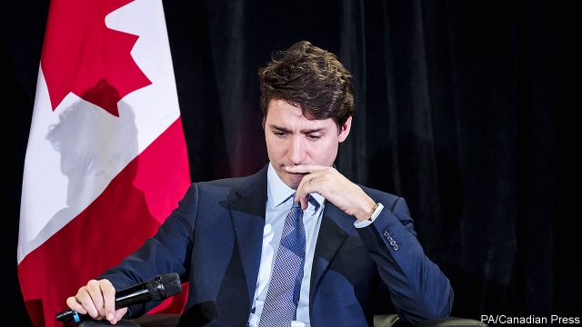

###### Trudeau’s woes

# Voters are cooling towards Justin Trudeau 

##### A new budget will not distract Canadians from a scandal 

 

> Mar 21st 2019 

WHEN JUSTIN TRUDEAU formed his first cabinet after winning an election in 2015, it was a triumphant affair. The prime-minister-elect marched to Rideau Hall, home to the Queen’s representative in Canada, like a conquering hero, surrounded by beaming ministers. On March 18th, half a political lifetime later, he walked to the hall with just his security detail to make the third change to his cabinet this year. The usually media-friendly Mr Trudeau did not stop. Waiting reporters thought they heard him mutter “Having a good day....” as he slipped in by a side door. 

There have not been many good days for the prime minister since the publication in February of allegations that he and his officials put pressure on the then attorney-general to fine rather than prosecute SNC-Lavalin, a large construction firm in Quebec accused of bribery. In their wake has come a slew of resignations. Jody Wilson-Raybould, the former attorney-general, left the cabinet on February 12th, followed by Jane Philpott, a respected minister who later quit in sympathy. Gerry Butts, Mr Trudeau’s senior adviser, took responsibility for “a communication breakdown” and resigned. This week Michael Wernick, Canada’s highest-ranking civil servant, told Mr Trudeau he too would go, since he is no longer trusted by the opposition. 

It has been quite a comedown for the Liberal leader, whose pre-election promises of openness and transparency are being thrown back in his face by Conservative opponents scenting victory in a federal election due on October 21st. But it is too soon to count Mr Trudeau out. 

The case against him and his officials is that they attempted to obstruct justice by urging Ms Wilson-Raybould to offer SNC-Lavalin a deal under which the company would pay a fine and agree to mend its ways in order to avoid a trial. She told the parliamentary justice committee, which has been investigating the case, that she did indeed feel pressure. But she added that the harassment, though inappropriate, was not illegal. (The attorney-general, who is a member of the cabinet, is not supposed to be influenced by political considerations.) Mr Trudeau admits he raised concerns about job losses but did not direct Ms Wilson-Raybould to change her decision. The case is still going to trial. 

The details may be murky but, says Darrell Bricker of Ipsos, a polling firm, voters smell a rat. An average of recent polls shows the Liberals behind the Conservatives, by 33% to 35%. Sensing they are on to a winner, the Conservatives have been demanding that Ms Wilson-Raybould come back to parliament to testify again. (That hope died on March 19th when the Liberals used their majority to end the committee’s investigation.) The Conservative #LetHerSpeak campaign on social media targets another of Mr Trudeau’s soft spots. After championing the rights of women and indigenous peoples, he now finds himself at daggers drawn with Ms Wilson-Raybould, who is both female and a member of the We Wai Kai nation. 

But the Conservative opposition is not benefiting as much as might be expected. It has its own vulnerabilities. The party has tacked rightward under its leader, Andrew Scheer, after a dissident member, Maxime Bernier, set up a new party even further to the right. Before the SNC-Lavalin scandal, the Conservatives had been hammering the government for letting too many asylum-seekers cross the border with the United States. But Mr Scheer is finding it hard to appeal to anti-immigrant supporters without offending the large majority of Canadians who back immigration. He got into trouble last month for sharing a platform with Faith Goldy, a controversial white nationalist. 

Economic issues tend to be more important in Canadian elections than political controversies. Here, Mr Trudeau’s record is mixed. Unemployment is close to a 40-year low. Workforce participation is rising for women, young people and immigrants. The introduction of an income-tested child benefit in 2016 has lifted almost 300,000 children out of poverty. But growth seems to have ground to a halt (GDP rose by a miserable 0.4% at an annualised rate in the last quarter of 2018) and household debt is at a record high. 

The budget on March 19th was the government’s last chance before the election to offer voters some goodies—and persuade them that it knows what it is doing. It duly took the first step towards a national “pharmacare” plan (to make prescription drugs cheaper), offered first-time owners a new incentive to buy a house, increased money for municipal infrastructure, lowered interest rates on student loans and so on. Thanks to an unexpected increase in tax revenues, the government still was able to keep the budget deficit largely unchanged and the debt-to-GDP ratio stable. 

If the Liberals had hoped the budget would distract the opposition from the SNC-Lavalin scandal, however, they were disappointed. The Conservatives chanted “let her speak” throughout the early part of the budget speech. The broader question is whether, on election day, voters will focus on the scandal or on the economy and budget. At the moment, they are cooling on Mr Trudeau without warming to Mr Scheer. 

-- 

 单词注释:

1.woe[wәu]:n. 悲哀, 悲痛, 苦痛 

2.voter['vәutә]:n. 选民, 投票人 [法] 选民, 选举人, 投票人 

3.justin['dʒʌstin]:n. 贾斯廷（男子名） 

4.trudeau[]:n. (Trudeau)人名；(英、法)特鲁多 特鲁多 

5.distract[dis'trækt]:vt. 转移, 分心, 使发狂 

6.justin['dʒʌstin]:n. 贾斯廷（男子名） 

7.trudeau[]:n. (Trudeau)人名；(英、法)特鲁多 特鲁多 

8.triumphant[trai'ʌmfәnt]:a. 得胜的, 得意洋洋的 

9.rideau[ri'dәj]:n. 土堆, 土阜 

10.allegation[.æli'geiʃәn]:n. 断言, 主张, 申辩 [法] 声明, 事实陈述, 断言 

11.prosecute['prɒsikju:t]:vt. 告发, 起诉, 彻底进行, 执行, 从事 vi. 告发, 起诉, 作检察官 

12.quebec[kwi'bek]:n. 魁北克（加拿大港市省名） 

13.bribery['braibәri]:n. 贿赂行为, 行贿, 受贿 [经] 行贿, 受贿 

14.slay[slei]:v. 杀害, 残杀 

15.jody['dʒәjdi]:n. 乔迪（女子名, 等于Judith, Jodi, Jodie） 

16.jane[dʒein]:n. 简（女子名） 

17.philpott[]: [人名] [英格兰人姓氏] 菲尔波特 Philip的昵称 

18.gerry['^eri]:n. 格里（男名） 

19.butt[bʌt]:n. 粗大的一头, 烟头, 靶, 笑柄 [医] 对核 

20.adviser[әd'vaizә]:n. 顾问, 劝告者, 指导教师 [法] 顾问, 劝告者 

21.breakdown['breikdaun]:n. 崩溃, 故障 [化] 事故; 击穿 

22.michael['maikl]:n. 迈克尔（男子名） 

23.wernick[]: [人名] 韦尼克 

24.opposition[.ɒpә'ziʃәn]:n. 反对, 敌对, 相反, 在野党 [医] 对生, 对向, 反抗, 反对症 

25.comedown['kʌmdaun]:n. 衰落, 失望, 落魄 

26.openness['әupәnnis]:n. 公开；宽阔；率真 

27.transparency[træns'pærәnsi]:n. 透明, 透明度, 透过性, 透明物, 清晰 [计] 透明性; 透明 

28.obstruct[әb'strʌkt]:vt. 阻隔, 妨碍, 阻塞, 遮没 vi. 设障碍 

29.parliamentary[.pɑ:lә'mentәri]:a. 国会的, 议会的, 议会制度的 

30.harassment['hærәsmәnt]:n. 困扰, 烦扰, 烦恼 [法] 折磨, 骚扰, 侵扰 

31.inappropriate[.inә'prәupriәt]:a. 不适当的, 不相称的 

32.murky['mә:ki]:a. 黝暗的, 阴沉的, 朦胧的 

33.darrell['dærәl]:n. 达雷尔（男子名） 

34.bricker[]: [人名] 布里克 

35.ipso[]:abbr. incremental phase shift oscillator 增量移相振荡器; Internet protocol security option 因特网协议安全选件; iodized poppy-seed oil 碘化罂粟子油 

36.testify['testifai]:v. 证明, 作证, 声明, 表明 

37.indigenous[in'didʒinәs]:a. 本土的, 国产的, 固有的 [医] 原产的, 本土的 

38.dagger['dægә]:n. 匕首 vt. 用剑刺 

39.wai[]:abbr. [网络]真是个白痴（What An Idiot） 

40.kai[]:n. 卡伊（姓氏） 

41.vulnerability[.vʌlnәrә'biliti]:n. 易受伤, 易受责难, 易受伤部位 [医] 易损性 

42.tack[tæk]:n. 平头钉, 大头钉, 粗缝针脚, 行动方针, 食物 vt. 以大头针钉住, 附加 

43.rightward['raitwәd]:adv. 向右, 向右倾 a. 朝右的 

44.andrew['ændru:]:n. 安德鲁（男子名） 

45.scheer[]: [人名] 希尔; [地名] [德国] 谢尔 

46.dissident['disidәnt]:a. 意见不同的, 持不同政见的 n. 意见不同的人, 持不同政见者 

47.maxime[]:n. (Maxime)人名；(法)马克西姆 

48.berny[]:n. (Berny)人名；(法、瑞典)贝尔尼 

49.supporter[sә'pɒ:tә]:n. 支持者, 后盾, 迫随者, 护身织物 [法] 支持者, 赡养者, 抚养者 

50.goldy['^әjldi]:a. 似黄金的, 金黄的 

51.nationalist['næʃәnәlist]:n. 国家主义者, 民族主义者 

52.controversy['kɒntrәvә:si]:n. 论争, 辩论, 论战, 争论 [法] 论战, 争论, 争吵 

53.participation[.pɑ:tisi'peiʃәn]:n. 参与, 分享 [经] 参与, 参股 

54.annualised['ænjuəlaizd]:a. 年度的 v. 按年计算（annualise的过去式和过去分词） 

55.duly['dju:li]:adv. 恰当地, 充分地, 适当地, 及时地 

56.incentive[in'sentiv]:n. 动机 a. 激励的 

57.municipal[mju:'nisipl]:a. 市政的, 自治区的, 内政的 [经] 市政的, 市的 

58.infrastructure['infrәstrʌktʃә]:n. 基础结构, 基础设施 [经] 基础设施 

59.unexpect[]:[网络] 意想不到；使意外 

60.deficit['defisit]:n. 赤字, 不足额 [医] 短缺 

61.unchanged[.ʌn'tʃeindʒd]:a. 无变化的 [经] 持稳的 

