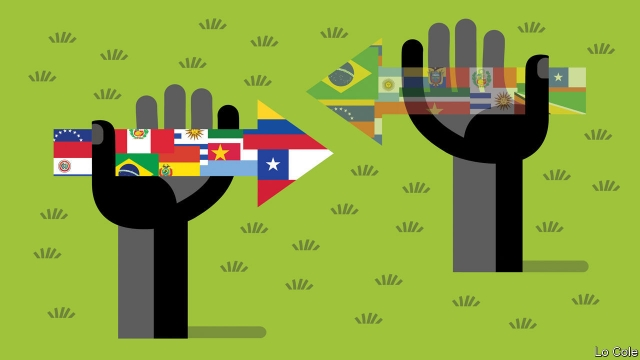

###### Bello

# Why Prosur is not the way to unite South America 

##### Attempts at regional integration always seem to stumble over politics 

 

> Mar 21st 2019 

IT IS NOT often that a country pulls out of an international organisation of which it is the host. Yet that is what Ecuador’s president, Lenín Moreno, did on March 13th. Ecuador joined six other countries who have withdrawn from the South American Union (Unasur), a talking shop which once included all 12 of the continent’s nations, criticising it for the “perverse politicking of the self-styled 21st-century socialists”. For good measure he said he wants his country to repossess Unasur’s gleaming, cantilevered $65m headquarters near Quito, opened in 2014 and paid for by his predecessor, Rafael Correa, calling it “an ode to waste”. He wants to turn it into a university for indigenous people. 

Mr Moreno is among several South American presidents who may go to Santiago on March 22nd to launch a replacement for Unasur called Prosur. This is a brainchild of Iván Duque, Colombia’s new conservative president, and his Chilean counterpart, Sebastián Piñera, of the centre-right. Unveiling the idea in January, Mr Duque said that rather than a bureaucratic organisation, Prosur will be a “co-ordination mechanism” supporting democracy and the market economy. Mr Piñera has invited all but one of the 12 countries. The exception is Venezuela. 

Prosur is a sign of the changing political climate in South America. After a period of hegemony for the left, of various strands, the region has swung to the right in recent elections. Yet, far from being an answer to regional disunity, Prosur looks like a restatement of the problem: that in Latin America regional institutions have become hostage to ideology and ephemeral political alignments. They rarely work to forward the co-operation that would be in the lasting interest of all their members. 

It was precisely these faults that doomed Unasur, a good idea traduced by misguided political leadership. Its origins lay in a Brazilian wish to talk about cross-border transport and energy projects. By the time it was formally constituted by treaty in 2008, those practical aims had succumbed to the overlapping ambitions of two leftist presidents, Brazil’s Luiz Inácio Lula da Silva and Venezuela’s Hugo Chávez, to create a body devoted to political solidarity and defence co-operation, implicitly against the United States. 

Unasur’s last secretary-general, Ernesto Samper, a former Colombian president, told Bello in 2015 that the body was the reflection of “a political scenario” in which most governments were of the left. Its commitment to democracy in the region, he said, was to “the real validity of social rights”—a formula that echoed Cuban and Venezuelan propaganda. Venezuela’s opposition and its many supporters came to see Mr Samper as a stooge for the Venezuelan government. When Mr Samper’s term ended, a broad coalition of countries proposed José Octavio Bordón, a shrewd centrist politician and diplomat from Argentina, as his replacement. Venezuela vetoed him. That was the final straw. 

Unasur’s fate is a symbol of the deep fracture caused by Venezuela’s regime and its remaining friends in South America. It is also a rebuke to Brazilian foreign policy under Lula and his successor, Dilma Rousseff. Yet walking away from Unasur rather than trying to bypass Venezuela and reform the organisation looks like a mistake. “You don’t overcome the fracture by setting up a new organisation composed only of your friends,” says a former South American foreign minister, who worries about the “improvisation” it embodies. 

Many South American officials who have no sympathy for chavista Venezuela are cool towards Prosur. Several countries may stay away. Pressing Venezuela to return to democracy is a task that the region has entrusted to the Lima group, an ad hoc body of 14 countries that works reasonably well. That it includes Canada is hardly an existential problem. And as described by its founders, Prosur will lack the heft to do the job Unasur should have done (but didn’t) of working for practical measures of integration—especially by acting as a bridge between the two economic blocs in South America, Mercosur and the Pacific Alliance. 

As for Unasur, it may not actually die, but join Latin America’s clutter of the moribund. Laurence Whitehead of Oxford University has written that the penchant of Latin America’s elites for the latest ideological fashion has turned the region into a “mauseolum of modernities”. That now applies to its institutions of integration. This penchant is a luxury that a region which is falling behind economically cannot afford. 

-- 

 单词注释:

1.bello[]:n. 贝罗（姓氏） 

2.regional['ri:dʒәnәl]:a. 地方的, 地域性的 [医] 区的, 部位的 

3.integration[.inti'greiʃәn]:n. 综合, 与环境协调的行为, 集成 [化] 集成; 整合 

4.alway['ɔ:lwei]:adv. 永远；总是（等于always） 

5.politic['pɒlitik]:a. 精明的, 明智的, 策略的 

6.organisation[,ɔ: ^әnaizeiʃən; - ni'z-]:n. 组织, 团体, 体制, 编制 

7.Moreno[]:莫雷诺（男子名） 

8.Ecuador['ekwәdɒ:]:n. 厄瓜多尔 

9.Unasur[]:[网络] 南美国家联盟；南美洲国家联盟；南美联邦 

10.criticise['kritisaiz]:v. 批评, 吹毛求疵, 非难 

11.perverse[pә'vә:s]:a. 乖张的, 故意作对的, 有悖常情的, 执迷不悟的, 歪曲的, 错误的, 不正当的 [法] 邪恶的, 罪恶的:堕落的, 不合法的 

12.politick['pɔlitik]:vi. 进行政治活动, 谈论政治 

13.repossess[.ri:pә'zes]:vt. 再拿到手, 取回 [经] 重新获得 

14.gleam[gli:m]:n. 光束, 微光, 反光 vi. 闪烁, 隐约地闪现 vt. 使发微光, 使闪烁 

15.cantilever['kæntili:vә]:n. 悬臂 [化] 悬臂梁 

16.headquarter[,hed'kwɔ:tә]:vt. 将...的总部设在 

17.quito['ki:tәu]:n. 基多（厄瓜多尔的首都） 

18.predecessor[.predi'sesә]:n. 前任, 先辈, 前身 [医] 初牙, 前辈, 祖先 

19.rafael[]:n. 拉斐尔（男子名, 来源于圣经故事） 

20.correa[]: [人名] 科雷亚 

21.ode[әud]:n. 颂诗, 赋 

22.indigenous[in'didʒinәs]:a. 本土的, 国产的, 固有的 [医] 原产的, 本土的 

23.Santiago[sænti'ɑ:^әu]:n. 圣地亚哥 

24.replacement[ri'pleismәnt]:n. 归还, 更换, 代替者 [医] 复位, 置换 

25.brainchild['breintʃaild]:n. 脑力劳动的产物 

26.duque[]: [人名] 杜凯 

27.Chilean['tʃiliәn]:n. 智利人, 智利讲的西班牙语 a. 智利文化的, 智利人的, 智利的 

28.counterpart['kauntәpɑ:t]:n. 副本, 复本, 配对物, 相应物 [经] 副本, 正副二份中之一 

29.unveil[.ʌn'veil]:vt. 揭开, 揭幕, 除去...的面纱 vi. 显露, 除去面纱 

30.mechanism['mekәnizm]:n. 机械, 机构, 结构, 机理, 技巧 [化] 机理; 历程; 机构 

31.Venezuela[,vene'zweilә]:n. 委内瑞拉 

32.hegemony[hi:'dʒemәni]:n. 霸权, 领导权, 支配权, 拥有支配权的政府 [法] 霸权, 盟主权 

33.strand[strænd]:n. (绳索的)股, 绳, 串, 海滨, 河岸 vi. 搁浅 vt. 使搁浅, 使落后, 使陷于困境, 弄断, 搓 

34.disunity[dis'ju:niti]:n. 不统一 

35.restatement[.ri:'steitmәnt]:n. 再声明, 重述 [经] 重报, 重新陈述, 再声明 

36.hostage['hɒstidʒ]:n. 人质, 抵押品 [经] 人质, 抵押品 

37.ideology[.aidi'ɒlәdʒi]:n. 思想体系, 意识形态, 观念学, 空论 [医] 观念学, 观念形态 

38.ephemeral[i'femәrәl]:a. 朝生暮死的, 短命的, 短暂的 [医] 暂时的 

39.alignment[ә'lainmәnt]:n. 队列, 结盟, 校正 [计] 校准; 对齐; 对准 

40.precisely[pri'saisli]:adv. 精确地, 明确地, 刻板地, 拘泥地, 正好, 恰恰, 对, 正是如此, 确实如此, 不错 

41.doom[du:m]:n. 厄运, 不幸, 法律, 宣告, 判决, 死亡 vt. 命中注定, 判决 

42.traduce[trә'dju:s]:vt. 诽谤, 中伤, 背叛 [法] 诽谤, 中伤, 诋毁 

43.misguide[mis'gaid]:vt. 误导 

44.Brazilian[brә'ziljәn]:n. 巴西人 a. 巴西的, 巴西人的 

45.formally['fɒ:mәli]:adv. 正式地, 形式上 

46.constitute[kәn'stitjut]:vt. 构成, 组成, 任命 [建] 构造, 组成 

47.succumb[sә'kʌm]:vi. 屈从, 屈服, 死 

48.overlap[.әuvә'læp]:n. 重叠, 重复, 部分的同时发生 vt. 重叠, 重复, 与...同时发生 vi. 迭盖, 部分的同时发生 [计] 重叠 

49.leftist['leftist]:n. 左翼的人, 左派 a. 左派的 

50.luiz[]:n. (Luiz)人名；(西、葡)路易斯 

51.lula[]:n. 卢拉（男子名） 

52.DA[,di:'ei]:美国地方检察官 [计] 数据采集, 数据管理员, 数据分析, 设计自动化 

53.silva['silvә]:n. 森林, 森林志 

54.hugo['hju:^әu]:n. 雨果（男子名, 等于Hugh） 

55.solidarity[.sɒli'dæriti]:n. 团结, 团结一致, 共同一致 [法] 团结, 共同责任 

56.implicitly[]:adv. 含蓄, 不言明, 暗示, 暗指, 内含, 固有, 无疑, 绝对, 无保留 [计] 隐含地 

57.Ernesto[]:欧内斯托（人名） 

58.samper[]: [人名] [英格兰人姓氏] 桑珀住所名称，由当地教堂奉献给St Peter而得名; [地名] [西班牙] 桑佩尔 

59.Colombian[kә'læmbiәn]:n. 哥伦比亚人 a. 哥伦比亚的 

60.scenario[si'nɑ:riәu]:n. 剧本提纲, 情节, 剧本, 方案, 事态 [计] 方案 

61.validity[vә'liditi]:n. 有效性, 正确性 [计] 有效性 

62.Cuban['kju:bәn]:a. 古巴的, 古巴人的 n. 古巴人 

63.venezuelan[,venә'zweilәŋ]:a. 委内瑞拉的；委内瑞拉人的 

64.propaganda[.prɒpә'gændә]:n. 宣传, 宣传活动 [医] 宣传 

65.opposition[.ɒpә'ziʃәn]:n. 反对, 敌对, 相反, 在野党 [医] 对生, 对向, 反抗, 反对症 

66.supporter[sә'pɒ:tә]:n. 支持者, 后盾, 迫随者, 护身织物 [法] 支持者, 赡养者, 抚养者 

67.stooge[stu:dʒ]:n. 喜剧配角(或丑角), 下手, 助手 vi. 充当配角 

68.coalition[.kәuә'liʃәn]:n. 结合体, 结合, 联合 [经] 联合, 联盟 

69.octavio[]:奥克塔维奥（人名） 

70.Bordón[]:[地名] 博尔东 ( 西 ) 

71.shrewd[ʃru:d]:a. 精明的, 锐利的, 剧烈的, 机灵的, 厉害的 

72.centrist['sentrist]:n. 中间党派的成员, 温和主义者 [法] 中间派议员, 中立派议员 

73.diplomat['diplәmæt]:n. 外交官, 有外交手腕的人 [法] 外交家, 外交官, 有权谋的人 

74.Argentina[.ɑ:dʒәn'ti:nә]:n. 阿根廷 

75.veto['vi:tәu]:n. 否决权 vt. 否决, 禁止 

76.fracture['fræktʃә]:n. 破碎, 骨折 v. (使)破碎, (使)破裂 

77.regime[rei'ʒi:m]:n. 政权, 当权期间, 政体, 社会制度, 体制, 情态 [医] 制度, 生活制度 

78.rebuke[ri'bju:k]:n. 指责, 谴责, 非难 vt. 斥责, 指责, 制止 

79.successor[sәk'sesә]:n. 继承者, 接任者 [计] 后继 

80.Dilma[]:[网络] 迪尔玛；总统迪尔玛 

81.rousseff[]:[网络] 罗塞夫；总统罗赛夫 

82.bypass['baipɑ:s]:n. 旁路 vt. 省略, 绕过, 忽视, 回避 

83.improvisation[.imprәvai'zeiʃәn]:n. 即兴而作, 即席演奏, 即席作品 

84.embody[im'bɒdi]:vt. 具体表达, 使具体化 [经] 合并, 具体化, 具体表现 

85.chavista[]:[网络] 查维斯派人士；查维兹党人；查维斯主义者 

86.entrust[in'trʌst]:vt. 信托, 交托, 委托 [经] 委托 

87.lima['li:mә]:n. 利马（秘鲁首都） 

88.hoc[]:abbr. 下议院, 众议院（House of Commons）；肝卵圆细胞（Hepaticoval Cells）；重油催化裂化（Heavy Oil Cracking ）；最高输出信道（Highest Outgoing Channel）；均质铸锭（Homogeneous Casting） 

89.reasonably['ri:znәbli]:adv. 适度地, 相当地 

90.existential[.egzis'tenʃәl]:a. 有关存在的 

91.founder['faundә]:n. 创立者, 建立者 vt. 使沉没, 使摔倒, 弄跛, 浸水, 破坏 vi. 沉没, 摔到, 变跛, 倒塌, 失败 

92.heft[heft]:n. 重量, 影响, 重要性 vt. 举起试重量, 举起 vi. 称重量 

93.bloc[blɒk]:n. 集团 

94.mercosur[]:abbr. Mercado Comun del Sur 南方共同市场 

95.alliance[ә'laiәns]:n. 联盟, 联合 [法] 同盟, 联盟, 联姻 

96.clutter['klʌtә]:n. 杂乱 vt. 弄乱, 使凌乱 

97.moribund['mɒ:ribʌnd]:a. 垂死的 n. 垂死的人 

98.laurence['lɔrәns]:n. 劳伦斯（男子名）；闪烁景 

99.Whitehead['(h)wait,hed]:怀特黑德(①姓氏 ②Alfred North, 1861-1947, 1924年移居美国的英国哲学家、数学家) 

100.Oxford['ɒksfәd]:n. 牛津, 牛津大学 

101.penchant['pә:ŋʃә:ŋ]:n. 爱好, 嗜好 

102.elite[ei'li:t]:n. 精华, 精锐, 中坚分子 

103.ideological[.aidiә'lɒdʒikәl]:a. 意识形态的, 空想的 [法] 思想的, 思想上的, 意识形态的 

104.modernity[mɒ'dә:nәti]:n. 现代性, 现代状态, 现代东西 

105.economically[i:kә'nɔmikәli]:adv. 节约地, 不浪费地, 节省地, 节俭地, 在经济上, 在经济学上 

106.cannot['kænɒt]:aux. 无法, 不能 

