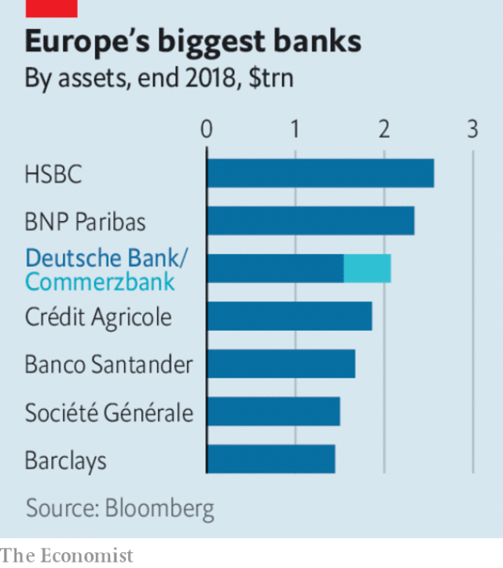

###### Chaguan

# Business this week 

> Mar 21st 2019 

The Federal Reserve left interest rates unchanged, and suggested it would not raise them at all this year (in December the Fed indicated rates might be lifted twice in 2019). It is also to slow the pace at which it shrinks its portfolio of Treasury holdings from May, and stop reducing its balance-sheet in September. 

 

After months of speculation, Deutsche Bank and Commerzbank said they would explore a merger. A combined entity would be Europe’s third-biggest bank and hold about one-fifth of German deposits. The German government is thought to favour a tie-up between the Frankfurt neighbours. A deal faces many hurdles, not least from unions opposed to the potential 30,000 job losses. See article. 

In one of the biggest deals to take place in the financial-services industry since the end of the financial crisis, Fidelity National Information Services, a fintech company, offered to buy Worldpay, a payment-processor, in a $43bn transaction. It is the latest in a string of acquisitions in the rapidly consolidating payments industry amid a shift to cashless transactions. See article. 

Lyft gave an indicative price range for its forthcoming IPO of up to $68 a share, which would value it at $23bn and make it one of the biggest tech flotations in recent years. Uber, Lyft’s larger rival, is expected to soon launch its IPO. 

Bayer’s share price swooned, after another jury found that someone’s cancer had developed through exposure to a weedkiller made by Monsanto, which Bayer acquired last year. The German drugs and chemicals company has been under the spotlight since August, when a jury reached a similar verdict in a separate case. 

Anil Ambani avoided a three-month prison sentence when his brother, Mukesh, stepped in at the last minute to help pay the $77m that a court ordered was owed to Ericsson for work it did at Anil’s now-bankrupt telecoms firm. Anil Ambani, who was once ranked the world’s sixth-richest man, said he was “touched” by his brother’s gesture. 

 AB InBev shook up its board, appointing a new chairman and replacing directors. The changes are meant to reassure investors that the brewer intends to revitalise its drooping share price and pay down the $103bn in net debt it accumulated in a spree of acquisitions. They also reduce the influence of 3G Capital, a private-equity firm that helped create AB InBev via several mergers. 3G’s strategy has been called into question by mounting problems at Kraft Heinz, another corporate titan it helped bring about. 

The White House nominated Steve Dickson, a former executive at Delta Air Lines, to lead the Federal Aviation Administration. The FAA is under pressure to explain its procedures for certifying Boeing’s 737 MAX 8, which has crashed twice within five months, killing hundreds of people. It has not had a permanent head since early 2018, in part because Donald Trump had mooted giving the job to his personal pilot. See article. 

BMW said it expects annual profit this year to come in “well below” last year’s. Like others in the industry, the German carmaker is forking out for the technologies that are driving the transition to electric and self-driving vehicles; it unveiled a strategy this week to reduce its overheads. 

Talks on resolving the trade dispute between America and China were set to resume, with the aim of signing a deal in late April. Senior American officials including Steven Mnuchin, the treasury secretary, are preparing to travel to Beijing for negotiations, followed by a reciprocal visit from a Chinese delegation led by Liu He, a vice-premier, to Washington. One of the sticking points is a timetable for unravelling the tariffs on goods that each side has imposed on the other. 

Tariffs imposed by the EU, China and others on American whiskey led to a sharp drop in exports in the second half of 2018, according to the Distilled Spirits Council. For the whole year exports rose by 5.1% to $1.2bn, a sharp drop from 2017. 

The European Commission slapped another antitrust fine on Google, this time for restricting rival advertisers on third-party websites. The €1.5bn ($1.7bn) penalty is the third the commission has levied on the internet giant within two years, bringing the total to €8.3bn. See article. 

Industrial action by French customs staff caused Eurostar to cancel trains on its London-Paris route. The workers want better pay, and also more people to check British passports after Brexit. A study by the British government has found that queues for the service could stretch for a mile if there is a no-deal Brexit, as Brits wait to get their new blue passports checked. Passengers got a taste of that this week, standing in line for up to five hours because of the go-slow. 

-- 

 单词注释:

1.unchanged[.ʌn'tʃeindʒd]:a. 无变化的 [经] 持稳的 

2.portfolio[pɒ:t'fәuliәu]:n. 皮包, 公文包, 部长职务, 有价证券财产目录, 艺术代表作选辑 [法] 公文包, 文件夹, 阁员职务 

3.treasury['treʒәri]:n. 国库, 宝库, 财政部, 国库券 [经] 库存, 国库, 金库 

4.holding['hәuldiŋ]:n. 把持, 支持, 保持 [法] 租借地, 占有物, 拥有的财产 

5.speculation[.spekju'leiʃәn]:n. 沉思, 推测, 投机 [经] 投机交易, 买空卖空 

6.deutsche[]:n. 德意志联邦共和国马克 

7.commerzbank[]: 德国商业银行公司总部所在地：德国主要业务：银行 

8.merger['mә:dʒә]:n. 合并, 归并 [经] 购并 

9.entity['entiti]:n. 实体, 实存物, 存在 [计] 实体 

10.frankfurt['fræŋkfәt]:n. 牛肉香肠, 猪牛肉混合香肠 

11.hurdle['hә:dl]:n. 障碍, 跳栏, 临时活动篱笆 vt. 用篱笆围, 越过, 克服 

12.fidelity[fi'deliti]:n. 忠实, 诚实, 忠诚, 保真度 [电] 逼真度 

13.fintech[]:[网络] 金融科技；表面处理技术展；金融资讯科技服务 

14.transaction[træn'sækʃәn]:n. 交易, 办理, 学报, 和解协议 [计] 事务处理 

15.consolidate[kәn'sɒlideit]:vt. 巩固, 使联合, 统一 vi. 巩固 [计] 合并计算 

16.amid[ә'mid]:prep. 在其间, 在其中 [经] 在...中 

17.cashless['kæʃlis]:a. 无现款的,无现金的,无钱的 

18.lyft[]:[网络] 散落 

19.indicative[in'dikәtiv]:a. 指示的, 象征的, 表示...的 [经] 指标的 

20.forthcoming['fɒ:θ'kʌmɑŋ]:a. 即将来临的 n. 来临 

21.ipo[]:abbr. 首次公开募股（Initial Public Offerings）；初次公开发行（Initial Public Offering） 

22.tech[tek]:n. 技术学院或学校 

23.flotation[flәu'teiʃәn]:[化] 浮; 浮游选矿 [医] 浮集(法), 浮选(法) 

24.uber['ju:bә]:[医] 乳房 

25.swoon[swu:n]:n. 昏晕, 晕厥 vi. 昏晕, 着迷, 渐渐消失 

26.weedkiller[ˈwi:dkɪlə(r)]:n. 除莠剂; 除草剂 

27.monsanto[]:n. 孟山都公司（美国著名农业生化公司） 

28.baye[]: [地名] [毛里塔尼亚] 巴伊 

29.spotlight['spɒtlait]:n. 照明灯, 反光灯, 聚光灯 

30.verdict['vә:dikt]:n. 裁决, 判决, 判断性意见, 定论, 结论 [法] 定论, 判断, 意见 

31.anil['ænil]:n. 假蓝靛, 靛蓝 [化] (醛或酮)缩苯胺; 苯胺衍生物(PhN=型化合物) 

32.ambani[]:[网络] 安巴尼；安巴尼家族；阿姆巴尼集团 

33.mukesh[]:[网络] 穆克什；穆克希；穆凯什 

34.ericsson[]:n. 爱立信公司 

35.telecom['telәkɔm]:telecommunication 电信 

36.ab[æb]:prep. 从, 自 [计] 地址总线 

37.inbev[]:[网络] 英博；英博啤酒集团；英博集团 

38.reassure[.ri:ә'ʃuә]:vt. 使...安心, 向...再保证 [法] 重新保证, 再保险, 使清除疑虑 

39.investor[in'vestә]:n. 投资者 [经] 投资者 

40.brewer['bru:ә]:n. (啤酒)制造者, 泡制饮料的器皿 [机] 啤酒工人 

41.revitalise[]:vt. 使有新的活力, 使新生, 使恢复元气 

42.droop[dru:p]:vi. 下垂, 消沉 vt. 使下垂 n. 低垂, 消沉 

43.spree[spri:]:n. 戏耍, 喧闹, 宴会, 狂饮 vi. 狂欢, 狂饮 

44.kraft[krɑ:ft]:n. 牛皮纸 

45.heinz[]:n. 海因茨（姓氏）；亨氏食品公司（世界著名的食品供应商, 主要产品包括调味品和餐食两大类） 

46.corporate['kɒ:pәrit]:a. 社团的, 合伙的, 公司的 [经] 团体的, 法人的, 社团的 

47.Titan['taitn]:n. 提坦, 太阳神, 巨人 

48.nominate['nɒmineit]:vt. 提名, 任命, 命名 [法] 提名...为候选人, 指定, 推荐 

49.steve[]:n. 史蒂夫（男子名） 

50.Dickson[]:n. 迪克逊（姓氏） 

51.delta['deltә]:n. 三角洲, 希腊字母的第四个字 [医] δ(希腊文的第四个字母), 丁种, 三角, 三角形区 

52.FAA[]:一切海损均不赔偿 

53.certify['sә:tifai]:v. 证明, 保证 

54.MAX[mæks]:[计] 最大 

55.moot[mu:t]:n. 大会, 模拟案件, 辩论会 a. 未决议的, 无实际意义的 vt. 讨论, 争论 

56.bmw[]:abbr. 德国宝马汽车公司（Bavarian Motor Works） 

57.carmaker['kɑ:,meikә(r)]:n. 汽车制造商 

58.transition[træn'ziʃәn]:n. 转变, 转换, 变迁, 过渡时期, 临时转调 [化] 跃迁 

59.unveil[.ʌn'veil]:vt. 揭开, 揭幕, 除去...的面纱 vi. 显露, 除去面纱 

60.steven['sti:vn]:n. 史蒂文（男子名） 

61.treasury['treʒәri]:n. 国库, 宝库, 财政部, 国库券 [经] 库存, 国库, 金库 

62.negotiation[ni.gәuʃi'eiʃәn]:n. 谈判, 磋商, 交涉 [经] 谈判, 协商 

63.reciprocal[ri'siprәkl]:a. 互惠的, 相互的, 相等的, 倒数的, 彼此相反的 n. 倒数, 互相起作用的事物 

64.Washington['wɒʃiŋtn]:n. 华盛顿 

65.unravel[.ʌn'rævl]:vt. 阐明, 解决, 解开 vi. 散开 

66.tariff['tærif]:n. 关税, 关税表, 价格表, 收费表 vt. 课以关税 [计] 价目表 

67.EU[]:[化] 富集铀; 浓缩铀 [医] 铕(63号元素) 

68.whiskey['hwiski]:n. 威士忌酒 a. 威士忌酒的 

69.distil[]:vt.vi. 蒸馏, 提取...的精华, 用蒸馏法提取 vi. 滴下, 渗出 

70.slap[slæp]:n. 掴, 掌击, 侮辱, 拍击声 v. 拍击, 惩罚 adv. 正面地, 直接地, 突然地 

71.antitrust[.ænti'trʌst]:a. 反托拉斯的 [法] 反托拉斯的 

72.google[]:谷歌；搜索引擎技术；谷歌公司 

73.advertiser['ædvәtaizә]:n. 做广告者, 广告客户 [经] 广告商, 广告者 

74.penalty['penәlti]:n. 处罚, 刑罚, 罚款, 罚球, 报应, 不利结果, 妨碍 [经] 罚金(款), 违约金 

75.levy['levi]:n. 税款, 所征的人数, 征收 vi. 征税, 课税 vt. 征收, 强求, 召集 

76.eurostar['juərəustɑ:]: 欧洲之星（一条连接英国伦敦圣潘可拉斯车站与法国巴黎北站、里尔以及比利时布鲁塞尔南站的高速铁路服务） 

77.Brexit[]:[网络] 英国退出欧盟 

78.brit[brit]:n. 小海生动物, 小鲱鱼 

