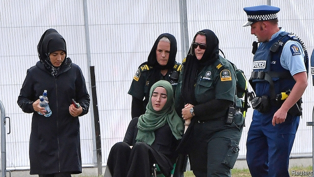
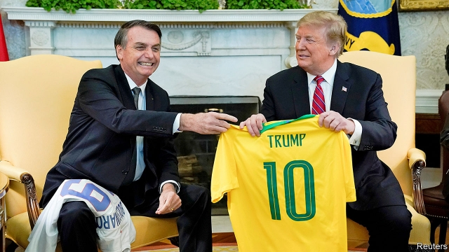

###### Chaguan

# Politics this week 

 

> Mar 21st 2019 

A gunman killed 50 worshippers at two mosques in Christchurch, streaming part of the atrocity live on Facebook. The attacker, an Australian who had been living in New Zealand for two years, was motivated by fears that immigration was threatening “white” culture. The government vowed to tighten gun-control laws and monitor right-wing extremists more carefully. See article. 

Nursultan Nazarbayev, Kazakhstan’s strongman president of 30 years, resigned abruptly. He retains considerable influence; his daughter is the new chairman of the Senate and the constitution gives him lifetime immunity from prosecution. The capital, Astana, is to be renamed Nursultan after him. See article. 

Tsai Ing-wen, Taiwan’s president, was challenged for her party’s nomination in next year’s presidential election by Lai Ching-te, a former prime minister. No sitting Taiwanese president has faced a primary before. See article. 

The Philippines withdrew from the International Criminal Court. Rodrigo Duterte, the country’s president, initiated the move a year ago after the court began probing his campaign to encourage police to shoot suspected drug dealers. 

China’s president, Xi Jinping, told a meeting of educators that training people to support the Communist Party should begin when they are toddlers. He said teachers must “confront all kinds of wrong opinions”—an apparent reference to Western ideas. 

In a “white paper”, the Chinese government said that since 2014 it had destroyed 1,588 terrorist gangs, arrested 12,995 terrorists and punished 30,645 people for “illegal religious activities” in the far western region of Xinjiang. Human-rights groups say about 1m people in Xinjiang, mostly Muslim Uighurs, have been locked up for signs of extremism, such as having big beards or praying too much. 

Benny Gantz, the main challenger to Binyamin Netanyahu, the prime minister, in Israel’s forthcoming election, dismissed reports that his phone had been hacked by Iran and that he was vulnerable to blackmail. Some in Mr Gantz’s party blamed Mr Netanyahu for leaking the story. He denied this and asked: “If Gantz can’t protect his phone, how will he protect the country?” See article. 

For the third week in a row Algeria was rocked by mass protests against Abdelaziz Bouteflika, the ailing president. Mr Bouteflika insists on staging a national conference and approving a new constitution before holding an election, in which he would not run. But a new group led by politicians and opposition figures called on him to step down immediately. The army appeared to be distancing itself from the president. See article. 

More than 1,000 people may have been killed when a cyclone hit Mozambique, causing floods around the city of Beira. The storm also battered Malawi and Zimbabwe. See article. 

Amnesty International said that 14 civilians were killed during five air strikes by American military forces in Somalia. AFRICOM, America’s military command for Africa, said no civilians had been killed in the strikes. 

 

Jair Bolsonaro, Brazil’s populist president, visited Donald Trump at the White House. Mr Bolsonaro has been described as the “Trump of the Tropics” for his delight in offending people. The pair got on well. Mr Trump said he wanted to make Brazil an official ally, which would grant it preferential access to American military technology. 

Supporters of Juan Guaidó, the man recognised as the rightful president of Venezuela by over 50 countries, said they now controlled three of the country’s diplomatic buildings in the United States, including the consulate in New York. 

A judge in Guatemala ordered the arrest of Thelma Aldana, a candidate in the forthcoming presidential election, on charges of fraud, which she denies. Ms Aldana, a former attorney-general, worked closely with a UN-backed commission investigating corruption. Guatemala withdrew its support from that body after it turned its sights on the president, Jimmy Morales. 

Canada’s top civil servant resigned over his entanglement in a scandal in which political pressure was allegedly exerted on the then attorney-general to drop the prosecution of an engineering firm accused of bribery in Libya. He is the fourth person to resign over the matter, which has tarnished Justin Trudeau, the Liberal prime minister.  See article. 

Citing a convention dating back to 1604, John Bercow, the Speaker of Britain’s House of Commons, intervened in the Brexit process, again, ruling out a third vote on the withdrawal deal unless there was a change in substance to its terms. Parliament therefore could not have another “meaningful vote” on leaving the European Union before this week’s European Council meeting, where Brexit is on the agenda. Theresa May asked the council for a three-month extension of the Brexit deadline, to June 30th. See article. 

The European People’s Party, a grouping of centre-right parties at the European Parliament, voted to suspend Fidesz, Hungary’s ruling party, as a protest against what many in the parliament believe are repeated attempts by the government to undermine the rule of law. 

Zuzana Caputova, a political novice, came top in the first round of Slovakia’s presidential election. Disgust at official corruption, and the murder last year of a young journalist who was investigating it, fuelled her victory. See article. 

Donald Trump vetoed the first bill of his presidency, a resolution from Congress to overturn his declaration of a national emergency on the border with Mexico. The resolution had passed with some support from Republicans, worried about the precedent Mr Trump is setting for future presidents, who might also declare an emergency to obtain funding for a project that Congress has denied them. 

-- 

 单词注释:

1.politic['pɒlitik]:a. 精明的, 明智的, 策略的 

2.gunman['gʌnmәn]:n. 枪手, 持枪的歹徒, 制造枪械者 [法] 持枪歹徒, 持枪抢劫或杀人者, 枪炮工人 

3.worshipper[]:n. 礼拜者, 崇拜者, 爱慕者 

4.mosque[mɒsk]:n. 清真寺 

5.Christchurch['kraist-tʃә:tʃ]:n. 克赖斯特彻奇 

6.atrocity[ә'trɒsiti]:n. 残暴, 凶恶, 暴行 [法] 暴行, 残酷, 残忍 

7.facebook[]:n. 脸谱网 

8.attacker[ә'tækә]:n. 攻击者 

9.zealand['zi:lәnd]:n. 西兰岛（丹麦最大的岛） 

10.vow[vau]:n. 誓约, 誓言, 许愿 vi. 起誓, 发誓, 郑重宣言 vt. 立誓, 起誓要, 郑重地宣布 

11.tighten['taitn]:vt. 勒紧, 使变紧 vi. 变紧, 绷紧 

12.extremist[iks'tri:mist]:[经] 偏激份子 

13.carefully['kєәfuli]:adv. 小心地, 谨慎地 

14.nursultan[]:[网络] 努苏坦 

15.nazarbayev[]:[网络] 纳扎尔巴耶夫；总统纳扎尔巴耶夫；哈萨克的纳扎尔巴耶夫 

16.strongman[ˈstrɒŋmæn]:n. 大力士 

17.abruptly[ә'brʌptli]:adv. 突然地, 唐突地 

18.immunity[i'mju:niti]:n. 免疫, 免疫性, 免除 [化] 免疫性 

19.prosecution[.prɒsi'kju:ʃәn]:n. 执行, 经营, 起诉 

20.Astana['ɑ:stənə]:n. 阿斯塔纳（哈萨克斯坦共和国首都） 

21.rename[.ri:'neim]:vt. 重新命名, 再命名, 给...改名 [计] 重命名; DOS内部命令:更改文件名 

22.tsai[]:n. 蔡（姓氏） 

23.nomination[.nɒmi'neiʃәn]:n. 提名, 任命, 提名权 

24.presidential[.prezi'denʃәl]:a. 总统制的, 总统的, 首长的, 统辖的 [法] 总统的, 议长的, 总经理的 

25.lai[lai]:abbr. 意大利航空公司（Linee Aeree Italiane） 

26.taiwanese[,taiwɑ:'ni:z, -'ni:s]:a. 台湾人的；台湾的 

27.Philippine['filipi:n]:a. 菲律宾(群岛)的, 菲律宾人的 

28.Rodrigo[]:n. 罗德里戈（歌曲名称） 

29.duterte[]:[网络] 迪泰特 

30.initiate[i'niʃieit]:n. 入会, 开始 a. 新加入的 vt. 开始, 传授基本知识给 

31.probe[prәub]:n. 探索, 调查, 探针, 探测器 v. 用探针探测, 调查, 探索 

32.dealer['di:lә]:n. 经销商, 商人 [经] 交易员, 贩卖商 

33.toddler['tɔdlә]:n. 蹒跚行走的人, 学步的小孩, 学步的幼儿, (非正式)信步走的人 

34.confront[kәn'frʌnt]:vt. 使面对, 对抗, 遭遇, 使对质, 比较 [法] 对证, 使对质, 比较 

35.terrorist['terәrist]:n. 恐怖分子 [法] 恐怖份子, 恐怖主义 

36.Muslim['mjzlim; (?@) 'mʌzlem]:n. 伊斯兰教, 伊斯兰教教徒 

37.Uighur[]:n. 维吾尔族人, 维吾尔语, 维吾尔人 

38.extremism[ik'stri:mizm]:n. 极端倾向, 极端论, 过激主义 

39.benny['beni]:n. 安非他明(药片) 

40.gantz[]: [人名] 甘茨; [电影]杀戮都市/杀戮都市 

41.challenger['tʃælindʒә]:n. 挑战者 [经] 申请回避的人 

42.binyamin[]:本雅明 

43.Netanyahu[]:n. 内塔尼亚胡（人名） 

44.forthcoming['fɒ:θ'kʌmɑŋ]:a. 即将来临的 n. 来临 

45.hack[hæk]:n. 劈, 砍, 砍痕, 出租车, 干咳, 晒架, 鹤嘴锄 vt. 劈, 砍, 出租, 用旧 vi. 劈, 砍, 干咳, 驾驶出租车 a. 出租的 

46.Iran[i'rɑ:n]:n. 伊朗 

47.vulnerable['vʌlnәrәbl]:a. 易受伤害的, 有弱点的, 易受影响的, 脆弱的, 成局的 [医] 易损的 

48.blackmail['blækmeil]:n. 勒索 vt. 勒索 

49.Algeria[æl'dʒiәriә]:n. 阿尔及利亚 

50.abdelaziz[]:n. (Abdelaziz)人名；(阿拉伯)阿卜杜勒-阿齐兹 

51.bouteflika[]:[网络] 布特弗利卡；阿尔及利亚总统布特弗利卡；布特佛里卡 

52.ailing['eiliŋ]:a. 生病的 [医] 患病的, 病痛的 

53.opposition[.ɒpә'ziʃәn]:n. 反对, 敌对, 相反, 在野党 [医] 对生, 对向, 反抗, 反对症 

54.cyclone['saiklәun]:n. 龙卷风, 暴风 [化] 旋流(分离,除尘)器 

55.Mozambique[.mәuzәm'bi:k]:n. 莫桑比克 

56.Beira['beirә]:贝拉[莫桑比克东南部港市] 

57.batter['bætә]:v. 连续猛打（尤其指妇女），猛击 n. 面糊（食物），击球员，打击手 

58.Malawi[mә'lɑ:wi]:n. 马拉维 

59.amnesty['æmnisti]:n. 大赦, 赦免 

60.Somalia[sәu'mɑ:liә]:n. 索马里 

61.africom[]:[网络] 非洲司令部；非洲军事指挥部；非洲指挥部 

62.jair[]:[网络] 睚珥；贾伊尔；睢珥 

63.Populist['pɔpjulist]:n. 民粹派的成员 

64.tropic['trɒpik]:n. 回归线 

65.Brazil[brә'zil]:n. 巴西 

66.ally['ælai. ә'lai]:n. 同盟者, 同盟国, 助手 vt. 使联盟, 使联合, 使有关系 vi. 结盟 

67.preferential[.prefә'renʃәl]:a. 优先的, (关税等)优惠的 [经] 特惠的; 特惠关税率, 优先权 

68.supporter[sә'pɒ:tә]:n. 支持者, 后盾, 迫随者, 护身织物 [法] 支持者, 赡养者, 抚养者 

69.juan[hwɑ:n]:n. 胡安（男子名） 

70.rightful['raitful]:a. 合法的, 正直的, 恰当的 [法] 正当的, 合法的, 依法有求权的 

71.Venezuela[,vene'zweilә]:n. 委内瑞拉 

72.diplomatic[.diplә'mætik]:a. 外交的, 老练的 [法] 外交的, 外交上的, 文献上的 

73.consulate['kɒnsjulit]:n. 领事, 领事任期, 领事馆 [经] 领事馆 

74.york[jɔ:k]:n. 约克郡；约克王朝 

75.Guatemala[.gwɑ:tә'mɑ:lә]:n. 危地马拉 

76.thelma['θelmә]:n. 西尔玛（女子名） 

77.aldana[]:[网络] 任峻；阿尔丹那 

78.fraud[frɒ:d]:n. 欺骗, 欺诈, 诡计, 骗子 [经] 欺诈, 舞弊, 骗子 

79.corruption[kә'rʌpʃәn]:n. 腐败, 堕落, 贪污 [计] 论误 

80.jimmy['dʒimi]:n. 铁撬 vt. 撬 

81.morale[mɒ'rɑ:l]:n. 士气, 道德 

82.entanglement[in'tæŋglmәnt]:n. 纠缠, 卷入, 缠绕物 [化] 缠结 

83.allegedly[ә'ledʒidli]:adv. 依其申述 

84.bribery['braibәri]:n. 贿赂行为, 行贿, 受贿 [经] 行贿, 受贿 

85.Libya['libiә]:n. 利比亚 

86.tarnish['tɑ:niʃ]:n. 失泽, 失泽膜, 污点 vt. 使失去光泽, 玷污 vi. 失去光泽, 被玷污 

87.justin['dʒʌstin]:n. 贾斯廷（男子名） 

88.trudeau[]:n. (Trudeau)人名；(英、法)特鲁多 特鲁多 

89.cite[sait]:vt. 引用, 引证, 表彰 [建] 引证, 指引 

90.john[dʒɔn]:n. 盥洗室, 厕所, 嫖客 

91.intervene[.intә'vi:n]:vi. 插入, 调停, 干涉 [经] 进场干预 

92.Brexit[]:[网络] 英国退出欧盟 

93.withdrawal[wið'drɒ:l]:n. 提款, 撤退, 退回, 撤消, 退隐, 戒毒过程 [医] 戒除, 脱瘾 

94.meaningful['mi:niŋful]:a. 意味深长的 

95.theresa[ti'ri:zә]:n. 特丽萨（女子名） 

96.grouping['gru:piŋ]:n. 分组 [计] 组 

97.fidesz[]:[网络] 青年民主党；匈牙利执政党青民盟；匈牙利执政党青年民主党 

98.undermine[.ʌndә'main]:vt. 在...下面挖, 渐渐破坏, 暗地里破坏 [法] 暗中破坏, 以阴谋中伤伤害 

99.zuzana[]:[网络] 健身教练祖札娜；张虹；捷克的正妹祖札娜 

100.novice['nɒvis]:n. 新手, 初学者 

101.veto['vi:tәu]:n. 否决权 vt. 否决, 禁止 

102.presidency['prezidәnsi]:n. 总统职权, 总裁职位 

103.overturn[.әuvә'tә:n]:n. 倾覆, 破灭, 革命 vt. 推翻, 颠倒 vi. 翻倒 

104.declaration[.deklә'reiʃәn]:n. 宣告, 说明, 宣布 [计] 说明 

105.precedent['presidәnt]:n. 先例, 前例 a. 在先的, 在前的 

