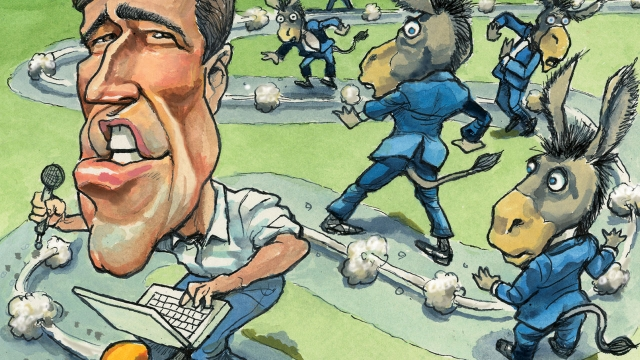

###### Lexington

# Bet on O’Rourke 

##### The Texan Democrat has a rare ability to control his own narrative 

 

> Mar 21st 2019 

LESS THAN a week into his presidential campaign, Beto O’Rourke is stirring strong emotions. Among the thousands who have flocked to hear the skateboarding, bilingual Texan in the small rallies he has already held in Iowa, Michigan, Ohio, Pennsylvania and New Hampshire, they seem to be largely positive. Youngish, tall and more charismatic than any of his rivals, as he demonstrated during his losing Senate campaign last year, the 46-year-old former congressman is Democratic box office. 

During a pit-stop at Penn State University, in central Pennsylvania, midway between Iowa and New Hampshire, he received half the adulation Senator Bernie Sanders would have got, with a tenth of the planning. There is a gushier edge to Betomania, too. Like Swede Levov, George Clooney and, yes, Barack Obama, whose pensive pauses, fluid perorations and optimism Mr O’Rourke has repurposed for a dress-down generation, he has passed the first test of American heroism: women and men seem equally prone to admire or love him. As he tried to exit the crush of a couple of thousand students, while standing head and shoulder above them, your columnist overheard one express amorous thoughts for him, while another loudly invited the candidate to join his punk band. 

Yet Mr O’Rourke, whose music is these days confined to air-drumming behind the wheel, has also attracted more (and nastier) criticism than his dozen rivals put together. His unofficial campaign announcement—a cover-interview in Vanity Fair,with pictures by Annie Leibovitz—was panned as preening and entitled. Commentators on the right have piled into his underwhelming record, as a once-aimless youth with a drunk-driving charge, who married money, then served three low-key terms in the House of Representatives. Those on the left were scandalised when Mr O’Rourke, in an early stump speech, made a joke of his absentee fathering. And there is a bipartisan consensus that Mr O’Rourke, who has launched himself at America in a self-driven rental truck, with tearaway passion, no campaign manager and few firm policy ideas, shows an unbefitting want of seriousness. “When are we going to get an actual policy from you, instead of platitudes and nice stories?” asked a Sanders supporter in the crowd at Penn State. 

Much of this is warranted. Mr O’Rourke is an undistinguished Democratic front-runner and his sketchiness on large areas of policy seems almost wilful. Surely, on the journey of introspection that followed his Texas defeat, during which Mr O’Rourke ate sacred dirt in New Mexico and blogged religiously, he could have found time to form a view on Brexit? Yet he says he has no opinion on it. And he has little more to say on the environmental and other economic policies he claims to prioritise. Having sounded unenthusiastic about the Green New Deal preached by left-wingers, he was asked in Pennsylvania how he would change it. His reply included much emphasis on the seriousness of the climate emergency (as if his audience needed convincing on that), a joke about not wanting to be seen as one of the bendejos who failed to deal with it, a shout-out to Texan wind turbines, and little else. 

Yet it is possible to exaggerate Mr O’Rourke’s cluelessness. He has conventional progressive positions on criminal justice and immigration reform, and a more interesting emerging one on health care. Having backed Medicare for all, he now wants to expand it while protecting the private-insurance market. As most of his rivals rush to the left, that is a notable statement of realism. It is also moot whether Mr O’Rourke’s hot air on climate change is less serious than the hallucination masquerading as policy that is the Green New Deal. Mr O’Rourke has been so condemned mainly because his diverse critics view him as a threat. 

For professional politickers—the consultants, pollsters and columnists who shape political news—his campaign is heretical. He disdains polling, depicts his rallies as brainstorming sessions and generates and distributes much of his own media. And his methods work. His slim defeat in Texas was not the stunning achievement he claims, yet it gave him a national profile and Sanders-esque command of online fundraising. His methods also work for reasons none of his Democratic rivals looks able to replicate. 

In place of policy smarts, Mr O’Rourke projects a mood that many find appealing. His optimistic talk of “America’s genius” is familiar; yet mingled with a rarer call for humility and atonement. Though America’s shortcomings, its injustices and political dysfunction, are experienced unevenly, fixing them starts with acknowledging that everyone is responsible. Not least the candidate: “Thank you for the accountability,” he replied sadly, when asked to explain the mismatch between his idealistic rhetoric and more pragmatic voting record. It was almost moving. Mr O’Rourke, who is reading Joseph Campbell’s treatise on heroism, “The Power of Myth”, is not only the master of his narrative because of his quirkiness. It is also because his frailties are as integral to it as his inspirational strengths. He comes across as a reformed drifter vying to turn a personal quest for self-improvement into a political cause. 

If he fails, it will be because Democrats find his shortcomings too risky. Mr Obama, one notes, had to convince them he had serious policy chops besides the feel-good. Yet Democrats face bigger challenges today than they did back then, to which Mr O’Rourke offers a possibly flawed yet perhaps unrivalled answer. 

The hard left is stronger—which makes his Obama-like ability to cloak his pragmatism in soaring rhetoric and a few progressive pledges especially valuable. And Donald Trump, who tries to turn any contest into a brawl, is a fierce opponent. A Democratic challenger who could not merely dust himself off, as Mr Obama could, but make his patience and fortitude seem more important than the president’s boorishness, as Mr O’Rourke would try to do, might be awkward. That the lanky Texan would then get back on his skateboard, while vlogging about it, would be another plus. 

-- 

 单词注释:

1.lexington['leksiŋtәn]:n. 列克星敦市（位于美国肯塔基州） 

2.Texan['teksәn]:a. 得克萨斯州的 n. 得克萨斯州的人, 得克萨斯人 

3.democrat['demәkræt]:n. 民主人士, 民主主义者, 民主党党员 [经] 民主党 

4.narrative['nærәtiv]:n. 叙述, 故事 a. 叙述的, 叙事的, 故事体的 

5.les[lei]:abbr. 发射脱离系统（Launch Escape System） 

6.presidential[.prezi'denʃәl]:a. 总统制的, 总统的, 首长的, 统辖的 [法] 总统的, 议长的, 总经理的 

7.beto[]:n. (Beto)人名；(英)贝托 

8.bilingual[bai'liŋgwәl]:a. 双语的 

9.rally['ræli]:n. 重振旗鼓, 集合, 群众集会, 跌停回升 v. 重整旗鼓, 集合, 恢复精神, 团结, 挖苦, 嘲笑 

10.Iowa['aiәwә]:n. 衣阿华州 

11.Michigan['miʃigәn]:n. 密歇根州 

12.Ohio[әu'haiәu]:n. 俄亥俄 

13.Pennsylvania[.pensil'veinjә]:n. 宾夕法尼亚 

14.hampshire['hæmpʃiә]:n. 汉普郡（英国南部之一郡） 

15.youngish['jʌŋiʃ]:a. 还年轻的, 还幼小的 

16.charismatic[,kæriz'mætik]:a. 魅力, 能吸引大众的非凡能力, 神授的能力, 领袖人物感人的超凡魅力 

17.congressman['kɒŋgresmәn]:n. 国会议员, 众议院议员 [法] 国会议会 

18.penn[pen]:abbr. 宾夕法尼亚大学（Pennsylvania） 

19.midway['mid'wei]:n. 中途, 中间, 娱乐场 a. 中途的, 中间的 adv. 中途 

20.adulation[.ædju'leiʃәn]:n. 谄媚, 过分的称赞 

21.senator['senәtә]:n. 参议员, (某些大学的)理事 [法] 参议员, 上议员 

22.bernie['bә:ni]:n. 伯尼（男子名）；[俚]可卡因（等于cocaine） 

23.sander['sændә]:[电] 散沙 

24.gushier[]:adj. 迸发的；流出的；过分多情的 [网络] 装腔作势的；易动感情的 

25.Swede[swi:d]:n. 瑞典人 

26.levov[]:[网络] 列沃夫；利沃夫 

27.george[dʒɔ:dʒ]:n. 乔治（男子名）；自动操纵装置；英国最高勋爵勋章上的圣乔治诛龙图 

28.clooney[]:克卢尼（人名） 

29.barack[bɑ:'ræk]:n. 巴拉克（男子名） 

30.obama[]:n. 奥巴马(姓) 

31.pensive['pensiv]:a. 沉思的, 哀思的, 忧郁的 

32.peroration[.perә'reiʃәn]:n. 结束语, 演讲, 夸夸其谈 

33.optimism['ɒptimizm]:n. 乐观主义, 乐观, 乐天 [医] 乐观主义, 乐观 

34.repurposed[]:[网络] 再利用材料 

35.equally['i:kwәli]:adv. 相等地, 同样地, 平等地 

36.prone[prәun]:a. 俯伏的, 面向下的, 有...倾向的 [医] 旋前的, 伏的, 俯的 

37.columnist['kɒlәmist]:n. 专栏作家 

38.overhear[.әuvә'hiә]:vt. 无意中听到, 偷听 

39.amorous['æmәrәs]:a. 多情的, 表示爱情的, 恋爱的 

40.punk[pʌnk]:n. 废物, 小阿飞 a. 无用的, 腐朽的 

41.unofficial[.ʌnә'fiʃәl]:a. 非正式的, 非官方的 [化] 非法定的; 未入药典的 

42.annie['æni]:n. 安妮（女子名） 

43.preen[pri:n]:vt. 用嘴整理, 打扮, 使得意 vi. 打扮漂亮, 感到得意 

44.commentator['kɔmenteitә]:n. 评论员, 实况广播员, 注释者, 时事评论员 

45.underwhelm[,ʌndә'hwelm]:vt. 未留下深刻印象 

46.scandalise[]:vt. 使(某人)愤慨, 使感震惊, 使(某人)反感, 诽谤, 中伤 

47.stump[stʌmp]:n. 残株, 树桩, 烟蒂, 讲演台 vt. 砍断, 挑战, 难住 vi. 蹒跚而走 

48.absentee[.æbsәn'ti:]:n. 缺席者, 不在者 [经] 缺勤者, 缺席者, 未到工者 

49.bipartisan[bai,pɑ:ti'zæn]:a. 两党连立的 

50.rental['rentl]:n. 租费, 租金收入 a. 租赁的, 收取租金的 

51.tearaway['tєәrә.wei]:a. 野性十足的, 行动鲁莽的 n. 野蛮狂暴的人, 流氓 

52.unbefitting[.ʌnbi'fitiŋ]:a. 不合适的, 不相宜的 

53.seriousness['siәriәsnis]:n. 严肃, 认真, 严重性 

54.platitude['plætitju:d]:n. 单调, 平凡, 陈腐, 陈词滥调 

55.supporter[sә'pɒ:tә]:n. 支持者, 后盾, 迫随者, 护身织物 [法] 支持者, 赡养者, 抚养者 

56.warrant['wɒ:rәnt]:n. 授权, 正当理由, 根据, 证明, 批准, 凭证, 令状, 委任状 vt. 授权给, 保证, 担保, 批准, 使有正当理由 

57.undistinguished[.ʌndis'tiŋgwiʃt]:a. 未经区分的, 未被注意到的, 普通的, 平凡的 

58.sketchiness['sketʃinis]:n. 大概；肤浅 

59.wilful['wilful]:a. 任性的, 固执的, 故意的, 存心的 [法] 有意的, 故意的, 任性的 

60.introspection[.intrәu'spekʃәn]:n. 内省, 反省 [医] 内省 

61.Texas['teksәs]:n. 德克萨斯 

62.blogged[]:v. 维护网志（不断更新和传发他人等）( blog的过去式 ) 

63.religiously[]:adv. 虔诚而经常地, 笃诚地 

64.environmental[in.vaiәrәn'mentәl]:a. 周围的, 环境的 [经] 环境的, 环保的 

65.prioritise[praɪ'ɒrəˌtaɪz]:vt. 给予…优先权; 按优先顺序处理; 出轻重缓急 vi. 把事情按优先顺序排好（等于prioritize） 

66.unenthusiastic[ʌnɪn'θjʊzɪ'æstɪk]:a. 不热心的, 缺乏热情的 

67.preach[pri:tʃ]:v. 传道, 讲道, 说教, 宣讲, 鼓吹 n. 说教, 布道 

68.cluelessness[]:[网络] 无知的；无绪；摸着石头过河 

69.medicare['medi,keә]:n. 医疗照顾方案, 医疗照顾项目 [法] 公办的医疗保险制 

70.notable['nәutәbl]:n. 著名人士, 值得注意之事物 a. 值得注意的, 显著的 

71.realism['riәlizm]:n. 写实主义, 现实, 实在论 [法] 现实主义 

72.moot[mu:t]:n. 大会, 模拟案件, 辩论会 a. 未决议的, 无实际意义的 vt. 讨论, 争论 

73.hallucination[hә.lu:si'neiʃәn]:n. 幻觉, 幻想 [医] 幻觉 

74.masquerade[.mɑ:skә'reid]:n. 化装舞会, 伪装 vi. 参加化装舞会, 伪装, 假装 

75.pollster['pәulstә]:n. 民意调查人, 民意测验经办人 

76.heretical[hi'retikәl]:a. 异教的, 异端的 

77.disdain[dis'dein]:n. 蔑视 vt. 蔑视, 鄙弃 

78.depict[di'pikt]:vt. 描述, 描写 

79.brainstorming['brein,stɔ:miŋ]:自由讨论, 发表独创[创造]性意见, 智力爆发 

80.stunning['stʌniŋ]:a. 打昏迷的, 弄得人昏头昏脑的, 令人震惊的 

81.profile['prәufail]:n. 侧面, 轮廓, 传略 vt. 描绘...轮廓, 写...的传略 [计] 提问档; 剖面图法; 剖面法 

82.online[]:[计] 联机 

83.fundraising['fʌndˌreɪzɪŋ]:n. 筹款, 募款 a. 筹款的 

84.replicate['replikeit]:vt. 折叠, 折转, 复制 n. 复现试验, 复制品, 高八度音 a. 复现的, 复制的, 折转的, 弯回的 

85.mingle['miŋgl]:v. (使)混合 

86.humility[hju:'militi]:n. 谦逊, 谦虚, 谦卑 

87.atonement[ә'tәunmәnt]:n. 赎罪, 补偿 [法] 补偿, 赎回, 赎罪 

88.injustice[in'dʒʌstis]:n. 不公平, 非正义的行为 [法] 不公正, 不公平, 权利侵害 

89.dysfunction[dis'fʌŋkʃәn]:n. 机能不良, 机能障碍 [医] 机能障碍, 机能不良 

90.unevenly[]:adv. 不平坦地；不均衡地；不平行地 

91.accountability[ә.kauntә'biliti]:n. 负有责任, 可说明性 [化] 衡算计量 

92.mismatch[mis'mætʃ]:n. 错配 vt. 错配, 使...成不相配的婚姻 

93.idealistic[ai'diәlistik]:a. 理想主义的, 唯心论的, 唯心主义的, 唯心主义者的 

94.rhetoric['retәrik]:n. 修辞, 修辞学, 雄辩(术) 

95.pragmatic[præ^'mætik]:a. 忙碌的, 爱管闲事的, 自负的, 固执己见的, 实际的, 务实的, 国事的, 国务的 [法] 闲断的, 固执己见的, 实用主义的 

96.Joseph['dʒәuzif]:n. 约瑟夫（男子名）；约瑟（圣经中雅各的第十一子） 

97.treatise['tri:tis]:n. 论文, 专著 

98.heroism['herәuizm]:n. 英勇, 勇敢事迹, 豪侠行为 

99.myth[miθ]:n. 神话, 虚构的事, 虚构的人 

100.quirkiness[]:n. 诡诈；离奇；突变 

101.frailty['freilti]:n. 弱点, 脆弱, 意志薄弱 [法] 虚弱, 意志薄弱, 因意志薄弱而犯的错误 

102.integral['intigrәl]:n. 整体, 积分, 整数 a. 固有的, 整体的, 整数的, 积分的 [计] 积分 

103.inspirational[.inspә'reiʃәnәl]:a. 凭灵感的, 鼓舞人心的, 神感的 

104.drifter['driftә]:n. 漂流者, 漂流物, 漂网渔船 

105.vie[vai]:vi. 争, 竞争, 争胜 vt. 提出...来竞争, 以...作较量 

106.quest[kwest]:n. 探索, 寻求, 调查 v. 寻找, 找, 追寻猎物 

107.democrat['demәkræt]:n. 民主人士, 民主主义者, 民主党党员 [经] 民主党 

108.risky['riski]:a. 危险的 

109.flaw[flɒ:]:n. 缺点, 裂纹, 瑕疵, 一阵狂风 [化] 划痕; 裂缝; 裂纹 

110.unrivalled[]:a. 无敌的, 无双的, 无可匹敌的, 无比的, 至高无上的, 极好的 

111.pragmatism['prægmәtizm]:n. 实用主义 [法] 实用主义, 干涉主义, 独断 

112.soar[sɒ:]:n. 高扬, 翱翔 vi. 往上飞舞, 高耸, 翱翔 

113.pledge[pledʒ]:n. 诺言, 保证, 誓言, 抵押, 信物, 保人, 祝愿 vt. 许诺, 保证, 使发誓, 抵押, 典当, 举杯祝...健康 

114.brawl[brɒ:l]:n. 争吵 vi. 争吵, 哗哗地流水 

115.challenger['tʃælindʒә]:n. 挑战者 [经] 申请回避的人 

116.fortitude['fɒ:titju:d]:n. 刚毅, 坚毅, 不屈不挠 

117.boorishness['buriʃnis]:n. 粗野；粗鲁；笨拙 

118.lanky['læŋki]:a. 瘦长的 

119.vlogging[]:[网络] 视频博客；影客；手机博客和视频日志 

