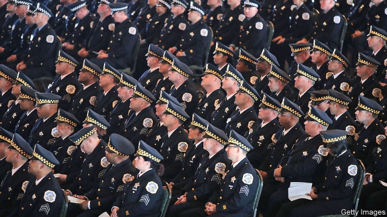

###### Watching the watchmen

# Chicago’s troubled police force gets federal oversight 

##### How much difference will this make to the way officers behave? 

 

> Mar 21st 2019 

“FOR ME, NOTHING’S gonna change,” says a police sergeant, hands on hips, huddled with colleagues in a station in a scruffy, violent district on Chicago’s West Side. He sounds relaxed as the city begins its term under a “consent decree”, a court-ordered process that imposes federal monitors to oversee police reforms. “If you’re a good officer, it won’t change anything,” agrees another man in uniform. 

As they will soon discover, much in fact will have to be done differently if a history of often unconstitutional policing in the Windy City is to end. Even as Los Angeles and New York have cut murder rates to historic lows over the past three decades, Chicago’s remain three times higher. Officers have long proved trigger-happy and quick to cover up colleagues’ wrongdoing. One calculation in 2016 found that they fired at a member of the public every five days, and had killed 92 people in the previous six years. And young black men are overwhelmingly the victims of police abuse. 

Reform in Chicago has been hampered by strong police unions and politicians who dared not make enemies by confronting the 13,000 men in blue. Chicago long failed, for example, to train its officers properly. Eddie Johnson, the superintendent, recalls he was educated in use-of-force rules as a novice at the police academy in 1988 but not retrained for 28 years, until he became the top cop in 2016. 

Mr Johnson’s appointment came after protests over an egregious killing, in which a white officer was filmed shooting a disoriented black teenager, Laquan McDonald, 16 times in 2014. (The officer was convicted of murder, a rarity in Chicago, last October.) Since then a new “pointing policy” discourages quick draws, though it has caused consternation in the force. Mr Johnson said recently that officers grumbled so much, “it is the bane of my life.” 

Though he talks of other recent improvements, such as officers’ use of body cameras, he admits that difficulties linger. These include ongoing use of “racist techniques” and the fact “we treat part of the city inappropriately”. He means his police are most likely to abuse Latino or black residents. This, Mr Johnson reckons, is the fault of a few rotten apples. “We need to identify the bad actors and get them out.” 

In reality, the problems are structural. The compensation doled out for wrongdoing by his force provides an illustration. Since 2010, such settlements plus interest have amounted to over $930m (not far off the $1.5bn annual budget for the police). In 2015 the city agreed to pay reparations of $5.5m to victims of a detective, Jon Burge, who led a team known as the “Midnight Crew”. For much of the 1970s and 1980s they beat, burned, raped, electrocuted or subjected to mock executions 118 suspects, probably many more, to get confessions. 

Such systemic failings explain why the mayor, Rahm Emanuel, at last agreed to a consent decree. He says that after “seven attempts in 100 years to reform”, he is proud that bigger changes will come. The decree was in the works for two years, as first the Justice Department and then Illinois’s attorney-general demanded it. It allows federal monitors to insist on openness and accountability across many departments, not only the police, says Walter Katz, who negotiated for the city. The experiences of other cities which have had decrees, such as Los Angeles, suggest it will last a decade or more. 

Consent decrees were made possible by legislation from 1994 (passed after riots in 1992 in Los Angeles, sparked by the acquittal of police officers who had beat a black motorist, Rodney King.) The Justice Department each year has typically picked two or three targets for reform from 18,000 police departments. It usually responds to a prominent case of police malpractice. According to a Justice Department review of two decades’ use of decrees, there have been 69 formal investigations and 40 decrees covering police departments. 

Do they work? Because they apply to only a few of America’s 18,000 police departments, it is hard to prove that consent decrees lead to fewer police shootings. (America’s police killed 998 people in 2018, on a par with recent years.) But Stephen Rushin of Loyola University in Chicago, author of a book on consent decrees, says their benefits far outweigh costs. He says police use less “categorical force” when being monitored, meaning acts that send members of the public to hospital rather than a morgue. Surveys also often show that public support for the police rises when decrees are in place. And Mr Rushin argues that cities can expect to pay less in civil suits after decrees take effect. 

What of objections that constrained police are less able to get on with arresting criminals? Heather MacDonald, author of “The War on Cops”, has argued that violent crime rises when police pull back from “proactive” measures such as stop-and-frisks of potential suspects. In 2016 she said that increases in violence in cities like Chicago or Baltimore could be because police felt hamstrung. 

Mr Rushin, aided by evidence from the past couple of years in which crime began to fall again, rejects that. He agrees that consent decrees hurt police morale and could make officers leave. His study of “depolicing” did suggest a short-lived but “significant” uptick in some crime rates, when police complain of “growing pains” from external oversight. But he suggests this involves property crime, not the violent sort. In the case of gun violence police typically reacted to shootings, and did not act proactively to prevent them. Nor does he see arrest rates generally falling. 

Beyond Chicago, the chance for new research on decrees will be limited. Under Barack Obama the Justice Department was keen on decrees, but Donald Trump’s administration has frozen them, saying state or local authorities, not federal ones, should take charge. That stance won Mr Trump support from police unions, just as it infuriated civil-rights activists. 

That need not mean the end of reforms, however. Individual cities can study the Justice Departments’s 69 investigations of police departments and find ideas for change. The best processes are often the most open. In Chicago the first draft of the consent decree was made public, passed round 13 focus groups (including police officers) and took hundreds of hours to negotiate. Mr Rushin thinks more open-minded police departments, state and local governments can find lessons to apply for themselves, even without federal pressure. 

-- 

 单词注释:

1.watchman['wɒtʃmәn]:n. 巡夜者, 看守人 [法] 看守人, 门警, 哨兵 

2.oversight['әuvәsait]:n. 勘漏, 失察, 失败, 照料 [经] 监督权 

3.gonna['ɡɔnә]:abbr. （美）将要（等于going to） 

4.sergeant['sɑ:dʒәnt]:n. 警察小队长, 军士 

5.hip[hip]:n. 臀部, 蔷薇果, 忧郁 a. 熟悉内情的 vt. 使忧郁, 给(屋顶)造屋脊 interj. 喝彩声 

6.huddle['hʌdl]:n. 杂乱一团, 混乱, 拥挤 vt. 把...挤在一起, 乱堆, 草率了事, 蜷曲 vi. 挤作一团, 蜷缩 

7.scruffy['skrʌfi]:a. 不整齐的, 肮脏的, 破旧的, 褴褛的 

8.decree[di'kri:]:n. 法令, 判决, 天意 vt. 颁布, 判决 vi. 发布命令 

9.oversee[.әuvә'si:]:vt. 向下看, 了望, 监督, 偷看到 [法] 监察, 监督, 俯瞰 

10.differently['difrentli]:adv. 差异, 不同, 各别, 各种 

11.unconstitutional['ʌnkɔnsti'tju:ʃәnәl]:a. 违反宪法的, 不符合宪法的 [法] 违反宪法的, 违宪的, 不合宪法规定的 

12.los[lɔ:s]:abbr. 月球轨道航天器（Lunar Orbiter Spacecraft）；视线（Line of Sight） 

13.angeles[]:n. 安杰利斯（姓氏）；天使城（菲律宾地名） 

14.york[jɔ:k]:n. 约克郡；约克王朝 

15.historic[hi'stɒrik]:a. 历史上著名的, 有历史性的 

16.wrongdoing['rɒŋ'du:iŋ]:n. 干坏事, 坏事 

17.overwhelmingly[.әuvә'hwelmiŋli]:adv. 压倒性地, 不可抵抗地 

18.Chicago[ʃi'kɑ:gәu]:n. 芝加哥 

19.hamper['hæpә]:n. 食篮, 阻碍物, 食盒 vt. 阻碍, 使困累, 妨碍, 牵制 

20.confront[kәn'frʌnt]:vt. 使面对, 对抗, 遭遇, 使对质, 比较 [法] 对证, 使对质, 比较 

21.eddie['edi]:n. 埃迪（男子名） 

22.johnson['dʒɔnsn]:n. 约翰逊（姓氏） 

23.superintendent[,sju:pәrin'tendәnt]:n. 监督人, 主管人, 主日学校校长 [经] 监督人, 主管人(部门) 

24.novice['nɒvis]:n. 新手, 初学者 

25.retrain[ri:'trein]:vt. 重新训练, 再训练 

26.cop[kɒp]:n. 警官 vt. 抓住 

27.egregious[i'gri:dʒiәs]:a. 异乎寻常的, 过分的, 惊人的 

28.disorientate[dis'ɒ:rienteit]:vt. 使失去方向, 使迷惑 

29.laquan[]:[网络] 信不求人 

30.mcdonald[mәk'dɔnәld]:n. 麦克唐纳（男子名）；麦当劳（快餐店名称） 

31.convict[kәn'vikt]:n. 囚犯, 罪犯 vt. 宣告有罪, 使知罪 

32.rarity['rєәrәti]:n. 稀罕, 罕有, 珍奇, 稀薄 

33.consternation[.kɒnstә'neiʃәn]:n. 惊愕, 恐怖, 惊惶失措 

34.grumble['grʌmbl]:n. 怨言, 满腹牢骚 vi. 抱怨, 发牢骚, 发隆隆声 vt. 抱怨 

35.bane[bein]:n. 祸根, 毒药, 灭亡的原因, 灭亡 [医] 毒物, 毒, 毒药 

36.linger['liŋgә]:vi. 逗留, 消磨, 徘徊 vt. 消磨 

37.ongoing['ɒngәuiŋ]:a. 前进的, 进行的, 不间断的 n. 前进, 发展 

38.racist['reisist]:n. 种族主义者 [法] 种族主义的, 种族歧视 

39.inappropriately[]:adv. 不恰当, 不适当, 不适宜, 不合时宜, 不相宜, 不合宜 

40.Latino[læ'ti:nәu, lә-]:n. 拉丁美洲人 

41.reckon['rekәn]:vt. 计算, 总计, 估计, 认为, 猜想 vi. 数, 计算, 估计, 依赖, 料想 

42.compensation[.kɒmpen'seiʃәn]:n. 补偿, 赔偿金, 工资 [医] 代偿(机能), 补偿 

43.dole[dәul]:n. 救济品, 失业救济金 vt. 发放救济 

44.reparation[.repә'reiʃәn]:n. 补偿, 赔偿, 弥补, 修复, 修理 [经] 赔偿, 补偿, 修理 

45.jon[dʒɔn]:n. 乔恩（男子名） 

46.Burge[]:n. (Burge)人名；(法)比尔热；(英)伯奇 

47.rape[reip]:n. 抢夺, 掠夺, 强奸, 葡萄渣, 芸苔 vt. 掠夺, 抢夺, 强奸 

48.electrocute[i'lektrәkju:t]:vt. 以电椅处死, 以电击杀死, 通电致死 [法] 施以电刑, 误触电致死 

49.mock[mɒk]:n. 嘲笑, 戏弄, 模仿 a. 假的, 伪造的, 模拟的 adv. 虚伪地 vt. 嘲弄, 模仿, 使失望, 欺骗, 挫败 vi. 嘲弄 

50.execution[.eksi'kju:ʃәn]:n. 实行, 完成, 执行, 死刑 [计] 执行 

51.confession[kәn'feʃәn]:n. 承认, 坦白, 招供 [法] 自白, 招供, 自认有罪 

52.systemic[si'stemik]:a. 系统的, 体系的, 全身的 [医] 系统的, 全身的 

53.failing['feiliŋ]:n. 失败, 缺点 prep. 如果没有... a. 失败的 

54.rahm[]:n. (Rahm)人名；(英、德、西、芬、瑞典)拉姆 

55.emanuel[i'mænjuәl]:n. 伊曼纽尔 

56.openness['әupәnnis]:n. 公开；宽阔；率真 

57.accountability[ә.kauntә'biliti]:n. 负有责任, 可说明性 [化] 衡算计量 

58.Walter['wɔ:ltә(r)]:n. 沃尔特（男子名） 

59.Katz[]:卡茨（人名） 

60.riot['raiәt]:n. 暴动, 喧闹, 放纵 vi. 发动, 暴动, 纵情, 放荡 vt. 浪费, 挥霍 

61.acquittal[ә'kwitәl]:n. 履行, 无罪开释 [经] (债务的)清偿 

62.motorist['mәutәrist]:n. 开汽车者, 驾车旅行的人 

63.rodney['rɔdni]:n. 罗德尼（男子名） 

64.typically['tipikәli]:adv. 代表性地；作为特色地 

65.malpractice[mæl'præktis]:n. 不当治疗, 不端行为, 渎职 [医] 疗法失当, 医疗差错 

66.par[pɑ:]:n. 标准, 票面价值, 平均数量, 同等水平 a. 票面的, 平常的, 标准的, 平价的 [计] 重新传输的肯定回答 

67.stephen['sti:vn]:n. 斯蒂芬（男子名） 

68.rushin[]:na. 冲进 [网络] 冲进去；闯进来；冲进来 

69.Loyola[]:n. (Loyola)人名；(西、意、葡)洛约拉 

70.outweigh[.aut'wei]:vt. 比...重, 比...重要, 比...有价值 

71.les[lei]:abbr. 发射脱离系统（Launch Escape System） 

72.categorical[.kæti'gɒrikl]:a. 范畴的, 绝对的, 明确的 

73.morgue[mɔ:^]:n. 陈尸所 [医] 停尸室 

74.constrain[kәn'strein]:vt. 强迫, 限制, 关押 

75.heather['heðә]:n. 石南花 a. 似石南的, 杂色的 

76.macdonald[mәk'dɔnәld]:n. 麦克唐纳（姓氏）；麦当劳快餐店 

77.proactive[,prәu'æktiv]:a. 〈心理〉前摄的 

78.Baltimore['bɒ:ltimɒ:]:n. 巴尔的摩 

79.hamstring['hæmstriŋ]:n. 后腿腱 vt. 切断腿腱使成跛腿, 使瘫痪 

80.morale[mɒ'rɑ:l]:n. 士气, 道德 

81.uptick['ʌptik]:[商](股票)报升(成交价格比上一个交易高的成交或价格) 

82.proactively[ ˌprəʊˈæktɪvlɪ]:adv. 前摄地 

83.barack[bɑ:'ræk]:n. 巴拉克（男子名） 

84.obama[]:n. 奥巴马(姓) 

85.stance[stæns]:n. 准备击球姿势, 站立的姿势, 位置, 姿态 [经] 地位, 形势 

86.infuriate[in'fjuәrieit]:a. 狂怒的 vt. 激怒 

87.activist['æktivist]:n. 激进主义分子 

