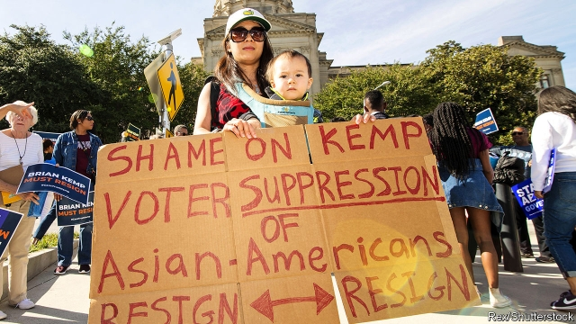

###### Was it stolen?

# Democrats raise doubts about Georgia’s election for governor 

##### It is not yet proven that voter suppression changed the result 

 

> Mar 21st 2019 

STACEY ABRAMS, a Democrat who narrowly failed in her bid last year to become the first black governor of Georgia, does not concede that she lost the election. “I concede I’m not the governor of Georgia,” she told a reporter from the Associated Press on March 19th. But she blamed her failure to come first in the poll on cheating. She says that voter suppression in Georgia kept her supporters—mostly blacks—away from the polls. 

She is hardly alone in believing that. On March 6th Democrats in the House of Representatives launched an investigation into “voter registration, voter access, and other matters affecting the ability of people in Georgia to exercise their right to vote”. The House Oversight Committee has requested documents from the declared winner of the poll, Brian Kemp—who, as secretary of state, supervised his own campaign—in order to evaluate his impartiality, the use of voting machines and the changing of polling places. There is no doubt that Georgia made voting tough for some. But are critics right in thinking that this was decisive in Mr Kemp’s victory? 

Some claims can be dismissed out of hand. At an event in Selma, Alabama earlier this month, Hillary Clinton claimed that Georgia had fewer registered voters in 2016 than in 2012. That is straightforwardly untrue. According to data from Georgia’s secretary of state, fewer than 6.1m Georgians registered to vote in the 2012 general election; in 2016, that number had climbed to over 6.6m, and by 2018 it reached nearly 7m. (Mrs Clinton, too, thinks she is a victim: she also made a dodgy claim about voters being turned away from polls in Wisconsin, a state she lost in 2016.) 

The House Oversight Committee is interested in the “exact match” voter-validation programme that was designed to ensure that voters’ registration applications matched the information that the state had on file. In 2018 a US district judge, Eleanor Ross, said that raised “grave concerns” about disenfranchising minority voters vastly more often than whites. Michael McDonald, an academic who has been involved in voting-rights litigation in the past, identified the programme as one of the more consequential examples of voter suppression in Georgia. But in the end poll workers were not allowed to use it to turn voters away from the voting booths, because of Judge Ross’s ruling. The number of possibly disenfranchised voters was close to 50,000; Mr Kemp’s margin was 55,000. Mr McDonald says that Ms Abrams’s claims “are very tenuous”. 

It could be that changing the location of polling places in predominantly black precincts hurt Ms Abrams’s ability to win. Georgia closed more than 200 polling places during Mr Kemp’s tenure as secretary of state. Research by Henry Brady and John McNulty, both political scientists, found that changing the site of polling places in Los Angeles County had significant negative effects on voter turnout in California’s election for governor in 2003. They estimate that there was a 1.85% reduction in turnout in precincts where polling places changed. So this strategy “could be used by an unscrupulous politician or registrar to manipulate an election”. 

Between 2014 and 2018, turnout among blacks in Georgia (some 90% of whom voted for Ms Abrams) did not decline but in fact leapt, from 750,000 to 1.1m. For Mr Kemp’s lead to disappear, you have to assume that had he not closed down polling places, it would have been even higher, by about 6%. That is possible but perhaps generous to Ms Abrams. 

In the end, it should not matter whether voter suppression was enough to keep Ms Abrams out of a job. As she herself has pointed out, “voter suppression is insidious”. Even if it does not make the difference between a victory or a defeat, it still deprives citizens of their rights. Mitch McConnell, the Republican Senate majority leader, commented in January that a bill intended to increase voter turnout was a “political power grab” designed to “rewrite the rules to favour [Democrats] and their friends”. Perhaps he should explain why the rules as they are now seem mostly to benefit Republicans. 

-- 

 单词注释:

1.democrat['demәkræt]:n. 民主人士, 民主主义者, 民主党党员 [经] 民主党 

2.voter['vәutә]:n. 选民, 投票人 [法] 选民, 选举人, 投票人 

3.suppression[sә'preʃәn]:n. 抑压, 镇压, 抑制 [计] 抑制 

4.stacey[]:n. 史黛丝（女子名） 

5.abram['eibrәm]:n. 艾布拉姆（男子名, 等于Abraham） 

6.democrat['demәkræt]:n. 民主人士, 民主主义者, 民主党党员 [经] 民主党 

7.narrowly['nærәuli]:adv. 狭窄地, 严密地, 仔细地, 几乎不, 勉强地, 仅仅 

8.Georgia['dʒɒ:dʒjә]:n. 乔治亚州 

9.concede[kәn'si:d]:vt. 承认, 退让 vi. 让步 

10.registration[.redʒi'streiʃәn]:n. 登记, 挂号, 注册 [计] 登记; 定位; 对齐; 记录 

11.oversight['әuvәsait]:n. 勘漏, 失察, 失败, 照料 [经] 监督权 

12.brian['braiәn]:n. 布莱恩（男子名） 

13.supervise['sju:pәvaiz]:v. 监督, 管理, 指导 

14.impartiality['im.pɑ:ʃi'æliti]:n. 公平, 无私, 不偏 [法] 公正无私, 公平, 公正 

15.decisive[di'saisiv]:a. 决定性的, 坚定的, 果断的 

16.selma['selmә]:n. 塞尔玛（女子名） 

17.Alabama[.ælә'bæmә]:n. 亚拉巴马州 

18.Hillary['hiləri:]:n. 希拉里（美国现任国务卿） 

19.clinton['klintәn]:n. 克林顿（男子名） 

20.straightforwardly[ˌstreɪt'fɔ:wədlɪ]:adv. 正直地 

21.datum['deitәm]:n. 论据, 材料, 资料, 已知数 [医] 材料, 资料, 论据 

22.Georgian['dʒɒ:dʒjәn]:n. 乔治亚州人, 乔治亚人 a. 乔治王时代的, 乔治王时代艺术风格的, 乔治亚的 

23.Mr['mistә(r)]:先生 [计] 存储器回收程序, 多重请求 

24.dodgy['dɒdʒi]:a. 狡猾的, 逃避的, 难弄的 

25.Wisconsin[wis'kɒnsin]:n. 威斯康星 

26.Eleanor['elənə; -nɔ:]:n. 埃莉诺（女子名） 

27.ros[]:abbr. 只读存储器（Read-Only-Storage）；活性氧（Reactive oxygen species） 

28.disenfranchise[.disin'fræntʃaiz]:vt. 剥夺…的公民权（等于disfranchise） 

29.vastly['vɑ:stli]:adv. 广大地, 许多, 巨大 

30.michael['maikl]:n. 迈克尔（男子名） 

31.mcdonald[mәk'dɔnәld]:n. 麦克唐纳（男子名）；麦当劳（快餐店名称） 

32.litigation[.liti'geiʃәn]:n. 诉讼, 起诉 [经] 诉讼, 纠葛 

33.consequential[,kɔnsi'kwenʃәl]:a. 作为结果的, 随之发生的, 推论的, 间接的, 重大的, 自大的, 傲慢的, 自傲的 [法] 结果的, 相应而生的, 接着发生的 

34.tenuous['tenjuәs]:a. 稀薄的, 微细的, 纤细的, 脆弱的 [医] 细薄的, 纤细的 

35.predominantly[]:adv. 主要地, 显著地, 大多数地, 突出地 

36.precinct['pri:siŋkt]:n. 区域, 管理区, 管辖区域 [法] 管辖区, 选区, 分界 

37.tenure['tenjuә]:n. 享有, 保有期 [经] (财产,职位等的)占有, 占有权 

38.henry['henri]:n. 亨利 [医] 亨[利](电感应单位) 

39.Brady[]:[经] 布莱迪 

40.john[dʒɔn]:n. 盥洗室, 厕所, 嫖客 

41.McNulty[]:n. (McNulty)人名；(英)麦克纳尔蒂 

42.los[lɔ:s]:abbr. 月球轨道航天器（Lunar Orbiter Spacecraft）；视线（Line of Sight） 

43.angeles[]:n. 安杰利斯（姓氏）；天使城（菲律宾地名） 

44.turnout['tә:naut]:n. 聚集的人群, 出席者, 产量 [化] 输出; 产额 

45.unscrupulous[.ʌn'skru:pjulәs]:a. 无道德原则的, 不审慎的, 肆无忌惮的 

46.registrar['redʒistrɑ:]:n. 记录者, 登记者, 登记官员 [医] 登记员, 挂号员, 专科住院医师 

47.manipulate[mә'nipjuleit]:vt. 操纵, 利用, 操作, 巧妙地处理, 假造 

48.insidious[in'sidiәs]:a. 隐伏的, 阴险的, 狡猾的 [医] 隐袭的 

49.deprive[di'praiv]:vt. 剥夺, 使丧失 [法] 剥夺, 剥夺, 夺去 

50.mitch[mitʃ]:vi. [方言]逃学 

51.McConnell[]:n. (McConnell)人名；(英)麦康奈尔 麦康内尔（美国地名） 

52.grab[græb]:n. 抓握, 掠夺, 强占, 东方沿岸帆船 vi. 抓取, 抢去 vt. 攫取, 捕获, 霸占 

