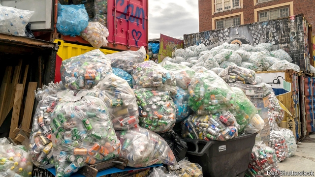

###### A rubbish idea

# New York’s proposed bottle bill may actually hurt recycling 

##### Scavengers will benefit at the expense of municipal programmes 

 

> Mar 21st 2019 

JUAN IS GRATEFUL for New York’s bottle bill, which imposes a refundable nickel deposit on bottles and cans of water, soda and beer. He and his wife earn about $500 a week by collecting empties from recycling bins, bars and restaurants in Bushwick, Brooklyn, which they trade for money at a local redemption centre. Their jangling cart is among the many that helped the state recycle over 5bn drinks containers in 2016. New York’s governor, Andrew Cuomo, now wants to expand the bill to cover most non-alcoholic containers, to help fight litter and boost recycling throughout the state. Juan and his wife are delighted. Companies that handle the state’s recycling, however, are howling. 

Most municipal recycling programmes work because the costs of collecting and sorting recyclables are largely offset by the value of these materials on commodity markets. But China, once the leading buyer of America’s recyclables, upended these markets last year by banning most waste imports. Prices for scrap paper, cardboard and plastic have plunged. Recycling companies that once turned a tidy profit are now losing money and sending material to landfills. Local governments are debating whether to cancel their recycling services or charge residents for what had always been free. 

Some argue that bottle bills offer a handy way to boost recycling without adding real costs. In the ten states where container deposits are already in effect—most of them introduced well before municipal recycling began—they reduce litter, raise recovery rates and create a cleaner stream of recyclables, says Susan Collins of the Container Recycling Institute, an advocacy group. Unredeemed deposits often help pad state coffers. New York, for example, earns around $100m in revenue from its bottle bill every year. 

The problem is that these bills encourage people to divert valuable materials, like aluminium and PET plastic, away from kerbside bins to a separate system run primarily by beverage manufacturers and distributors. This not only creates inefficiencies (more trucks, more bureaucracy), but also shrinks revenues for recycling companies left with less valuable materials. 

Tom Outerbridge of SIMS, which has a long-term contract to process all the metal, glass and plastic collected by New York City’s sanitation department, says New York’s current bill, introduced in 1982, already cuts the value of every tonne of material SIMS receives by $15-30. He estimates that the governor’s expanded bill could cost another $30 per tonne. The New York State Association for Reduction, Reuse and Recycling estimates that the expanded bill would cost recyclers $10m in lost commodity value, on top of $42m in new costs because of China-related turmoil. 

Instead of putting a bounty on materials that recycling companies need to stay afloat, Eric Goldstein of the Natural Resources Defence Council, a conservation group, recommends placing redemption values on things that are difficult to recycle, such as more glass (wine and liquor bottles, for example), batteries, paints and carpets. Collecting these materials will not be easy, but at least it will spare local recycling operators a financial headache. 

-- 

 单词注释:

1.recycling[]:[电] 再循环 

2.scavenger['skævindʒә]:n. (英)清道夫, 清扫工, 拾垃圾的人, 清除剂, 净化剂, 食腐动物, 黄色作家 [计] 清除器 

3.municipal[mju:'nisipl]:a. 市政的, 自治区的, 内政的 [经] 市政的, 市的 

4.juan[hwɑ:n]:n. 胡安（男子名） 

5.refundable[ri'fʌndәbl]:a. 可偿还的, 可归还的 

6.nickel['nikl]:n. 镍, 镍币, 五分镍币 vt. 镀镍于 

7.bin[bin]:n. (贮存谷物等的)容器, 箱子 [计] 二进制, 商业信息网 

8.bushwick[]: [地名] [美国] 布什威克 

9.Brooklyn['bruklin]:n. 布鲁克林区(纽约行政区) 

10.redemption[ri'dempʃәn]:n. 赎回, 赎身, 偿还, 拯救 [经] 偿还, 买回, 赎回 

11.jangle['dʒæŋgl]:v. 吵架, (使)发出刺耳声 n. 吵嚷, 刺耳声, 空谈 

12.andrew['ændru:]:n. 安德鲁（男子名） 

13.cuomo[]: [人名] 科莫 

14.juan[hwɑ:n]:n. 胡安（男子名） 

15.recyclable[ˌri:ˈsaɪkləbl]:a. 可循环再用的 

16.offset['ɒ:fset]:n. 抵消, 把...并列, 旁系, 支管, 用胶印法印 vt. 弥补, 抵消, 胶印 vi. 装支管 n. 偏移量 [计] 偏移量 

17.commodity[kә'mɒditi]:n. 农产品, 商品, 有用的物品 [经] 商品, 货物, 日用品 

18.buyer['baiә]:n. 买主, 买方 [经] 买主, 买方, 买手 

19.upend[ʌp'end]:v. 颠倒, 倒放 

20.scrap[skræp]:n. 碎片, 残余物, 些微, 片断, 铁屑, 吵架 vt. 扔弃, 敲碎, 拆毁 vi. 互相殴打 a. 零碎拼凑成的, 废弃的 

21.cardboard['kɑ:dbɒ:d]:n. 薄纸板 [化] 咭纸; 特等纸板; 卡纸板; 卡片纸板 

22.recycling[]:[电] 再循环 

23.landfill['lændfil]:n. 垃圾堆；垃圾填埋地 

24.alway['ɔ:lwei]:adv. 永远；总是（等于always） 

25.susan['su:zn]:n. 苏珊（女子名） 

26.collins['kɒlinz]:n. 柯林斯酒 

27.advocacy['ædvәkәsi]:n. 拥护, 支持, 鼓吹, 辩护, 辩护术 [法] 辩护, 拥护, 提倡 

28.unredeemed['ʌnri'di:md]:a. 未履行的, 未实践的, 未赎回的, 未偿还的, 未补偿的, 未挽救的, 未收复的 [法] 未实现的, 未履行的, 未赎回的 

29.coffer['kɒfә]:n. 保险箱, 金库 vt. 把...锁进箱子 

30.york[jɔ:k]:n. 约克郡；约克王朝 

31.divert[dai'vә:t]:vt. 转移, 使欢娱 vi. 转移 

32.kerbside['kә:bsaid]:n. (=curbside)街道边, 马路边 

33.beverage['bevәridʒ]:n. 饮料 [化] 饮料(如牛奶、茶、咖啡、啤酒等) 

34.distributor[dis'tribjutә]:n. 分发者, 分布者, 散布者, 分配者, 销售者, 分配器, 配电盘, 自动拆版机 [计] 分配器 

35.inefficiency[.ini'fiʃәnsi]:n. 无效率, 无能 [化] 效率低; 效率差 

36.bureaucracy[bjuә'rɒkrәsi]:n. 官僚, 官吏 [法] 官僚主义, 官僚政治, 官僚机构 

37.les[lei]:abbr. 发射脱离系统（Launch Escape System） 

38.tom[tɒm]:n. 雄性动物, 雄猫 

39.outerbridge[]: [人名] 奥特布里奇 

40.sim[sim]:abbr. 用户身份识别卡（subscriber identity module）；工业管理学院（School of Industrial Management）；科学仪表舱（Scientific Instrument Module）；模拟计算机索引法（Simulated Machine Indexing） 

41.sanitation[sæni'teiʃәn]:n. (环境)卫生, 环境卫生的提倡/维持, 卫生设备, 下水道设施, 卫生设施 [医] 环境卫生 

42.tonne[tʌn]:n. 吨, 公吨 [经] 吨 

43.recycler[]:[计] 再循环器, 反复循环器 

44.turmoil['tә:mɒil]:n. 骚动, 混乱 

45.bounty['baunti]:n. 慷慨, 宽大, 礼物 [经] 奖励金, 补贴 

46.afloat[ә'flәut]:a. 飘浮着的, 在海上的, 浸满水的, 在进行中的 adv. 飘浮着, 在海上, 浸满水, 在进行中 

47.eric['erik]:abbr. 科教资源信息中心（Educational Resources Information Center）；电子遥控与独立控制（Electronic Remote and Independent Control） 

48.Goldstein[]:戈德斯坦 

