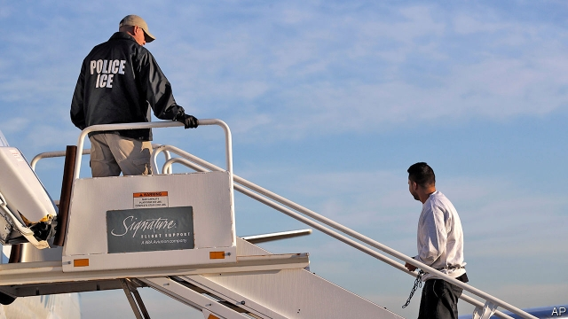

###### Kafkaesque justice

# The Supreme Court rules that ICE can deport green card holders 

##### Immigrants leaving prison can be rearrested at any time 

 

> Mar 21st 2019 

TOWARDS THE end of Franz Kafka’s “The Trial”, Josef K, the protagonist, gets some advice. There is no such thing as a definite acquittal, the court artist tells him; the court “forgets nothing”. Whenever they like, the authorities can renew their charges against the released defendant. When they do, Kafka writes, “his life as a free man is at an end.” 

American law emulated Kafka on March 19th when a 5-4 Supreme Court majority ruled that many immigrants who had been held in criminal custody are subject to mandatory detention by Immigration and Control Enforcement (ICE) at any time after their release. Eduardo Vega Padilla, one of the litigants in Nielsen v Preap, came to America in the 1960s as an infant. In the late 1990s he was twice convicted for possessing drugs and, in 2002, for illegally (as a previous felon) owning a firearm. In 2013, 11 years after finishing his six-month sentence for the gun conviction, Mr Padilla found himself on the brink of being deported to Mexico, a country he left when he was 16 months old. 

The question the justices tackled in Preap was how to interpret a law of 1996 requiring the detention of certain immigrants “when the alien is released” from criminal custody. The Ninth Circuit Court of Appeals ruled in 2016 that green-card holders may not be nabbed and held indefinitely without a bail hearing long after being released. The law, the appeals court said, permitted ICE to swoop in only at the time of the immigrant’s release. If authorities wanted to detain an alien later, they would have to give him a hearing. 

For Justice Samuel Alito, author of the majority in the latest ruling, that reading is “hard to swallow”. Requiring that the “alien must be arrested on the day he walks out of jail” unreasonably constrains ICE authority, he says. The law would amount to “nonsense” if it were understood to favour Mr Padilla and his fellow plaintiffs. Mandatory detention would be “downright incoherent” if it did not require the detention of every alien who has committed an offence listed, at any time. 

In dissent, Justice Stephen Breyer wrote that the case concerns “basic American legal values”. It has “consequences” for green-card holders who have “established families and put down roots in a community”. The ruling threatens to deprive people of their liberty without “due process of law” and to strip them of “the longstanding right of virtually all persons to receive a bail hearing” when held in custody. A six-month limit on re-arrest, Justice Breyer wrote, is reasonable and squares with other detention time frames. 

A long-running disagreement fuels the split between the court’s liberals and conservatives: how to read statutes. Whereas the Alito majority in Preap takes a magnifying glass to the words on the page and strives to understand them without reference to anything else—an approach known as “textualism”—the Breyer dissent takes a broader view, considering the purposes that lie behind the law. “I would have thought that Congress...did not intend to allow the government to apprehend persons years after their release from prison,” Justice Breyer wrote. 

-- 

 单词注释:

1.Kafkaesque[,kɑ:fkə'esk]:a. 卡夫卡式；受压抑和恶梦般的 

2.deport[di'pɒ:t]:vt. 举止, 驱逐出境 [法] 放逐, 驱逐, 递解 

3.holder['hәuldә]:n. 持有人, 所有人, 支持物 [化] 夹持器; 夹具; 贮罐 

4.rearrest[ri:ә'rest]:vt. 重新逮捕, 重新扣留, 重新拘留 [法] 再拘捕, 再拘留; 再拘捕, 拘留 

5.franz[frɑ:nts]:n. 弗朗茨（Francis Ferdinand的德文名） 

6.Josef[]:n. 约瑟夫（人名） 

7.K[kei]:[计] 键, 关键字, 千, 千字节 [医] 钾(19号元素) 

8.protagonist[prәu'tægәnist]:n. 主人公, 主角, 领导者 

9.acquittal[ә'kwitәl]:n. 履行, 无罪开释 [经] (债务的)清偿 

10.defendant[di'fendәnt]:n. 被告 [经] 被告方 

11.kafka[]:n. 卡夫卡（奥地利小说家） 

12.emulate['emjuleit]:vt. 效法, 尽力赶上, 同...竞争 [计] 仿真 

13.custody['kʌstәdi]:n. 监护, 拘留, 监禁 [经] 保管, 照顾, 保护 

14.mandatory['mændәtәri]:a. 命令的, 托管的 [经] 受托者, 命令者 

15.detention[di'tenʃәn]:n. 阻止, 监禁, 拘留 [医] 隔离, 拘留, 滞留, 停滞 

16.enforcement[in'fɒ:smәnt]:n. 执行, 强制 [法] 实施, 加强, 厉行 

17.Eduardo[]:n. 爱德华多（姓氏） 

18.vega['vi:^ә]:n. [天]织女星 

19.padilla[]: [人名] 帕迪利亚; [地名] [玻利维亚、墨西哥] 帕迪亚 

20.litigant['litigәnt]:a. 诉讼的 n. 诉讼当事人, 诉讼关系人 

21.nielsen[]:n. 尼耳森（人名） 

22.V[vi:]:[计] 溢出, 变量, 向量, 检验, 虚拟, 垂直 [医] 钒(23号元素) 

23.convict[kәn'vikt]:n. 囚犯, 罪犯 vt. 宣告有罪, 使知罪 

24.illegally[]:[法] 非法地, 不合法地, 违法地 

25.felon['felәn]:n. 重罪犯, 恶棍, 瘭疽 [医] 瘭疽, 指头脓炎 

26.firearm['faiә'ɑ:m]:n. 火器, 枪炮 

27.conviction[kәn'vikʃәn]:n. 定罪, 信服, 坚信 [法] 定罪, 证明有罪, 判罪 

28.brink[briŋk]:n. 边缘, 陡岸 

29.tackle['tækl]:n. 工具, 复滑车, 滑车, 装备, 扭倒 vt. 固定, 处理, 抓住 vi. 扭倒 

30.alien['eiljәn]:n. 外国人, 外侨 a. 外国的, 相异的 

31.nab[næb]:vt. 捉住, 逮捕, 抢夺 [电] 国际广播协会的简写 

32.indefinitely[]:adv. 无期限地 

33.bail[beil]:n. 保释, 拎环, 杓, 栅栏 vt. 保释, 舀水 

34.swoop[swu:p]:n. 俯冲, 攫取 vt. 抓取 vi. 猛扑, 突然袭击 

35.detain[di'tein]:vt. 扣留, 扣押, 耽搁 [法] 拘留, 扣押, 留住 

36.samuel['sæmjuәl]:n. 撒母耳（希伯来先知）；塞缪尔（男子名） 

37.alito[]:n. (Alito)人名；(英)阿利托 

38.unreasonably[.ʌn'ri:znәbli]:adv. 不合理地 

39.constrain[kәn'strein]:vt. 强迫, 限制, 关押 

40.plaintiff['pleintif]:n. 原告, 起诉人 [经] 原告, 原起诉人 

41.mandatory['mændәtәri]:a. 命令的, 托管的 [经] 受托者, 命令者 

42.downright['daunrait]:a. 明白的, 率直的, 十足的 adv. 全然, 彻底, 完全 

43.incoherent[.inkәu'hiәrәnt]:a. 不连贯的, 语无伦次的 [医] 不连贯的 

44.dissent[di'sent]:n. 异议 vi. 持异议, 不同意 

45.stephen['sti:vn]:n. 斯蒂芬（男子名） 

46.Breyer[]:布雷耶（人名） 

47.deprive[di'praiv]:vt. 剥夺, 使丧失 [法] 剥夺, 剥夺, 夺去 

48.longstanding['lɔŋ'stændiŋ;'lɔ:ŋ-]:a. 长期间的, 长期存在的 

49.magnify['mægnifai]:vt. 放大, 扩大, 赞美, 夸大 vi. 有放大能力 

50.strive[straiv]:vi. 努力, 奋斗, 斗争 

51.apprehend[.æpri'hend]:vt. 理解, 忧虑, 逮捕 vi. 担心, 理解 

