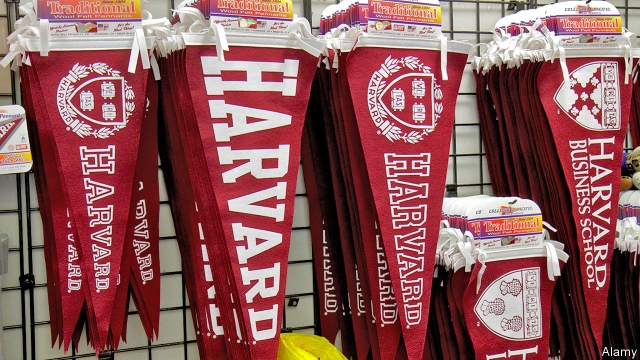
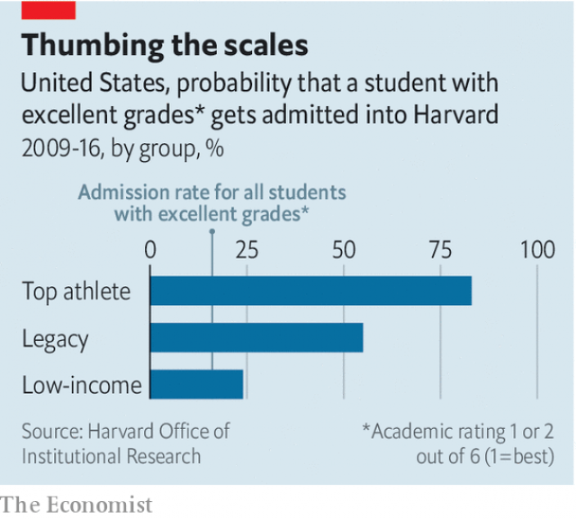

###### Exorbitant privilege

# Why legacy places should be abolished 

##### Giving the children of alumni a leg-up makes no sense 

 

> Mar 21st 2019 

“I  AM SIMPLY thrilled about all the folks you were able to admit,” David Ellwood, the then dean of Harvard’s John F. Kennedy School of Government, wrote to the then admissions dean, William Fitzsimmons, in a 2013 email entitled “My hero”. “All big wins. [Name redacted] has already committed to a building.” 

Charges brought against rich and famous people who are accused of illegally buying university places for their children has focused attention on an oddity in American higher education: that while it was illegal for these people to buy places, others can do so quite legally. This issue is normally hidden behind the veil of the “holistic” admissions policy which selective universities run. But a case in the Supreme Court in which Asian-American plaintiffs allege that Harvard’s admissions system is racially biased has thrown a light on preference given to different groups, including “legacies”—the children of alumni. Their parents do not have to fork out for them to be favoured, but since alumni are universities’ principal source of donations after foundations, institutions that practice legacy preference defend it as essential. 

A survey by the Harvard Crimson, the student newspaper, found that 29% of the class of 2021 had a close relation who had been at the university; 18% had at least one parent there. Nor is the practice confined to the top institutions. A survey of 499 admissions directors by Inside Higher Ed found that 42% of those at private universities used legacy preference. 

Legacy preference is, as Richard Kahlenberg, a senior fellow at the Century Foundation and editor of “Affirmative Action for the Rich”, points out, both entirely un-American and uniquely American. It flies in the face of the ideals on which America was founded—the rejection, as Thomas Jefferson put it, of the “artificial aristocracy” based on birth, which had corrupted Britain, in favour of a “natural aristocracy” based on “virtue and talents”. No other serious university system permits it. Universities in Britain, the only other country represented in the Times Higher Education league of the world’s top ten universities, use test scores supplemented, in some institutions, with an interview. 

In the 1920s, Ivy League college administrators feared that relying too much on exams to screen applicants would yield a high number of Jewish students. They set up admissions systems which embedded legacy preference. In the egalitarianism of the post-war era, universities tried to get rid of legacies, but were defeated by passionate opposition from their alumni. 

No combination of money and alumni clout, however powerful, will get a thick kid a place at a good university. University administrators point out that legacy applicants’ SAT scores tend to be higher than average—not surprising, since they tend to be richer and therefore better-prepared. In an interview with the Crimson, Mr Fitzsimmons referred to legacy as a “tip” which, other things being substantially equal, could win an applicant a place. But recent data suggest it is more than that. Michael Hurwitz, then at Harvard, calculated that, controlling for all relevant characteristics, being related to an alumnus of one of America’s top 30 universities increased an applicant’s chance threefold. Thomas Espenshade at Princeton found that it was the equivalent of 160 points on a SAT score where the maximum is 1,600. 

The trial has forced Harvard to publicise its own numbers (see chart). The biggest advantage goes to athletes, but they are sometimes the same people as legacies—as some of the sports which ease students in (lacrosse, rowing, golf) suggest. “The best donors”, says an insider, “are sports scholars who went on to Harvard Business School. They ‘bleed crimson’.” 

 

Universities that favour legacy applicants say doing so helps pay for need-blind admissions, under which universities pay the bills of poorer students. But as Richard Reeves of the Brookings Institution points out, “they admit so few poor people that this is pocket change for them.” According to Harvard’s Raj Chetty, the university has 14 times as many students from the top than the bottom economic quintile. Legacies take places that might go to poorer people: Mimi Doe of Top Tier Admissions points out that half of places at top universities are fenced off by racial, athletic and legacy preferences. “For students who don’t have any interesting ‘hooks’ on their cvs, acceptance rates of 10% of applicants come down to more like 5%.” 

MIT, which does not favour legacies, has need-blind admissions. A study of 100 universities found that “the presence of legacy preference policies does not result in significantly higher alumni giving”; those with legacy preference got more money from alumni, but that was because they had richer alumni. Abandoning the practice might be in the universities’ interest. A study into the “child-cycle of alumni giving” found that donations increased when alumni’s children reached their early teens, and then dropped to below their original level when the child was turned down. Hell hath no fury like an alumnus whose child has been scorned. 

Some institutions, including the University of California, Berkeley, the University of California, Los Angeles and Texas A&M, have abandoned the practice. More than two-thirds of Americans are against it. Mr Kahlenberg notes that universities are increasingly unpopular among Americans. “Some of this has to do with the idea that these are liberal bastions where students are being indoctrinated. But it is also about the fact that these are seen as gated communities where the privileged protect their positions in society.” A majority of the admissions directors surveyed by Inside Higher Ed opposed it, including 11% of those who practised it. The Crimson wants it ended. “It would make it a happier place,” says a Harvard insider. “So many of the students have impostor syndrome.” 

Ron Wyden, a Democratic senator, plans to help legacy preference on its way by introducing a bill to limit tax breaks on donations before or while a child is enrolled. It is a condition of tax exemption that a donor should get no direct benefit from a donation; and although universities are very careful to make it clear that there is no quid pro quo, their defence of legacy preference—that it raises money—implicitly admits the connection. 

But the likeliest impetus for change is the affirmative-action trial. “At present the universities can say they take into account lots of factors, including legacies,” says Mr Kahlenberg. “If you no longer have the minorities then it becomes harder to justify.” That, indeed, is what happened at the University of California and at Texas A&M: when racial preferences were ended, legacy preferences looked even more egregiously unfair, and were binned. 

-- 

 单词注释:

1.exorbitant[ig'zɒ:bitәnt]:a. 过度的, 过高的, 过分的 

2.legacy['legәsi]:n. 祖先传下来之物, 遗赠物 [经] 遗产, 遗赠物 

3.alumni[ә'lʌmni]:pl. 男毕业生, 男校友 

4.thril[θ'rɪl]: 联络小巷 

5.david['deivid]:n. 大卫；戴维（男子名） 

6.Ellwood[]:n. (Ellwood)人名；(英)埃尔伍德 

7.dean[di:n]:n. 院长, 主持牧师 [法] 外交团长, 学院院长, 教务长 

8.john[dʒɔn]:n. 盥洗室, 厕所, 嫖客 

9.kennedy['kenidi]:n. 肯尼迪（姓氏, 美国第35任总统） 

10.william['wiljәm]:n. 威廉（男子名）；[常作W-][美俚]钞票, 纸币 

11.Fitzsimmons[]:n. (Fitzsimmons)人名；(英)菲茨西蒙斯 

12.illegally[]:[法] 非法地, 不合法地, 违法地 

13.oddity['ɒditi]:n. 奇异, 奇特, 怪人, 怪事, 怪僻 

14.legally['li:gәli]:adv. 法律上, 合法地 [法] 法律上, 合法地, 法定地 

15.holistic[hәj'listik]:[计] 完整的, 整体的 [医] 机能整体性的 

16.selective[si'lektiv]:a. 选择的, 选择性的 [经] 选择的, 选择性的 

17.plaintiff['pleintif]:n. 原告, 起诉人 [经] 原告, 原起诉人 

18.allege[ә'ledʒ]:vt. 宣称, 主张, 提出, 断言 [法] 断言, 指称, 指证 

19.racially['reiʃәli]:adv. 按人种, 人种上 

20.bias['baiәs]:n. 偏见, 斜纹 a. 偏斜的 adv. 偏斜 vt. 使有偏见 [计] 偏流; 偏压; 偏磁; 偏离 

21.donation[dәu'neiʃәn]:n. 捐赠物, 捐款, 捐赠 [经] 赠品, 捐款, 捐赠 

22.Harvard['hɑ:vәd]:n. 哈佛大学 

23.crimson['krimzәn]:n. 深红色 a. 深红色的 v. (使)变为深红色, 脸红 

24.ED[]:[计] 电子设备, 密码设备, 数据结束, 工程设计, 错误检测, 外部设备 

25.legacy['legәsi]:n. 祖先传下来之物, 遗赠物 [经] 遗产, 遗赠物 

26.richard['ritʃәd]:n. 理查德（男子名） 

27.kahlenberg[]: [地名] [奥地利] 卡伦山 

28.affirmative[ә'fә:mәtiv]:a. 肯定的, 赞成的, 积极的 n. 肯定语 

29.entirely[in'taiәli]:adv. 完全, 全然, 一概 

30.uniquely[]:adv. 独特地；珍奇地 

31.rejection[ri'dʒekʃәn]:n. 拒绝, 抛弃, 驳回, 被抛弃的东西, 呕出物 [化] 报废; 拒收 

32.thoma[]:n. (Thoma)人名；(阿尔巴、阿拉伯)索玛；(英、德、罗、匈、捷、塞、瑞典)托马 

33.jefferson['dʒefәsn]:n. 杰弗逊（姓氏） 

34.aristocracy[.æri'stɒkrәsi]:n. 贵族, 上层社会, 知识界杰出分子 [法] 贵族政治, 贵族统治 

35.ivy['aivi]:n. 常春藤 a. 学院的, 抽象的 

36.administrator[әd'ministreitә]:n. 管理人, 行政官 [经] 遗产管理人员 

37.embed[im'bed]:vt. 使插入, 使嵌入, 使深留脑中 [计] 嵌入 

38.egalitarianism[i.ɡæli'tεәriәnizәm]:n. 平等主义, 平均主义 

39.passionate['pæʃәnit]:a. 热情的, 热烈的, 易怒的, 热恋的 

40.opposition[.ɒpә'ziʃәn]:n. 反对, 敌对, 相反, 在野党 [医] 对生, 对向, 反抗, 反对症 

41.clout[klaut]:n. 敲击, 破布 vt. 打补钉 

42.substantially[sәb'stænʃәli]:adv. 实质上, 本质上, 大体上 

43.datum['deitәm]:n. 论据, 材料, 资料, 已知数 [医] 材料, 资料, 论据 

44.michael['maikl]:n. 迈克尔（男子名） 

45.hurwitz[]: [人名] 赫维茨 

46.alumnus[ә'lʌmnәs]:n. 男毕业生, 男校友 

47.threefold['θri:fәuld]:a. 三倍的, 三重的 adv. 三倍地, 三重地 

48.espenshade[]: [人名] 埃斯彭沙德 

49.Princeton['prinstәn]:n. 普林斯顿 

50.publicise['pʌblisaiz]:vt. 公布, 为...做广告, 宣传 

51.lacrosse[lә'krɒs]:n. 长曲棍球 

52.donor['dәunә]:n. 捐赠人 [化] 给体; 供体 

53.insider['in'saidә]:n. 内部的人, 权威人士, 知道内情的人 [经] 熟悉内情者 

54.reeve[ri:v]:n. 地方长官 v. 穿(绳索), 穿过 

55.Brooking[]:n. (Brooking)人名；(英、西)布鲁金 忍受（brook的现在分词形式） 容忍 

56.raj[rɑ:dʒ]:n. 主权, 统治 [法] 统治, 支配, 主权 

57.chetty[]:[网络] 出马竞选都能最高票当选 

58.quintile['kwintil, -tail]:a. [占星术] 五分之一对座的(相隔72度) n. [天]五分之一对座 

59.mimi['mimi,'mi:mi]:[计] 小型微型的 

60.doe[dәu]:n. 母鹿, 雌兔 

61.tier[tiә]:n. 排, 层, 等级 

62.cv[]:abbr. 简历（Curriculum Vitae） 

63.mit[mit]:n. 手, 连指手套, 棒球手套, 拳击手套, 马萨诸塞理工学院, 麻省理工学院 vt. 与...握手, 用手铐铐住, 逮捕 [计] 麻省理工学院, 模块化智能终端 

64.significantly[]:adv. 值得注目地；意味深长地 

65.teen[ti:n]:n. 愤怒, 悲哀 

66.hath[hæθ; hәθ, әθ]:vbl.<废>have的第三人称单数现在式 

67.fury['fjuri]:n. 愤怒, 狂暴, 狂怒的人 [医] 狂乱, 狂暴, 狂怒 

68.California[.kæli'fɒ:njә]:n. 加利福尼亚 

69.berkeley['bɑ:kli, 'bә:kli]:n. 伯克利（姓氏）；贝克莱（爱尔兰主教及哲学家）；伯克利（美国港市） 

70.los[lɔ:s]:abbr. 月球轨道航天器（Lunar Orbiter Spacecraft）；视线（Line of Sight） 

71.angeles[]:n. 安杰利斯（姓氏）；天使城（菲律宾地名） 

72.Texas['teksәs]:n. 德克萨斯 

73.unpopular['ʌn'pɔpjulә]:a. 不得人心的, 不受欢迎的, 不流行的 

74.bastion['bæstʃәn]:n. 棱堡, 阵地工事 

75.indoctrinate[in'dɒktrineit]:vt. 教训, 教导, 灌输 

76.impostor[im'pɒstә]:n. 冒名顶替者, 骗子, 冒牌 

77.syndrome['sindrәum]:n. 并发症状, 综合征, 同时存在的事物 [计] 校验子; 并发位 

78.ron[]:abbr. 研究法辛烷值（Research Octane Number） 

79.wyden[]: [人名] 怀登 

80.senator['senәtә]:n. 参议员, (某些大学的)理事 [法] 参议员, 上议员 

81.enrol[in'rәul]:vt. 登记, 使加入 vi. 参军, 注册 

82.exemption[ig'zempʃәn]:n. 解除, 免除, 免税 [化] 免检 

83.quid[kwid]:n. 一镑金币, 一镑, 咀嚼物 

84.pro[prәu]:adv. 正面地 [计] 可编程远程操作 

85.quo[]:vt. [古]说 

86.impetus['impitәs]:n. 动力, 推动力, 动量 [医] 冲动, 动能, 起始(病) 

87.egregiously[ɪɡ'ri:dʒɪəəslɪ]:adv. 过份地, 卓越地 

88.bin[bin]:n. (贮存谷物等的)容器, 箱子 [计] 二进制, 商业信息网 

