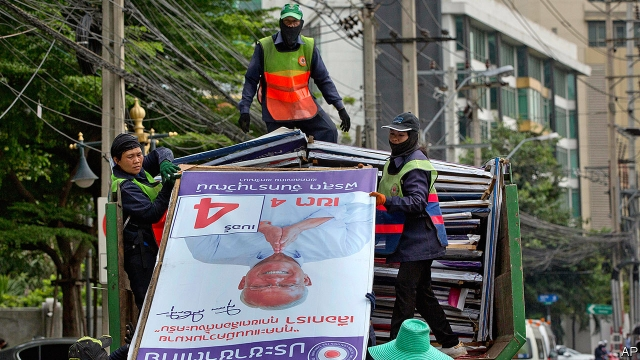

###### To the spoiler, victory

# After an ineptly rigged election, Thailand’s junta will cling to power 

##### The opposition says it has a parliamentary majority, but is unlikely to form a government 

 

> Mar 28th 2019 

“WE HAVE RECEIVED a mandate from the people,” declared Sudarat Keyuraphan, a leader of the Pheu Thai party. She was introducing a slate of seven parties that she said had won a narrow majority in the lower house of parliament in the election held on March 24th. Parties linked to Thaksin Shinawatra, a former prime minister ousted in a military coup, have won every election in the past 20 years. Pheu Thai, his current vehicle, seems to have won more seats than any other this time, too. But the results also mark a victory for the military junta running the country, which rigged the process to reduce Pheu Thai’s showing and will probably deny it the chance to form a government. 

Initial results suggest Pheu Thai won 137 of the 500 seats in the lower house. That is more than any other party, but a far lower share than in previous elections. The system of proportional representation the generals used hurt Pheu Thai. So did official harassment of its activists, the banning of an allied party and rules that made it difficult to campaign via social media and barred all but the tiniest political gatherings until December. 

These same distortions helped Palang Pracharat, a party founded last year to support the generals, win perhaps 116 seats overall. But Future Forward, another party opposed to the generals, is set to become the third-biggest. Meanwhile, the Democrats, the country’s oldest party and Pheu Thai’s fiercest foe, performed abysmally. They lost their stronghold of Bangkok. Their leader, a former prime minister, resigned. The net result is a chamber that is fairly evenly divided, for the moment, between friends and foes of the junta. 

The junta’s position, however, is stronger than it looks. For one thing, the Election Commission has until May 9th to certify the final results. Its boss already raised eyebrows on election night by saying that he would have to halt the count just hours after it had started because he did not “have a calculator with me now”. Mr Thaksin scoffed that turnout in one district exceeded 200%. Elsewhere the number of ballots appeared greater than that of voters. The Thai for “election commission busted” has been trending on Twitter. The suspicions of manipulation matter since the Election Commission has released only provisional voting data from the country’s 350 constituencies, on which the allocation of a further 150 party-list seats depends. The parties have made their own projections of the result, but the commission could yet declare a different outcome. 

It also has the power to investigate violations of campaign rules. If it considers them grave enough, it can order candidates disqualified (a red card) or the election to be re-conducted in certain constituencies (a yellow card). That provides an easy way to erode Pheu Thai’s alliance. “From now on we’ll see so-called red and yellow cards,” predicts Ms Sudarat. Pheu Thai will not be the only target. The commission recently threatened to bring proceedings against Future Forward for being subject to “outside influence”—a usefully vague no-no. Its leader, Thanathorn Juangroongruangkit, faces personal legal troubles, too. He is on trial for comments he made in footage streamed on Facebook, in which he suggested that the junta was trying to win defections from hostile political parties. 

Bangkok will bubble with intrigue until the seat numbers held by each side seem more secure. Rumours abound that the six MPs of one of Ms Sudarat’s allies, the New Economy Party, will defect, wiping out her claimed majority of five at a stroke. There are lots of smaller, biddable parties, who could help shore up either side. Pheu Thai is said to have offered the post of prime minister to Anutin Charnvirakul, the leader of the Bhumjaithai party, with a projected 51 seats, if he were to join its block. 

But securing the post of prime minister involves overcoming the junta’s biggest advantage. The constitution the generals pushed through in 2016 awards the job of picking the prime minister to a joint sitting of the lower house and the 250-member Senate. All the senators are appointed by the junta. That means that the incumbent prime minister and junta leader, Prayuth Chan-ocha, would only need 126 votes in the lower house to keep his job. A rival candidate, meanwhile, would need 376 votes in the lower house—a daunting target. 

But if the parliamentary arithmetic all but assures Mr Prayuth’s return to office, it also makes his job extremely difficult. The sweeping powers that the junta has enjoyed since seizing power in 2014 will lapse once a new cabinet is installed. Mr Prayuth will then need to persuade a majority of the lower house to back whatever plans his government may have. Even if Pheu Thai’s claimed majority evaporates, it is clear that the lower house will be difficult to manage. Mr Prayuth’s career in the army and as a coup leader has not given him a lot of experience of horse-trading with politicians. 

Even with unfettered authority, the generals have not done a good job of running the country. True to form, their preparations for the election appear to have been half-baked. Finding excuses to lock up or disqualify lots of the new MPs would be to dismantle the democratic façade currently under construction. But if the democratic front still holds a majority of the seats in the lower house when the Election Commission releases the final results on May 9th, instability looms. Thailand’s junta, it seems, cannot organise a rigged election in a dictatorship. 

-- 

 单词注释:

1.spoiler[]:n. 掠夺者, 搞坏事情的人, 宠坏别人的人 

2.ineptly[]:adv. 不适当, 不符合要求, 不恰当, 不合场面, 笨拙, 愚蠢, 无能, 不称职 

3.rig[rig]:n. 装备, 帆装 vt. 装配, 装扮, 给船装帆, 垄断, 操纵 

4.junta['dʒʌntә]:n. 以武力政变上台的(军)政府, 私党, 阴谋小集团, 政务会 

5.cling[kliŋ]:vi. 粘紧, 附着, 紧贴, 坚持 

6.opposition[.ɒpә'ziʃәn]:n. 反对, 敌对, 相反, 在野党 [医] 对生, 对向, 反抗, 反对症 

7.parliamentary[.pɑ:lә'mentәri]:a. 国会的, 议会的, 议会制度的 

8.mandate['mændeit]:n. 命令, 指令, 要求 vt. 委任统治 

9.Thai[tai]:n. 泰国人, 泰语 

10.slate[sleit]:n. 板岩, 页岩, 提名名单, 人选, 记录, 石板 a. 石板色的 vt. 铺石板, 责骂, 痛打 

11.thaksin[]: 塔克辛; 塔辛（人名） 

12.shinawatra[]:[网络] 西那瓦；那越；钦那瓦 

13.oust[aust]:vt. 逐出, 罢黜, 剥夺, 驱逐 [法] 驱逐, 剥夺, 免职 

14.coup['ku:]:n. 砰然的一击, 妙计, 出乎意料的行动, 政变 [医] 发作, 中, 击 

15.representation[.reprizen'teiʃәn]:n. 表示法, 表现, 陈述, 代表 [计] 表示法指定 

16.harassment['hærәsmәnt]:n. 困扰, 烦扰, 烦恼 [法] 折磨, 骚扰, 侵扰 

17.activist['æktivist]:n. 激进主义分子 

18.ally['ælai. ә'lai]:n. 同盟者, 同盟国, 助手 vt. 使联盟, 使联合, 使有关系 vi. 结盟 

19.gathering['gæðәriŋ]:n. 聚集, 集中, 采集 [化] 富集 

20.distortion[dis'tɒ:ʃәn]:n. 扭曲, 变形, 曲解 [计] 畸变; 失真 

21.palang[]:[网络] 巴冷刀；崩龙人 

22.democrat['demәkræt]:n. 民主人士, 民主主义者, 民主党党员 [经] 民主党 

23.foe[fou]:n. 仇敌, 反对者, 敌人, 对手 

24.abysmally[ə'bɪzməlɪ]:adv. 极糟地; 可怕地; 完全地; 极端地 

25.stronghold['strɒŋhәuld]:n. 要塞, 堡垒, 大本营 

26.Bangkok['bæŋkɒk]:n. 曼谷 

27.evenly['i:vәnli]:adv. 平衡地, 平坦地, 平等地 

28.certify['sә:tifai]:v. 证明, 保证 

29.eyebrow['aibrau]:n. 眉毛 [医] 眉 

30.scoff[skɒf]:n. 嘲笑, 愚弄, 笑柄, 食品 v. 嘲笑, 嘲弄, 贪吃, 狼吞虎咽地吃 

31.turnout['tә:naut]:n. 聚集的人群, 出席者, 产量 [化] 输出; 产额 

32.ballot['bælәt]:n. 投票, 投票用纸, 抽签 vi. 投票, 抽签 vt. 投票选出, 拉选票 

33.voter['vәutә]:n. 选民, 投票人 [法] 选民, 选举人, 投票人 

34.bust[bʌst]:n. 半身像, 胸部, 失败, 殴打 vt. 使爆裂, 使破产 vi. 爆裂, 破产 [计] 操作错 

35.twitter['twitә]:n. 啁啾, 唧唧喳喳声 vi. 啭, 啁啾, 颤抖 vt. 嘁嘁喳喳地讲, 抖动 

36.manipulation[mә.nipju'leiʃәn]:n. 操作, 处理 [化] (用手)操作; 使用 

37.provisional[prә'viʒәnl]:a. 暂时的, 暂定的, 临时的 [医] 临时的 

38.datum['deitәm]:n. 论据, 材料, 资料, 已知数 [医] 材料, 资料, 论据 

39.constituency[kәn'stitjuәnsi]:n. 选民, 顾客, 读者 [法] 选区, 全体选民, 选区内的选民 

40.allocation[.ælәu'keiʃәn]:n. 配置, 分配, 拨给 [经] 分配, 拨款, 分摊 

41.projection[prә'dʒekʃәn]:n. 发射, 计划, 突出部分, 设计, 推测 [计] 投影 

42.violation[.vaiә'leiʃәn]:n. 违反, 违背, 妨碍 [法] 违犯, 违背, 违反 

43.disqualify[dis'kwɒlifai]:vt. 使不适合, 取消...资格 

44.erode[i'rәud]:vt. 腐蚀, 侵蚀 vi. 受腐蚀 

45.alliance[ә'laiәns]:n. 联盟, 联合 [法] 同盟, 联盟, 联姻 

46.proceeding[prәu'si:diŋ]:n. 进行, 程序, 行动, 诉讼程序, 事项 [化] 会议论文集 

47.usefully[]:adv. 有效地, 有用地 

48.footage['futidʒ]:n. 英尺长度, 英板尺, (影片的)连续镜头 

49.facebook[]:n. 脸谱网 

50.defection[di'fekʃәn]:n. 背叛, 缺乏, 毛病 [法] 缺点, 过失, 背叛 

51.intrigue[in'tri:g]:n. 阴谋, 复杂的事 vi. 密谋, 私通 vt. 激起...的兴趣, 用诡计取得 

52.abound[ә'baund]:vi. 大量存在, 富于, 充满 

53.MP[]:国会议员, 下院议员 [计] 宏处理程序, 维护程序, 线性规划, 微程序, 多处理器 

54.biddable['bidәbl]:a. 顺从的, 可叫牌的 

55.senator['senәtә]:n. 参议员, (某些大学的)理事 [法] 参议员, 上议员 

56.incumbent[in'kʌmbәnt]:a. 现任的, 依靠的, 负有义务的 n. 领圣俸者, 在职者 

57.Prayuth[]:[网络] 巴狱 

58.daunt[dɒ:nt]:vt. 威吓, 难倒, 使气馁 

59.lapse[læps]:n. 过失, 流逝, 失效 vi. 犯错, 堕落, 减退, 消失, 流逝 vt. 使失效 

60.unfetter[.ʌn'fetә]:vt. 给...解开脚链, 释放, 使自由 [法] 除去...脚镣, 释放 

61.dismantle[dis'mæntl]:vt. 拆除...的设备, 分解, 去除覆盖物 

62.currently['kʌrәntli]:adv. 现在, 当前, 一般, 普通 [计] 当前 

63.instability[.instә'biliti]:n. 不安定, 不稳定 [医] 不稳定性 

64.loom[lu:m]:n. 织布机, 若隐若现的景象 vi. 朦胧地出现, 隐约可见, 可怕地出现 

65.cannot['kænɒt]:aux. 无法, 不能 

66.dictatorship[dik'teitәʃip]:n. 独裁者之职位, 独裁, 独裁政权 [法] 专攻, 独裁权 

