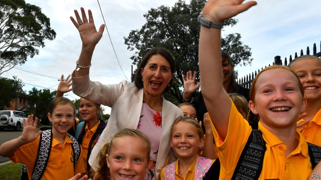

###### An anti-anti-immigrant backlash

# Australian voters keep rejecting nativist campaigns 

##### Immigrant voters recoil from a Labor leader who railed against Asians with phds 

 

> Mar 28th 2019 

NATIONALLY, IT HAS been behind in the polls for years. Several of its MPs have defected from the party. Many others have said they will not contest the next election, due in May. The bickering about what has gone wrong and who is to blame has become deafening. So how did the ruling Liberal party win a state election in New South Wales this week? 

Gladys Berejiklian, the Liberals’ leader in the state, expressed pride at having won despite being both a woman and “someone with a long surname”. But that may have worked in her favour. During the campaign, the opposition Labor party tried to stir indignation about immigration. Days before the vote, a video surfaced in which Michael Daley, the local Labor leader, complained about an influx of PhD-wielding Asians. “Our kids are moving out and foreigners are moving in and taking their jobs,” he protested. He apologised (and has since resigned), but Sydney’s huge immigrant population turned against him. 

Meanwhile Ms Berejiklian, the daughter of Armenian immigrants, eschewed “the culture wars bullshit”, as a member of her government put it, focusing instead on the strength of the local economy under the Liberals, who have been in office for eight years. New South Wales has the strongest economy in Australia: its budget is in surplus and unemployment, at 3.9%, is at a record low. 

At the national level, however, the pattern is the reverse. It is the Liberals who have been trying to stoke fear of immigration. Scott Morrison, the prime minister, has fiercely resisted a law allowing sick asylum-seekers detained in camps abroad to be treated in Australia, on the grounds that hordes of boat people would set sail in the hope of making use of this loophole. He has also lowered the annual cap on immigrants, from 190,000 to 160,000. At another recent state election, in Victoria in November, the Liberals were trounced after they attempted to whip up fear about non-existent African gangs. 

Ms Berejiklian distanced herself from her colleagues’ more noxious policies, and all but banned Mr Morrison from the campaign trail. She even admitted that climate change was a problem—a notion that is controversial within the national party. She has also laid out a winning electoral strategy, which her more senior colleagues seem determined to ignore. 

-- 

 单词注释:

1.backlash['bæklæʃ]:n. 后冲, 强烈反对 [电] 反撞, 逆栅流 

2.voter['vәutә]:n. 选民, 投票人 [法] 选民, 选举人, 投票人 

3.nativist['neitivist]:n. 先天论者, 乡土主义者, 本土主义者 

4.recoil[ri'kɒil]:n. 畏缩, 后退, 弹回, 反作用, 后坐力 vi. 退却, 畏缩, 弹回, 撤退, 反冲, 报应 

5.labor['leibә]:n. 劳动, 努力, 工作, 劳工, 分娩 vi. 劳动, 努力, 苦干 vt. 详细分析, 使厌烦 

6.phd[]:abbr. 哲学博士学位（Doctor of Philosophy） 

7.nationally['næʃәnәli]:adv. 作为整个民族, 举国一致地, 全国性地 

8.MP[]:国会议员, 下院议员 [计] 宏处理程序, 维护程序, 线性规划, 微程序, 多处理器 

9.bicker['bikә]:vi. 斗嘴, 潺潺而流, 闪动 n. 口角, 流水声 

10.deafen['defәn]:vt. 使聋 vi. 变聋 

11.wale[weil]:n. 隆起的伤痕, 鞭痕, 凸条纹, 精华, 选择 vt. 在...上留下鞭痕, 织成棱纹, 挑选, 撑住 vi. 挑选 

12.gladys[]:n. 格拉迪斯（女子名） 

13.opposition[.ɒpә'ziʃәn]:n. 反对, 敌对, 相反, 在野党 [医] 对生, 对向, 反抗, 反对症 

14.indignation[.indig'neiʃәn]:n. 愤怒, 愤慨, 义愤 

15.michael['maikl]:n. 迈克尔（男子名） 

16.DALEY[]:n. 戴利（男子名） 

17.influx['inflʌks]:n. 流入, 河口, 汇集 [医] 注入, 流入 

18.apologise[ә'pɔlәdʒaiz]:vi. 道歉（等于apologize） 

19.Armenian[ɑ:'mi:njәn]:a. 亚美尼亚的, 亚美尼亚人的 n. 亚美尼亚人, 亚美尼亚语 

20.eschew[is'tʃu:]:vt. 避开, 远避 

21.bullshit['bulʃit]:n. 胡说 

22.stoke[stәuk]:v. 司炉, (使)大吃 

23.scott[skɔt]:n. 斯科特（男子名） 

24.morrison['mɔrisn]:n. 莫里森（姓氏） 

25.fiercely['fiәsli]:adv. 猛烈地, 厉害地 

26.detain[di'tein]:vt. 扣留, 扣押, 耽搁 [法] 拘留, 扣押, 留住 

27.horde[hɒ:d]:n. (一)群, 游牧部落, 移动群 vi. 成群结队 

28.loophole['lu:phәul]:n. 枪眼, 小窗, 换气孔 

29.victoria[vik'tɔ:riә]:n. 维多利亚（女子名） 

30.trounce[trauns]:vt. 痛打, 严惩 

31.noxious['nɒkʃәs]:a. 有害的, 有毒的, 使道德败坏的 [医] 有害的, 有毒的 

32.electoral[i'lektәrәl]:a. 选举人的, 选举的, (有关)选举的 [法] 选举的, 选举人的, 由选举人组成的 

