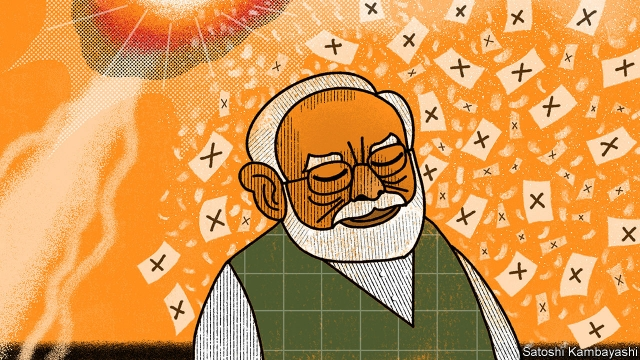

###### The sky’s no limit

# India’s prime minister takes his re-election campaign into outer space 

##### Narendra Modi orders the test of an anti-satellite missile, weeks before an election 

 

> Mar 28th 2019 

AT NOON ON March 27th Narendra Modi, India’s prime minister, appeared on television to deliver a triumphal message to the nation. An Indian missile had hurtled 300km into space and blown up a satellite, putting India in the small club of countries that had developed and tested anti-satellite (ASAT) weapons. “India stands tall as a space power!” he exulted. 

Mr Modi’s address was unusual. Voting in a seven-stage national election begins on April 11th. Prime ministerial broadcasts during election season—when a “model code of conduct” applies, barring the ruling party from abusing its position—have occurred only twice before: after the assassination of the prime minister in 1984 and of the leader of the opposition in 1991. Mamata Banerjee, the leader of a regional opposition party, demanded that the Election Commission investigate Mr Modi’s speech for breaching its code. 

An ASAT test would hardly qualify as a national-security emergency. Indeed, India might have carried it out at any time in the past eight years. In 2012 V.K. Saraswat, then the head of the Defence Research and Development Organisation, the government agency that develops new military gear, noted that the “building blocks” of an ASAT capability were in place and required only electronic fine-tuning. It is hard to avoid the conclusion that Mr Modi’s space spectacular was timed for the polls. It comes a month after India sent warplanes to bomb Pakistan for the first time since 1971—another move seen by many as grandstanding for the voters. 

Electioneering aside, the test had two aims. One was to lay down a marker at a time of growing military competition in space. China, India’s regional rival, operates around 30 satellites, many of which would be used by its armed forces in any conflict. It has also developed an array of ASAT weapons, including missiles and lasers, of its own. 

India is keen to show it can hit back. But in flaunting its ability to shoot small, fast-moving objects at enormous heights, India was also signalling its interest in swatting other, harder-to-hit things—Pakistani nuclear missiles, say—out of the sky. 

Yet that muscle-flexing may come at some diplomatic cost. It is the first avowed ASAT test since China blew up one of its own satellites in 2007, provoking international condemnation. The debris from that explosion generated a quarter of all catalogued objects in low-earth orbit a few years later, putting other countries’ satellites at risk. In 2012 Mr Saraswat had promised that India would not follow suit for just that reason. 

Indian officials point out that this week’s test took place far lower in orbit, so debris is more likely to fall towards Earth and burn up harmlessly. Brian Weeden of the Secure World Foundation, an NGO, agrees. But he warns that some pieces may be thrown into higher orbit, as occurred after America destroyed a wayward satellite at about the same altitude in 2008. Mr Modi will at least be glad that, unlike after his airstrikes against Pakistan, no one is questioning whether he hit the target. 

-- 

 单词注释:

1.narendra[]:[网络] 纳伦德拉；纳兰德；纳然陀 

2.MODI['mәudai]:[计] 模块化光学数字接口 

3.triumphal[trai'ʌmfәl]:a. 胜利的, 凯旋的 

4.hurtle['hә:tl]:vi. 猛冲, 碰撞, 突进 vt. 猛撞, 猛投 n. 投掷, 碰撞, 碰撞声 

5.ASAT['eisæt]:abbr.Anti-Satellite Weapon, 反卫星武器 

6.exult[ig'zʌlt]:vi. 非常高兴, 欢欣 

7.ministerial[.mini'stiәriәl]:a. 部长的, 内阁的, 执政的 [法] 部长的, 部的, 公使的 

8.assassination[ә.sæsi'neiʃәn]:n. 暗杀 [法] 暗杀, 行刺 

9.opposition[.ɒpә'ziʃәn]:n. 反对, 敌对, 相反, 在野党 [医] 对生, 对向, 反抗, 反对症 

10.Mamata[]:[网络] 熟客仔 

11.banerjee[]:n. (Banerjee)人名；(印)班纳吉 

12.regional['ri:dʒәnәl]:a. 地方的, 地域性的 [医] 区的, 部位的 

13.breach[bri:tʃ]:n. 裂口, 违背, 破坏, 违反, 突破, 破裂 vt. 攻破, 突破 vi. 跳出水面 

14.vk[]:abbr. 维生素k（vitamin k） 

15.organisation[,ɔ: ^әnaizeiʃən; - ni'z-]:n. 组织, 团体, 体制, 编制 

16.spectacular[spek'tækjulә]:a. 公开展示的, 惊人的, 壮观的 n. 奇观, 惊人之举, 展览物 

17.warplane['wɒ:plein]:n. 军用飞机 

18.Pakistan[.pɑ:ki'stɑ:n]:n. 巴基斯坦 

19.grandstand['grændstænd]:n. 正面看台, 观众 

20.voter['vәutә]:n. 选民, 投票人 [法] 选民, 选举人, 投票人 

21.electioneer[i.lekʃә'niә]:vi. 从事选举活动 n. 从事选举活动的人 

22.marker['mɑ:kә]:n. 作记号的人, 记分员, 书签, 纪念碑, 里程碑, 标识物, 标记 [计] 标记 

23.array[ә'rei]:n. 排列, 衣服, 大批, 军队 vt. 布署, 打扮, 排列 [计] 数组; 阵列 

24.flaunt[flaunt]:n. 炫耀, 飘扬 v. 炫耀, 飘扬 

25.swat[swɒt]:vt. 用力打下去, 重拍 n. 用劲打击, 长打, 全垒打 

26.diplomatic[.diplә'mætik]:a. 外交的, 老练的 [法] 外交的, 外交上的, 文献上的 

27.provoke[prә'vәuk]:vt. 激怒, 惹起, 诱导 [法] 刺激, 煽动, 激怒 

28.condemnation[kɒndem'neiʃәn]:n. 非难, 宣告有罪, 非难的理由 

29.debris['deibri:]:n. 碎片, 残骸 [医] 碎屑 

30.harmlessly[]:adv. 无害地；无恶意地 

31.brian['braiәn]:n. 布莱恩（男子名） 

32.weeden[]: [人名] 威登 

33.wayward['weiwәd]:a. 任性的, 难以捉摸的, 不稳定的, 刚愎的 [法] 顽强的, 任性的, 不规则的 

34.airstrike['er,straik]:n. 空袭；空中打击 

