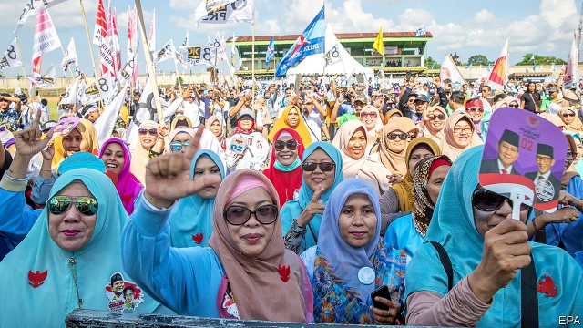

###### Dildo for president

# Indonesian voters get a genuine choice, but an increasingly narrow one 

##### Restrictive rules make it hard for small parties to break into politics 

 

> Mar 28th 2019 

IN A METAL pavilion down a backstreet in Yogyakarta, a mid-sized Indonesian city, Tutiek Widyo is making her pitch to the crowd. She is a candidate for the local legislature from the National Mandate Party (PAN), a small Islamic outfit, in the general election on April 17th. Dressed in a bejewelled headscarf, Ms Tutiek patiently spells out her credentials to the audience, who are mostly elderly. They nod and smile politely, but appear more interested in the free tea and gudeg, a local speciality made from stewed jackfruit. 

Yogyakarta is a stronghold of PAN, partly because it is also the headquarters of Muhammadiyah, an affiliated Muslim organisation. Even so, Ms Tutiek needs to whip up as much support as possible. A recent change to electoral laws means that parties need at least 4% of the popular vote to gain seats in the national parliament, up from 2% in 2004. Polls show PAN hovering dangerously near this threshold. Abduljalie, a retired tailor wearing a chequered sarong, says he has voted for PAN at every election since it was founded in 1999. It is crucial that PAN be represented in parliament, he continues; he would never vote for anyone else. 

Other parties are also at risk. Of the ten in parliament, four will not meet the 4% threshold and two others are hovering just above it, according to current polling. The threshold is one of a series of recent rules which are making Indonesia’s elections less competitive. 

Indonesia is still a young democracy. Following independence from the Netherlands in 1945, it experimented briefly with competitive elections before slipping into four decades of authoritarian rule under first Sukarno and then Suharto. The latter allowed parliamentary elections, but with only two cowed opposition parties. Pliant parliamentarians then selected the president from a shortlist of one. It was only after Suharto resigned in the face of mass protests in 1998 that the country reverted to free elections. 

On the face of things, democracy has thrived since then. The subsequent presidential elections have all been genuinely competitive. Democracy pervades every level of government. Voters get to choose a chief executive and a parliament not just for the country as a whole, but also for provinces and the next layer of administration, cities and districts. The press is free and public protests are common. 

But Indonesia’s political parties are not as keen on competition as its voters appear to be. The biggest ones are developing something of a cartel. They have been drawing up rules that not only make it harder for old parties to survive; creating new ones is becoming trickier too. In 1999, when new election laws were approved, the government was battling separatists in Aceh, East Timor and Papua. To stymie the splittists, the new rules required national parties to have officers not only in half of the country’s provinces, but also in half of the districts within those provinces. Even though the threat of secession has faded, the barriers to new parties have continued to rise. Now parties must have chapters in all provinces, three-quarters of districts and half of sub-districts. 

Options for voters are narrowing in the presidential race, too. In the first direct presidential election of the democratic era, in 2004, there were five candidates on the ballot. This year it is a two-horse race. As in the previous contest, in 2014, Joko Widodo or Jokowi, the incumbent, faces Prabowo Subianto, a former three-star general. Jokowi has worked hard to limit the number of contenders. In 2017 his coalition government refused to scrap a law requiring presidential candidates to have the support of at least 20% of MPs. Since the coalition controls more than 60% of seats, the rule in effect meant that Jokowi could have only one opponent. Opposition parties and one of Jokowi’s then coalition partners stormed out in a vain protest. 

The contest could have been even less competitive. A year ago Jokowi and Mr Prabowo toyed with the possibility of running on a joint ticket, despite having battled one another fiercely in the previous election. That would have ended any semblance of a meaningful contest. Talks fell apart, but observers saw the possible partnership as a sign of the increasingly collusive nature of Indonesia’s democracy. 

Voters’ frustration is borne out at the polls: turnout for presidential elections has fallen at every vote since 2004, albeit from a high starting point. The angst is also apparent online. In January campaign materials for Nurhadi and Aldo, a fake but plausible presidential ticket, spread across social media. The invention of internet wags, the mustachioed men posed piously in photos and championed vague social programmes. The fiction was accurate down to a portmanteau nickname: Nurhadi and Aldo became “Dildo”. 

Perhaps the most egregious erosion of voters’ choice is happening at the regional level. At these votes last year 9% of ballots only had one candidate, up from 1% in 2015. The practice was permitted by the constitutional court in 2014. It is the result of sweeping coalitions, sometimes including virtually all the parties. The political spoils get shared out and there is no need to waste money competing. Yet even unopposed candidates are not always shoo-ins. Last year one lost the mayoral vote in Makassar, a big eastern city, to blank ballots. Indonesians are still finding a way, it seems, to express their discontent. 

-- 

 单词注释:

1.dildo[dildәu]:n. 人造阴茎 

2.Indonesian[.indәu'ni:ʒәn]:a. 印尼的 n. 印尼人, 印尼语群 

3.voter['vәutә]:n. 选民, 投票人 [法] 选民, 选举人, 投票人 

4.restrictive[ri'striktiv]:a. 限制的, 约束的, 限定的 n. 限制词 

5.politic['pɒlitik]:a. 精明的, 明智的, 策略的 

6.pavilion[pә'viljәn]:n. 楼阁, 亭子, 大帐篷, 观众席 vt. 置...于亭中, 搭帐篷, 笼罩 

7.backstreet['bækstri:t]:n. （贫穷地区的）后街小巷 a. 偷偷摸摸的；非法的 

8.yogyakarta[]: [地名] [印度尼西亚] 日惹 

9.legislature['ledʒisleitʃә]:n. 立法机关, 议会, 立法院 [法] 立法机构, 立法机关 

10.mandate['mændeit]:n. 命令, 指令, 要求 vt. 委任统治 

11.Islamic[iz'læmik]:a. 伊斯兰教的, 穆斯林的 

12.outfit['autfit]:n. 用具, 配备, 机构 vt. 配备, 供应 vi. 得到装备 

13.bejewel[bi'dʒu:әl]:vt. 饰以珠宝 

14.headscarf[ˈhedskɑ:f]:n. 女人的头巾 

15.patiently['peiʃәntli]:adv. 耐心地；有毅力地 

16.credential[kri'denʃәl]:n. 国书, 凭据, 证明书 [经] 凭证, 证书 

17.politely[pә'laitli]:adv. 有礼貌地, 文雅地, 客气地 

18.stew[stju:]:n. 炖, 烦恼, 热浴, 妓院, 鱼塘 vi. 炖, 焖, 忧虑 vt. 炖, 焖, 使焦虑 

19.jackfruit['dʒækfru:t]:n. 木波罗 

20.stronghold['strɒŋhәuld]:n. 要塞, 堡垒, 大本营 

21.headquarter[,hed'kwɔ:tә]:vt. 将...的总部设在 

22.muhammadiyah[]:[网络] 穆罕默迪亚；穆罕默德协会；穆罕默德会 

23.affiliate[ә'filieit]:vt. 使紧密联系, 使附属, 接纳, 收养 vi. 发生联系, 参加 

24.Muslim['mjzlim; (?@) 'mʌzlem]:n. 伊斯兰教, 伊斯兰教教徒 

25.organisation[,ɔ: ^әnaizeiʃən; - ni'z-]:n. 组织, 团体, 体制, 编制 

26.electoral[i'lektәrәl]:a. 选举人的, 选举的, (有关)选举的 [法] 选举的, 选举人的, 由选举人组成的 

27.hover['hʌvә]:vi. 盘旋, 翱翔, 徘徊 vt. 孵 n. 翱翔 

28.dangerously[]:adv. 危险, 不安全 

29.threshold['θreʃәuld]:n. 门槛, 入口, 开端, 阈 [计] 阈; 阈值 

30.chequer['tʃekә]:n. (一粒)棋子, 西洋跳棋, 方格图案, 格子花, 花楸果, 排列成方格式的石头 vt. 把...画/制成方格图案形, 交替变换 

31.sarong[sә'rɒŋ]:n. 莎笼(马来人服装), 围裙 

32.sery[]:n. (Sery)人名；(俄)谢雷；(科特)塞里 

33.les[lei]:abbr. 发射脱离系统（Launch Escape System） 

34.Indonesia[.indәu'ni:ʒә]:n. 印尼 

35.Netherlands['neðәlәndz]:n. 荷兰 

36.briefly['brifli]:adv. 简短地, 扼要地, 简明地, 简单地 

37.authoritarian[ɒ:.θɒri'tєәriәn]:a. 独裁的, 独裁主义的 

38.Sukarno[]:n. (Sukarno)人名；(印尼)苏加诺 苏加诺 

39.Suharto[su'hɑ:təu]:n. 苏哈托（人名） 

40.parliamentary[.pɑ:lә'mentәri]:a. 国会的, 议会的, 议会制度的 

41.opposition[.ɒpә'ziʃәn]:n. 反对, 敌对, 相反, 在野党 [医] 对生, 对向, 反抗, 反对症 

42.pliant['plaiәnt]:a. 易弯的, 柔韧的, 柔顺的 

43.parliamentarian['pɑ:lәmen'teәriәn]:n. 议会法规专家, 国会议员, 熟悉议会法规而又有经验的议员 

44.shortlist['ʃɔ:tlist]:n. <英>供最后挑选(或考虑)用的候选人名单 

45.revert[ri'vә:t]:vi. 恢复, 复归, 回复, 还原 vt. 使回复原状, 使回转 n. 恢复原信仰的人 [计] 还原 

46.presidential[.prezi'denʃәl]:a. 总统制的, 总统的, 首长的, 统辖的 [法] 总统的, 议长的, 总经理的 

47.genuinely[]:adv. 真诚地；诚实地 

48.pervade[pә'veid]:vt. 弥漫于, 遍及于, 流行于, 蔓延, 渗透于, 充满 

49.cartel[kɑ:'tel]:n. 卡特尔, 企业联合, 俘虏交换条约, 决斗挑战书 [经] 同业联合, 联合贩卖, 卡特尔 

50.tricky['triki]:a. 狡猾的, 机敏的 

51.separatist['sepәreitist]:n. 分离主义者, 独立派 

52.aceh[]:n. 亚齐省（印度尼西亚最西部的一个省） 

53.Timor['ti:mɔ:]:帝汶岛(马来群岛中一岛) 

54.Papua['pæpjuә]:n. 巴布亚岛 

55.stymie['staimi]:n. (喻)困难的境地 vt. 使(球)处于困难的位置, 使为难, 使处困境, 妨碍, 阻挠, 阻碍 

56.splittist[sp'lɪtɪst]: 分裂主义分子 

57.secession[si'seʃәn]:n. 脱离, 分离 

58.ballot['bælәt]:n. 投票, 投票用纸, 抽签 vi. 投票, 抽签 vt. 投票选出, 拉选票 

59.Joko[]:[网络] 佐戈；上甲；彩绘阿祥 

60.widodo[]:[网络] 阿斯 

61.Jokowi[]:[网络] 佐科威；省长佐科威；雅加达市长 

62.incumbent[in'kʌmbәnt]:a. 现任的, 依靠的, 负有义务的 n. 领圣俸者, 在职者 

63.prabowo[]:[网络] 拉波沃；拉博沃 

64.contender[kәn'tendә(r)]:n. 参赛者, 争论者, 斗争者, 竞争者 

65.coalition[.kәuә'liʃәn]:n. 结合体, 结合, 联合 [经] 联合, 联盟 

66.scrap[skræp]:n. 碎片, 残余物, 些微, 片断, 铁屑, 吵架 vt. 扔弃, 敲碎, 拆毁 vi. 互相殴打 a. 零碎拼凑成的, 废弃的 

67.MP[]:国会议员, 下院议员 [计] 宏处理程序, 维护程序, 线性规划, 微程序, 多处理器 

68.opposition[.ɒpә'ziʃәn]:n. 反对, 敌对, 相反, 在野党 [医] 对生, 对向, 反抗, 反对症 

69.fiercely['fiәsli]:adv. 猛烈地, 厉害地 

70.semblance['semblәns]:n. 外表, 伪装, 假象, 少量 

71.meaningful['mi:niŋful]:a. 意味深长的 

72.partnership['pɑ:tnәʃip]:n. 合伙, 合股, 合作关系 [经] 合伙(合作)关系, 全体合伙人 

73.collusive[kә'lu:siv]:a. 共谋的 

74.frustration[frʌs'treiʃәn]:n. 挫折, 顿挫 [医] 挫折 

75.turnout['tә:naut]:n. 聚集的人群, 出席者, 产量 [化] 输出; 产额 

76.albeit[ɔ:l'bi:it]:conj. 尽管, 虽然 

77.angst[æŋst]:n. 焦虑, 疑惧 [医] 恐怖 

78.online[]:[计] 联机 

79.aldo['ɑ:ldәj,'ɔ:l-,'æl-]:n. 奥尔多（男子名） 

80.fake[feik]:n. 假货, 欺骗, 诡计 a. 假的 vt. 假造, 仿造 vi. 伪装 

81.plausible['plɒ:zibl]:a. 貌似真实的, 貌似合理的, 说得煞有其事的 [法] 花言巧语的, 似乎有理的 

82.mustachioed[]: 有大鬈曲八字胡的 

83.piously[]:adv. 虔诚地 

84.portmanteau[pɒ:t'mæntәu]:n. 手提箱 a. 多用的, 混合的 

85.egregious[i'gri:dʒiәs]:a. 异乎寻常的, 过分的, 惊人的 

86.erosion[i'rәuʒәn]:n. 腐蚀, 冲蚀, 侵蚀 [化] 磨耗; 侵蚀 

87.regional['ri:dʒәnәl]:a. 地方的, 地域性的 [医] 区的, 部位的 

88.constitutional[.kɒnsti'tju:ʃәnl]:a. 宪法的, 立宪的, 体质的 [医] 全身的; 体质的 

89.unopposed['ʌnә'pәuzd]:[法] 无反对的, 无对手的 

90.alway['ɔ:lwei]:adv. 永远；总是（等于always） 

91.mayoral['mєәrәl]:a. 市长的 

92.Makassar[mə'kæsə]:n. 孟加锡（印度尼西亚苏拉威西岛西南部港市） 

93.Indonesian[.indәu'ni:ʒәn]:a. 印尼的 n. 印尼人, 印尼语群 

94.discontent[.diskәn'tent]:n. 不满 

