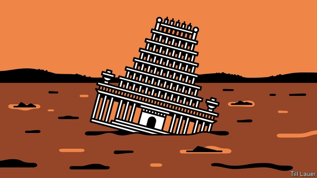

###### Banyan

# The world’s most sacred river—the Ganges—is also one of its dirtiest 

##### Yet there is little political pressure in India to clean it up 

 

> Mar 28th 2019 

ROUND AND round the baggage carousel at London’s Heathrow airport goes a battered cardboard box waiting to be claimed by its owner, a passenger from Delhi: “PLEASE KEEP THIS SIDE UP! GANGA JAL—HOLLY WATER.” For many Hindus the world over, nothing is more holy or pure than Ganga jal, or water from the Ganges. 

The whole river—from Himalayan glaciers across the vast North Indian plain to the filigree delta on the Bay of Bengal—is worshipped as a life-affirming goddess. The spiritual potency comes not from the Ganges’s 2,500km length, which falls short of the world’s longest rivers. Rather, its basin supports half of India’s population of 1.3bn (plus nearly the entire population of Nepal and much of Bangladesh’s). For its water and fertile sediment, no river is more important to humanity. And so for centuries Ganga jal has marked births, weddings and deaths. Scores of cremations take place daily on the riverside ghats in the city of Varanasi alone. Between January and early March, a temporary city sprang up on the banks of the river near Allahabad (recently renamed Prayagraj) for the Kumbh Mela festival, in which a staggering 240m devotees took to the river to wash away sins and human ailments. 

Yet the Ganges is likelier to add to the ailments than cure them. For decades, declining water volumes have been a growing worry, as hydropower dams have proliferated, wanton irrigation and industrial schemes have drawn water away and the annual monsoon has become more fickle. Three months before this summer’s monsoon, the Ganges is a thin meander, much of its bed exposed, as it passes through Kanpur, the biggest city along its course. 

Low flows not only harm the livelihoods of fishermen and farmers downstream. They also degrade water quality. Sewage is pumped raw into the stream. Levels of fecal coliform bacteria are off the chart. Tests from the Yamuna, a tributary which flows through Delhi, have found 1.1bn such bacteria per 100 millilitres—nearly half a million times the officially recommended limit for bathing. No wonder “Delhi belly” is so prevalent. Victor Mallet describes in “River of Life, River of Death” how the Ganges system appears to be a conduit for bacteria increasingly resistant to antibiotics. 

Alarmed at the state of the Ganges, some holy men have spoken out. In October G.D. Agrawal, an environmental engineer turned guru, fasted to death as a protest. Despite such dramatic gestures, too few Hindus accept that the Ganges’s holy waters are sullied. Civic pressure to clean up the river remains slight. 

To his credit, Narendra Modi, the prime minister, declared a clean Ganges a priority when he came to power in 2014. It was a nod to his Hindu-nationalist following. He promised $3bn and new plants to treat sewage and industrial waste. Five years on, progress is disappointing. In Varanasi, the focus is on razing a rambling old quarter to provide vistas for visiting VIPs, rather than on cleaning up the river. 

As for Kanpur, a city of Dickensian leather factories, the picture is dystopian. The river stinks. It is not just sewage that goes untreated into the Ganges, among whose pools children play. So, too, do effluents from the 300-plus tanneries, most notably chromium, a toxic heavy metal. When Banyan visited, the tanneries were supposedly closed to spare bathers at the Kumbh Mela 200km downstream. Yet in one ancient factory, huge wooden vats were still turning, and workers were carrying slopping buckets of chemicals around. Meanwhile tens of thousands of Kanpur’s poorest live in slums drawing groundwater laced with chromium, which is known to cause cancer, liver failure and early dementia. Kanpur has facilities to recycle industrial wastewater and extract the chromium. The process is said to add no more than nine rupees (13 cents) to the cost of a pair of shoes. Yet a blind eye is turned to environmental breaches. 

Too often, says Shashi Shekhar, a former senior water official, state governments and their business cronies are more interested in constructing treatment plants than ensuring their long-term use. New forms of public-private partnership may start to bear fruit in a few years’ time, Mr Shekhar predicts, and water quality at last improve. Yet deeper change is needed. The Ganges is abused in search of short-term gain. Meanwhile, neither politicians nor the press lay out the scale of the environmental problem. As Mr Shekhar puts it, if a river in which millions of devotees bathe “is full of shit, then people are required to be told”. 

-- 

 单词注释:

1.banyan['bænjәn]:n. 印度榕树 [医] 榕树, 孟加拉榕 

2.carousel[kә'rauzәl]:n. 竞技比武大会 

3.heathrow['hi:θrәj]:n. 希思罗机场（位于英国伦敦） 

4.batter['bætә]:v. 连续猛打（尤其指妇女），猛击 n. 面糊（食物），击球员，打击手 

5.cardboard['kɑ:dbɒ:d]:n. 薄纸板 [化] 咭纸; 特等纸板; 卡纸板; 卡片纸板 

6.ganga['^æŋ^ә]:[医] 大麻花膏 

7.Hindu['hindu:]:a. 印度教教徒的 n. 印度教教徒 

8.ganga['^æŋ^ә]:[医] 大麻花膏 

9.JAL[]:日本航空公司 

10.ganges['^ændʒi:z]:n. 恒河（位于亚洲, 发源于喜马拉雅山, 流经印度和孟加拉） 

11.Himalayan[hi'mɒlәjәn]:a. 喜玛拉雅山的 

12.glacier['gleiʃә]:n. 冰川 

13.filigree['filә^ri:]:n. 金银细丝工艺, 精致华丽而不很坚固的物品, 金丝的细工饰品 [医] 银丝网 

14.delta['deltә]:n. 三角洲, 希腊字母的第四个字 [医] δ(希腊文的第四个字母), 丁种, 三角, 三角形区 

15.goddess['gɒdis]:n. 女神, 美女, 受崇拜的女性 

16.potency['pәutәnsi]:n. 力量, 权力, 效力 [化] 能力 

17.Nepal[ni'pɒ:l]:n. 尼泊尔 

18.sediment['sedimәnt]:n. 沉淀物, 沉积 [化] 沉降物; 沉积物 

19.humanity[hju:'mæniti]:n. 人性, 人类, 博爱 

20.cremation[kri'meiʃәn]:n. 烧, 火葬 [医] 火葬 

21.riverside['rivәsaid]:n. 河边, 河畔 

22.ghat[^ɔ:t]:n. <印>河边的石梯, 山路 

23.Varanasi[vә'rɑ:nәsi:]:瓦腊纳西[印度东北部城市](旧称贝拿勒斯) 

24.Allahabad['ælәhә,bæd]:阿拉哈巴德[印度北部城市](印度教圣地) 

25.rename[.ri:'neim]:vt. 重新命名, 再命名, 给...改名 [计] 重命名; DOS内部命令:更改文件名 

26.kumbh[]: [地名] 泉（布拉灰语） 

27.mela[]:n. 梅拉（女子名） 

28.stagger['stægә]:n. 蹒跚, 踌躇 vi. 蹒跚, 犹豫 vt. 使摇摆, 使踌躇, 交错, 错开 a. 交错的, 错开的 

29.devotee[.devә'ti:]:n. 爱好者, 献身者, 虔诚的宗教信徒 

30.ailment['eilmәnt]:n. 病痛, 疾病 [医] 疾病 

31.hydropower['haidrәupauә]:n. 水力发出的电力 

32.proliferate[prәәu'lifәreit]:vi. 增殖, 激增, 扩散 vt. 使激增 

33.wanton['wɒntәn]:n. 荡妇, 水性杨花的女人 a. 恶意的, 不负责任的, 无节制的, 嬉戏的, 繁茂的, 淫荡的 vi. 变化无常, 嬉戏, 闲荡, 放肆 vt. 挥霍 

34.monsoon[mɒn'su:n]:n. 季风, 吹季风的季节, 雨季 

35.fickle['fikl]:a. 变幻无常的, 浮燥的, 薄情的 

36.meander[mi'ændә]:n. (河流的)蜿蜒, 漫步, 迂回旅行 vi. 蜿蜒流动, 漫步 vt. 使蜿蜒曲折 

37.kanpur[]:坎普尔 

38.livelihood['laivlihud]:n. 生计, 营生, 生活 

39.downstream['daun'stri:m]:adv. 下游地 a. 下游的 

40.degrade[di'greid]:v. (使)降级, (使)退化 

41.sewage['sju:idʒ]:n. 脏水, 污水 [医] 污水, 污物 

42.fecal['fi:kәl]:a. 排泄物的, 渣滓的 [医] 粪便的 

43.coliform['kɒlifɒ:m]:n. 大肠菌 a. 大肠菌状的 

44.yamuna[]:[网络] 亚穆纳河；那河；阎牟那河 

45.tributary['tribjutәri]:a. 支流的, 纳贡的, 从属的, 辅助的 n. 支流, 纳贡者, 属国 

46.delhi['deli]:n. 德里（印度城市名） 

47.officially[ә'fiʃәli]:adv. 作为公务员, 职务上, 官方地 

48.BThE[]:[网络] 实际热效率 

49.prevalent['prevәlәnt]:a. 普遍的, 流行的 

50.victor['viktә]:n. 胜利者 a. 胜利的 

51.mallet['mælit]:n. 木槌, 球棍, 棒 [化] 大锤; 手锤 

52.conduit['kɒndit]:n. 导管, 水管, 沟渠 [电] 导管 

53.antibiotic[.æntibai'ɒtik]:n. 抗生素 a. 抗生的 

54.GD[]:[计] 图形显示 [医] 钆(64号元素) 

55.agrawal[]:阿格拉沃尔（人名） 

56.environmental[in.vaiәrәn'mentәl]:a. 周围的, 环境的 [经] 环境的, 环保的 

57.guru['guru:]:n. 古鲁(印度教导师) [医] 柯拉子 

58.sully['sʌli]:vt. 玷污, 弄脏 n. 污点, 脏污 

59.civic['sivik]:a. 市的, 市民的, 公民的 [法] 公民的, 市民的, 公民资格的 

60.narendra[]:[网络] 纳伦德拉；纳兰德；纳然陀 

61.MODI['mәudai]:[计] 模块化光学数字接口 

62.sewage['sju:idʒ]:n. 脏水, 污水 [医] 污水, 污物 

63.raze[reiz]:vt. 毁灭, 刮去, 把...夷为平地, 消除, 抹去, 破坏 

64.rambling['ræmbliŋ]:a. 漫步的, 布局零乱的, 散漫的 

65.vista['vistә]:n. 远景, 展望, 回想 

66.VIP[]:n. 要人, 大人物 [化] 血管活性肠肽 

67.Dickensian[di'kenziәn]:n. 专门研究狄更斯(英国小说家)者, 崇拜狄更斯者 a. 狄更斯的 

68.dystopian[dis'tәjpiәn]:a. 反面乌托邦的,反面假想国的  n. 反面乌托邦的鼓吹者(或描写者) 

69.stink[stiŋk]:n. 臭味, 臭气 vi. 发臭味, 名声臭 vt. 用臭味赶 

70.untreated['ʌn'tri:tid]:[化] 未经处理的 

71.effluent['efluәnt]:a. 流出的, 射出的 n. 流出物, 由河湖等流出之水流 

72.tannery['tænәri]:n. 制革厂, 硝皮厂 [化] 鞣革厂; 皮革厂 

73.notably['nәjtbәli]:adv. 显著地, 著名地, 尤其, 特别 

74.chromium['krәumiәm]:n. 铬 [化] 铬Cr 

75.toxic['tɒksik]:a. 有毒的, 中毒的 [医] 中毒的, 毒物的 

76.supposedly[sә'pәuzidli]:adv. 想象上, 看上去像, 被认为是, 恐怕, 按照推测 

77.bather['beiðә]:n. 入浴者, 游泳者 

78.VAT[væt]:n. 大桶 vt. 装入大桶, 在大桶里处理 

79.slop[slɒp]:n. 外衣, 工作服, 泥浆, 污水, 过分热情, 口若悬河 vi. 溅出, 踏着泥泞前进 vt. 使溢出, 使溅出, 弄脏 

80.tens[]:十位 

81.groundwater['graundwɒ:tә]:n. 地下水 

82.dementia[di'menʃiә]:n. 痴呆 [医] 痴呆 

83.wastewater['weistwɔ:tә]:n. 废水 

84.extract[ik'strækt]:n. 榨出物, 精汁, 摘录, 选段 vt. (费力地)取出, 采掘, 榨取, 摘录, 吸取 [计] 提取 

85.rupee[ru:'pi:]:n. 卢比(印、巴等国货币单位) 

86.breach[bri:tʃ]:n. 裂口, 违背, 破坏, 违反, 突破, 破裂 vt. 攻破, 突破 vi. 跳出水面 

87.Shashi[]:n. (Shashi)人名；(印、尼)沙希 

88.Shekhar[]:n. (Shekhar)人名；(印)谢卡尔 

89.crony['krәuni]:n. 密友, 亲密伙伴, 好朋友 

90.partnership['pɑ:tnәʃip]:n. 合伙, 合股, 合作关系 [经] 合伙(合作)关系, 全体合伙人 

91.shit[ʃit]:vi. 拉屎 vt. 欺骗, 在...拉屎 n. 粪, 屎 interj. 狗屁 

