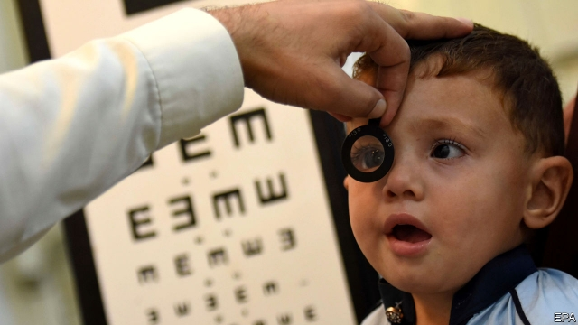

###### Who jabs in Punjab?

# Why Pakistan has so many quacks 

##### With real doctors in short supply, phoneys abound 

 

> Mar 28th 2019 

MOHAMMAD ZAHID sat sullenly in the office where minutes earlier he had been doling out advice, pills and injections to a long line of patients. His customers had melted away at the sudden arrival of Saeed Asghar and his police escort. Dr Asghar, deputy director of the Anti-Quackery Department of the Pakistani province of Punjab, spends his days hunting for people practising medicine without the proper qualifications. Mr Zahid briefly tried to claim he was a proper doctor, before admitting he was not when his paperwork was checked. In fact, he had been trained only to help a pharmacist dispense medicine. His set of rooms in the backstreets of Rawalpindi were full of medicines he was not qualified to prescribe and syringes he was not trained to use, said Dr Asghar. “I haven’t been doing this for long,” Mr Zahid said, by way of an excuse. Beneath his desk was a plastic tub stuffed with banknotes. 

A health-care census earlier this decade found Punjab, Pakistan’s most populous province with 110m inhabitants, had between 70,000 and 80,000 totally unqualified practitioners. Many more, like Mr Zahid, had a medical qualification of some sort, but were doing work that far exceeded their training. Pharmacists, homeopaths and herbalists often pose as GPs. 

The fraudulent doctors and dentists are not only charging handsomely for ineffective and often dangerous treatment. They are also threatening public health, according to Punjab’s health-care commission, which enforces health-care standards. Reuse of unsterilised syringes and other implements is spreading blood-borne diseases such as hepatitis C. This scourge is especially alarming because many backstreet clinics specialise in pick-me-up steroid injections for almost any ailment. Lax prescription of antibiotics is helping to breed bacterial resistance to them. Quacks do not keep records and are not able to spot, much less report, outbreaks of infectious diseases. 

Yet when Dr Asghar and his team catch charlatans and seal their premises, the crowds that gather to watch are not grateful for their deliverance. “Local people say: ‘He’s our only doctor, please bring us another one before sealing this,’” Dr Asghar says. Quacks thrive because public health care is so poor and private health care so poorly regulated. Government spending per person on health is barely three-fifths that of neighbouring India, in part because so much of the budget goes on defence, squeezing out other items. As a result, Pakistanis end up paying for two-thirds of their health care themselves. The poor naturally resort to the cheapest option, even if they know the care is substandard. 

The quacks are also canny. Within minutes of a raid, other sham clinics in the same neighbourhood will abruptly shut, having received tip-offs via WhatsApp. The fake doctors often operate with the connivance of real ones, who lend them authentic credentials in exchange for a share of the profits. Professional bodies rarely take action against members caught doing that sort of thing. 

The health-care commission acknowledges that unless decent treatment becomes more readily available, the quacks will continue to thrive, no matter how much energy is put into enforcement. As Dr Asghar bursts into a clinic lined with vials of veterinary steroids ready to be injected into human patients, it becomes clear his team has visited before. The Anti-Quackery division had sealed the shop next door, but an enterprising fraudster has simply rented the adjacent premises and knocked a hole through the wall. 

-- 

 单词注释:

1.jab[dʒæb]:v. 刺, 戳, 猛击 n. 刺, 戳, 猛击 

2.Pakistan[.pɑ:ki'stɑ:n]:n. 巴基斯坦 

3.quack[kwæk]:n. 鸭叫声, 冒牌医生, 冒充内行之人 a. 冒牌医生的 v. 嘎嘎叫, 当冒牌医生, 夸大广告 

4.phoney['fәuni]:a. 假的, 假冒的, 伪造的 n. 骗子, 假货, 假冒者 

5.abound[ә'baund]:vi. 大量存在, 富于, 充满 

6.MOHAMMAD[]:n. 穆罕默德（穆斯林真主）；（阿拉伯）穆罕默德（男子名） 

7.zahid[]:[网络] 扎希德；自我否定；男性 

8.sullenly['sʌlənlɪ]:adv. 不高兴地, 绷着脸, 忧郁地 

9.dole[dәul]:n. 救济品, 失业救济金 vt. 发放救济 

10.Saeed[]:n. 萨伊德（男子名） 

11.asghar[]:n. (Asghar)人名；(阿拉伯、伊朗、巴基、阿富)阿斯加尔 

12.escort['eskɒ:t]:n. 护送者, 护卫者, 护航舰 vt. 护卫, 护送 

13.Pakistani[.pɑ:ki'stɑ:ni]:a. 巴基斯坦的 n. 巴基斯坦人 

14.Punjab[pʌn'dʒɑ:b]:n. 旁遮普(南亚一地区) 

15.zahid[]:[网络] 扎希德；自我否定；男性 

16.briefly['brifli]:adv. 简短地, 扼要地, 简明地, 简单地 

17.pharmacist['fɑ:mәsist]:n. 药师, 药品商, 药商, 药剂师 [医] 药师, 调剂员, 药商 

18.dispense[dis'pens]:vt. 分发, 分配 vi. 特许, 豁免 

19.backstreet['bækstri:t]:n. （贫穷地区的）后街小巷 a. 偷偷摸摸的；非法的 

20.Rawalpindi[,rɑ:vәl'pindi:]:拉瓦尔品第[巴基斯坦东北部城市] 

21.syringe['sirindʒ]:n. 注射器, 洗涤器 vt. 注射, 洗涤 

22.banknote['bæŋknәut]:n. 钞票 

23.census['sensәs]:n. 户口普查 vt. 实施统计调查 

24.populous['pɒpjulәs]:a. 人口多的, 人口稠密的 

25.unqualified[.ʌn'kwɒlifaid]:a. 不合格的, 无资格的, 不胜任的 [经] 无条件的, 不合格的, 无资格的 

26.practitioner[præk'tiʃәnә]:n. 从业者, 开业者 [医] 行医者, 医师 

27.homeopath['hәumiәpɑ:θ]:[医] 顺势医疗者 

28.herbalist['hә:bәlist]:n. 草药医生 [医] 草药医 

29.GP[]:普通医师, 普通医生开业医生 [计] 通用程序设计, 图形处理器 

30.fraudulent['frɒ:djulәnt]:a. 欺诈的, 不正的, 不诚实的 [法] 欺诈的, 欺骗的, 骗取的 

31.handsomely['hænsәmli]:adv. 漂亮地, 整齐地, 当心地, 慢慢地, 优厚地, 慷慨地, 美观地 

32.ineffective[.ini'fektiv]:a. 无效的 [法] 失效的, 无效的, 效率低的 

33.unsterilised[]:[网络] 收回 

34.hepatitis[.hepә'taitis]:n. 肝炎 [医] 肝炎 

35.C[si:]:[计] 调用, 访问, 呼叫；电容, 进位, 通道, 字符, 清除, 常数, 控制, 周期；C 程序设计语言 [化] 碳的化学符号; 胞苷 

36.scourge[skә:dʒ]:n. 鞭, 苦难根源, 灾祸 vt. 鞭打, 痛斥, 蹂躏 

37.specialise['speʃә,laiz]:vt. 特加指明, 列举, 使专门化, 限定...的范围 vt.vi. (使)特化, (使)专化 vi. 成为专家, 专务, 专攻, 专门研究, 逐条详述 

38.steroid['stiәrɒid]:n. 类固醇 [化] 甾族化合物 

39.ailment['eilmәnt]:n. 病痛, 疾病 [医] 疾病 

40.lax[læks]:a. 松的, 不严格的, 腹泻的, 松弛的 n. 腹泻, 松元音 

41.antibiotic[.æntibai'ɒtik]:n. 抗生素 a. 抗生的 

42.bacterial[bæk'tiәriәl]:a. 细菌的 [医] 细菌的, [无芽胞]杆菌的 

43.les[lei]:abbr. 发射脱离系统（Launch Escape System） 

44.outbreak['autbreik]:n. 爆发, 暴动 [医] 暴发 

45.infectious[in'fekʃәs]:a. 有传染性的, 易传染的 [医] 传染性的 

46.charlatan['ʃɑ:lәtәn]:n. 庸医 [医] 庸医, 江湖医 

47.premise['premis]:n. 前提, 房屋连地基, 上述各项 vt. 预先提出, 引出, 作为...的前提 vi. 作出前提 

48.deliverance[di'livәrәns]:n. 解脱, 解救, 释放, 判决 [法] 交保, 判决, 正式意见 

49.poorly['puәli]:adv. 贫穷地, 不充分地, 贫乏地 a. 身体不舒服的 

50.Pakistani[.pɑ:ki'stɑ:ni]:a. 巴基斯坦的 n. 巴基斯坦人 

51.substandard[.sʌb'stændәd]:a. 标准以下的, 不合规格的 [化] 低于定额的 

52.canny['kæni]:a. 精明的, 谨慎的, 节约的 

53.sham[ʃæm]:n. 假, 赝品, 骗子, 哄骗 a. 假的, 伪造的 vt. 假装, 冒充 vi. 装假 

54.abruptly[ә'brʌptli]:adv. 突然地, 唐突地 

55.WhatsApp[]:[网络] 智能手机；联络电话；每月活跃用 

56.fake[feik]:n. 假货, 欺骗, 诡计 a. 假的 vt. 假造, 仿造 vi. 伪装 

57.connivance[kә'naivәns]:n. 默许, 纵容 [法] 纵容, 默许 

58.credential[kri'denʃәl]:n. 国书, 凭据, 证明书 [经] 凭证, 证书 

59.enforcement[in'fɒ:smәnt]:n. 执行, 强制 [法] 实施, 加强, 厉行 

60.vial['vaiәl]:n. 小瓶 vt. 装入小瓶 

61.veterinary['vetәrinәri]:a. 兽医的 n. 兽医 

62.inject[in'dʒekt]:vt. 注射, 注入, 使入轨 [医] 注射 

63.enterprising['entәpraiziŋ]:a. 有魄力的, 有进取心的, 有事业心的 

64.fraudster[ˈfrɔ:dstə(r)]:n. 行骗者 

65.adjacent[ә'dʒeisәnt]:a. 毗连的, 邻近的, 连接的 [机] 相邻的, 邻位的, 交界的 

