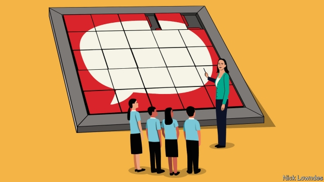

###### Johnson

# The agony and ecstasy of grammar 

##### Teaching and learning it should be fascinating—and fun 

 

> Mar 28th 2019 

“UNDERLINE A RELATIVE clause.” This challenge would give a lot of adults the sweats. It would even—whisper it—flummox many professional writers and editors. Yet in England’s national curriculum, it is asked of ten- and 11-year-olds. The results of such tests are used to evaluate schools, and sometimes to force reforms on them. 

So it is surely proven that this sort of teaching helps young people learn to write. Right? Wrong. Remarkably, nobody knows whether lessons of the “underline the relative clause” type do anything to improve pupils’ prose. Two trials—in which students were randomly assigned to groups that either received this kind of teaching or were spared it—pointed in different directions, one showing improvement, the other none. Policymakers seem to have cherry-picked the positive study. But, notes Dominic Wyse of University College London, both the studies involved only secondary students. It is something else entirely to give such rebarbative instructions to ten-year-olds. 

Children use nouns (usually their first words) long before they have ever heard the word “noun”. They even produce relative clauses when they are about two and a half, a long time before they have heard the word “clause”. No wonder that adults—and those writers and editors—can use them too, even skilfully, without having a clue as to how to identify one. After all, people can do all kinds of complex things without being able to explain how. An elite golfer does not need to know the laws of physics, or a star basketball player the kinesiology behind a slam-dunk. 

Still, grammar is more than just a means to an end. It can be thought of as valuable cultural heritage (like history), as a mode of analytical thinking (like philosophy) or as a science (like biology), and can help in learning a second language. In fact there is a science of language—linguistics—that touches on all of these elements. But it has hardly any influence in classrooms. Done right, explaining how language works might not only improve writing but bring life to what is otherwise a widely loathed subject. 

The improvement would first need to reach the teachers. Sadly, grammar instruction for teachers in many Anglophone countries is almost non-existent. (In other places such as Germany, grammar teaching has remained robust.) In England and America, most English teachers have focused on literature, not language or linguistics, at university. Many literature programmes require some study of language itself, but this might be on poetics or Anglo-Saxon rather than the nuts and bolts of a sentence. 

Teachers in England typically do a one-year postgraduate course to qualify to work in state schools. But in these programmes, they may get as little as a single day of grammar instruction—far too little to make up for what they were not taught earlier. So they often approach the task of teaching formal grammar to their charges with trepidation. 

One answer is to make language analysis a requirement in university English courses. It has the virtue of being fascinating. Language is a system, with moving, variable parts. The study of that system includes not only the grammar of standard English, but how it differs from other languages and from non-standard varieties such as minority dialects. 

Armed with such knowledge, teachers could impart grammar not as an onslaught of desiccated definitions or things to underline, but puzzles to solve. Why does “She destroyed” not feel like a full sentence? (That allows the introduction of concepts such as “direct object”.) How does Shakespeare use “do” differently from modern writers? (Here you can sneak in historical linguistics.) Where might you hear “we was” instead of “we were”? (This can introduce class, dialect and situational appropriateness.) One study found that adding this kind of analysis—albeit in foreign-language classes, not English—made almost 60% of the pupils want to learn more linguistics, particularly language history. Meanwhile the “Linguistics Olympiad” is a popular extra-curricular contest that instils linguistic thinking; perhaps everyone should take part. 

Getting real language analysis into classrooms would take work. And it may not pay off in better writing—that would have to be tested, too. But that is not the only measure that matters. The dry naming of the parts in vogue today in England is neither enjoyable nor obviously useful. A new approach would be more interesting—and more fun. 

-- 

 单词注释:

1.johnson['dʒɔnsn]:n. 约翰逊（姓氏） 

2.ecstasy['ekstәsi]:n. 狂喜, 心醉神迷, 忘形 [医] 入迷 

3.clause[klɒ:z]:n. 子句, 条款 [计] 子句 

4.remarkably[ri'mɑ:kәbli]:adv. 显著地, 引人注目地, 非常地 

5.prose[prәuz]:n. 散文 v. 写散文 a. 散文的, 平凡的 

6.randomly[]:adv. 偶然, 胡乱, 无目的, 任意, 随便, 任取, 无规则, 机遇, 胡乱地, 任意地, 随便地 [计] 随机地 

7.policymaker['pɔlisi.meikә]:n. 政策制定者；决策人 

8.dominic['dɔminik]:n. 多米尼克（男子名） 

9.wyse[]:n. 美国慧智公司，终端生产商 

10.entirely[in'taiәli]:adv. 完全, 全然, 一概 

11.rebarbative[ri'bɑ:bәtiv]:a. 厌烦的, 令人讨厌的, 难看的 

12.skilfully[]:adv. 熟练地（等于skillfully） 

13.elite[ei'li:t]:n. 精华, 精锐, 中坚分子 

14.golfer['gɒlfә]:n. 打高尔夫球的人 

15.physic['fizik]:n. 药品, 泻药, 医学 vt. 给...服药, 治愈, 使通便 

16.kinesiology[ki.ni:si'ɒlәdʒi]:n. 运动机能学 [医] 运动学 

17.cultural['kʌltʃәrәl]:a. 文化的, 教养的, 修养的 [医] 培养的 

18.heritage['heritidʒ]:n. 遗产, 祖先遗留物, 继承物 [医] 遗传性 

19.analytic[.ænә'litik]:a. 分析的, 善于分析的, 解析的 [医] 分析的 

20.loathe[lәuð]:vt. 厌恶, 憎恶 

21.anglophone['æŋ^lәufәun]:n. 母语是英语者 

22.robust[rәu'bʌst]:a. 健康的, 强健的, 要用力气的, 坚定的, 粗野的 [计] 健壮性 

23.linguistic[liŋ'^wistik]:a. 语言的, 语言学的 [计] 语言的, 语言学的 

24.poetic[pәu'etik]:a. 诗的, 诗意的, 诗人的 

25.typically['tipikәli]:adv. 代表性地；作为特色地 

26.postgraduate['pәust'^rædjuit, 'pәust'^rædʒuit]:a. 大学毕业后的, 大学研究院的 n. 研究生 

27.trepidation[.trepi'deiʃәn]:n. 恐惧, 惊惶, 忧虑 [医] 震颤, 抖颤; 悸惧 

28.fascinate['fæsineit]:vt. 令人入神, 使着迷 vi. 入迷 

29.impart[im'pɑ:t]:vt. 给予, 传授, 告知 

30.onslaught['ɒnslɒ:t]:n. 突击, 猛击, 猛攻 

31.desiccate['desikeit]:vt. 使干, 干贮 vi. 变干 

32.Shakespeare['ʃeik.spiә]:n. 莎士比亚 

33.differently['difrentli]:adv. 差异, 不同, 各别, 各种 

34.sneak[sni:k]:vi. 鬼鬼祟祟做事 vt. 偷偷地做 n. 鬼鬼祟祟的人, 偷偷摸摸的行为, 帆布胶底运动鞋 a. 暗中进行的 

35.situational[sitju'eiʃәnәl. -tʃu-]:a. 环境形成的；情形的 

36.appropriateness[ə'prəupriətnis]:n. 适当；适合 

37.olympiad[әu'limpiæd]:n. (四年一次的)奥林匹克世界运动大会, 四年周期 

38.instil[in'stil]:vt. 滴注, 逐渐灌输, 不断灌输 [医] 滴注 

39.vogue[vәug]:n. 时尚, 时髦, 流行 a. 流行的, 时髦的 

