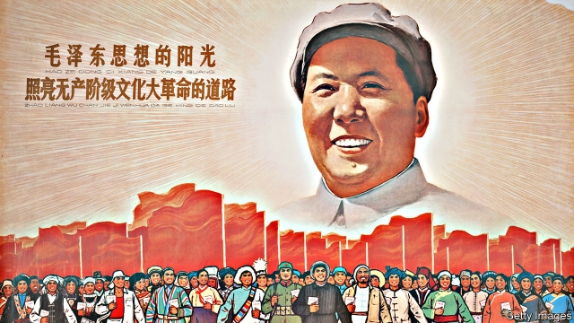

###### The chairman will see you now

# The enduring influence of Mao Zedong 

##### Alone among bloody 20th-century dictators his myth and thinking still resonate 

 

> Mar 28th 2019 

Maoism: A Global History.By Julia Lovell.Bodley Head; 624 pages; £30. To be published in America by Knopf in September; $37.50.  

THE NAMES of the 20th century’s bloodiest dictators are synonymous with evil. Hitler, Pol Pot, Stalin: even to joke about them is in poor taste. Yet one tyrant’s name has a milder impact. Indeed, many still revere him. His face is on almost every banknote in circulation in the world’s second-largest economy. Thousands of people queue up daily to see his embalmed body lying in state in a glass sarcophagus. When Barack Obama was president, a designer in China produced an image blending the despot’s garb with the American’s face and put it on T-shirts. Many people—including Western tourists—bought them for their kitsch appeal. It probably did not occur to them that they were, in effect, equating America’s leader with a figure who caused tens of millions of deaths. 

Mao Zedong was always thus: a despot whose global image was moulded and adapted without regard to the man he really was. It floated free of the horrors he set off—the killings of landlords, the persecutions of intellectuals and the mass starvation that swept the country in the early 1960s. His Little Red Book was as eagerly read by rebellious students on Western campuses as it was by insurgents in the developing world. There was no fashion shame in wearing a Mao suit. No child has been reproached for asking who is the most powerful cat in China. (Chairman Miaow.) 

As Julia Lovell of Birkbeck, University of London, describes in “Maoism: A Global History”, the abstract chairman inspired revolutionaries around the world, from the highlands of Peru to the jungles of Cambodia, from the cafés of Paris to inner-city America. Mao’s ideology, distilled into a few pithy epigrams (“to rebel is justified”, “serve the people” and “bombard the headquarters” is all you need to know), helped foster suffering and mayhem not only in his own country, but around the world. His was the thinking behind Pol Pot and his Cambodian killing fields. It was his personality cult that encouraged an envious Kim Il Sung to push his own to similar heights of absurdity; North Koreans remain in its terrifying thrall today. 

The cult of Mao did not end with the anarchy of the Cultural Revolution in the 1960s and 1970s. It has enjoyed a tenacious afterlife that has not received the attention it deserves. As Ms Lovell argues, the paucity of study of Maoism’s global impact is not only the result of inattention. “It is also a consequence of post-Mao China’s success in communicating a particular narrative of its past,” she writes. Mao’s image continues to be manipulated. It still has a powerful allure in China and elsewhere. 

The origins of the legend owe a surprising amount to an American. Ms Lovell explores the startling role played by Edgar Snow in creating the Mao myth more than a decade before Mao seized power in 1949. Snow was a journalist who managed to enter the remote north-western area where Mao and his followers ended up after their epic Long March to escape the forces of Chiang Kai-shek. The book he wrote about the guerrilla base and his meetings with Mao, “Red Star Over China”, published in 1937, became an international bestseller. 

No other journalist had enjoyed such access. Snow’s description of Mao, then in his early 40s, as an idealist who wanted to save China from Chiang’s corrupt autocracy and build a democratic country mesmerised the world. As Snow put it, Mao’s aim was to awaken the Chinese “to a belief in human rights” and to persuade them “to fight for a life of justice, equality, freedom and human dignity.” What could be objectionable about that? 

Snow’s work, says Ms Lovell, “created Mao as a national and global political personality before there was such a thing in the Chinese Communist Party as Maoism.” A Chinese translation attracted young, well-educated urban Chinese to Mao’s cause. Abroad it became a handbook for anti-Nazi partisans in Russia, for Huk guerrillas in the Philippines and for anti-British revolutionaries in India. It was, says Ms Lovell, a “core text” for thousands of Indians who joined a Maoist insurgency there that still simmers. 

Ms Lovell’s descriptions of these (and other) global strands of Maoism are well-researched and colourful. She concludes her book by examining Mao’s afterlife in China itself. This is where the creed’s importance is most starkly evident. 

After many years during which Mao had become increasingly marginalised in Chinese political culture, China’s current leader, Xi Jinping, is trying to re-establish the late chairman’s authority. He has ordered party members to brush up on Maoist ideology. China’s successes during the recent era of “reform and opening” should not be used to cast aspersions on the preceding one under Mao, he insists. In this way Mr Xi has become a darling of Mao-loving thinkers in China who have long been chafing at the party’s drift towards free-market capitalism. They admire his fondness of a more state-led kind of economy. 

This becomes all the more significant when considering Mr Xi’s foreign policy. Ms Lovell’s book offers a valuable reminder that, under Mao, China wanted to be the leader of a global revolution. Subsequent Chinese leaders tried to downplay that aspect of Maoism—fearful, perhaps, of fuelling Western suspicions of Chinese communism. Mr Xi, however, has made it clear that he wants to make China a central player on the world stage. He says Chinese-style socialism has been “blazing a new trail” for other countries. There are echoes of the past in his words. 

For all that, the analogy is difficult to sustain. Mr Xi is not on a revolutionary mission. He wants to ensure a global safe space for Chinese communism, not convert the world to it. He is no supporter of insurgencies. He is happy to forge friendly relations with non-communist powers if they do not challenge his right to rule. 

At home Mr Xi uses Maoism as a way of enforcing party discipline: mouthing the chairman’s words shows loyalty to the party he helped create. Mr Xi would not wish its members to take Maoist ideology too literally; after all, as Ms Lovell notes, Mao “possessed a genius” for theories that justified inconsistency and contradiction. When “there is great chaos under Heaven, the situation is excellent,” he said. 

Mr Xi does not want Red Guard-type anarchy of the kind unleashed by Mao because he fears the party would not survive it. In many ways he is the antithesis of Mao. He wants stability at any cost. Yet as Ms Lovell’s book advises: “Like a dormant virus, Maoism has demonstrated a tenacious, global talent for latency.” 

-- 

 单词注释:

1.bloody['blʌdi]:a. 血腥的, 嗜杀的, 有血的 

2.dictator['dikteitә]:n. 命令者, 独裁者 

3.myth[miθ]:n. 神话, 虚构的事, 虚构的人 

4.resonate['rezәneit]:v. (使)共鸣, (使)共振 

5.julia['dʒu:ljә]:n. 朱莉娅（女子名） 

6.Knopf[]:n. (Knopf)人名；(德、瑞典、捷)克诺普夫；(英)克诺夫 

7.synonymous[si'nɒnimәs]:a. 同义词的, 同义的 

8.hitler['hitlә]:n. 希特勒（纳粹德国元首） 

9.pol[pɔl]:abbr. 油料（Petroleum, Oil and Lubricants）；北极星导弹（Polaris） 

10.revere[ri'viә]:vt. 崇敬, 敬畏, 尊敬 

11.banknote['bæŋknәut]:n. 钞票 

12.circulation[.sә:kju'leiʃәn]:n. 流通, 循环, 发行量 [化] 环流 

13.embalm[im'bɑ:m]:vt. 以药物防腐, 铭记于心, 使不朽 

14.sarcophagus[sɑ:'kɒfәgәs]:n. 石棺 

15.barack[bɑ:'ræk]:n. 巴拉克（男子名） 

16.obama[]:n. 奥巴马(姓) 

17.designer[di'zainә]:n. 设计者, 谋划者, 制图者 [计] 设计员 

18.garb[gɑ:b]:n. 打扮, 装束 vt. 打扮, 穿衣 

19.kitsch[kitʃ]:n. 粗劣作品；迎合低级趣味的作品 

20.equate[i'kweit]:vt. 使相等, 视为平等 vi. 等同 

21.tens[]:十位 

22.alway['ɔ:lwei]:adv. 永远；总是（等于always） 

23.despot['despɒt]:n. 专制君主, 暴君 [法] 暴君, 专制君主 

24.killing['kiliŋ]:n. 谋杀, 杀戮 a. 杀害的, 疲惫的, 迷人的 

25.persecution[.pә:si'kju:ʃәn]:n. 虐待, 迫害运动, 迫害, 烦扰 [法] 迫害, 虐待, 困扰 

26.eagerly[]:adv. 渴望, 热衷于, 热切 

27.rebellious[ri'beljәs]:a. 造反的, 反抗的 [法] 造反的, 反抗的, 反判的 

28.insurgent[in'sә:dʒәnt]:a. 谋叛的, 起义的, 澎湃的 n. 起义者, 叛乱者 

29.miaow[mi'au]:n. 猫叫声 vi. 猫叫 

30.lovell['lʌvәl]:n. 洛弗尔（男子名） 

31.Birkbeck[]:n. (Birkbeck)人名；(英)伯克贝克；(瑞典)比尔克贝克 

32.highland['hailәnd]:n. 高地, 苏格兰高地 

33.Peru[pә'ru:]:n. 秘鲁 

34.Cambodia[kæm'bәudiә]:n. 柬埔寨 

35.ideology[.aidi'ɒlәdʒi]:n. 思想体系, 意识形态, 观念学, 空论 [医] 观念学, 观念形态 

36.distil[]:vt.vi. 蒸馏, 提取...的精华, 用蒸馏法提取 vi. 滴下, 渗出 

37.pithy['piθi]:a. 有髓的, 由髓组成的, 简洁有力的 

38.epigram['epigræm]:n. 警句, 讽刺短诗 

39.bombard[bɒm'bɑ:d]:vt. 炮击, 攻击, 轰击 n. 射石炮 

40.headquarter[,hed'kwɔ:tә]:vt. 将...的总部设在 

41.foster['fɒstә]:a. 收养的, 养育的 vt. 养育, 抚育, 培养, 鼓励, 抱(希望) 

42.mayhem['meihem]:n. 蓄意的破坏, 故意的伤害罪 [医] 伤残, 残废 

43.cambodian[kæm'bәjdiәn]:n. 柬埔寨人（高棉人）；柬埔寨语 

44.cult[kʌlt]:n. 膜拜, 礼拜式, 祭仪, 一群信徒 [医] 迷信, 巫术 

45.envious['enviәs]:a. 嫉妒的, 羡慕的 

46.kim[]:n. 金姆（人名） 

47.IL[]:[计] 指令表, 中间语言, 解释语言 [医] 钷(61号元素) 

48.absurdity[әb'sә:diti]:n. 荒谬, 悖理, 荒谬的言行 

49.Korean[kә'riәn]:n. 朝鲜人, 朝鲜语 a. 朝鲜人的, 朝鲜语的 

50.thrall[θrɒ:l]:n. 奴隶, 束缚, 奴役 

51.anarchy['ænәki]:n. 无政府状态, 政治混乱 [法] 混乱, 无秩序, 无政府状态 

52.cultural['kʌltʃәrәl]:a. 文化的, 教养的, 修养的 [医] 培养的 

53.tenacious[ti'neiʃәs]:a. 紧握的, 固执的, 不屈不挠的, 黏着力强的 [医] 坚韧的 

54.afterlife['ɑ:ftәlaif]:n. 来世, 下半生 

55.paucity['pɒ:sәti]:n. 少数, 少量, 缺乏 

56.inattention[.inә'tenʃәn]:n. 不注意, 粗心, 疏忽 

57.narrative['nærәtiv]:n. 叙述, 故事 a. 叙述的, 叙事的, 故事体的 

58.manipulate[mә'nipjuleit]:vt. 操纵, 利用, 操作, 巧妙地处理, 假造 

59.allure[ә'luә]:vt. 引诱, 吸引 n. 魅力, 诱惑力 

60.edgar['ed^ә]:n. 埃德加（男子名） 

61.follower['fɒlәuә]:n. 从者, 属下, 追补者 [电] 随动机 

62.epic['epik]:n. 史诗, 叙事诗 a. 史诗的, 叙事诗的 

63.chiang[]:n. 蒋（中国姓氏） 

64.guerrilla[gә'rilә]:n. 游击队 

65.bestseller[]:n. 畅销书 

66.idealist[ai'diәlist]:n. 理想主义者, 唯心主义者 a. 唯心论的, 理想主义的 

67.autocracy[ɒ:'tɒkrәsi]:n. 独裁统治, 独裁统治的国家 [法] 独裁政治, 专制政治, 独裁政府 

68.mesmerise['mezmәraiz, 'mes-]:vt. 对...施催眠术, 使目瞪口呆, 使入迷 

69.awaken[ә'weikәn]:vt. 唤醒, 唤起, 使意识到 vi. 觉醒, 意识到 

70.objectionable[әb'dʒekʃәnәbl]:a. 会引起反对的, 令人讨厌的 

71.Maoism['mauizәm]:毛泽东主义 

72.handbook['hænd,buk]:n. 手册 [计] 手册 

73.partisan['pɑ:tizn]:n. 党羽, 虔诚信徒, 同党, 游击队员 a. 党派的, 偏袒的, 效忠的, 献身的, 盲目推崇的 

74.huk[]:abbr. human urinary kallikrein 人尿血管舒缓素; 人尿激肽释放酶; hunter-killer 协同反潜; 海空联合反潜艇的 

75.Philippine['filipi:n]:a. 菲律宾(群岛)的, 菲律宾人的 

76.Maoist['majist]:n. 毛泽东主义者  a. 毛泽东的,毛(泽东)主义的 

77.insurgency[in'sә:dʒәnsi]:n. 叛乱状态, 发生暴动 [法] 暴动, 起义, 叛乱 

78.simmer['simә]:vt. 煨 vi. 炖, 内心充满 n. 即将沸腾的状态, 即将发作 

79.strand[strænd]:n. (绳索的)股, 绳, 串, 海滨, 河岸 vi. 搁浅 vt. 使搁浅, 使落后, 使陷于困境, 弄断, 搓 

80.colourful['kʌlәful]:a. 颜色丰富的, 鲜艳的, 艳丽的, 多色的, 丰富多彩的, 吸引人的, 引人入胜的 [计] 有色的 

81.starkly[]:adv. 完全, 分明地, 赤裸裸地 

82.marginalise['mɑ:dʒɪnəlaɪz]:v. 使显得微不足道；使处于边缘；使无实权 

83.aspersion[ә'spә:ʃәn]:n. 诽谤, 中伤, 洒水 [医] 喷洒[法] 

84.precede[.pri:'si:d]:vt. 在...之前, 优于, 较...优先 vi. 在前面 

85.thinker['θiŋkә]:n. 思想者, 思想家 

86.chafe[tʃeif]:n. 擦伤, 气恼 v. 摩擦, 擦痛, 激怒 

87.capitalism['kæpitәlizәm]:n. 资本主义 [经] 资本主义 

88.fondness['fɔndnis]:n. 溺爱；爱好 

89.reminder[ri'maindә]:n. 提醒的人, 暗示 [经] 催单 

90.downplay['daunplei]:vt. 不予重视 

91.analogy[ә'nælәdʒi]:n. 相似, 类似 [计] 模拟 

92.supporter[sә'pɒ:tә]:n. 支持者, 后盾, 迫随者, 护身织物 [法] 支持者, 赡养者, 抚养者 

93.forge[fɒ:dʒ]:n. 熔炉, 铁工厂 vt. 打制, 锻造, 伪造 vi. 锻造, 伪造 

94.literally['litәrәli]:adv. 逐字地, 按照字面上地, 不夸张地 

95.inconsistency[.inkәn'sistәnsi]:n. 不一致, 易变, 前后矛盾的事物 [法] 前后矛盾, 不一致 

96.chao[]:n. 钞（货币） 

97.unleash[.ʌn'li:ʃ]:vt. 解开...的皮带, 发出, 发动 

98.antithesis[æn'tiθisis]:n. 对偶, 对照, 对立面 

99.dormant['dɒ:mәnt]:a. 睡眠状态的, 静止的 [医] 休眠的, 不活动的, 休止的 

100.latency['leitnsi]:n. 潜伏, 潜在 [计] 传输时间, 传输延迟时间 

