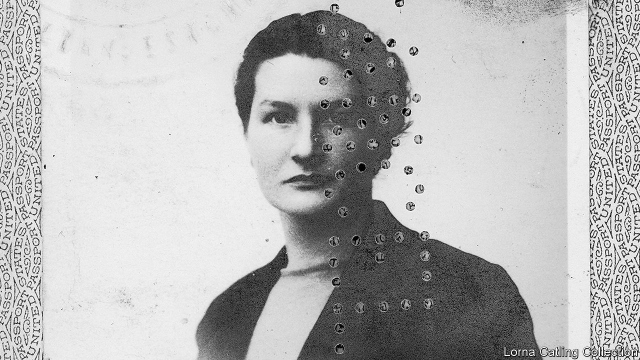

###### The limping lady

# Virginia Hall, the greatest spy you’ve never heard of 

##### A stirring biography of an astonishing, one-legged woman 

 

> Mar 28th 2019 

A Woman of No Importance. By Sonia Purnell.Viking; 368 pages; $28. Virago; £20.  

AS TALES OF wartime derring-do go, it would be hard to beat that of Virginia Hall, a young, one-legged American woman who, in the Gestapo’s view, became the Allies’ most dangerous spy. She did more than anyone else to forge the disparate, rivalrous groups of the French Resistance into effective military units that by 1944 could play a part in liberating their country. As Sonia Purnell shows in her new biography, Hall’s bravery was of the cool, calculating, unflagging kind that is peculiarly required of the special agent operating for years in enemy-occupied territory, in constant danger of betrayal or of making the one wrong false step that would result in exposure, capture, torture and death. 

From the outset, she seemed to have known she was different. Born in Baltimore in 1906 to conventional, upper-middle class parents, she insisted on going to university (Radcliffe College, the bluestocking offshoot from Harvard) and completing her studies in French, German and Italian in Europe. Her ambition to join the State Department was thwarted first by bureaucratic misogyny and then by a hunting accident in Turkey when she was 27, which led to the amputation of her leg and the fitting of a prosthesis she named “Cuthbert”. 

Unbowed and determined to relay the horrors of fascism to readers at home, she became a stringer in Europe for several American newspapers. By the summer of 1940, as German Panzers rolled through France, she had found new work driving wounded soldiers from the collapsing French army to hospitals in Paris. It was then that she had an idea. As the citizen of a neutral country, she could exploit her relative freedom to move around by becoming an undercover agent for Britain’s nascent Special Operations Executive (SOE), which sent her back to France in 1941. 

Although continually patronised and underestimated, Hall quickly adapted to the secret life, basing herself in Lyon, deep in collaborationist Vichy France, and exploiting her cover as a journalist. Her bosses in London soon saw that she had talents they could use. She was an able recruiter of intelligence assets, including a courageous brothel madam, several prostitutes and a VD doctor. At a time when the Resistance barely existed, she found and trained saboteurs and developed escape routes for downed British pilots and brave but bungling agents sent from London. She even organised spectacular jail breaks when colleagues were captured by the Germans or the French police. When other agents were slapdash and guilty of lethal security breaches, she somehow kept the show on the road, even as the personal risks to her intensified. Klaus Barbie, the psychopathic “Butcher of Lyon”, became obsessed with killing the “limping lady”. 

Eventually Hall’s luck ran out. Betrayed by a clever and vile double agent, Abbé Alesch, her network shattered (many of her associates were tortured and sent to death camps), her own cover blown, she escaped from France by crossing the Pyrenees in midwinter on foot, her stump oozing blood as Cuthbert fell apart. Once back in London, Hall resolved to return to France to help prepare the ground for D-Day. When SOE refused to send her back, deeming the risks too high, she persuaded the British outfit’s fledgling American counterpart, the Organisation of Strategic Services (OSS), to take her on. Operating in the Haute-Loire region in the guise of a milkmaid—the Madonna of the Mountains, as Hall was dubbed by her Resistance recruits—she shaped her men into an insurgent force capable of liberating the region with little need of external help. Intelligence provided by Hall on the disposition of the German Seventh Army led the Americans to trap and destroy it in the Falaise Gap, resulting in the decisive breakthrough in the Battle of Normandy. 

After the war, Hall joined the successor of the OSS, the CIA. But despite her unparalleled record of service, she was once again the victim of prejudice and frequently passed over for promotion. Only after her death in 1982, her health almost certainly damaged by the overuse of “uppers” and “downers” in wartime, did she gain the official recognition she deserved. Gina Haspel, the CIA’s first female director, may have been thinking of Hall when she said she stood “on the shoulders of heroines who never sought public acclaim”. There have been other books about Hall, but with her thriller-writer’s style and copious new research, Ms Purnell has written a fitting and moving tribute to an amazing woman. 

-- 

 单词注释:

1.limp[limp]:n. 跛行 a. 柔软的, 无力的, 软弱的 vi. 跛行 

2.Virginia[vә'dʒinjә]:n. 弗吉尼亚 

3.sonia[]:n. 索尼亚（女子名） 

4.virago[vi'rɑ:gәu]:n. 泼妇, 悍妇 

5.wartime['wɒ:taim]:n. 战时 

6.forge[fɒ:dʒ]:n. 熔炉, 铁工厂 vt. 打制, 锻造, 伪造 vi. 锻造, 伪造 

7.disparate['dispәrәt]:a. 根本不同的, 全异的, 不相干的 n. 无法相比的东西(或人) 

8.rivalrous['raivәlrәs]:a. 有竞争性的, 敌对性的 

9.Purnell[]:n. (Purnell)人名；(英)珀内尔 

10.unflagging[.ʌn'flægiŋ]:a. 不衰的, 不屈不挠的, 不松懈的 

11.peculiarly[pi'kju:liәli]:adv. 特别, 尤其, 奇怪地 

12.betrayal[bi'treiәl]:n. 背叛, 辜负 [法] 背叛, 通敌, 背信 

13.Baltimore['bɒ:ltimɒ:]:n. 巴尔的摩 

14.Radcliffe['rædklif]:n. 拉德克利夫（姓氏） 

15.bluestocking['blu:stɒkiŋ]:n. 女学者, 装做有学问的女人 

16.offshoot['ɒ:fʃu:t]:n. 分支, 旁系, 衍生事物 

17.Harvard['hɑ:vәd]:n. 哈佛大学 

18.thwart[θwɒ:t]:a. 横放的 vt. 反对, 阻挠, 横过 prep. 横过 adv. 横过 

19.misogyny[mai'sɒdʒini]:n. 厌恶女人 [医] 厌女症, 厌恶女人 

20.amputation[.æmpju'teiʃәn]:n. 切断, 截肢术 [医] 切断术 

21.prosthesis['prɔsθi:sis]:n. 弥补, 添字首音 

22.Cuthbert['kʌθbәt]:卡斯伯特(姓氏, 男子名) 

23.unbowed[.ʌn'baud]:a. 不弯的, 不屈服的 

24.fascism['fæʃizm]:n. 法西斯主义, 极端国家主义 

25.stringer['striŋә]:n. 纵梁, 楼梯基, 上弦工人, 出售弓弦的人, 制造弓弦的人 

26.panzer['pæntsә]:a. 装甲的 n. 装甲车, 坦克 

27.undercover[.ʌndә'kʌvә]:a. 秘密从事的, 秘密的, 从事间谍活动的 [法] 暗中从事的, 秘密的 

28.nascent['næsnt]:a. 发生中的, 开始存在的, 初期的 [医] 初发的, 初生的 

29.SOE[]:abbr. 事件顺序记录（Sequence Of Event）；特殊行动执行局（Special Operations Executive）；索尼在线娱乐公司（Sony Online Entertainment）；国有企业（state-owned enterprises）；特别行动处（Special Operations Executive） 

30.continually[kәn'tinjuәli]:adv. 不断地, 频繁地 

31.patronise['pætrәnaiz, 'pei-]:vt. 庇护, 资助, 赞助, 保护, 光顾, 惠顾, 对...以恩人自居 

32.underestimate[.ʌndәr'estimeit]:n. 低估 vt. 低估, 看轻 

33.quickly['kwikli]:adv. 很快地 

34.Lyon['laiәn]:n. 里昂 

35.collaborationist[kә.læbә'reiʃәnist]:n. 通敌者 

36.vichy['vi:ʃi:]:n. 维希（法国城市） 

37.recruiter[ri'kru:tә]:n. 招聘人员, 征兵人员 

38.asset['æset]:n. 资产, 有益的东西 

39.courageous[kә'reidʒәs]:a. 勇敢的, 大胆的, 有胆量的 

40.brothel['brɒθәl]:n. 妓院 [法] 妓院 

41.prostitute['prɒstitju:t]:n. 妓女, 男娼 vt. 使沦为妓女 a. 卖淫的, 堕落的 

42.VD[]:性病, 花柳病 

43.saboteur[.sæbә'tә:]:n. 从事破坏活动者, 阴谋破坏者 [法] 破坏者, 破坏份子, 怠工者 

44.bungle['bʌŋgl]:v. 拙劣地工作, 粗制滥造, 把...搞糟 n. 粗劣, 失误, 笨拙 

45.spectacular[spek'tækjulә]:a. 公开展示的, 惊人的, 壮观的 n. 奇观, 惊人之举, 展览物 

46.slapdash['slæpdæʃ]:n. 草率 a. 猛烈的, 粗心的 

47.lethal['li:θәl]:a. 致命的 n. 致死因子 

48.breach[bri:tʃ]:n. 裂口, 违背, 破坏, 违反, 突破, 破裂 vt. 攻破, 突破 vi. 跳出水面 

49.intensify[in'tensifai]:vt. 加强 vi. 强化 

50.klaus[klaus]:n. 克劳斯（男子名） 

51.Barbie[]:n. 芭比（女子名）；芭比娃娃（商标名） 

52.psychopathic[.saikә'pæθik]:a. 精神病的, 精神变态的 n. 精神变态者, 精神病患者 

53.obsess[әb'ses]:vt. 迷住, 使困扰 

54.vile[vail]:a. 恶劣的, 肮脏的, 低廉的, 卑鄙的 [法] 极坏的, 恶劣的, 卑鄙的 

55.shatter['ʃætә]:n. 碎片, 粉碎, 落叶, 喷洒 vt. 打碎, 使散开, 粉碎, 破坏 vi. 粉碎, 损坏, 脱落 

56.Pyrenees[,pirә'ni:z]:比利牛斯山脉[欧洲西南部] 

57.midwinter['mid'wintә]:n. 仲冬, 冬至 

58.stump[stʌmp]:n. 残株, 树桩, 烟蒂, 讲演台 vt. 砍断, 挑战, 难住 vi. 蹒跚而走 

59.ooze[u:z]:n. 渗流, 分泌物 v. 渗出, 泄漏 

60.deem[di:m]:v. 认为, 相信 

61.fledgling['fledʒliŋ]:n. 羽毛初长的雏鸟, 刚会飞的幼鸟, 无经验的人 

62.counterpart['kauntәpɑ:t]:n. 副本, 复本, 配对物, 相应物 [经] 副本, 正副二份中之一 

63.organisation[,ɔ: ^әnaizeiʃən; - ni'z-]:n. 组织, 团体, 体制, 编制 

64.oss[]:abbr. [美]航天科学局（Office of Space Sciences）；[美]战略情报局（Office of Strategic Services） 

65.guise[gaiz]:n. 相似, 外观, 伪装 v. 穿戴, 伪装 

66.Madonna[mә'dɒnә]:n. 圣母玛利亚, 圣母像 

67.dub[dʌb]:vt. 配音, 轻点, 授予称号, 击 n. 一下击鼓声, 笨蛋 

68.insurgent[in'sә:dʒәnt]:a. 谋叛的, 起义的, 澎湃的 n. 起义者, 叛乱者 

69.disposition[.dispә'ziʃәn]:n. 性情, 处置, 处理, 布置 [医] 素因, 性情 

70.falaise[]: [地名] [法国] 法莱斯 

71.decisive[di'saisiv]:a. 决定性的, 坚定的, 果断的 

72.Normandy['nɒ:mәndi]:n. 诺曼底 

73.successor[sәk'sesә]:n. 继承者, 接任者 [计] 后继 

74.CIA[]:中央情报局 [计] 中国互联网络协会 

75.unparalleled[.ʌn'pærәleld]:a. 无比的, 无双的, 空前的 

76.promotion[prәu'mәuʃәn]:n. 晋级, 创建, 增进 [经] 推广, 推销, 促进 

77.overuse[.әuvәr'ju:z]:vt. 使用过度 n. 过度使用, 任意驱使 

78.downer['daunә]:n. 镇定剂, 令人沮丧的人 

79.gina['dʒi:nә]:n. 吉娜（男子名） 

80.haspel[]: [人名] 哈斯佩尔 

81.acclaim[ә'kleim]:n. 喝彩, 欢呼, 赞同 v. 欢呼, 喝彩, 称赞 

82.copious['kәupiәs]:a. 很多的, 丰富的, 内容丰富的 

83.tribute['tribju:t]:n. 贡物, 礼物, 颂辞 

