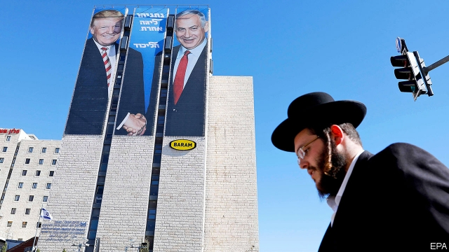
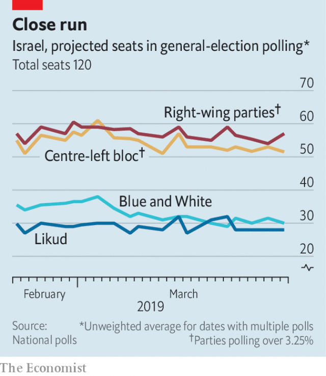
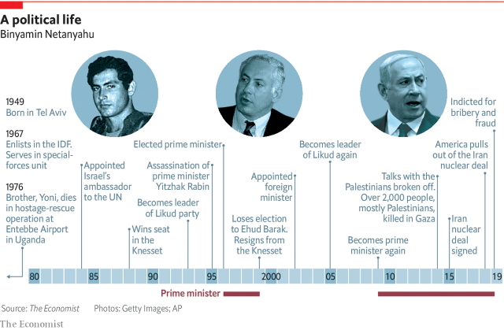

###### Statesman and schemer

# The success of Binyamin Netanyahu’s divisive politics in Israel 

##### When solutions are daunting and unpalatable, why seek them? 

 

> Mar 28th 2019 

THE YOUNG Israeli diplomat was visibly flustered, tie askew, forehead glistening. A senior American official had just chewed him out inside the State Department and he had no idea what to say about it to the reporters clamouring for comment outside. He blinked helplessly into their cameras, struggling for words. 

It is a long time since the world has seen Binyamin Netanyahu as flummoxed as he was in 1982 when, as Israel’s deputy ambassador to Washington, he was called on to explain why his country’s tanks were rolling north through Lebanon. The unease he showed in a recent television interview about a corruption scandal surrounding some German submarines, while palpable, was not on the same scale. 

The difference between the “King Bibi” who has been prime minister of Israel for the past ten years and the callow youth of four decades ago is remarkable. Mr Netanyahu has kept Israel prosperous and safe. He has used its military might without getting sucked into wars; he has improved relations with once hostile neighbours and gained the respect of world leaders. His country looks strong. But to judge him by this statecraft is not to do full justice to the man. The means by which he has won and maintained power matter, too. They have seen Israel become more divided—and, in some ways, weakened. 

After the State Department fiasco Mr Netanyahu drilled himself assiduously on the presentational skills a modern politician benefits so much from mastering. He soon became a fluent fixture on American news shows. When he returned to Israel in 1988 to compete for a seat in the Knesset the press was captivated by his eloquence. His powerful speeches and media expertise contributed to the four election victories which made him prime minister from 1996 to 1999 and from 2009 until today. 

One result of that sojourn in power is that no Israeli diplomat today need worry about humiliation at the hands of a Republican administration. It is hard to imagine a feather sliding between President Donald Trump’s Republicans and Mr Netanyahu and his Likud party. When he arrived in Washington on March 24th for a fleeting visit Mr Netanyahu was treated like royalty. Mr Trump presented him with a princely gift: American recognition of Israel’s annexation of the Golan Heights, seized from Syria in the Arab-Israeli war of 1967. 

One way to read that generosity is as an election fillip. Mr Netanyahu’s hawkish Likud party, which leads a religious and nationalist coalition, is in a tight race with Blue and White, a new party led by Benny Gantz, a former chief of staff of the Israel Defence Forces. The campaign has, like its most recent predecessors, been about Mr Netanyahu himself. Also like its predecessors it is close (see chart), not least because of corruption allegations. 

 

Another reading of Mr Trump’s action, though, is that it is a tribute to a forerunner and kindred spirit. Mr Netanyahu was a trailblazer in his skilful intertwining of ethnic nationalism and anti-establishment populism. He has long branded opponents as threats to Israel’s security and whipped up fears of Arab encroachment. He blames his legal troubles on the liberal elite and leftist media; he is beset by witch-hunts and fake news. 

Mr Netanyahu’s supporters see him as an indispensable statesman who has achieved remarkable things in the world—most notably, in standing up to Iran—while keeping the world’s concerns about Israel’s conflict with the Palestinians at bay. As one Likud supporter, Ronen Sharabi, a teacher from Rosh Ha’ayin in central Israel, puts it: “Netanyahu, with all his experience and all his knowledge…is a leader that Israel can’t afford to give up.” 

His opponents counter that Mr Netanyahu’s politics have put Israel’s future at risk. He has done nothing to solve the country’s fundamental trilemma: that it cannot forever remain in control of the land from the Jordan to the Mediterranean, a majority-Jewish state, and a democracy. Instead Mr Netanyahu reinforces the status quo. He has bottled up trouble in Gaza, where 2m people live under the oppressive Islamists of Hamas. As supposedly temporary occupation becomes permanent conquest, Israel’s rule over the West Bank starts to bear comparison to South African apartheid. When the zealots on whom he depends for power in the Knesset push for annexation of the occupied territories he resists, to some extent. But he makes almost no effort to push back. 

Charges of corruption provide another line of attack. Mr Netanyahu has been indicted for bribery and fraud, pending a hearing, in three investigations. In the first, known as Case 1000, he is accused of accepting expensive gifts from rich patrons (which he admits) in return for political favours (which he denies). The second, Case 2000, hinges on a recording in which he tells a newspaper publisher that he will curb a competitor in exchange for favourable coverage, though the benefit to the publisher never emerged. In the third, Case 4000, he is alleged to have intervened in regulatory decisions on behalf of Bezeq, a telecoms company which owns one of Israel’s largest websites, in return for favourable coverage. 

Then there are the submarines. Mr Netanyahu’s cousin, who has long been his lawyer, and his former chief of staff, among others, have been arrested in an investigation into contracts awarded to ThyssenKrupp, an engineering conglomerate which has supplied submarines both to Israel and, subsequently, Egypt. Mr Netanyahu pushed the armed forces to buy submarines they did not want and approved the sale to Egypt without consulting his defence minister or army chief. His opponents note that he once owned shares in a supplier to ThyssenKrupp and suggest that he may have profited from the deals. Mr Netanyahu’s response to all the charges has been to sow division and stoke mistrust in state institutions. 

Mr Netanyahu’s deep divisiveness is not just a side-effect of a forceful personality and trenchant views. It is a tool—one he has used since his early days as Likud leader in the 1990s. “You are worse than Chamberlain,” he told Yitzhak Rabin, the prime minister, in a speech to the Knesset following the Oslo accords that Mr Rabin’s government had negotiated with the Palestine Liberation Organisation (PLO) in 1993. “He endangered another nation, but you are doing it to your own nation.” As Likud leader, he participated in rallies where placards portrayed Rabin as a Nazi and in the sights of a gun. When the prime minister was assassinated by a Jewish zealot in 1995, his widow, Leah, refused to shake Mr Netanyahu’s hand at the state funeral. “He didn’t say a word when Yitzhak was being called ‘murderer’ and ‘traitor’, and I will not forgive him as long as I live,” she said. 

Sorrow for their fallen leader saw Israelis preferring Shimon Peres, Rabin’s successor as prime minister and leader of the Labour party, over Mr Netanyahu by 20 points in the polls at the beginning of the following year’s election campaign. But a wave of suicide-bombings, for which Hamas was largely responsible, changed the mood of the electorate. Mr Netanyahu put out campaign ads showing Peres shaking hands with Yasser Arafat, chairman of the PLO; he accused him, without evidence, of wanting to divide Jerusalem. He won the election by less than a percentage point. 

 

It was in the following election, that of 1999, that Mr Netanyahu fully embraced the tactics that have come to define his brand of politics. Voters from conservative religious and working-class backgrounds, Russian-speaking immigrants and Mizrahi Jews (who are descended from immigrants from the Arab world) had been supporters of Likud since its founding. But whereas the party’s earlier leaders, including its founder, Menachem Begin, appealed to these groups on the grounds of national unity, Mr Netanyahu stoked their resentments. Having been forced to hold the election by a vote of no confidence he portrayed himself, like them, as a victim of the establishment. “The rich, the artists ...these elites. They hate everyone. They hate the people,” he told his supporters. “They hate the Mizrahis, they hate the Russians, hate anyone who is not them.” He accused the media of conspiring with the left to bring him down and urged crowds to chant: “They. Are. Afraid.” 

On that occasion, whatever fears “they” may have had proved groundless. Mr Netanyahu lost by 12 percentage points and left the Knesset. He returned to government a few years later, soon becoming finance minister. The bloated public sector was acting like a fat man riding on the back of a thin man, the private sector, he said, and embarked on radical reforms. He froze public spending, cut red tape and slashed taxes. State assets, including the national airline, El Al, were privatised. Soon thereafter unemployment fell and GDP per head rose. Israel’s technology sector became the envy of almost all who behold it. 

When it came to the 2009 elections Mr Netanyahu, again Likud’s leader, followed the same tactics as he had a decade earlier. This time, as in every subsequent election, they worked. Likud did not win a majority—no Israeli party ever does—but Mr Netanyahu became prime minister with the support of other smaller parties. Thus, although most Israelis support moves that would reduce the role of religion in public life, such as allowing buses to run on Shabbat and permitting civil marriage, they will not see such change as long as Mr Netanyahu needs the support of the ultra-Orthodox minority which will have none of it. 

Despite the fact that prime ministers from Likud have led Israel for 30 of the past 41 years, Mr Netanyahu continues to stoke resentment of the so-called establishment. The press is his favourite target. When he lost power in 1999 he blamed reporters for downplaying his accomplishments and accentuating his failures. “I need my own media,” he told his financial backers, exhorting them to purchase news organisations. In 2007 Sheldon Adelson, an American casino mogul who is one of the Republican Party’s biggest donors, founded a freesheet called Israel Hayom, which is now Israel’s most popular paper. Its coverage of the prime minister is reliably glowing; Avigdor Lieberman, Mr Netanyahu’s defence minister until late last year, has compared it to Pravda. 

Meanwhile the non-lickspittle press sees photos of its journalists on Likud campaign posters beneath the slogan, “They Won’t Decide!” This is in return for the media’s work breaking a number of the corruption stories that the police and judiciary are following up. Those investigators also come in for stick from Mr Netanyahu, despite the fact that he appointed the people responsible for the investigations, the attorney-general and a former police chief. 

In the current campaign Mr Netanyahu has crossed new lines. He has helped broker an electoral pact between Jewish Home, a religious party, and Jewish Power, a far-right outfit. Until recently Likud felt that Jewish Power’s racist policies put it beyond the pale. But it would not, on its own, receive more than 3.25% of the vote, the threshold needed to take seats in the Knesset. The pact aims to make sure that votes for Jewish Power help Likud’s coalition. 

All of this has taken a toll on the state, Mr Netanyahu’s critics say. “There is no question that when you look at the strength and health of Israeli democracy, it looks a lot shakier now than it did five years ago,” says Michael Koplow of Israel Policy Forum, a think-tank in Washington. 

The division is not simply political. The wealth generated by the economic reforms of the 2000s does not impress those who see the country marred by inequality, low productivity and, owing to a lack of state investment, poor infrastructure. Israel has the busiest highways in the OECD, with more than three times as much traffic as the average. The main wards of Israeli hospitals have just 1.8 beds per 1,000 people, well below the rich-country mean. It has the highest level of poverty and peculiarly onerous tax procedures for businesses. 

Despite this, Likud did not even bother to draft an economic platform before the election. It says its record speaks for itself. When asked about the problem of sky-high house prices in the 2015 campaign, Mr Netanyahu contrived to avoid an answer by steering the conversation to the threat that was posed by Iran. 

A neat trick; also a telling one. Iran is Mr Netanyahu’s obsession. In his speech to the UN general assembly last September he mentioned the country nearly 60 times. “Israel will do whatever it must do to defend itself against Iran’s aggression,” he said. He was a vehement opponent of the deal that Iran negotiated with the permanent members of the UN Security Council and the EU, which saw it curb its nuclear ambitions and open its programme up to inspections in return for sanctions relief. Last year he was overjoyed at Mr Trump’s decision to pull America out of the agreement. Neither leader offered any alternative. Pundits took to calling Mr Netanyahu’s strategy “anti-solutionism”. 

Mr Netanyahu treats the problem of the Palestinians in much the same anti-solutionist way. He has sought to convince Israelis that the conflict can be managed, if the right people are put in charge of managing it, and thus needs not be solved. The last peace talks collapsed in 2014. Though a wave of stabbing attacks in 2015 and 2016 killed dozens of people, it was a far cry from the suicide-bombings of the second intifada of the early 2000s. Missile attacks from Gaza are a chronic, if intermittent, incitement. But more intense violence, which flares up every few years, is soon quelled. Mr Trump’s peace plan, which he calls “the deal of the century”, will be dead on arrival, should it ever arrive. The percentage of Israelis favouring talks with the Palestinians has dropped from over 70% to closer to 50% over the past decade. Among Mr Netanyahu’s supporters it is 30%. 

These positions on Iran and the occupied territories have the merit of being politically effective, in that his adversaries have not found it possible to counter them. Take the Iran deal. Generals, retired spy chiefs, a former head of the nuclear agency: all said that, although it was flawed, it served Israel’s interests. But Mr Netanyahu’s political rivals dared not criticise his opposition to it. “There’s no daylight” between us, declared Isaac Herzog, then the opposition leader, in 2015. During that campaign Mr Herzog preferred discussing solar panels and mortgages to dwelling on Israel’s continued rule over 4.5m Palestinians. Mr Gantz has been similarly mute this time round. Mr Netanyahu faces no true ideological opposition; just a succession of vaguely centrist parties defined by little more than the personalities of their leaders and their dislike of him. 

It is true that even a well-intentioned Israeli leader could not hold meaningful talks with either Hamas in Gaza or Mahmoud Abbas, president of the Palestinian Authority (PA) in the West Bank. Mr Abbas, who ran out of legitimacy years ago, is obsessed with preserving his endless rule and more enthusiastic about putting sanctions on Hamas than trying to end the occupation. But Mr Netanyahu has not just avoided negotiations. He has worked to deepen the split between the West Bank and Gaza and to convince Israelis that no deal is possible and no efforts towards it advisable. 

The army has recommended easing the blockade of Gaza to prevent another war, and even hawkish members of Mr Netanyahu’s coalition agree. Yet the embargo persists. In February, again against security officials’ advice, the government decided to withhold 500m shekels ($138m) in taxes it collects on behalf of the Palestinians as a way of punishing the PA for making welfare payments to the families of jailed militants. It was, it seems, a useful campaign-season flourish. 

Happy to do short-term damage, Mr Netanyahu refuses to confront the long-term issue that a territory with an Arab majority cannot be a Jewish democracy. Though he is notionally committed to a two-state solution (which his party is not) it is not a notion to be seriously entertained. Temperamentally conservative, wary of change, he governs as if Israel needs no change. The economy is fine for the well off, even if it does not feel that way for millions of people. The religious status quo remains in place, despite public opinion. Because the Palestinian issue cannot be solved, “we will forever live by the sword,” as he said in 2015. 

Israel and its circumstances are unique. But inequality, reactionary nationalism and mistrust of democratic institutions are problems shared across the developed world. Mr Netanyahu’s long rule shows that, in some circumstances, they can feed off each other in a way that persists. Things wear down, but they do not break. After a decade of King Bibi, Israeli politics feels tired and uninspired, an unhealthy democracy where nothing is debated other than who should lead. 

-- 

 单词注释:

1.schemer['ski:mә]:n. 计划者, 阴谋家 [法] 阴谋家, 计划人, 设计人 

2.binyamin[]:本雅明 

3.divisive[di'vaisiv]:a. 区分的, 制造分裂的, 造成不和的 

4.politic['pɒlitik]:a. 精明的, 明智的, 策略的 

5.Israel['izreil]:n. 以色列, 以色列后裔, 犹太人 

6.daunt[dɒ:nt]:vt. 威吓, 难倒, 使气馁 

7.unpalatable[.ʌn'pælәtәbl]:a. 不可口的, 味道差的, 不好吃的 

8.Israeli[iz'reili]:a. 以色列的, 以色列人(语)的 n. 以色列人 

9.diplomat['diplәmæt]:n. 外交官, 有外交手腕的人 [法] 外交家, 外交官, 有权谋的人 

10.visibly['vizәbli]:adv. 看得见地, 明显地, 明白地 

11.fluster['flʌstә]:n. 慌乱, 激动, 紧张不安 vt. 使紧张, 使慌张, 使激动 vi. 慌乱 

12.askew[ә'skju:]:a. 歪斜的 adv. 歪斜地 

13.glisten['glisn]:vi. 闪亮, 辉耀 n. 闪光, 闪耀 

14.clamour['klæmә]:n. 喧闹 v. 大声地要求 

15.blink[bliŋk]:vi. 眨眼, 闪亮 vt. 眨眼, 使闪亮 n. 眨眼, 瞬间, 闪光, 闪烁 [计] 闪烁 

16.helplessly[]:adv. 无能为力地；无助地 

17.Netanyahu[]:n. 内塔尼亚胡（人名） 

18.flummox['flʌmәks]:vt. 使狼狈, 使失措, 使混乱, 挫败 n. 失败 

19.Washington['wɒʃiŋtn]:n. 华盛顿 

20.Lebanon['lebәnәn]:n. 黎巴嫩 

21.unease[.ʌn'i:z]:n. 不安 

22.corruption[kә'rʌpʃәn]:n. 腐败, 堕落, 贪污 [计] 论误 

23.palpable['pælpәbl]:a. 可感知的, 明显的, 触摸得到的 [医] 可触知的 

24.bibi[]:n. 周笔畅 

25.callow['kælәu]:a. 年轻而无经验的, (鸟)羽毛未丰的 [机] 无羽毛的 

26.statecraft['steitkræft]:n. 治国才能 

27.fiasco[fi'æskәu]:n. 惨败, 大失败 

28.assiduously[ə'sidʒuəsli]:adv. 刻苦地；勤勉地 

29.presentational[,prezən'teiʃənәl,,pri:-]:a. 表象的, 上演的, 演出的, 本身有意义的, 描述性的 

30.fixture['fikstʃә]:n. 固定(状态), 固定物, 设备 [计] 夹具 

31.Knesset['kneset]:n. (以色列)议会 

32.captivate['kæptiveit]:vt. 迷住, 迷惑 

33.eloquence['elәkwәns]:n. 口才, 雄辩术, 雄辩 [法] 善辩, 口才 

34.expertise[.ekspә:'ti:z]:n. 专家意见, 专门技术 [法] 专门知识, 专家意见 

35.sojourn['sɒdʒә:n]:n. 逗留, 旅居 vi. 逗留, 旅居 

36.humiliation[hju:.mili'eiʃәn]:n. 耻辱, 丢脸, 谦卑 

37.Likud[li:'ku:d]:n. 利库德集团(以色列右翼党派的政治联盟,长期为以色列执政党) 

38.royalty['rɒiәlti]:n. 皇室, 王族成员, 王权, 特权阶层, 庄严 [经] 特许权, 使用费, 使用税 

39.princely['prinsli]:a. 王子的, 威严的, 王候般的, 豪华的, 奢侈的 

40.annexation[ænek'seiʃәn]:n. 合并, 附加, 附加物 [法] 兼并, 侵吞, 附加物 

41.golan['^әj'lɑ:n]:Heights戈兰高地[叙利亚西南部](1967年被以色列占领) 

42.Syria['siriә]:n. 叙利亚 [经] 叙利亚 

43.generosity[.dʒenә'rɒsiti]:n. 慷慨, 宽大 

44.fillip['filip]:n. 弹指, 刺激 vt. 用指弹, 刺激 

45.hawkish['hɒ:kiʃ]:a. 像鹰的, 鹰派的, 强硬派的 

46.nationalist['næʃәnәlist]:n. 国家主义者, 民族主义者 

47.coalition[.kәuә'liʃәn]:n. 结合体, 结合, 联合 [经] 联合, 联盟 

48.benny['beni]:n. 安非他明(药片) 

49.gantz[]: [人名] 甘茨; [电影]杀戮都市/杀戮都市 

50.predecessor[.predi'sesә]:n. 前任, 先辈, 前身 [医] 初牙, 前辈, 祖先 

51.allegation[.æli'geiʃәn]:n. 断言, 主张, 申辩 [法] 声明, 事实陈述, 断言 

52.tribute['tribju:t]:n. 贡物, 礼物, 颂辞 

53.forerunner[fɒ:'rʌnә]:n. 先驱, 前兆 

54.kindred['kindrid]:n. 家族, 相似, 亲戚关系 a. 同族的, 同类的, 血缘的 

55.trailblazer['treil.bleizә]:n. 开路的人, 开拓者 

56.skilful['skilful]:a. 灵巧的, 熟练的, 制作精巧的 

57.intertwine[.intә'twain]:v. (使)纠缠, (使)缠绕 

58.ethnic['eθnik]:a. 人种的, 种族的 [医] 人种的 

59.nationalism['næʃәnәlizm]:n. 民族主义, 民族特性 

60.Populism['pɒpjulizm]:n. 平民主义, 民粹主义 

61.encroachment[in'krәutʃmәnt]:n. 侵蚀, 侵犯 [法] 侵犯, 侵占, 侵入 

62.elite[ei'li:t]:n. 精华, 精锐, 中坚分子 

63.leftist['leftist]:n. 左翼的人, 左派 a. 左派的 

64.beset[bi'set]:vt. 围绕, 使苦恼, 镶嵌 

65.fake[feik]:n. 假货, 欺骗, 诡计 a. 假的 vt. 假造, 仿造 vi. 伪装 

66.supporter[sә'pɒ:tә]:n. 支持者, 后盾, 迫随者, 护身织物 [法] 支持者, 赡养者, 抚养者 

67.notably['nәjtbәli]:adv. 显著地, 著名地, 尤其, 特别 

68.Palestinian[,pælis'tiniәn]:[经] 巴勒斯坦的 

69.ronen[]:[网络] 罗恩；罗能；吐个舌头给你看 

70.rosh[]:[网络] 冰火战歌；罗施；快干墨水 

71.cannot['kænɒt]:aux. 无法, 不能 

72.jordan['dʒɒ:dәn]:n. 约旦, 约旦河, 尿壶 

73.statu[]:[网络] 状态查看；雕像；特级雪花白 

74.quo[]:vt. [古]说 

75.gaza['^ɑ:zә]:n. 加沙（地中海岸港市） 

76.oppressive[ә'presiv]:a. 压制性的, 压迫的, 沉重的 

77.Islamist[iz'lɑ:mist]:n. 伊斯兰教主义者；回教教徒 

78.Hama['hæmә]:哈马[叙利亚西部城市] 

79.supposedly[sә'pәuzidli]:adv. 想象上, 看上去像, 被认为是, 恐怕, 按照推测 

80.apartheid[ә'pɑ:theit]:n. 种族隔离 

81.zealot['zelәt]:n. 热心者, 狂热者, 犹太教狂热信徒 [法] 狂热分子, 激烈分子 

82.indict[in'dait]:vt. 起诉, 控告, 指控 [法] 控告, 揭发, 对...起诉 

83.bribery['braibәri]:n. 贿赂行为, 行贿, 受贿 [经] 行贿, 受贿 

84.fraud[frɒ:d]:n. 欺骗, 欺诈, 诡计, 骗子 [经] 欺诈, 舞弊, 骗子 

85.pending['pendiŋ]:a. 未决定的, 待决的, 行将发生的, 向外伸出的 prep. 在等待...之际, 直到...时为止, 在...期间, 在...过程中 

86.patron['peitrәn]:n. 赞助人, 顾客, 保护人 [法] 保护人, 庇护人, 赞助人 

87.hinge[hindʒ]:n. 铰链, 关键, 枢纽 vt. 装铰链 vi. 靠铰链移动, 依...而转移 

88.publisher['pʌbliʃә]:n. 出版者, 发行人 [法] 发行人, 出版者, 报刊发行者 

89.curb[kә:b]:n. 抑制, 勒马绳, 边石 vt. 抑制, 束缚, 勒住 

90.coverage['kʌvәridʒ]:n. 覆盖的范围, 保险总额, 新闻报导 [化] 可达范围; 覆盖度 

91.allege[ә'ledʒ]:vt. 宣称, 主张, 提出, 断言 [法] 断言, 指称, 指证 

92.intervene[.intә'vi:n]:vi. 插入, 调停, 干涉 [经] 进场干预 

93.regulatory['regjulәtәri]:a. 受控制的, 统制的, 调整的 [经] 规则的 

94.telecom['telәkɔm]:telecommunication 电信 

95.ThyssenKrupp[]:[网络] 蒂森克虏伯；蒂森克虏伯集团；德国蒂森克虏伯 

96.conglomerate[kәn'glɒmәrit]:a. 聚成球形的, 砾岩性的 n. 集成物, 混合体, 砾岩 v. (使)凝聚成团 

97.subsequently['sʌbsikwәntli]:adv. 后来, 随后 

98.Egypt['i:dʒipt]:n. 埃及 

99.supplier[sә'plaiә]:n. 供应者, 供给国, 供应商 [化] 承制厂; 供应厂商 

100.stoke[stәuk]:v. 司炉, (使)大吃 

101.mistrust[.mis'trʌst]:n. 不信任, 疑惑 v. 不信任, 疑惑 

102.divisiveness[di'vaisivnis]:n. 引起分歧, 导致分裂 

103.forceful['fɒ:sful]:a. 有力的, 强烈的, 有说服力的 

104.trenchant['trentʃәnt]:a. 锐利的, 尖锐的, 有力的, 鲜明的, 清晰的 

105.chamberlain['tʃeimbәlin]:n. 内侍, 管家, 掌管财物的人 [法] 管家, 国王侍从, 收款员 

106.Yitzhak[]:n. (Yitzhak)人名；(以)伊扎克 

107.Rabin[]:n. 拉宾（希伯来姓氏） 

108.Oslo['ɒzlәu]:n. 奥斯陆 

109.Palestine['pælәstain]:n. 巴勒斯坦 

110.organisation[,ɔ: ^әnaizeiʃən; - ni'z-]:n. 组织, 团体, 体制, 编制 

111.PLO[]:abbr. 巴勒斯坦解放组织（Palestine Liberation Organization） 

112.endanger[in'deindʒә]:vt. 危及 [法] 使危险, 危及 

113.rally['ræli]:n. 重振旗鼓, 集合, 群众集会, 跌停回升 v. 重整旗鼓, 集合, 恢复精神, 团结, 挖苦, 嘲笑 

114.placard['plækɑ:d]:n. 公告, 布告, 小牌, 海报 vt. 公布, 布告, 张帖, 贴海报于 

115.portray[pɒ:'trei]:vt. 描绘, 描写, 描绘...的肖像 

116.Nazi['nɑ:tsi]:n. 纳粹党人 a. 纳粹党的 

117.assassinate[ә'sæsineit]:vt. 暗杀, 行刺 [法] 暗杀, 行刺, 中伤 

118.Leah[liә]:n. 利亚(<<圣经>>故事人物) 

119.Israeli[iz'reili]:a. 以色列的, 以色列人(语)的 n. 以色列人 

120.Shimon[]:n. (Shimon)人名；(日)施门(名)；(塞、以)希蒙 

121.pere[]:n. （西）父亲 

122.successor[sәk'sesә]:n. 继承者, 接任者 [计] 后继 

123.electorate[i'lektәrit]:n. 选民, 有选举权者, 选区 [法] 选民, 选举团, 选区 

124.Yasser[]:n. (Yasser)人名；(阿拉伯)亚西尔 

125.Arafat[]:阿拉法特（人名） 

126.Jerusalem[dʒә'ru:sәlәm]:n. 耶路撒冷 

127.les[lei]:abbr. 发射脱离系统（Launch Escape System） 

128.fully['fuli]:adv. 十分地, 完全地, 充分地 

129.tactic['tæktik]:n. 一项战术, 一条策略 a. 战术的, 顺序的, 排列的 

130.voter['vәutә]:n. 选民, 投票人 [法] 选民, 选举人, 投票人 

131.mizrahi[]: [人名] 米兹拉希 

132.Jew[dʒu:]:n. 犹太人, 守财奴, 犹太教信徒 vt. 欺骗, 杀价 

133.founder['faundә]:n. 创立者, 建立者 vt. 使沉没, 使摔倒, 弄跛, 浸水, 破坏 vi. 沉没, 摔到, 变跛, 倒塌, 失败 

134.menachem[]:n. (Menachem)人名；(以)梅纳赫姆；(罗)梅纳凯姆 

135.resentment[ri'zentmәnt]:n. 怨恨, 愤恨 

136.mizrahi[]: [人名] 米兹拉希 

137.conspire[kәn'spaiә]:vi. 阴谋, 协力, 共谋 vt. 图谋 

138.groundless['^aundlis]:a. 无根据的, 无理由的 [法] 无根据的, 无理由的 

139.bloat[blәut]:vt. 使膨胀, 腌制, 使自大 vi. 膨胀, 肿起 n. 肿胀病人 

140.sector['sektә]:n. 扇形, 部门, 部分, 函数尺, 象限仪, 段, 区段 vt. 把...分成扇形 [计] 扇面; 扇区; 段; 区段 

141.embark[im'bɑ:k]:vi. 乘船, 着手, 从事, 上飞机 vt. 使上船, 使上飞机, 使从事 

142.slash[slæʃ]:v. 猛砍, 乱砍 n. 猛砍, 乱砍, 删减 [计] 斜线 

143.asset['æset]:n. 资产, 有益的东西 

144.el[el]:abbr. 预期损失（Expected Loss） 

145.AL[]:[计] 算法语言, 字母, 汇编语言 [医] 铝(13号元素) 

146.privatise[p'rɪvətɪs]:vt. 使私有化 

147.thereafter[.ðєәr'æftә]:adv. 其后, 从那时以后 

148.behold[bi'hәuld]:vt. 看到, 注视 vi. 看 

149.shabbat[ʃə'bɑ:t; 'ʃɑ:; 'ʃɑ:bəs]:n. （犹太教）安息日（等于Shabbos, Shabbas） 

150.downplay['daunplei]:vt. 不予重视 

151.accomplishment[ә'kʌmpliʃmәnt]:n. 成就, 完成 

152.accentuate[æk'sentjueit]:vt. 以重音念, 强调, 重读 

153.backer['bækә]:n. 援助者, 支持者 [经] 背书人, 支持人 

154.exhort[ig'zɒ:t]:v. 劝诫, 忠告 

155.organisation[,ɔ: ^әnaizeiʃən; - ni'z-]:n. 组织, 团体, 体制, 编制 

156.sheldon['ʃeldәn]:n. 谢尔登（男子名） 

157.adelson[]:[网络] 主席阿德尔森；拉斯维加斯金沙集团艾德森；金沙集团董事长阿德尔森 

158.casino[kә'si:nәu]:n. 卡西诺赌场, 卡西诺牌戏 

159.mogul[mәu'^ʌl, 'mәu^ʌl]:n. 大人物, 有权势的人 

160.donor['dәunә]:n. 捐赠人 [化] 给体; 供体 

161.freesheet['fri:ʃi:t]:n. (以广告收入支付开支的)免费报纸,赠阅报纸 

162.HaYom[]:[网络] 今天 

163.reliably[ri'laiәbli]:adv. 可靠地, 可信赖地 

164.avigdor[]:n. (Avigdor)人名；(法)阿维格多尔；(英、以)阿维格多 

165.Lieberman[]:利伯曼（人名） 

166.Pravda['prɑ:vdә]:n. 真理报 

167.judiciary[dʒu:'diʃiәri]:a. 司法的, 法院的, 法官的 n. 司法部, 司法系统, 法官 

168.investigator[in'vestigeitә]:n. 调查者, 审查者 [法] 审查员, 侦查员, 调查员 

169.broker['brәukә]:n. 掮客, 经纪人 [经] 经纪人, 掮客 

170.electoral[i'lektәrәl]:a. 选举人的, 选举的, (有关)选举的 [法] 选举的, 选举人的, 由选举人组成的 

171.pact[pækt]:n. 契约, 协定, 条约 [化] 合同 

172.outfit['autfit]:n. 用具, 配备, 机构 vt. 配备, 供应 vi. 得到装备 

173.racist['reisist]:n. 种族主义者 [法] 种族主义的, 种族歧视 

174.threshold['θreʃәuld]:n. 门槛, 入口, 开端, 阈 [计] 阈; 阈值 

175.toll[tәul]:n. 通行费, 代价, 钟声 vt. 征收, 敲钟, 鸣钟, 勾引, 引诱 vi. 征税, 鸣钟 

176.shaky['ʃeiki]:a. 震动的, 摇晃的, 动摇的 

177.michael['maikl]:n. 迈克尔（男子名） 

178.forum['fɒ:rәm]:n. 论坛, 公开讨论的广场, 法庭, 讨论会 [法] 讨论会, 专题讨论, 公共论坛 

179.mar[mɑ:]:vt. 损毁, 损伤, 糟蹋 n. 三月 

180.inequality[.ini'kwɒliti]:n. 不平等, 不同, 不平坦, 不平均 n. 不平等, 不等式 [计] 不等式 

181.productivity[.prәudʌk'tiviti]:n. 生产力 [经] 生产率, 生产能力 

182.infrastructure['infrәstrʌktʃә]:n. 基础结构, 基础设施 [经] 基础设施 

183.Oecd[]:[经] 已开发国家组织 

184.peculiarly[pi'kju:liәli]:adv. 特别, 尤其, 奇怪地 

185.onerous['ɒnәrәs]:a. 繁重的, 负有法律责任的 [法] 负有义务的, 艰巨的, 繁重的 

186.bother['bɒðә]:vt. 烦扰, 迷惑 vi. 烦恼, 操心 n. 麻烦, 纠纷, 讨厌的人 

187.contrive[kәn'traiv]:v. 发明, 设计, 图谋 

188.Iran[i'rɑ:n]:n. 伊朗 

189.obsession[әb'seʃәn]:n. 困扰, 困扰人的情绪 [医] 强迫观念 

190.UN[ʌn]:pron. 家伙, 东西 [经] 联合国 

191.vehement['vi:imәnt]:a. 热烈的, 激烈的 

192.EU[]:[化] 富集铀; 浓缩铀 [医] 铕(63号元素) 

193.sanction['sæŋkʃәn]:n. 核准, 制裁, 处罚, 约束力 vt. 制定制裁规则, 认可, 核准, 同意 

194.overjoy[.әuvә'dʒɒi]:vt. 使大喜 

195.pundit['pʌndit]:n. 学者, 梵文学者, 博学的印度人, 权威 

196.intifada['ɪntɪfeɪdə]:n. (1987年底爆发的)以色列占领区的巴勒斯坦人暴动 

197.chronic['krɒnik]:a. 慢性的, 习惯性的 n. 慢性病患者 

198.intermittent[.intә'mitәnt]:a. 间歇的, 断断续续的 [化] 间歇的; 间断的 

199.incitement[in'saitmәnt]:[法] 煽动, 刺激, 怂恿犯罪 

200.quell[kwel]:vt. 压制, 平息, 减轻 

201.politically[]:adv. 政治上 

202.adversary['ædvәsәri]:n. 敌手, 对手 a. 敌手的, 敌对的 

203.flaw[flɒ:]:n. 缺点, 裂纹, 瑕疵, 一阵狂风 [化] 划痕; 裂缝; 裂纹 

204.criticise['kritisaiz]:v. 批评, 吹毛求疵, 非难 

205.opposition[.ɒpә'ziʃәn]:n. 反对, 敌对, 相反, 在野党 [医] 对生, 对向, 反抗, 反对症 

206.isaac['aizәk]:n. 艾萨克（男人名）；以撒（希伯来族长, 犹太人的始祖亚伯拉罕和萨拉的儿子） 

207.Herzog[]:赫尔佐克（人名） 

208.mortgage['mɒ:gidʒ]:n. 抵押, 约束性义务, 抵押借款 vt. 抵押, 以...作担保, 把...许给 

209.ideological[.aidiә'lɒdʒikәl]:a. 意识形态的, 空想的 [法] 思想的, 思想上的, 意识形态的 

210.vaguely['veigli]:adv. 含糊地, 暧昧地 

211.centrist['sentrist]:n. 中间党派的成员, 温和主义者 [法] 中间派议员, 中立派议员 

212.meaningful['mi:niŋful]:a. 意味深长的 

213.Mahmoud[]:穆罕默德（伊斯兰男名） 

214.Abba['æbә]:n. 阿爸父(耶稣对上帝的尊称) 

215.Palestinian[,pælis'tiniәn]:[经] 巴勒斯坦的 

216.PA[pɑ:]:私人秘书, (露天)扩音系统 [计] 程序存取, 程序地址, 程序分析 

217.legitimacy[li'dʒitimәsi]:n. 合法, 正统, 正当 [法] 合法性, 正统性, 婚生 

218.obsess[әb'ses]:vt. 迷住, 使困扰 

219.negotiation[ni.gәuʃi'eiʃәn]:n. 谈判, 磋商, 交涉 [经] 谈判, 协商 

220.blockade[blɒ'keid]:n. 阻塞 vt. 封锁 

221.embargo[im'bɑ:gәu]:n. 封港令, 禁运 vt. 禁止出入港口, 禁运 

222.withhold[wið'hәuld]:vt. 使停止, 扣留, 保留, 拒给 vi. 克制, 忍住 

223.shekel['ʃekl]:n. 钱, 财富, 硬币 [经] 以色列币 

224.militant['militәnt]:a. 好战的 

225.confront[kәn'frʌnt]:vt. 使面对, 对抗, 遭遇, 使对质, 比较 [法] 对证, 使对质, 比较 

226.notionally['nəuʃənəli]:adv. 想象地 

227.temperamentally[ˌtemprə'mentəlɪ]:adv. 在气质上; 易兴奋地, 神经质地 

228.wary['wєәri]:a. 谨慎的, 小心的, 机警的, 周到的, 唯恐的 

229.reactionary[ri'ækʃәnәri]:n. 反动分子 a. 反动的, 反动主义的, 反对改革的 

230.uninspired[.ʌnin'spaiәd]:a. 未受灵感启迪的, 无灵感的, 缺乏创见的 

