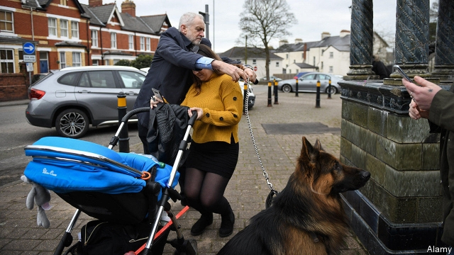

###### Brexit and a by-election

# At a forthcoming by-election, voters don’t care about Brexit 

##### Canvassers discover there is no Brexit dividend for Labour or the Tories 

 

> Mar 28th 2019 

BRITONS TIRED of Brexit could do worse than head to Newport. A flick through the pamphlets of the two leading candidates in the Welsh city’s by-election, which is set for April 4th, provides a break from the endless talk about Britain leaving the EU. Labour’s candidate, Ruth Jones, makes no mention of it, instead promising more police on Newport’s mean streets. Matthew Evans, the Conservative challenger, has sidelined Brexit in favour of a simpler main message to voters in the traffic-clogged city: “Build the M4 relief road now.” 

Knocking on a few doors on a street of plush houses explains why both candidates avoid the B-word. For each voter delighted by Britain’s impending departure from the EU, another despairs. After a short soliloquy extolling the virtues of Margaret Thatcher, one self-declared lifelong Conservative voter says he does not know whether he can back the party again. “My party has ripped apart our ability to trade in the world,” he moans. Others on the road have the opposite complaint: why have we not gone yet? 

When it comes to Brexit, the seat of Newport West is bang on the national average. Across the country, the median constituency result was a 53.6% Leave victory. In Newport West, 53.7% voted out. Therein lies the problem for candidates both in Newport and beyond: for every voter potentially won over by a firm line on Brexit, another is likely to be repelled. For an MP in the most typical seats—slightly Leave or mildly Remain, rather than overwhelmingly either—the great political issue of the moment is something best ignored. 

It adds to the impression that the Newport contest is taking place in a vacuum, sealed off from national politics. It is not just Brexit that goes unmentioned. Neither party leader features prominently. Jeremy Corbyn dropped by on March 22nd for the funeral of Paul Flynn, the Labour MP who died last month aged 84, having held the seat since 1987. Mr Corbyn stayed long enough only to star in an accidental photo opportunity with an Alsatian. “I respect him,” is all Ms Jones will say about her party leader. (She opted for endorsements from a local resident, a Welsh Assembly member and a charity manager on her leaflet, rather than Mr Corbyn.) 

Theresa May, meanwhile, has gone from an ever-present fixture of the 2017 general election to being barely mentioned by Tory campaigners. 

Turnout is expected to be typically low for a by-election, with estimates averaging about 40%. “There hasn’t been election fever,” concedes Mr Evans, as he shoves leaflets proclaiming his passion for traffic decongestion through the letterboxes of large houses with tidy gardens. Neither party has set much store by the seat’s fate. Labour’s strategy seems to be fundamentally defensive: hanging on to the seat would appear to be reward enough. 

The Conservatives, meanwhile, have run an equally restrained campaign. Mr Flynn had an unspectacular majority of 5,658. Labour held the seat in 2017 only thanks to an unexpected surge in support for Mr Corbyn’s party during the election campaign—a red tide that may since have ebbed. But the past 18 months of shambolic government in Westminster has damaged Tory chances, fear party wallahs. “Now, of course, we probably couldn’t win a tombola,” remarks one former Tory staffer. The bookies agree and offer 10/1 on a Conservative victory. 

Between them, Labour and the Conservatives mopped up 92% of votes in Newport West in 2017. This time nine other parties are battling for the scraps. The UK Independence Party, which polled 15% in the seat in 2015 but only 2.5% two years later, now faces competition from a plethora of tiny parties with the same lines on Europe and immigration. Neil Hamilton, a disgraced former Tory MP turned UKIP candidate, offers a blunt pitch to voters who are fed up with Britain’s mainstream politicians: “Kick them up the arse: vote Hamilton.” Ardent Europhiles, such as an upstart centrist party, Renew, are making a similar pitch from the other end of the political spectrum. If there is to be any Brexit dividend, it is most likely to go to minnows such as these. 

-- 

 单词注释:

1.Brexit[]:[网络] 英国退出欧盟 

2.forthcoming['fɒ:θ'kʌmɑŋ]:a. 即将来临的 n. 来临 

3.voter['vәutә]:n. 选民, 投票人 [法] 选民, 选举人, 投票人 

4.canvasser['kænvәsә]:n. 游说者, 检票员, 兜揽生意的人 [经] 推销员, 兜揽生意的人保险经纪人 

5.dividend['dividend]:n. 被除数, 股利 [计] 被除数 

6.Tory['tɒ:ri]:n. 托利党党员, 保守党员, 亲英分子 a. 保守分子的 

7.Briton['britәn]:n. 大不列颠人, 英国人 

8.newport[]:n. 新港；纽波特（美国罗得岛之避暑胜地） 

9.flick[flik]:n. 快速的轻打, 轻打声, 弹开 v. 轻弹, 轻轻拂去, 忽然摇动 

10.pamphlet['pæmflit]:n. 小册子, 活页文选 

11.Welsh[welʃ]:a. 威尔士的 n. 威尔士人 vi. 赖赌帐, 逃避责任 

12.EU[]:[化] 富集铀; 浓缩铀 [医] 铕(63号元素) 

13.ruth[ru:θ]:n. 怜悯, 悲哀 

14.jones[dʒәunz]:n. 琼斯（姓氏） 

15.Matthew['mæθju:]:n. 马太, 马太福音 

16.evan['evən]:n. 埃文（男子名） 

17.challenger['tʃælindʒә]:n. 挑战者 [经] 申请回避的人 

18.sideline['saidlain]:n. 副业, 旁线, 界线, 兼职, 旁观者看法 vt. 使退出比赛场地 

19.plush[plʌʃ]:n. 长毛绒, 长毛绒裤 a. 长毛绒制的, 豪华的 

20.impend[im'pend]:vi. 迫近, 威胁, 悬挂 

21.soliloquy[sә'lilәkwi]:n. 自言自语, 独白 

22.extol[ik'stәul]:vt. 颂扬, 称赞, 吹捧 

23.margaret['mɑ:^әrit]:n. 玛格利特（女子名） 

24.thatcher[]:n. 盖屋顶者 

25.lifelong['laiflɒŋ]:a. 终身的, 毕生的 

26.rip[rip]:n. 裂痕, 破绽, 拉裂, 浪子, 巨浪 vi. 被拉开, 裂开, 猛冲 vt. 撕, 扯, 劈 

27.median['mi:diәn]:a. 中央的, 中间的, 正中的 n. 正中动脉, 中位数, 中线 

28.constituency[kәn'stitjuәnsi]:n. 选民, 顾客, 读者 [法] 选区, 全体选民, 选区内的选民 

29.therein[.ðєәr'in]:adv. 在其中, 在那里, 在那一点上 

30.potentially[pә'tenʃәli]:adv. 可能地, 潜在地 

31.repel[ri'pel]:vt. 逐退, 抵制, 使厌恶, 抗御 vi. 使厌恶, 相互排斥 

32.MP[]:国会议员, 下院议员 [计] 宏处理程序, 维护程序, 线性规划, 微程序, 多处理器 

33.mildly['maildli]:adv. 柔和地, 和善地, 适度地 

34.overwhelmingly[.әuvә'hwelmiŋli]:adv. 压倒性地, 不可抵抗地 

35.politic['pɒlitik]:a. 精明的, 明智的, 策略的 

36.unmentioned[ʌn'menʃәnd]:a. 未提及的,未说起的 

37.prominently['prɔminәntli]:adv. 显著地 

38.jeremy['dʒerimi]:n. 杰里米（男子名） 

39.Corbyn[]:科尔宾（人名） 

40.paul[pɔ:l]:n. 保罗（男子名） 

41.Flynn[flin]:[计] 弗林 

42.Alsatian[æl'seiʃ(ә)n]:a. (法国)阿尔萨斯(Alsace) 的, 阿尔萨斯人的 n. 阿尔萨斯人 

43.opt[ɒpt]:vi. 选择 

44.endorsement[in'dɒ:smәnt]:n. 支持, 认可, 背书 [经] 背书, 担保, 保证 

45.leaflet['li:flit]:n. 小叶, 传单 [医] 小叶 

46.theresa[ti'ri:zә]:n. 特丽萨（女子名） 

47.fixture['fikstʃә]:n. 固定(状态), 固定物, 设备 [计] 夹具 

48.Tory['tɒ:ri]:n. 托利党党员, 保守党员, 亲英分子 a. 保守分子的 

49.campaigner[kæm'peinә]:n. 从军者, 老兵, 竞选者 

50.turnout['tә:naut]:n. 聚集的人群, 出席者, 产量 [化] 输出; 产额 

51.typically['tipikәli]:adv. 代表性地；作为特色地 

52.concede[kәn'si:d]:vt. 承认, 退让 vi. 让步 

53.shove[ʃʌv]:n. 推, 挤 vt. 推挤, 猛推, 强使 vi. 推 

54.decongestion[,di:kәn'dʒestʃən]:n. (城市等)拥挤的消除(或缓解), [医]充血的减轻 

55.letterbox[]:n. 邮筒, 邮箱, 投信口, 信箱 

56.fundamentally[fʌndә'mentәli]:adv. 基础, 首要, 主要, 十分重要, 基本, 根本, 原始, 基频, 基音, 基谐波 

57.equally['i:kwәli]:adv. 相等地, 同样地, 平等地 

58.unspectacular[ˌʌnspekˈtækjələ(r)]:a. 不引人注意的 

59.unexpect[]:[网络] 意想不到；使意外 

60.surge[sә:dʒ]:n. 巨涌, 汹涌, 澎湃 vi. 汹涌, 澎湃, 颠簸, 猛冲, 突然放松 vt. 使汹涌奔腾, 急放 [计] 电压尖峰 

61.ebb[eb]:n. 退潮, 衰退 vi. 潮退, 衰退 

62.shambolic[ʃæm'bɒlik]:a. 大混乱的 

63.Westminster['westminstә]:n. 威斯敏斯特 

64.wallah['wɑ:lә]:n. 要人, 经办业务人 

65.tombola['tɒmbәlә]:n. "翻筋斗"赌戏 

66.staffer['stɑ:fә]:n. (一名)职员(尤指编辑或记者) 

67.booky['bjki]:a. 书本上的, 好学的 

68.scrap[skræp]:n. 碎片, 残余物, 些微, 片断, 铁屑, 吵架 vt. 扔弃, 敲碎, 拆毁 vi. 互相殴打 a. 零碎拼凑成的, 废弃的 

69.UK[ju: 'kei]:n. 联合王国 

70.plethora['pleθәrә]:n. 过多, 过剩, 多血症 [医] 多血[症] 

71.neil[]:n. 尼尔（男子名） 

72.hamilton['hæmiltәn]:n. 汉密尔顿（男子名）；哈密尔顿（美国城市名） 

73.disgrace[dis'greis]:n. 耻辱, 不名誉 vt. 使受耻辱, 使失体面 

74.UKIP[]:n. 英国独立党 

75.blunt[blʌnt]:a. 钝的, 坦率的, 麻痹的 

76.mainstream['meinstri:m]:n. 主流 

77.ardent['ɑ:dnt]:a. 热心的, 激动的, 燃烧般的 [医] 灼热的; 热心的 

78.europhiles[]:[网络] 欧洲支持者；欧盟者 

79.upstart['ʌpstɑ:t]:n. 新贵, 暴发户, 自命不凡者 a. 暴富的 

80.centrist['sentrist]:n. 中间党派的成员, 温和主义者 [法] 中间派议员, 中立派议员 

81.spectrum['spektrәm]:n. 光谱, 范围, 系列 [化] 光谱 

82.minnow['minәu]:n. 鲤科淡水小鱼 

