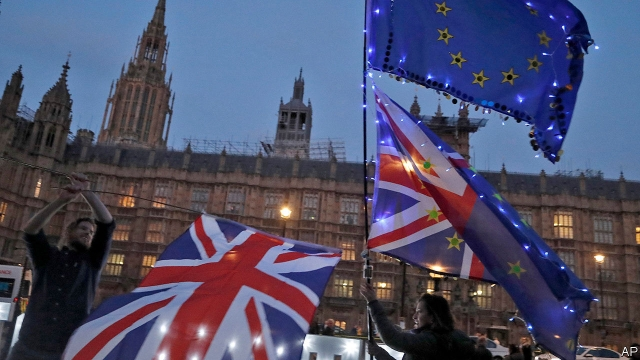

###### Magical thinking

# Brexit was scheduled for March 29th. Wasn’t it meant to be easy? 

##### As the deadline comes and goes, we remember some of the promises that were made to voters 

 

> Mar 28th 2019 

Sunlit uplands“There will be no downside to Brexit, only a considerable upside.”David Davis, the first of three (and counting) Brexit secretaries, lays out his analysis. October 10th 2016 

“To me, Brexit is easy.”Nigel Farage, then leader of the UK Independence Party, quite agrees.September 20th 2016 

Storm clouds gather“Nobody has ever pretended this will be easy. I have always said this negotiation will be tough, complex and at times confrontational.”Mr Davis spots the potential for downsides. September 5th 2017 

“I never promised it would be a huge success.”Brexit? Mr Farage has hardly even heard of it. May 29th 2018 

Deal or no deal?“The day after we vote to leave, we hold all the cards and we can choose the path we want.”Michael Gove, now environment secretary, reassures the public ahead of the referendum.April 19th 2016 

“The free-trade agreement that we will have to do with the European Union should be one of the easiest in human history.”Liam Fox, trade secretary, sees his job as a simple one.July 20th 2017 

“I would vote to stay in the single market. I’m in favour of the single market.”Boris Johnson, now a hardline Brexiteer, clearly felt differently when he gave this interview in 2013 

Let them eat spam“We will look at the issue in the round and make sure there is adequate food supply.”Dominic Raab, the second Brexit secretary, sets rather lower expectations for life outside the EU.July 24th 2018 

“I hadn’t quite understood the full extent of this, but…we’re particularly reliant on the Dover-Calais crossing.”Mr Raab gets to grips with his brief.November 7th 2018 

About that second referendum“If a democracy cannot change its mind, it ceases to be a democracy.”Mr Davis criticises the EU for imposing irreversible laws on member states.November 19th 2012 

“In a 52-48 referendum this would be unfinished business by a long way.”Mr Farage, imagining a narrow Remain victory, says another vote would be needed. May 16th 2016 

You said it“I believe it is clearly in our national interest to remain a member of the European Union.”Theresa May, campaigning for Remain before the referendum.April 25th 2016 

-- 

 单词注释:

1.magical['mædʒikәl]:a. 魔术的, 有魔力的, 不可思议的 

2.Brexit[]:[网络] 英国退出欧盟 

3.voter['vәutә]:n. 选民, 投票人 [法] 选民, 选举人, 投票人 

4.sunlit['sʌnlit]:a. 阳光照射的 

5.downside['daunsaid]:n. 底侧；下降趋势 

6.davis['deivis]:n. 戴维斯（男子名） 

7.farage[]:[网络] 人B淋巴瘤细胞系；法拉格 

8.UK[ju: 'kei]:n. 联合王国 

9.alway['ɔ:lwei]:adv. 永远；总是（等于always） 

10.negotiation[ni.gәuʃi'eiʃәn]:n. 谈判, 磋商, 交涉 [经] 谈判, 协商 

11.gove[]: [人名] 戈夫; [地名] [澳大利亚、美国] 戈夫 

12.reassure[.ri:ә'ʃuә]:vt. 使...安心, 向...再保证 [法] 重新保证, 再保险, 使清除疑虑 

13.johnson['dʒɔnsn]:n. 约翰逊（姓氏） 

14.hardline[]:n. 强硬路线 [电] 硬线 

15.Brexiteer[]: 

16.differently['difrentli]:adv. 差异, 不同, 各别, 各种 

17.Raab[]:n. (Raab)人名；(英、法、德、俄、捷、匈、瑞典)拉布；(西)拉夫 

18.reliant[ri'laiәnt]:a. 依赖的, 信赖的 

19.cannot['kænɒt]:aux. 无法, 不能 

20.criticise['kritisaiz]:v. 批评, 吹毛求疵, 非难 

21.EU[]:[化] 富集铀; 浓缩铀 [医] 铕(63号元素) 

22.irreversible[,iri'vә:sәbl,-sib-]:a. 不可逆的, 不可改变的, 不能倒置的, 不能翻转的, 不能倒转的, 不可撤销的 [计] 不可逆的 

23.referendum[.refә'rendәm]:n. （就重大政治或社会问题进行的）全民公决，全民投票 

24.unfinished[.ʌn'finiʃt]:a. 未完成的 

25.iti[]: [医][=intertrial interval]试验间期，试验间隔 

