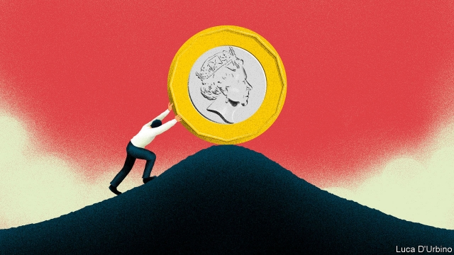
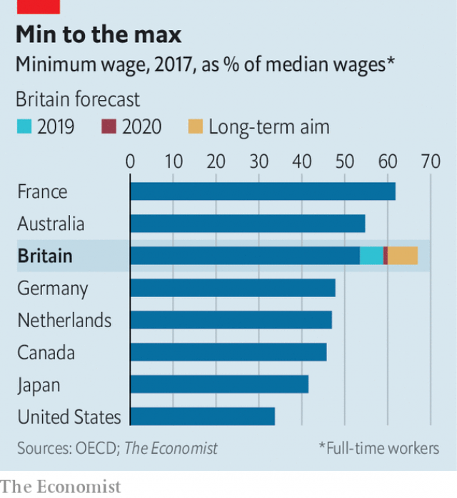

###### Towards a tipping point

# How high can Britain’s minimum wage go? 

##### It is already one of the world’s highest wage floors—and it is set to rise further 

 

> Mar 28th 2019 

THE WORLD has gone minimum-wage mad. Left-wing Democrats in America support the “fight for $15” movement, whose goal is to double the federal wage floor. France’s gilets jaunes protesters are also fighting for a higher minimum—and Emmanuel Macron has acquiesced to their demands. Yet Britain is going madder than most. In 2015 the Conservative government rebranded the hourly minimum wage for the over-25s as the “national living wage”, and since then it has risen by 17%, twice as fast as median earnings. On April 1st it will rise again, to £8.21 ($10.84). Britain now has one of the world’s highest minimum wages—and the government thinks it could go a lot higher. 

It is quite a turnaround for a country that for most of its modern history had no national minimum wage at all. Instead trade unions used to battle it out with employers to reach pay settlements. But the decline of Britain’s industrial base in the 1980s, and with it the power of unions, prompted politicians to worry that workers were being exploited. Although some on the left were sceptical about the idea of a national wage floor, arguing that the Labour Party should commit itself to resuscitating unions instead, Tony Blair promised one in his manifesto in 1997, and won. Britain introduced its minimum wage 20 years ago on April 1st. 

Many economists predicted that chaos would follow. Patrick Minford of Cardiff University, who has since made a name for himself as the hardline Brexiteers’ favourite wonk, foresaw a huge jump in unemployment, as firms decided they could no longer afford to employ as many workers. At the time this newspaper was among those worrying that the imposition of a wage floor would hurt low-paid workers more than it helped them. 

Yet these fears have not come to pass. Even as the rate for the over-25s has risen from 45% of median earnings in 1999 to what will soon be 59%, unemployment has fallen. At 3.9%, it is at its lowest in more than 40 years. The employment rate among working-age people, meanwhile, is at an all-time high. The gains for those at the bottom of the labour market have been real. In 2017 the proportion of employees receiving “low pay” (ie, hourly earnings below two-thirds of the national median) fell to its lowest level since 1982, according to the Resolution Foundation, a think-tank. 

Flushed with success, the government wants to go further. In the spring statement, a half-yearly fiscal update, on March 13th Philip Hammond, the chancellor, said he had the “ultimate objective of ending low pay”. Most experts interpret that as meaning raising the minimum wage until it reaches two-thirds of median hourly earnings. Britain’s wage floor might thus become the highest in the rich world (see chart). The Labour opposition has promised a £10 minimum wage, which would put Britain even higher up the international league tables. 

 

How high can it go before the prophecies of doom made in the 1990s come true? It is a theoretical certainty that the employment costs associated with an ever-higher minimum wage will at some point become too much for firms to bear. Already there are signs that companies in labour-intensive industries, such as hairdressing and hospitality, have responded by raising their prices. Other firms have accepted lower profit margins, or have tried to get around the rules by treating their workers as self-employed. 

The evidence suggests that further rises in the minimum wage could push up joblessness more quickly than past increases have. At present about 7% of workers are paid the minimum wage. But many Britons are paid just more than that, meaning that a wage floor worth two-thirds of median earnings would cover over 20% of workers. And whereas the lowest-paid workers often command less than the market rate for their labour, since they tend to live in places with few job opportunities, this is less frequently the case among slightly higher earners. Rather than fixing a market failure, a higher minimum wage could simply pile costs on to employers who are already paying as much as they can afford. Estimates set out by the Office for Budget Responsibility, the government’s fiscal watchdog, assume that once the wage floor exceeds 60% of median earnings, further increases have a greater impact on the number of hours worked. 

There are better ways of raising the incomes of Britain’s poorest. One would be to boost the provision of targeted in-work benefits such as tax credits (wage top-ups for the low-paid), as Mr Blair’s Labour governments did. Tax credits are expensive; the Tory government has been cutting them. Yet since taxpayers bear the cost they do not threaten jobs. And there is little evidence that tax credits make it easier for businesses to get away with paying miserly wages: three-quarters of the benefit ends up with employees, rather than firms. Promising ever-higher minimum wages is a guaranteed headline-grabber. But it is becoming an ever riskier wager. 

-- 

 单词注释:

1.democrat['demәkræt]:n. 民主人士, 民主主义者, 民主党党员 [经] 民主党 

2.gilet[dʒi'lei]:n. 背心, 马甲 

3.jaune[]:[网络] 汝拉 

4.protester[]:n. 抗议者, 持异议者, 拒付者 [经] 反对者 

5.emmanuel[i'mænjuәl]:n. 以马内利（耶稣基督的别称）；伊曼纽尔（男子名, 等于Immanuel） 

6.macron['mækrәn]:n. 长音符号 

7.acquiesce[.ækwi'es]:vi. 默许, 默然同意 

8.rebrand[ˌri:ˈbrænd]:v. 给（产品或组织）重新命名（或包装）, 重塑…的形象 

9.hourly['auәli]:a. 每小时的, 以小时计的, 频繁的 adv. 每小时地, 频繁地, 不绝地 

10.median['mi:diәn]:a. 中央的, 中间的, 正中的 n. 正中动脉, 中位数, 中线 

11.earning['ә:niŋ]:n. 收入（earn的现在分词） 

12.turnaround['tә:nә.raund]:n. 转向, 回车道, 转变 [化] 小修; 预防(性)修理 

13.resuscitate[ri'sʌsiteit]:v. (使)复苏, (使)复兴 

14.tony['tәuni]:a. 高贵的, 时髦的 

15.blair[bleә(r)]:n. 布莱尔（男子名） 

16.manifesto[.mæni'festәu]:n. 宣言, 声明 

17.economist[i:'kɒnәmist]:n. 经济学者, 经济家 [经] 经济学家 

18.chao[]:n. 钞（货币） 

19.patrick['pætrik]:n. 帕特里克（男子名） 

20.minford[]:[网络] 女婿闽福德；闵福共英语教学德；慕容六月 

21.cardiff['kɑ:dif]:n. 加的夫（英国港市） 

22.hardline[]:n. 强硬路线 [电] 硬线 

23.wonk[wɔŋk]:[俚]书呆子, 死用功的学生 

24.imposition[.impә'ziʃәn]:n. 征收, 课税, 强加, 欺骗 [经] 征税, 税, 税款 

25.fiscal['fiskәl]:a. 财政的, 国库的 [经] 财政上的, 会计的, 国库的 

26.update[ʌp'deit]:vt. 更新, 使现代化 n. 更新 [计] 更新 

27.philip['filip]:n. 菲利普（男子名） 

28.hammond['hæmәnd]:n. 哈蒙德（美国城市） 

29.chancellor['tʃɑ:nsәlә]:n. 大臣, 总理, 首相, 大使馆/领事馆的一等秘书, 司法官, 大学校长 

30.opposition[.ɒpә'ziʃәn]:n. 反对, 敌对, 相反, 在野党 [医] 对生, 对向, 反抗, 反对症 

31.prophecy['prɒfәsi]:n. 预言, 预言能力 

32.doom[du:m]:n. 厄运, 不幸, 法律, 宣告, 判决, 死亡 vt. 命中注定, 判决 

33.hairdressing['hєәdresiŋ]:n. 理发, 美发 

34.hospitality[.hɒspi'tæliti]:n. 款待, 亲切, 殷勤 

35.joblessness['dʒɔblisnis]:n. 失业；无活可干（jobless的名词形式） 

36.quickly['kwikli]:adv. 很快地 

37.Briton['britәn]:n. 大不列颠人, 英国人 

38.les[lei]:abbr. 发射脱离系统（Launch Escape System） 

39.earner['ә:nә]:n. 赚钱的人 

40.watchdog['wɒtʃdɒg]:n. 看门狗, 监察人 [化] 监控设备; 监视器 

41.Tory['tɒ:ri]:n. 托利党党员, 保守党员, 亲英分子 a. 保守分子的 

42.taxpayer['tækspeiә]:n. 纳税人 [法] 纳税人, 纳税义务人 

43.miserly['maizәli]:a. 吝啬的, 贪婪的 

44.risky['riski]:a. 危险的 

45.wager['weidʒә]:n. 赌注, 赌博, 赌物 vt. 下赌注, 向...保证 vi. 打赌 

