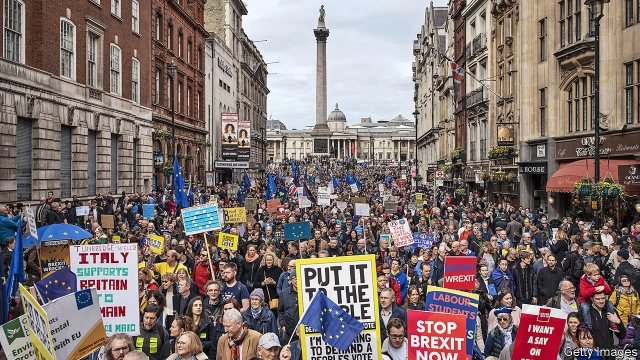
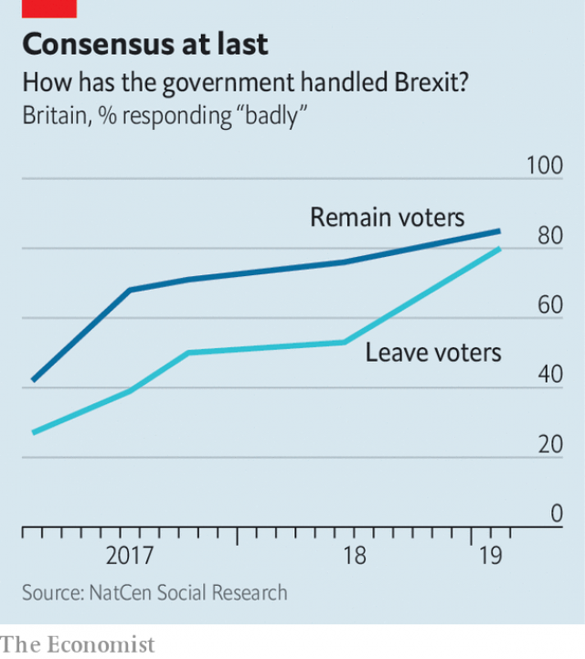

###### The elusive will

# Theresa May has united Britain: everyone hates her Brexit deal 

##### Remainers and Leavers are as divided as ever, but agree that the government has made a mess of things 

 

> Mar 28th 2019 

POLITICIANS ON BOTH sides of the Brexit divide talk sanctimoniously of the “will of the people”. Leavers cite the 17.4m who voted to leave in June 2016, insisting too that most of them want a hard Brexit. Remainers claim opinion is changing, pointing to a march for a “people’s vote” in London on March 23rd that drew a purported 1m people, and a petition to revoke Article 50 which has attracted 6m signatories. 

In truth, the will of the people is decidedly muddy, declares Sir John Curtice in his latest report for NatCen Social Research, based on survey data collected in early February. Since the autumn of 2016 NatCen has polled the same panel of voters, who like the country as a whole were divided in the referendum by 52% to 48% in favour of Leave. 

The most striking finding is how gloomy both sides have become. Among both Leavers and Remainers, only 6% now think that Britain will get a good Brexit deal. Especially among Leavers, they put some of the blame on the EU. But far more goes to Theresa May’s government, which is deemed by four-fifths of voters from both sides to have done a bad job (see chart). Six out of ten now expect to be economically worse off after Brexit. 

 

Might voters warm to a different deal from the one negotiated by Mrs May? NatCen finds almost 60% of voters ready to accept free movement of people from the EU in exchange for free access to its single market. That seems to point to support for a Norway-style soft Brexit, one of the choices for MPs in the indicative votes they have begun holding. 

Yet Sir John is cautious about the chimera of a unifying soft Brexit. Three-fifths of Leavers are hostile to free movement; they are simply outnumbered by the three-quarters of Remainers who are keen on the single market. In a separate study for the British Social Attitudes survey, Sir John finds that the two sides identify more strongly with their Brexit preferences than their political parties. There is little sign of compromise. 

What if there were another referendum? NatCen suggests that a re-run would produce a 55-45% Remain majority. Given the chaos in Parliament, that margin may even have risen since February. But Sir John warns against being too certain of the result. After all, most polls in 2016 suggested Remain would win. 

-- 

 单词注释:

1.elusive[i'lu:siv]:a. 难懂的, 易忘的, 难以捉摸的 

2.theresa[ti'ri:zә]:n. 特丽萨（女子名） 

3.Brexit[]:[网络] 英国退出欧盟 

4.remainers[]:[网络] 剩余物 

5.leaver['li:vә]:n. 离开者（常指学校毕业生） 

6.sanctimoniously[,sæŋkti'məunjəsli]:adv. 伪善地；伪装虔诚地 

7.cite[sait]:vt. 引用, 引证, 表彰 [建] 引证, 指引 

8.purport['pә:pɒ:t]:n. 意义, 要旨, 目的 vt. 意味着, 声称, 打算 

9.petition[pi'tiʃәn]:n. 请愿, 诉状, 陈情书, 申请, 祈求, 祷文 v. 正式请求, 恳求, 请愿 

10.revoke[ri'vәuk]:vt. 撤回, 废除 vi. 藏牌 n. 藏牌 [计] 取消权限程序 

11.signatory['si^nәtәri]:n. 协议的签署者, 签约国 a. 签署的, 签约的 

12.decidedly[di'saididli]:adv. 决定了, 坚决, 明显, 显而易见, 显然, 明确, 果断, 毫无疑问 

13.john[dʒɔn]:n. 盥洗室, 厕所, 嫖客 

14.curtice[]: [人名] 柯蒂斯 

15.NatCen[]:[网络] 国家社会研究中心；全国中心 

16.datum['deitәm]:n. 论据, 材料, 资料, 已知数 [医] 材料, 资料, 论据 

17.voter['vәutә]:n. 选民, 投票人 [法] 选民, 选举人, 投票人 

18.referendum[.refә'rendәm]:n. （就重大政治或社会问题进行的）全民公决，全民投票 

19.EU[]:[化] 富集铀; 浓缩铀 [医] 铕(63号元素) 

20.deem[di:m]:v. 认为, 相信 

21.economically[i:kә'nɔmikәli]:adv. 节约地, 不浪费地, 节省地, 节俭地, 在经济上, 在经济学上 

22.Mr['mistә(r)]:先生 [计] 存储器回收程序, 多重请求 

23.MP[]:国会议员, 下院议员 [计] 宏处理程序, 维护程序, 线性规划, 微程序, 多处理器 

24.indicative[in'dikәtiv]:a. 指示的, 象征的, 表示...的 [经] 指标的 

25.chimera[kai'miәrә]:n. 客迈拉(狮头、羊身、蛇尾的吐火女怪), 假想的妖怪, 妄想 [医] 嵌合体 

26.unify['ju:nifai]:v. 统一, 使成一体 

27.outnumber[.aut'nʌmbә]:vt. 数目超过, 比...多 

28.chao[]:n. 钞（货币） 

