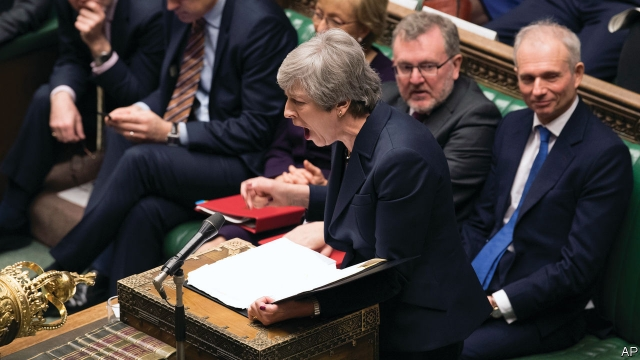
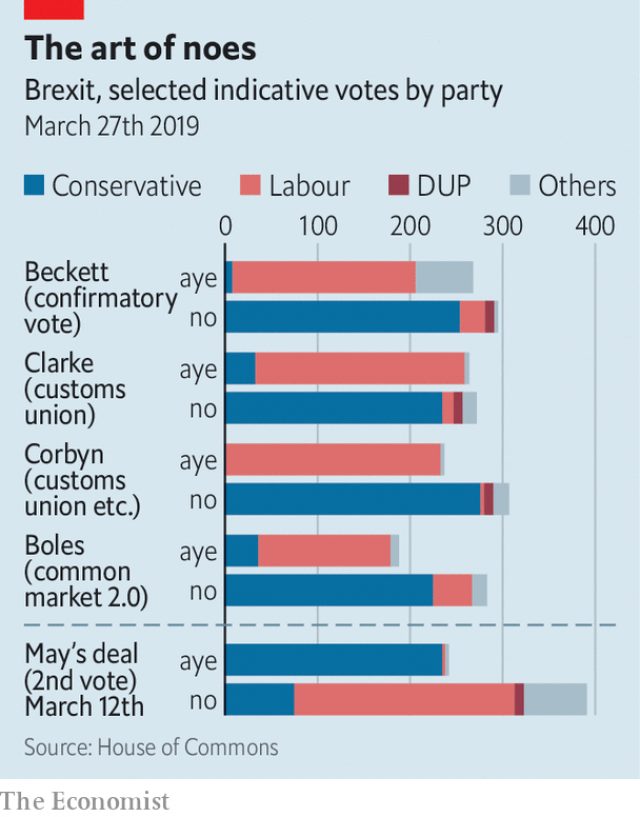

###### Kamikaze tactics

# Theresa May pays the ultimate price to try to seal her Brexit deal 

##### Her promise to quit marks the culmination of her loss of control over the Brexit process 

 

> Mar 30th 2019 

THE REFERENDUM in June 2016 was supposedly about taking back control. This made the news on March 27th that Theresa May had offered to resign to get her Brexit deal through more poignant. That her announcement took place as MPs were, for the first time in living memory, taking back control of their agenda from the government to hold indicative votes on Brexit emphasised her lost authority. 

The prime minister’s offer to resign if MPs pass her deal gives it another chance, despite its having been rejected twice. But the odds still seem stacked against it. So her departure is better seen as the final stage in a process of losing control that began on June 8th 2017, when she squandered her parliamentary majority in a snap election. Her government has since depended on the Northern Irish Democratic Unionist Party (DUP). The election also made her more vulnerable to internal ambushes, notably by hardline Tory Brexiteers in the European Research Group (ERG). 

Along the way, Mrs May has shown a remarkable propensity to lose ministers. No fewer than 28 have resigned since she became prime minister 32 months ago, an attrition rate far worse than any post-war predecessor. Fully 18 have quit over Brexit, most of them in the nine months since the prime minister unveiled a detailed outline of her plan at Chequers, her official country retreat. Three stood down this week. Mrs May survived a no-confidence vote by her own MPs in December only by promising not to contest the next election. And her loss of control led to two shattering defeats of her Brexit deal by MPs, the first being the largest on record. 

These domestic setbacks were matched by Mrs May’s lost grip of the process in Brussels. She began by drawing red lines and promising glorious Thatcherite battles with the EU. But she failed to grasp the mismatch in bargaining power. It has in fact been the EU that has set the agenda, determined the sequencing of negotiations and done most of the drafting. This reached a climax on March 21st when EU leaders met at a European Council summit in Brussels to consider Mrs May’s request for an extension of the March 29th deadline for Brexit. The leaders promptly dismissed her proposed new deadline of June 30th and spent hours without her debating alternatives. Towards midnight, the European Council president, Donald Tusk, curtly informed Mrs May that the new deadlines would be May 22nd if MPs passed the Brexit deal this week, or April 12th if not. 

What next? The political focus will doubtless now switch to the succession, with Boris Johnson or Michael Gove being champions for the Brexiteers, and Jeremy Hunt or Sajid Javid their most likely opponents. Yet the prior question is whether Mrs May’s deal passes. Although she was already winning a few opponents round, and more will now follow, the obstacles remain large. Even the Speaker, John Bercow, is exploiting his powers to make it harder for her to put the deal to another vote. 

Nobody has learnt to stop worrying and love her deal, yet the prime minister is making the best case she can. She was clear this week that MPs would block a no-deal Brexit. Deprived of their favoured no-deal option, more hardliners have swung behind her deal purely to stop a softer option or, worse, no Brexit at all. Jacob Rees-Mogg, leader of the ERG, said that, faced with such a choice, he now prefers Mrs May’s deal. Some in the DUP were also reportedly softening. But late on March 27th the party insisted that it would not fall into line. Despite Mrs May’s dramatic resignation promise, the numbers do not yet seem there for her deal to pass. 

Whether or not it gets through, the indicative votes by MPs matter, because they will influence the more difficult second stage of the Brexit negotiations on future relations, which could now take place under a new prime minister. Predictably, none of those cast this week produced a clear majority. Yet it was telling that two secured more than the 242 votes for Mrs May’s deal on March 12th (see chart). These were an amendment sponsored by Kenneth Clarke, a Tory veteran, to add a permanent customs union to her deal; and a motion from Margaret Beckett, a former Labour foreign secretary, to put any deal approved by MPs to a confirmatory referendum. An official Labour amendment got 237 votes, while a plan by Nick Boles, another Tory, in favour of “Common Market 2.0”, a Norwegian-style soft Brexit, took 188. 

 

When MPs tried a series of indicative votes on House of Lords reform in 2003, they ended up unable to agree to make any changes at all. Yet for Brexit the status quo is not an option. To avoid a no-deal Brexit at some point in future, which is their declared intent, MPs must agree upon some alternative. They are likely to try to narrow down their options in another ballot on April 1st. Judging by this week’s votes, the most likely choice if Mrs May’s deal fails is a permanent customs union. 

The other difference with Lords reform is that any Brexit deal needs EU agreement, which cannot be taken for granted. The EU will insist on acceptance of the current withdrawal agreement as it stands. Mr Boles says his Common Market 2.0 plan could be adopted quickly by tweaking the non-binding political declaration. But the permanent customs union may be trickier, as the Labour Party wants a say in future trade deals which the EU will not allow. 

What all options other than Mrs May’s have in common is a need for more time, implying yet another extension of the deadline. This could be quite problematic. Mujtaba Rahman of the Eurasia Group, a consultancy, says Brussels will insist that Britain participate in the European Parliament elections in late May. He adds that some countries now think a long extension could be worse even than a no-deal Brexit. Nicolai von Ondarza of the Berlin-based SWP think-tank says some German officials are claiming to prefer an end with horrors to horrors without end. 

With Westminster consumed by internal debates and leadership speculation, the EU is quietly preparing for another summit on April 9 or 10th. It is likely to find some way to give Britain more time, if only to stop a no-deal Brexit causing havoc before the European elections. Many EU leaders will be pleased to see the back of Mrs May, whom they find ever more irritating. They should be careful what they wish for: her successor could be worse. 

-- 

 单词注释:

1.kamikaze[.kɑ:mi'kɑ:zi]:n. 神风对队员；神风特攻队 

2.tactic['tæktik]:n. 一项战术, 一条策略 a. 战术的, 顺序的, 排列的 

3.theresa[ti'ri:zә]:n. 特丽萨（女子名） 

4.Brexit[]:[网络] 英国退出欧盟 

5.culmination[.kʌlmi'neiʃәn]:n. 顶点, 高潮, 最高点 

6.referendum[.refә'rendәm]:n. （就重大政治或社会问题进行的）全民公决，全民投票 

7.supposedly[sә'pәuzidli]:adv. 想象上, 看上去像, 被认为是, 恐怕, 按照推测 

8.poignant['pɒinәnt]:a. 辛酸的, 尖锐的, 剧烈的 

9.MP[]:国会议员, 下院议员 [计] 宏处理程序, 维护程序, 线性规划, 微程序, 多处理器 

10.indicative[in'dikәtiv]:a. 指示的, 象征的, 表示...的 [经] 指标的 

11.emphasise[]:vt. 强调, 重读, 加强...的语气, 着重 

12.odds[ɒdz]:n. 可能性, 几率, 机会, 胜算, 不平等 

13.squander['skwɒndә]:vt. 浪费, 使分散 vi. 浪费, 漂泊, 四散 

14.parliamentary[.pɑ:lә'mentәri]:a. 国会的, 议会的, 议会制度的 

15.unionist['ju:njәnist]:n. 工会会员, 工联主义者 [法] 工会会员, 工会主义者 

16.dup[dʌp]:vt. 打开；重复 

17.vulnerable['vʌlnәrәbl]:a. 易受伤害的, 有弱点的, 易受影响的, 脆弱的, 成局的 [医] 易损的 

18.ambush['æmbuʃ]:n. 埋伏, 伏兵, 伏击 vt. 埋伏, 伏击 vi. 埋伏 

19.notably['nәjtbәli]:adv. 显著地, 著名地, 尤其, 特别 

20.hardline[]:n. 强硬路线 [电] 硬线 

21.Tory['tɒ:ri]:n. 托利党党员, 保守党员, 亲英分子 a. 保守分子的 

22.Brexiteers[]:支持英国退欧的人（Brexiteer的复数） 

23.erg[ә:^]:n. 尔格 [计] 尔格 

24.Mr['mistә(r)]:先生 [计] 存储器回收程序, 多重请求 

25.propensity[prә'pensәti]:n. 倾向, 爱好, 习性 

26.attrition[ә'triʃәn]:n. 摩擦, 磨损 [医] 擦除术; 磨耗 

27.predecessor[.predi'sesә]:n. 前任, 先辈, 前身 [医] 初牙, 前辈, 祖先 

28.fully['fuli]:adv. 十分地, 完全地, 充分地 

29.unveil[.ʌn'veil]:vt. 揭开, 揭幕, 除去...的面纱 vi. 显露, 除去面纱 

30.chequer['tʃekә]:n. (一粒)棋子, 西洋跳棋, 方格图案, 格子花, 花楸果, 排列成方格式的石头 vt. 把...画/制成方格图案形, 交替变换 

31.shatter['ʃætә]:n. 碎片, 粉碎, 落叶, 喷洒 vt. 打碎, 使散开, 粉碎, 破坏 vi. 粉碎, 损坏, 脱落 

32.setback['setbæk]:n. 挫折, 退步, 逆流 

33.Brussel[]:n. 布鲁塞尔（比利时首都） 

34.Thatcherite['θætʃәrait]:n. (英国首相)撒切尔夫人的支持者 a. 撒切尔夫人(或主义)的 

35.EU[]:[化] 富集铀; 浓缩铀 [医] 铕(63号元素) 

36.mismatch[mis'mætʃ]:n. 错配 vt. 错配, 使...成不相配的婚姻 

37.negotiation[ni.gәuʃi'eiʃәn]:n. 谈判, 磋商, 交涉 [经] 谈判, 协商 

38.climax['klaimæks]:n. 高潮, 极点, 层进法 v. (使)达到顶点, (使)达到高潮 

39.promptly['prɒmptli]:adv. 敏捷地, 迅速地 

40.tusk[tʌsk]:n. 长牙, 獠牙, 尖物 vt. 以长牙刺戳, 以长牙掘 

41.curtly['kә:tli]:adv. 简略地, 草率地 

42.boris['bɔris]:n. 鲍里斯（男子名） 

43.johnson['dʒɔnsn]:n. 约翰逊（姓氏） 

44.michael['maikl]:n. 迈克尔（男子名） 

45.gove[]: [人名] 戈夫; [地名] [澳大利亚、美国] 戈夫 

46.jeremy['dʒerimi]:n. 杰里米（男子名） 

47.sajid[]:n. (Sajid)人名；(印尼)赛义德 

48.javid[]:[网络] 加威；贾维德 

49.john[dʒɔn]:n. 盥洗室, 厕所, 嫖客 

50.deprive[di'praiv]:vt. 剥夺, 使丧失 [法] 剥夺, 剥夺, 夺去 

51.hardliner[ˌhɑ:d'laɪnə(r)]:n. 强硬路线者 

52.jacob['dʒeikәb]:n. [圣经]雅各（以色列人的祖先）；雅各布（男子名） 

53.reportedly[ri'pɒ:tidli]:adv. 根据传说, 根据传闻, 据报道 

54.soften['sɒftn]:v. (使)变柔软, (使)变柔和 

55.predictably[]:adv. 可预言地 

56.amendment[ә'mendmәnt]:n. 修订, 改善, 改良, 改正 [化] 调理剂; 修正 

57.kenneth[]:n. 肯尼思（男子名）；[古]英俊的领导者 

58.clarke[]:n. 克拉克（姓氏） 

59.margaret['mɑ:^әrit]:n. 玛格利特（女子名） 

60.Beckett[ˈbekɪt]:贝克特（人名） 

61.confirmatory[kәn'f\\:mәtәri]:起确定作用的, 坚信礼的, 证实的 [计] 证实 

62.referendum[.refә'rendәm]:n. （就重大政治或社会问题进行的）全民公决，全民投票 

63.nick[nik]:n. 刻痕, 缺口, 划痕 vt. 刻痕于, 弄缺, 擦伤 vi. 狙击 

64.bole[bәul]:n. 树干 [医] 胶灰粘土 

65.sery[]:n. (Sery)人名；(俄)谢雷；(科特)塞里 

66.statu[]:[网络] 状态查看；雕像；特级雪花白 

67.quo[]:vt. [古]说 

68.intent[in'tent]:n. 意图, 含义, 故意 a. 专心的, 决心的, 热心的 

69.ballot['bælәt]:n. 投票, 投票用纸, 抽签 vi. 投票, 抽签 vt. 投票选出, 拉选票 

70.cannot['kænɒt]:aux. 无法, 不能 

71.withdrawal[wið'drɒ:l]:n. 提款, 撤退, 退回, 撤消, 退隐, 戒毒过程 [医] 戒除, 脱瘾 

72.quickly['kwikli]:adv. 很快地 

73.tweak[twi:k]:n. 拧, 扭, 焦急 vt. 扭, 开足马力 

74.declaration[.deklә'reiʃәn]:n. 宣告, 说明, 宣布 [计] 说明 

75.tricky['triki]:a. 狡猾的, 机敏的 

76.problematic[prɔblә'mætik]:a. 成问题的, 未定的, 疑难的, 有疑问的, 盖然性的, 或然性的 

77.mujtaba[]:[网络] 塔巴 

78.Rahman[]:n. (Rahman)人名；(塞、印、阿拉伯)拉赫曼 

79.Eurasia[ju'reiʒә]:n. 欧亚大陆 

80.consultancy[]:n. 商量, 协商, 磋商, 会诊, 与...商量, 咨询, 请教, 找(医生)看病, 查阅, 考虑 [经] 咨询业务, 咨询服务 

81.nicolai[]:n. (Nicolai)人名；(德、意、罗)尼古拉；(法)尼科莱 

82.Von[vɔn;fɔn;fәn]:[计] 冯·诺伊曼 

83.swp[]:abbr. safe working pressure 安全工作压力; sweep 清扫; sweeping 扫除; steam working pressure 蒸汽工作压力 

84.Westminster['westminstә]:n. 威斯敏斯特 

85.speculation[.spekju'leiʃәn]:n. 沉思, 推测, 投机 [经] 投机交易, 买空卖空 

86.quietly['kwaiәtli]:adv. 安静地, 沉着地, 秘密地 

87.havoc['hævәk]:n. 大破坏, 蹂躏 vt. 严重破坏 

88.irritate['iriteit]:vt. 激怒, 使发怒, 使兴奋, 使发炎 vi. 引起不快 

89.successor[sәk'sesә]:n. 继承者, 接任者 [计] 后继 

