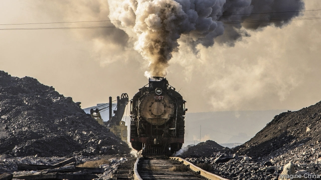
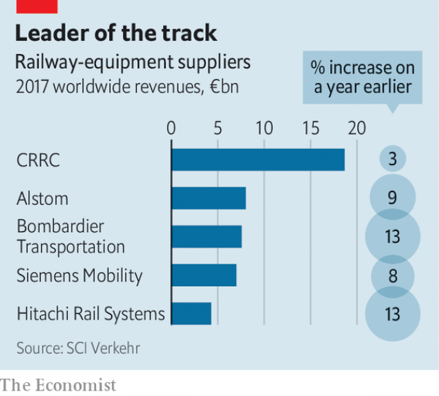

###### The red-train blues

# A giant Chinese trainmaker hits the buffers abroad 

##### CRRC may refocus on its home market instead 

 

> Mar 30th 2019 

LIKE MANY towns with an industrial heritage, the transformation of a factory that had stood derelict for decades into a shiny modern manufacturing site might seem a welcome development. But in Springfield, Massachusetts, famous for the rifles produced at its National Armoury, the arrival of a Chinese trainmaker has hit the buffers. 

It is not that Springfield has no history of trainmaking; two centuries ago it built some of the first American-made railway carriages to replace British imports. The need for a local manufacturing base is what led CRRC, the world’s biggest producer of locomotives and rolling stock, to set up shop there in 2017. Since then it has been attacked by the press as a threat to American jobs and national security. The firm was subsequently clobbered with tariffs on imported parts, and recently denied an exemption. Lawmakers in Washington, DC, are now trying to prevent federal funds from being spent on its trains. 

Some of the hostility is down to CRRC’s sheer size. Founded in 2015 from the merger of China’s two biggest train manufacturers, CRRC controls over 90% of the Chinese railway market—which also happens to be the world’s biggest. With its domestic business cornered, the company set its sights on expansion abroad. Liu Hualong, CRRC’s chairman, went about this by setting up overseas subsidiaries to handle some of the support and assembly operations. First he took aim at Asia and Africa, then Europe and America. 

CRRC now employs 180,000 people worldwide and posts annual revenues of $30.6bn, around a tenth of which comes from outside China. Between 2013 and 2017 CRRC made 44% of the world’s electric trains and a whopping 71% of its high-speed ones, estimates Maria Leenen of SCI Verkehr, a railways consultancy in Hamburg. Its earnings from railway equipment alone are far bigger than the railway earnings of its big European competitors, Siemens of Germany, Alstom of France and Bombardier of Canada. 

America is an especially attractive market, owing to its preference for customised trains, which fetch a premium over the off-the-yard variety favoured elsewhere in the world. Thanks to a renewed interest in rail travel, particularly among America’s carless young, it is also fast-growing, says Jia Bo, president of CRRC’s Springfield subsidiary. Since 2014 the company has won four big contracts in America for subway carriages. It delivered its first American-built train in December. 

 

CRRC’s manoeuvres have spooked its Western rivals. Siemens and Alstom have cited the threat posed by the Chinese firm’s overseas expansion in defence of the attempted merger of their rail divisions, which the European Commission last month vetoed because it feared it would hurt competition. Erik Olson of the Rail Security Alliance, a campaign group made up of American freight-wagon builders and their suppliers, claims that CRRC threatens to wipe out his members’ businesses through predatory pricing, just as he reckons the company did in Australia after it set up shop there. Add labour shortages and protectionist “Buy America” rules, which will soon force trainmakers to source 70% of their components from American suppliers, and the market suddenly looks far less appealing. Kawasaki, CRRC’s Japanese rival, has said it is considering leaving America altogether. 

CRRC’s provenance is making things worse. The trade war with China simmers on. Controversy surrounding Huawei, a huge Chinese maker of telecoms gear which has been accused (without any evidence being made public) of being a vehicle for Chinese spying, has infected other Chinese companies, CRRC among them. Mr Olson believes that carriages made by the firm and fitted with CCTV could be combined with facial-recognition technology to help the Chinese government track individuals. A fantasy, perhaps, but a real enough fear for CRRC to insist that it complies with all of America’s rules about cyber-security. 

All of this means that CRRC’s overseas expansion is nowhere near on track. It recently lost a contract in New York and has made virtually no headway in Europe. In Africa CRRC has done better, although rail firms there would prefer to buy Western trains if only they could obtain financing on the same generous terms as that provided by the Chinese, says Howard Rosen of the Rail Working Group, an international trade body. But Western firms cannot do this owing to rules imposed by the OECD, a club of rich countries that excludes China. 

This rough ride is causing CRRC to turn its attentions back to China. It says it may soon quit the American market for freight cars. To help manage the integration of the vast merger and deal with limits placed by the Chinese government on how much money it can invest abroad, CRRC has started to temper its overseas expansion, says Karen Li of JPMorgan Chase, a bank. The firm has quietly dropped a target to double its share of orders from abroad to 20% by 2021, she says. Better, it seems, to concentrate on winning orders for a coming glut of new high-speed lines in China. 

-- 

 单词注释:

1.trainmaker[]:[网络] 列车标记 

2.buffer['bʌfә]:n. 缓冲器, 缓冲区 vt. 缓冲 [计] 缓冲区, 缓冲器 

3.CRRC[]:中国中车（公司名） 中国不动产研究中心（China Realty Research Center） 全国公路摩托车锦标赛（China Road Racing Championship） 

4.refocus[ri:'fәukәs]:vt. 重调…的焦距 

5.heritage['heritidʒ]:n. 遗产, 祖先遗留物, 继承物 [医] 遗传性 

6.derelict['derilikt]:a. 被抛弃了的, 无主的, 玩忽职守的 n. 遗弃物, 被遗弃的人, 玩忽职守者 

7.shiny['ʃaini]:a. 有光泽的, 发光的, 辉煌的, 磨光的, 磨损的 

8.manufacturing[.mænju'fæktʃәriŋ]:n. 制造业 a. 制造业的 

9.Springfield['spriŋfi:ld]:n. 斯普林菲尔德（美伊利诺斯州首府） 

10.Massachusetts[.mæsә'tʃu:sits]:n. 麻萨诸塞州 

11.armoury['ɑ:mәri]:n. 军械库, 兵工厂 

12.producer[prә'dju:sә]:n. 生产者, 制作者, 制作人 [化] 发生器; (炉煤气)发生炉; 制气炉; 生产者 

13.subsequently['sʌbsikwәntli]:adv. 后来, 随后 

14.clobber['klɒbә]:n. 衣服, (鞋匠用来掩饰皮革缝的)软膏 vt. 痛打, 击倒, 拉垮 

15.tariff['tærif]:n. 关税, 关税表, 价格表, 收费表 vt. 课以关税 [计] 价目表 

16.exemption[ig'zempʃәn]:n. 解除, 免除, 免税 [化] 免检 

17.lawmaker[lɒ:'meikә]:n. 立法者 

18.Washington['wɒʃiŋtn]:n. 华盛顿 

19.DC[]:直流电 [计] 数据单元, 数据中心, 数据代码, 数据通信, 数据控制, 数字控制, 直流 

20.hostility[hɒs'tiliti]:n. 敌意, 敌对, 反对 

21.sheer[ʃiә]:a. 绝对的, 全然的, 纯粹的, 透明的, 峻峭的 vi. 偏转, 偏航 vt. 使急转向, 使偏航 adv. 完全, 全然, 峻峭 n. 偏航 

22.merger['mә:dʒә]:n. 合并, 归并 [经] 购并 

23.oversea['әuvә'si:]:adv. 海外, 向国外, 向海外, 国外 a. 外国的, 在国外的, 在海外的, 舶来的 

24.subsidiary[sәb'sidiәri]:n. 子公司, 附件, 辅助者 a. 辅助的, 次要的, 津贴的 

25.whop[hwɒp]:v. 打, 抽出, 打败, 征服 n. 重击, 打击声 

26.Maria[mә:'raiә, mә'riә]:n. 玛丽亚（女名） 

27.SCI[]:[计] 串行通信接口, 栈控制指令, 系统控制接口, 科学新闻组类 

28.consultancy[]:n. 商量, 协商, 磋商, 会诊, 与...商量, 咨询, 请教, 找(医生)看病, 查阅, 考虑 [经] 咨询业务, 咨询服务 

29.hamburg['hæmbә:^]:n. 汉堡（德国城市） 

30.earning['ә:niŋ]:n. 收入（earn的现在分词） 

31.siemen[]:[网络] 西门子贝得 

32.alstom[]:n. 阿尔斯通（法国公司） 

33.bombardier[.bɒmbә'diә]:n. 投弹手, 炮兵军士 

34.customise['kʌstәmaiz]:vt.<主英>=customize 

35.premium['pri:miәm]:n. 额外补贴, 奖金, 奖赏, 保险费 [医] 保险费 

36.carless['kɑ:lis]:a. 没有汽车的,无车的,没有被提供汽车 

37.jia[]:abbr. 幼年特发性关节炎（jejunoileal arthropathy） 

38.manoeuvre[mә'nu:vә]:n. 调遣, 演习, 策略 vi. 调动, 演习, 用策略 vt. 调动, 操纵 

39.spook[spu:k]:n. 幽灵, 鬼 vt. 惊吓, 鬼怪般地出没 vi. 惊吓而逃窜, 受惊 

40.cite[sait]:vt. 引用, 引证, 表彰 [建] 引证, 指引 

41.veto['vi:tәu]:n. 否决权 vt. 否决, 禁止 

42.erik[]:n. 埃里克（姓氏） 

43.Olson[]:n. (Olson)人名；(瑞典、芬、西、印尼)奥尔松；(英)奥尔森 奥尔森 

44.alliance[ә'laiәns]:n. 联盟, 联合 [法] 同盟, 联盟, 联姻 

45.builder['bildә]:n. 建立者 [机] 组份 

46.supplier[sә'plaiә]:n. 供应者, 供给国, 供应商 [化] 承制厂; 供应厂商 

47.predatory['predәtәri]:a. 掠夺成性的, 捕食生物的, 掠夺的 [医] 捕食的 

48.reckon['rekәn]:vt. 计算, 总计, 估计, 认为, 猜想 vi. 数, 计算, 估计, 依赖, 料想 

49.protectionist[prә'tekʃәnist]:n. 贸易保护主义者 a. 贸易保护主义的 

50.les[lei]:abbr. 发射脱离系统（Launch Escape System） 

51.Kawasaki[,kɑ:wɑ:'sɑ:ki:]:川崎[日本本州岛东南岸港市] 

52.provenance['prɒvәnәns]:n. 起源, 出处 

53.simmer['simә]:vt. 煨 vi. 炖, 内心充满 n. 即将沸腾的状态, 即将发作 

54.controversy['kɒntrәvә:si]:n. 论争, 辩论, 论战, 争论 [法] 论战, 争论, 争吵 

55.huawei[]: 华为 

56.maker['meikә]:n. 制造者, 上帝 [经] 制造者, 出票人 

57.telecom['telәkɔm]:telecommunication 电信 

58.CCTV[]:[计] 闭路电视 

59.comply[kәm'plai]:vi. 顺从, 依从 [法] 遵守, 承诺, 照做 

60.york[jɔ:k]:n. 约克郡；约克王朝 

61.headway['hedwei]:n. 前进, 航行速度, 进展 [经] 进尺, 钻井 

62.howard['hauәd]:n. 霍华德（男子名） 

63.Rosen[]:n. 罗斯（姓氏） 

64.cannot['kænɒt]:aux. 无法, 不能 

65.Oecd[]:[经] 已开发国家组织 

66.integration[.inti'greiʃәn]:n. 综合, 与环境协调的行为, 集成 [化] 集成; 整合 

67.karen['kɑ:rәn]:n. 凯伦（人名）；克伦邦（缅甸邦名） 

68.jpmorgan[]:[网络] 摩根大通；摩根大通银行；摩根大通公司 

69.quietly['kwaiәtli]:adv. 安静地, 沉着地, 秘密地 

70.glut[glʌt]:n. 大量, 供过于求 vt. 使充满, 使吃饱, 过多供应 vi. 吃得过多, 狼吞虎咽 

