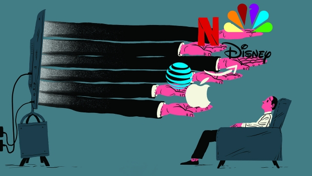
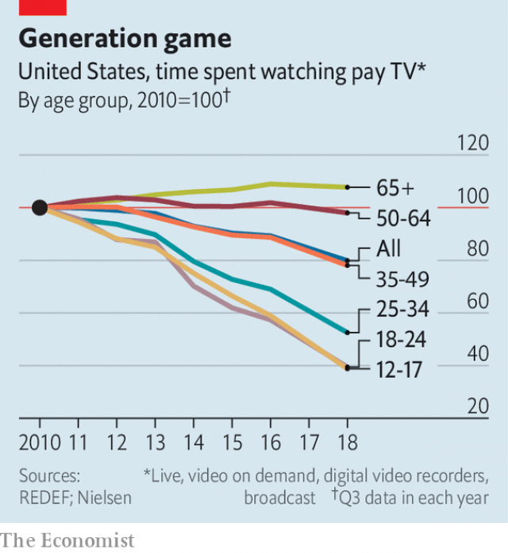

###### Streamlined

# Disney, AT&T and Comcast v Netflix, Amazon and Apple 

##### In the entertainment wars, billions of dollars are being torched. Someone will get hurt 

 

> Mar 28th 2019 

WHO MIGHT buy Netflix? Speculation on the matter has risen in line with the streaming giant’s own ascent in the past decade. Apple, with its cash hoard, was a frequently rumoured suitor. Or perhaps Amazon, or big distributors like AT&T or Comcast. At one point, industry sources say, Bob Iger of Disney directly asked Reed Hastings, the boss of Netflix, if he would welcome an offer (Mr Hastings said no). 

Instead all six companies embarked on a series of massive investments that will reshape the landscape of media: who makes entertainment and how people consume it. Since June AT&T, Comcast and Disney have spent $215bn in total on acquisitions of, respectively, Time Warner ($104bn), Sky, a European broadcaster ($40bn), and much of 21st Century Fox ($71bn). Each is preparing new streaming services that will launch by early 2020. 

Apple, meanwhile, has poured perhaps $2bn into original shows with some of Hollywood’s most famous directors and stars. On March 25th the company unveiled its new streaming-video service, Apple TV+, that will be available in more than 100 countries later this year. Amazon is thought to be spending more than $5bn a year on content. And Netflix is expected to burn about $15bn this year on original and licensed content in a bid to add to its 139m global subscribers before most of its would-be rivals get fully up and running. 

The firms are chasing the same prize: recurring revenue from video subscriptions by tens of millions of Americans and, potentially, hundreds of millions of international viewers. It is unclear how many of them can thrive at the same time. More than two, analysts reckon, but not all six. There are only so many $10 monthly subscriptions people will pay for. They may opt once again for those bundled with something else, like a mobile service—a business model of which consumers had grown weary in America, where a single distributor sells lots of channels at one price. What forms these reimagined bundles take, and who gets to sell them, will depend on who wins the streaming battles. 

In this fight, the contenders have adopted different strategies to win over subscribers. AT&T will bundle entertainment with its mobile service, which could help the company overtake Verizon as the largest wireless carrier in America. Comcast will offer an ad-supported streaming service from NBCUniversal, which it owns, to its 52m broadband and pay-TV customers (including Sky’s) in America, Britain and elsewhere in Europe (it will also sell subscriptions, but its ambitions seem more modest than the others’). Disney will use its enviable collection of film franchises, including Star Wars and Marvel superheroes, to draw families to Disney+, then steer them to its consumer products and theme parks. 

For the tech giants, video is a way to lure customers into their online emporiums. Amazon, with 100m Prime households, is ahead of Apple for now. But Apple TV can push its glitzy new shows to the world’s 1.4bn iDevices. Apple and Amazon have deeper pockets than AT&T, Comcast or Disney, so can afford to pour billions annually into streaming-video for years to come. Their platforms are perfect for selling online services including video. 

Then there is Netflix. Its head start puts it in a strong position. Its algorithms work out what viewers want and it has the infrastructure to deliver it to ever more people. A recession or rising interest rates could hurt its ability to borrow—Netflix has more than $10bn in debt and burns through $3bn of cash a year. But its lead is such that it could curtail spending on content and still stay ahead of competitors. 

AT&T and Disney face a more complicated challenge. To prosper in streaming, they must undermine lucrative existing businesses. In AT&T’s business unit that houses DirecTV, a satellite provider acquired in 2015 at a cost of $63bn, operating income has fallen by 20% since 2016—in part owing to aggressive marketing of DirecTV Now, a cheaper, loss-making streaming bundle of pay-TV networks. The new streaming service from AT&T (marketed under the WarnerMedia brand) will exacerbate the decline. Disney, for its part, will forgo profits of about $1bn this year—and $2bn annually from 2020—as it stops licensing films to Netflix and invests in original shows for its streaming platform, Disney+. New investments in Hulu, a general-interest streaming service with 25m subscribers that Disney controls, will also be costly. 

Disney and AT&T are willing to sacrifice near-term profits for two reasons: the vulnerability of their underlying businesses, and hoped-for returns from streaming. With the rise of Netflix, YouTube and other internet distractions, Americans are watching less pay-TV (see chart) and dropping pricey packages which AT&T sells, and which carry Disney’s TV networks. And they go to the cinema less often. That is why Rupert Murdoch wanted to sell much of his Fox empire, and Jeff Bewkes was keen to offload Time Warner. Networks bereft of “must-have” content will face demands from distributors to lower prices. Disney and AT&T viewed Fox and Time Warner studios and entertainment networks, with their libraries of hits, as valuable assets. 

 

For Disney, which oozed popular content even before the Fox deal, the economics of streaming stack up. ESPN, Disney’s sports network, generates more than $2bn annually, according to Kagan, a research group. But its reach is declining. In 2018 the company launched ESPN+, a sports-streaming service. It has picked up 2m subscribers in less than a year (though it is expected to lose money for years). 

The real opportunity should be in Disney+. Disney’s dominance of the box office will count for less as fewer people frequent cinemas. Matthew Ball, a media analyst, argues that even before the acquisition of Fox’s big franchises, such as “Avatar”, Disney’s spectaculars were beginning to crowd each other out. Streaming provides a neat solution. Disney will release films directly online, as with the upcoming live-action version of “Lady and the Tramp”, in addition to TV series from Lucasfilm, Marvel Studios and Pixar Animation. Once licences expire, it will control access to its complete library of hits. Bullish analysts at JPMorgan Chase, a bank, believe Disney+ can break even by 2022 and eventually attract 45m subscribers in America and 115m abroad. At $8-10 per month that would equate to $15bn-19bn in recurring sales; Disney’s revenues last fiscal year totalled $59bn. Disney would also have something new and valuable: direct relationships with its biggest fans. 

AT&T and Comcast look more precarious. WarnerMedia (as Time Warner has been renamed) owns some famous superheroes, like Batman and Wonder Woman, but they are not quite so formidable as Disney’s. AT&T’s early handling of WarnerMedia, where several highly respected executives have resigned, most notably at HBO, its most important asset, has raised concerns about its ability to manage a giant media conglomerate. Comcast, meanwhile, lacks enough popular shows to grab subscribers’ attention. 

It is not clear that owners of infrastructure need to enter the battle to produce content. Craig Moffett of MoffettNathanson, a research firm, argues that the streaming boom should benefit owners of distribution pipes. They can offset falling revenue from pay-TV with broadband, which offers higher margins with less capital spending. The cost of programming has ballooned—well above $10m an hour for “Game of Thrones”—as viewers increasingly expect blockbuster quality from their shows. One day, a Hollywood executive predicts, the spending binge will come to a halt. The streaming market, too, will consolidate. It will be “the biggest hangover that Hollywood has ever seen”. 

-- 

 单词注释:

1.streamline['stri:mlain]:n. 流线, 流线型 vt. 使成流线型, 使合理化 

2.Disney['dizni]:n. 迪斯尼 

3.comcast[]:n. 康卡斯特（美国最大的有线系统公司） 

4.V[vi:]:[计] 溢出, 变量, 向量, 检验, 虚拟, 垂直 [医] 钒(23号元素) 

5.netflix[]:n. 全球十大视频网站中唯一收费站点 

6.amazon['æmәzɒn]:n. 亚马孙河 [医] 无乳腺者 

7.speculation[.spekju'leiʃәn]:n. 沉思, 推测, 投机 [经] 投机交易, 买空卖空 

8.ascent[ә'sent]:n. 上升, 提高, 攀登, 上坡路 

9.hoard[hɒ:d]:n. 贮藏物, 密藏的金钱 v. 囤积, 贮藏 

10.suitor['sju:tә]:n. 起诉者, 请愿者, 求婚者 [法] 起诉人, 原告, 求婚者 

11.distributor[dis'tribjutә]:n. 分发者, 分布者, 散布者, 分配者, 销售者, 分配器, 配电盘, 自动拆版机 [计] 分配器 

12.bob[bɒb]:vt. 剪短, 敲击 vi. 振动, 上下跳动 n. 短发, 悬挂的饰品, 浮子, 摆动, 轻敲, 5便士 

13.iger[]:abbr. 英国草原与环境研究所（Institute of Grassland and Environmental Research） 

14.hasting[heistɪŋ]:v. 急忙, 匆忙( haste的现在分词 ) 

15.embark[im'bɑ:k]:vi. 乘船, 着手, 从事, 上飞机 vt. 使上船, 使上飞机, 使从事 

16.sery[]:n. (Sery)人名；(俄)谢雷；(科特)塞里 

17.reshape[ri:'ʃeip]:vt. 改造, 使成新的形状, 打开新局面 vt. 整形 vi. 整形 [计] 整形 

18.landscape['lændskeip]:n. 风景, 山水, 风景画 vi. 从事景观美化 vt. 美化...景观 [计] 横向 

19.warner['wɔ:nә]:n. 警告者, 告诫者, 预告者 [化] 报警器 

20.broadcaster['brɒ:dkæstә]:n. 播送者, 广播装置, 播种机 

21.unveil[.ʌn'veil]:vt. 揭开, 揭幕, 除去...的面纱 vi. 显露, 除去面纱 

22.subscriber[sʌbs'kraibә]:n. 签署者, 捐献者, 订户 [经] 定户 

23.fully['fuli]:adv. 十分地, 完全地, 充分地 

24.recur[ri'kә:]:vi. 复发, 回到, 重现, 再来, 诉诸, 采用, 循环 

25.subscription[sәb'skripʃәn]:n. 捐献, 订金, 订阅, 签署, 同意 [化] 订购 

26.tens[]:十位 

27.potentially[pә'tenʃәli]:adv. 可能地, 潜在地 

28.unclear[.ʌn'kliә]:a. 不易了解的, 不清楚的, 含混的 

29.analyst['ænәlist]:n. 分析者, 精神分析学家 [化] 分析员; 化验员 

30.reckon['rekәn]:vt. 计算, 总计, 估计, 认为, 猜想 vi. 数, 计算, 估计, 依赖, 料想 

31.opt[ɒpt]:vi. 选择 

32.reimagine[]:[网络] 再定义 

33.contender[kәn'tendә(r)]:n. 参赛者, 争论者, 斗争者, 竞争者 

34.verizon[]:n. 威瑞森（全成威瑞森无线通讯, 是美国第一家提供320万像素照相手机配套销售的无线营运商） 

35.NBCUniversal[]:[网络] 环球；美国国家广播环球公司；广播公司环球新闻部 

36.broadband['brɔ:dbænd]:[计] 宽带 

37.enviable['enviәbl]:a. 令人羡慕的, 可羡慕的 

38.franchise['fræntʃaiz]:n. 公民权, 特权, 特许经营权, 免赔额 vt. 给以特权, 给以...公民权 

39.marvel['mɑ:vl]:n. 奇异事物, 罕见例子 vt. 惊异于 vi. 惊异 

40.tech[tek]:n. 技术学院或学校 

41.lure[luә]:n. 饵, 诱惑 vt. 引诱, 诱惑 

42.online[]:[计] 联机 

43.emporium[em'pɒ:riәm]:n. 商场, 大百货商店 

44.glitzy['^litsi]:a. <美><加> 闪光的, 耀眼的, 眩目的 

45.iDevices[]:[网络] 装备至上；服务；应用设计 

46.annually['ænjuәli]:adv. 一年一次, 每年 [经] 年度的, 每年的 

47.algorithm['ælgәriðm]:n. 算法 [计] 算法 

48.infrastructure['infrәstrʌktʃә]:n. 基础结构, 基础设施 [经] 基础设施 

49.recession[ri'seʃәn]:n. 后退, 凹处, 衰退, 归还 [医] 退缩 

50.curtail[kә:'teil]:vt. 缩减, 剥夺, 简略 [法] 剥夺特权 

51.prosper['prɒspә]:vi. 繁荣, 兴隆, 成功 vt. 使成功, 使昌盛 

52.undermine[.ʌndә'main]:vt. 在...下面挖, 渐渐破坏, 暗地里破坏 [法] 暗中破坏, 以阴谋中伤伤害 

53.lucrative['lu:krәtiv]:a. 有利益的, 获利的, 合算的 

54.directv[]:[网络] 美国直播电视集团；直播电视公司；美国直播电视集团有限公司 

55.provider[prә'vaidә]:n. 供应者, 供养人, 伙食承办人 [计] 提供器 

56.marketing['mɑ:kitiŋ]:n. 行销, 买卖 [经] 推销, 在市场买卖, 销售 

57.exacerbate[ek'sæsәbeit]:vt. 使恶化, 使增剧, 激怒, 使加剧 

58.forgo[fɒ:'gәu]:vt. 摒绝, 放弃 

59.hulu[]: [地名] [印度尼西亚] 胡卢 

60.vulnerability[.vʌlnәrә'biliti]:n. 易受伤, 易受责难, 易受伤部位 [医] 易损性 

61.underlie[.ʌndә'lai]:vt. 位于...之下, 成为...的基础 

62.youtube[]:n. 视频网站（可以让用户免费上传、观赏、分享视频短片的热门视频共享网站） 

63.distraction[dis'trækʃәn]:n. 娱乐, 分心的事物, 分心 [医] 注意力分散, 内脱位, 牙弓过宽 

64.les[lei]:abbr. 发射脱离系统（Launch Escape System） 

65.pricey['praisi]:a. 昂贵的, 价格高的 

66.Rupert['ru:pət]:n. 鲁珀特（男子名） 

67.MURDOCH['mә:dɔk]:n. 默多克(m.) 

68.jeff[dʒef]:n. 杰夫（男子名, 等于Jeffrey） 

69.bewkes[]: [人名] 比克斯 

70.offload['ɔflәjd, ɔf'lәjd; (?@) 'ɔ:flәjd]:v. 卸下, 卸货 

71.bereave[bi'ri:v]:vt. 使孤寂, 使丧失, 使失去 

72.asset['æset]:n. 资产, 有益的东西 

73.ooze[u:z]:n. 渗流, 分泌物 v. 渗出, 泄漏 

74.espn[]:abbr. 娱乐体育节目电视网（Entertainment Sports Programming Network）；欧洲儿科肾病学会（European Society for Paediatric Nephrology） 

75.kagan[]:n. (Kagan)人名；(英)卡根；(俄、芬、瑞典、法)卡甘 

76.dominance['dɔminәns]:n. 优势, 显性, 统治, 控制, 支配 [计] 控制, 扰势 

77.Matthew['mæθju:]:n. 马太, 马太福音 

78.avatar[.ævә'tɑ:]:n. 天神下凡化作人形, 化身 

79.spectacular[spek'tækjulә]:a. 公开展示的, 惊人的, 壮观的 n. 奇观, 惊人之举, 展览物 

80.upcoming['ʌp.kʌmiŋ]:a. 即将来临的, 即将出现的 

81.lucasfilm[]:[网络] 卢卡斯影业；卢卡斯电影公司；卢卡斯电影动画公司 

82.pixar[]:n. 皮克斯；皮克斯动画工作室 

83.animation[.æni'meiʃәn]:n. 活泼, 生气, 激励, 卡通制作 [计] 动画 

84.expire[ik'spaiә]:vi. 期满, 呼气, 断气 vt. 呼出 

85.bullish['buliʃ]:a. 似公牛的, 看涨的, 上扬的 [经] 行情看涨的 

86.jpmorgan[]:[网络] 摩根大通；摩根大通银行；摩根大通公司 

87.equate[i'kweit]:vt. 使相等, 视为平等 vi. 等同 

88.fiscal['fiskәl]:a. 财政的, 国库的 [经] 财政上的, 会计的, 国库的 

89.precarious[pri'kєәriәs]:a. 不稳定的, 不安的, 危险的 

90.rename[.ri:'neim]:vt. 重新命名, 再命名, 给...改名 [计] 重命名; DOS内部命令:更改文件名 

91.batman['bætmәn]:n. 勤务兵 

92.formidable['fɒ:midәbl]:a. 巨大的, 优秀的, 可怕的, 艰难的 

93.notably['nәjtbәli]:adv. 显著地, 著名地, 尤其, 特别 

94.hbo[]:abbr. 家庭影院（Home Box Office）；美国家庭电影院 

95.conglomerate[kәn'glɒmәrit]:a. 聚成球形的, 砾岩性的 n. 集成物, 混合体, 砾岩 v. (使)凝聚成团 

96.grab[græb]:n. 抓握, 掠夺, 强占, 东方沿岸帆船 vi. 抓取, 抢去 vt. 攫取, 捕获, 霸占 

97.craig[krei^]:n. 克雷格（男子名） 

98.moffett[]: [人名] [苏格兰人、爱尔兰人姓氏] 莫菲特 Moffatt的变体 

99.offset['ɒ:fset]:n. 抵消, 把...并列, 旁系, 支管, 用胶印法印 vt. 弥补, 抵消, 胶印 vi. 装支管 n. 偏移量 [计] 偏移量 

100.blockbuster['blɒkbʌstә]:n. 巨型炸弹 

101.Hollywood['hɔliwud]:n. 好莱坞, 美国电影界, 美国电影工业, 美国式电影 

102.binge[bindʒ]:n. 狂闹, 狂欢 

103.consolidate[kәn'sɒlideit]:vt. 巩固, 使联合, 统一 vi. 巩固 [计] 合并计算 

104.hangover['hæŋәuvә]:n. 宿醉, 残留物, 遗物 [电] 残存物 

