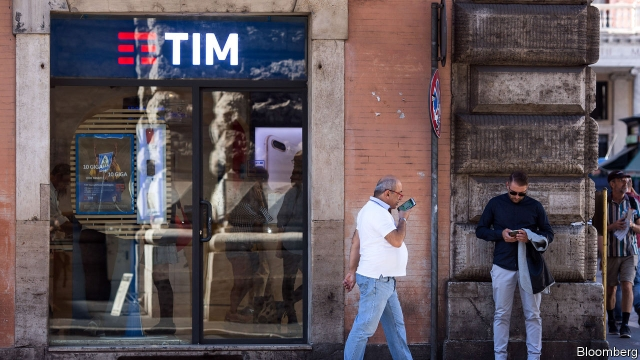

###### Wall Street comes to Milan

# Elliott and Vivendi fight over Telecom Italia 

##### Their feud illustrates how Italy’s corporate scene has changed 

 

> Mar 28th 2019 

TELECOM ITALIA is no stranger to shareholder feuds. Two years after it was privatised in 1997 Italy’s national operator, also known as TIM, was the subject of a hostile takeover which left it saddled with so much debt that it never fully recovered. It has gone through four chief executives in four years. Ownership of the company, which has a market value of €11bn ($12bn), is fragmented and unstable. On March 29th instability was expected to be on display once again at a general meeting. Shareholders were due to vote on a proposal by Vivendi, a French media conglomerate which owns 23.9% of TIM, to replace five directors put forward last May by Elliott, an American activist-investor fund with a 9.5% stake. The spat shows how corporate Italy is changing. 

One novelty is the nature of the antagonists. Both are newish shareholders; neither is Italian. Vincent Bolloré, who controls Vivendi, began building a stake in TIM in 2015, as part of a strategy to create a southern European media giant. Fellow billionaire Paul Singer of Elliott started amassing his fund’s stake last year (his fund also has a stake in Hyundai—see article). Rules enacted in the past decade to strengthen minority shareholders’ rights, for instance by allowing them to appoint board members, have made Italy “an ideal battleground” for activist investors, says Luca Enriques, professor of corporate law at Oxford University. 

This has helped bring altercations out from behind closed doors and into the open. François Goddard of Enders Analysis, a research firm, says they are “Wall Street style” encounters. Elliott has labelled Vivendi “a profoundly negative and harmful nuisance for the company”. Vivendi called Elliott an “unethical activist fund”, accusing it of “deceiving investors in many ways”. Three proxy advisers, firms which counsel shareholders on how to vote in general meetings (another import from across the Atlantic), recommended rejecting Vivendi’s proposal. Amid the rancour, TIM’s share price has fallen by 30% in the past year. 

It is not all change. Domestic investors with deep pockets remain scarce. And the Italian government resists making itself so. To blunt Vivendi’s clout, in 2017 it invoked Italy’s “golden power”, a law entitling it to intervene in strategically important sectors, including telecoms. Cassa Depositi e Prestiti, Italy’s state-controlled investment vehicle, this year doubled its stake in TIM to 9.8%. 

Governments and activist hedge funds make for strange bedfellows. Yet Cassa backs Elliott, partly because the fund wants to spin off TIM’s network infrastructure. That fits with the government’s hope to merge it with another network, Open Fiber, in which it has invested heavily. Luigi Gubitosi, TIM’s Elliott-backed boss, says he is open to a deal with Open Fiber, and has announced a network-sharing agreement with Vodafone, its biggest domestic competitor, to speed up the deployment of “fifth-generation” mobile-phone services across Italy. 

Mr Gubitosi wants TIM to become a “normal company”, by which he means one that sticks to a plan. Shareholders clashing over visions of future returns may herald a new normal. Wall Street would be proud. 

-- 

 单词注释:

1.Milan[mi'læn]:n. 米兰 

2.Elliott[]:n. 艾略特（姓氏） 

3.vivendi[]:[网络] 维旺迪；威望迪；法国维旺迪集团 

4.telecom['telәkɔm]:telecommunication 电信 

5.italia[i'tɑ:ljɑ:]:n. 意大利 

6.feud[fju:d]:n. 不和, 封地, 争执 vi. 长期不和, 擦亮 

7.corporate['kɒ:pәrit]:a. 社团的, 合伙的, 公司的 [经] 团体的, 法人的, 社团的 

8.telecom['telәkɔm]:telecommunication 电信 

9.italia[i'tɑ:ljɑ:]:n. 意大利 

10.shareholder['ʃєә.hәuldә]:n. 股东 [法] 股东, 股票持有人 

11.privatise[p'rɪvətɪs]:vt. 使私有化 

12.tim[tim]:n. 蒂姆（男子名） 

13.takeover[]:n. 接管, 接收 [经] 接收 

14.fully['fuli]:adv. 十分地, 完全地, 充分地 

15.instability[.instә'biliti]:n. 不安定, 不稳定 [医] 不稳定性 

16.conglomerate[kәn'glɒmәrit]:a. 聚成球形的, 砾岩性的 n. 集成物, 混合体, 砾岩 v. (使)凝聚成团 

17.novelty['nɒvәlti]:n. 新奇, 新鲜, 新奇的事物 

18.antagonist[æn'tægәnist]:n. 敌手, 对手 [化] 对抗物; 拮抗物; 反协同剂; 反协同试剂 

19.newish['nju:iʃ]:a. 尚新的 

20.Vincent['vinsәnt]:n. 文森特（男名） 

21.billionaire[.biljә'nєә]:n. 亿万富翁 

22.paul[pɔ:l]:n. 保罗（男子名） 

23.amass[ә'mæs]:vt. 积聚, 堆积 

24.enact[i'nækt]:vt. 制定法律, 扮演, 颁布 [法] 法令, 法规, 条例 

25.activist['æktivist]:n. 激进主义分子 

26.investor[in'vestә]:n. 投资者 [经] 投资者 

27.luca[]:n. 卢卡（男子名） 

28.enriques[]:[网络] 恩里克斯；恩里格斯 

29.Oxford['ɒksfәd]:n. 牛津, 牛津大学 

30.altercation[.ɒ:ltә'keiʃәn]:n. 争论, 争吵 

31.Goddard['^ɔdә:d]:[计] 戈达德 

32.ender[]:n. 安德（游戏中的人物名）；恩德（男子名） 

33.profoundly[prә'fajndli]:adv. 深深地, 深切地 

34.unethical[]:a. 不道德的 

35.proxy['prɒksi]:n. 代理, 代理人, 委托书 [经] 代理人, 代表权, 授权书 

36.adviser[әd'vaizә]:n. 顾问, 劝告者, 指导教师 [法] 顾问, 劝告者 

37.counsel['kaunsәl]:n. 商议, 忠告, 法律顾问 v. 商议, 劝告 

38.amid[ә'mid]:prep. 在其间, 在其中 [经] 在...中 

39.rancour['ræŋkә]:n. 敌意, 深仇 

40.blunt[blʌnt]:a. 钝的, 坦率的, 麻痹的 

41.clout[klaut]:n. 敲击, 破布 vt. 打补钉 

42.invoke[in'vәuk]:vt. 祈求, 恳求, 实行, 援引, 引起 [计] 调用; 请求 

43.intervene[.intә'vi:n]:vi. 插入, 调停, 干涉 [经] 进场干预 

44.strategically[strә'ti:dʒikәli]:adv. 在战略上, 颇策略地 

45.sector['sektә]:n. 扇形, 部门, 部分, 函数尺, 象限仪, 段, 区段 vt. 把...分成扇形 [计] 扇面; 扇区; 段; 区段 

46.telecom['telәkɔm]:telecommunication 电信 

47.cassa[]:abbr. Continental Army Command Automated System Support Agency <美国>大陆军队指挥部自动系统支援局 

48.E[i:]:[计] 元件, 部件, 元素, 误差, 执行, 表达式, 指数 

49.Prestiti[]:[网络] 军事公债 

50.bedfellow['bed.felәu]:n. 同床者, 伙伴 

51.infrastructure['infrәstrʌktʃә]:n. 基础结构, 基础设施 [经] 基础设施 

52.merge[mә:dʒ]:vt. 使合并, 使消失, 吞没 vi. 合并, 渐渐消失 [计] 合并 

53.fiber['faibә]:n. 纤维, 构造, 纤维制品 [化] 纤维 

54.luigi[]:n. （意）路易吉（男子名） 

55.gubitosi[]:古比托西 

56.vodafone[]:n. 沃达丰（英国电信企业） 

57.deployment[]:[计] 展开 

58.clash[klæʃ]:n. 冲突, 撞击声, 抵触 vi. 冲突, 抵触 vt. 使发出撞击声 [计] 对撞 

59.herald['herәld]:n. 使者, 传令官, 先驱 vt. 预报, 宣布, 传达, 欢呼 

