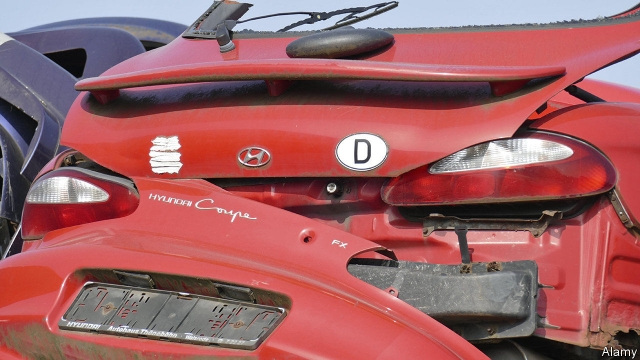

###### In need of a tune-up

# Hyundai is falling behind its Japanese and Western rivals 

##### The engine of South Korea’s car industry sputters 

 

> Mar 28th 2019 

THE OFFICES of the Asan car suppliers’ union resemble a bygone era. Walls are decorated with fading photographs of past protests. Cigarette smoke wafts from the foyer, where workers in overalls lounge on battered sofas enjoying a break between shifts. Most are well into middle age. Do Sung-dae, the union’s boss—shock of grey hair, horn-rimmed glasses, waistcoat heavy with pins supporting various causes—is locked in a struggle with Yoosung Enterprise, a parts-maker that employs its members in Asan, an industrial city south of the capital, Seoul. 

Korean parts-producers are being squeezed. More have filed for bankruptcy protection since last autumn than at any time since the financial crisis in 2008. Plenty, including Yoosung, claim they are fighting for survival. Their troubles are a symptom of a deepening crisis in the industry. At the industry’s centre is a single giant firm: Hyundai Motor. 

In 20 years Hyundai Motor (which also controls Kia) went from being barely known to the world’s fifth-biggest carmaker by churning out decent if unexciting cars that were cheaper than similar ones produced by Japanese or Western competitors. Like Asan’s union offices, however, it has failed to keep up with the times. 

Hyundai’s global sales were stagnant at 96.8trn won ($85bn) last year. Net profit declined in 2018 for the sixth year in a row. Since 2014 its shares have underperformed major peers such as Toyota, General Motors and Ford, measured in dollars. Some reasons for this lie beyond Hyundai’s control. A weak yen boosted Japanese producers. The trade dispute between America and China, as well as separate threats by President Donald Trump to impose additional tariffs on Korean cars, did not help. Its business in China was hit by a year-long Chinese boycott of South Korean products that followed a dispute over South Korea’s new missile-defence system in 2017. 

Many problems, though, are home-grown. Hyundai’s move upmarket in the past few years exposed it to fiercer competition. It missed the shift towards SUVs in Europe, America, and most recently China. Its Genesis brand has lagged behind in the highest-margin premium segment. Half of its production capacity in China currently sits idle—aggressive expansion may have more to do with this than the boycott, thinks James Lim of Dalton Investments, an asset manager. Rising labour costs at home, where it produces 40% of output, have crimped Hyundai’s ability to compete on price. “Customers still expect our cars to be cheaper than, say, a Volkswagen,” sighs Cho Won-hong, the firm’s chief strategist. 

Mr Cho wants to convince them to pay more, by betting on future technologies such as hydrogen fuel cells and loosely defined “integrated mobility” (car-sharing, autonomous vehicles and the like). Yet Hyundai channels 3% of sales to research and development, compared with 6% at Volkswagen or Toyota’s 4%, according to Bloomberg. Mr Cho will not say if Hyundai plans to ramp up spending, only that it will be “investing in the new value chain”. 

Some analysts blame the R&D shortfall on high labour costs. Others point to the old habits of the chaebol, the South Korean conglomerates of which Hyundai’s parent company is one of the biggest. In good times it ploughed spare cash from its carmaking arm on speculative property investments in Seoul’s glitzy Gangnam district and bought back a struggling construction company. 

Hidebound corporate governance at the firm and its parent have recently come under fire from activist investors. Last year Elliott, an American hedge fund, thwarted a restructuring plan that would have handed more power to Chung Eui-sun, son and heir apparent of Hyundai’s founder. But Elliott’s demands for higher dividends would have left even less for investment in the sort of technologies Mr Cho envisages. Last week Hyundai’s shareholders rejected Elliott’s proposal (and its candidates for board seats). If the group invests the savings in automotive innovation instead, Hyundai’s prospects may brighten again. 

-- 

 单词注释:

1.Hyundai[]:n. 现代（公司名, 韩国最大汽车企业） 

2.sputter['spʌtә]:n. 喷溅声, 劈啪声, 语无伦次 vi. 唾沫飞溅, 结结巴巴地讲, 发劈啪声 vt. 喷出, 飞溅出, 气急败坏地说 

3.asan[]:n. (Asan)人名；(俄、塞、罗)阿桑 

4.bygone['baigɒn]:n. 过去的事, 往事 a. 过去的 

5.waft[wɑ:ft]:vt. 随风传送, 使飘荡 vi. 飘荡 n. 吹拂, 飘荡 

6.foyer['fɔiei]:n. 门厅, 入门大堂 

7.batter['bætә]:v. 连续猛打（尤其指妇女），猛击 n. 面糊（食物），击球员，打击手 

8.waistcoat['weistkәut]:n. 西装背心, 马甲 

9.Seoul[sәul]:n. 汉城 

10.Korean[kә'riәn]:n. 朝鲜人, 朝鲜语 a. 朝鲜人的, 朝鲜语的 

11.bankruptcy['bæŋkrәptsi]:n. 破产者 [经] 破产, 倒闭 

12.kia[]:abbr. 阵亡（Killed in Action） 

13.carmaker['kɑ:,meikә(r)]:n. 汽车制造商 

14.churn[tʃә:n]:n. 搅乳器 v. 搅拌, 搅动 

15.unexciting[ˌʌnɪkˈsaɪtɪŋ]:a. 不令人兴奋的 

16.stagnant['stægnәnt]:a. 不流动的, 停滞的, 不景气的, 萧条的, 污浊的, 迟钝的 [经] 萧条的 

17.underperform[,ʌndәpә'fɔ:m]:vi.表现不佳,工作不如预期(或同行) vt.(股票等)运作差于(一般市场价格) 

18.peer[piә]:n. 同等的人, 匹敌, 贵族 vi. 凝视, 窥视, 费力地看, 隐现 vt. 与...同等, 封为贵族 

19.toyota[]:n. 日本丰田汽车（公司名） 

20.ford[fɒ:d]:n. 浅滩, 福特汽车 v. 涉过, 涉水 

21.yen[jen]:n. 日元(日本货币单位), 渴望, 嗜好 vi. 渴望 

22.producer[prә'dju:sә]:n. 生产者, 制作者, 制作人 [化] 发生器; (炉煤气)发生炉; 制气炉; 生产者 

23.tariff['tærif]:n. 关税, 关税表, 价格表, 收费表 vt. 课以关税 [计] 价目表 

24.upmarket[ˌʌpˈmɑ:kɪt]:a. 高级的, 高档的, 高端的 

25.suv[]:abbr. 多功能车（SportsUtilityVehicle）；小型单层水泡（small unilamellar vesicles） 

26.genesis['dʒenisis]:n. 发生, 起源, 创世记 [医] 生殖, 发生 

27.premium['pri:miәm]:n. 额外补贴, 奖金, 奖赏, 保险费 [医] 保险费 

28.currently['kʌrәntli]:adv. 现在, 当前, 一般, 普通 [计] 当前 

29.jame[]: 灰岩井 

30.lim[]:abbr. 潜象存储器（Latent Image Memory）；秘鲁利马机场的代号 

31.dalton['dɔ:ltәn]:[化] 道尔顿(质量单位,等于一氧原子的1/16) [医] 道尔顿(质量单位) 

32.asset['æset]:n. 资产, 有益的东西 

33.crimp[krimp]:n. 诱人当兵的人, 拳曲, 鬈发 vt. 诱...去当兵, 使拳曲, 使有褶 

34.volkswagen['fɔ:lks,vɑ:^әn]:n. 大众汽车（财富500强公司之一） 

35.cho[]:abbr. 首席人事官（Chief Human resources Officer） 

36.strategist['strætidʒist]:n. 战略家 

37.loosely['lu:sli]:adv. 松弛地, 宽松地, 不紧 

38.mobility[mәu'biliti]:n. 可动性, 流动性, 机动性 [化] 迁移率 

39.bloomberg[]: [人名] 布隆伯格 

40.ramp[ræmp]:n. 斜坡, 坡道, 敲诈 vi. 狂跳乱撞, 乱冲, 敲诈, 蔓延 vt. 使有斜面, 敲诈 

41.analyst['ænәlist]:n. 分析者, 精神分析学家 [化] 分析员; 化验员 

42.shortfall['ʃɒ:tfɒ:l]:n. 不足, 不足量 [经] 缺少, 不足, 亏舱运费 

43.chaebol['tʃæbəul]:n. 韩国大企业；韩国财阀 

44.conglomerate[kәn'glɒmәrit]:a. 聚成球形的, 砾岩性的 n. 集成物, 混合体, 砾岩 v. (使)凝聚成团 

45.carmaking[]:[网络] 汽车制造 

46.speculative['spekjuleitiv]:a. 思索性的, 投机的, 推测的 [经] 投机的, 冒险的 

47.glitzy['^litsi]:a. <美><加> 闪光的, 耀眼的, 眩目的 

48.Gangnam[]:[网络] 江南；江南区；首尔江南 

49.hidebound['haidbaund]:a. 思想偏狭顽固的, 死板的, 量小的 [医] 绷紧的, 包紧的(皮肤) 

50.corporate['kɒ:pәrit]:a. 社团的, 合伙的, 公司的 [经] 团体的, 法人的, 社团的 

51.governance['gʌvәnәns]:n. 统治, 统辖, 管理 [法] 统治, 管理, 支配 

52.activist['æktivist]:n. 激进主义分子 

53.investor[in'vestә]:n. 投资者 [经] 投资者 

54.Elliott[]:n. 艾略特（姓氏） 

55.thwart[θwɒ:t]:a. 横放的 vt. 反对, 阻挠, 横过 prep. 横过 adv. 横过 

56.restructuring[]:[计] 重构的 

57.chung[]:n. 钟, 宗, 忠, 聪 

58.founder['faundә]:n. 创立者, 建立者 vt. 使沉没, 使摔倒, 弄跛, 浸水, 破坏 vi. 沉没, 摔到, 变跛, 倒塌, 失败 

59.dividend['dividend]:n. 被除数, 股利 [计] 被除数 

60.les[lei]:abbr. 发射脱离系统（Launch Escape System） 

61.envisage[in'vizidʒ]:vt. 面对, 正视, 想象 

62.shareholder['ʃєә.hәuldә]:n. 股东 [法] 股东, 股票持有人 

63.automotive[.ɒ:tәu'mәutiv]:a. 汽车的 

64.innovation[.inәu'veiʃәn]:n. 改革, 创新 [法] 创新, 改革, 刷新 

