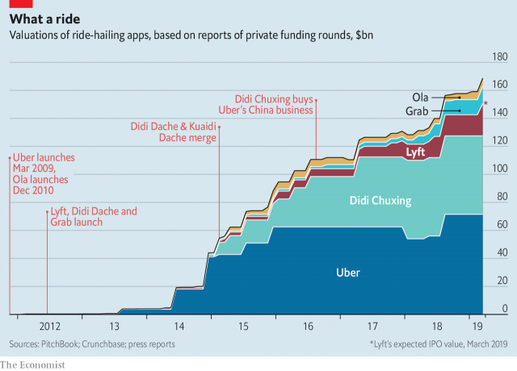

###### A unicorn stampede

# Lyft will be the first ride-hailing company to float its shares 

##### It belongs to a particularly fertile subspecies of the mythical $1bn-plus startups 

 

> Mar 28th 2019 

UNICORNS ARE horned mythical creatures that do not exist. In the world of technology they have multiplied in recent years, at least if you define them as privately held startups valued at more than $1bn. Some 330 such firms exist globally, according to cbInsights, a data provider. All told, venture capitalists value them above $1trn. Ride-hailing apps, which allow passengers to summon cars driven by their owners, form a particularly fertile subspecies. As The Economist went to press on March 29th one of these “taxicorns”, Lyft, was about to float its shares on the Nasdaq exchange in New York at a price which would value the firm at more than $23bn. Should the listing succeed, as analysts expect, other unicorns will rush to the stockmarket. Uber, the world’s biggest ride-hailing firm, is likely to do so in a few weeks (on March 26th it bought Careem, a Middle Eastern rival, for $3.1bn). Other candidates include Pinterest, which lets users create digital pin-boards, and Slack, a corporate messaging service. Once they list, of course, companies cease to be unicorns. Will the magic disappear, too? 

-- 

 单词注释:

1.unicorn['ju:nikɔ:n]:n. 似马的独角兽 [医] 单角的 

2.stampede[stæm'pi:d]:v. (使)惊跑, (使)蜂拥 n. 惊跑, 蜂拥 

3.lyft[]:[网络] 散落 

4.subspecies['sʌb.spi:ʃi:z]:n. 亚种 

5.mythical['miθikә l]:a. 神话的, 存在于神话中的, 神话式的, 不真实的, 虚构的, 幻想出来的 

6.startup[]:[计] 启动 

7.privately[]:adv. 秘密地；私下地 

8.globally[]:[计] 全局地 

9.datum['deitәm]:n. 论据, 材料, 资料, 已知数 [医] 材料, 资料, 论据 

10.provider[prә'vaidә]:n. 供应者, 供养人, 伙食承办人 [计] 提供器 

11.capitalist['kæpitәlist]:n. 资本家, 资本主义者 a. 资本主义的 

12.APP[]:[计] 应用, 应用程序; 相联并行处理器 

13.summon['sʌmәn]:vt. 召唤, 召集, 号召, 振奋, 唤起, 鼓起 [经] 传唤, 传讯 

14.economist[i:'kɒnәmist]:n. 经济学者, 经济家 [经] 经济学家 

15.nasdaq['næz,dæk]:abbr. 全国证券交易商自动报价系统协会（National Association of Securities Dealers Automated Quotation） 

16.york[jɔ:k]:n. 约克郡；约克王朝 

17.analyst['ænәlist]:n. 分析者, 精神分析学家 [化] 分析员; 化验员 

18.stockmarket[s'tɒkmɑ:kɪt]: 证券市场; 证券交易所; 证券行情 

19.uber['ju:bә]:[医] 乳房 

20.Pinterest[]:[网络] 品趣志；兴趣钉板；图片分享社交应用 

21.slack[slæk]:n. 松弛, 松懈, 淡季, 闲散, 家常裤 a. 松弛的, 不流畅的, 疏忽的, 无力的, 呆滞的, 软弱的, 漏水的 adv. 马虎地, 缓慢地 vt. 放松, 使缓慢 vi. 松懈, 减弱, 松弛 

22.corporate['kɒ:pәrit]:a. 社团的, 合伙的, 公司的 [经] 团体的, 法人的, 社团的 

