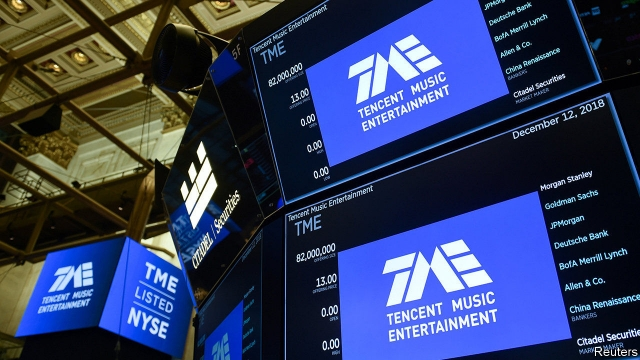
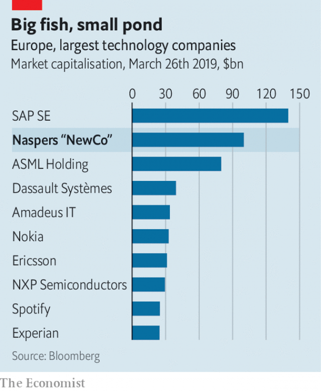

###### Going Dutch

# Naspers plans to spin off its Tencent stake and other holdings 

##### The South African media conglomerate has outgrown its domestic stock exchange 

 

> Mar 30th 2019 

EUROPEANS ARE keen users of the internet, but you would not know it looking at a list of the world’s biggest companies peddling stuff and services online. The continent’s failure to spawn an Amazon or Alibaba—the top 20 most valuable internet firms are either American or Chinese—has long been a blemish on Europe’s collective self-esteem. That will soon change. On March 25th Naspers, a South African media group, announced it would spin off a company made up of its investments in tech firms and list it in Amsterdam. Europe, at last, will have a tech giant of its own. 

Sort of. The new firm will certainly be big: analysts expect NewCo, as the outfit is being dubbed until branding consultants come up with an even less inspiring name, will boast a market value of around $100bn. But what would be Europe’s second-biggest technology firm (see chart) will have little to do with Europe or its consumers. Most of its value will be down to the purchase in 2001 by Naspers of one-third of Tencent, a Chinese group best known for its ubiquitous WeChat app, for $32m. The 31% stake it still owns is now worth $133bn. 

Naspers, which started out as an Afrikaans newspaper group a century ago, has since gone on to invest in a host of startups, mostly in emerging markets. The runaway success of Tencent has created an enviable headache: Naspers has become too big for the Johannesburg stock exchange, where it now makes up a quarter of the local index. Such scale requires foreign investors, not all of whom are keen on South Africa’s currency and political risk. Amsterdam, where Naspers already has staff, has similar listing requirements to Johannesburg. 

 

Splitting the group and relocating part of it to Europe should help close the gap between the value of the stakes in businesses Naspers owns, such as Tencent, and its market capitalisation, which is lower. By the company’s own reckoning, the discount has widened from around 25% four years ago to over 40%. Some of this is inevitable: Naspers couldn’t sell its stake in Tencent without paying taxes, for example. But it looks embarrassing for executives when investors ascribe little value to anything other than its star equity holding. 

Others know the feeling. SoftBank, a Japanese conglomerate, owns just under a third of Alibaba but gets (in its view) insufficient recognition from investors for its other businesses, like Sprint, an American telecoms firm, or a holding in a $100bn venture-capital fund that has rained money onto fashionable startups. Yahoo, an internet pioneer, has been renamed Altaba, a portmanteau of “alternative Alibaba”. By the time Yahoo’s bosses sold its operations to Verizon in 2017, keeping mainly its Alibaba stake, investors treated the stock as a back door to the Chinese firm. 

Naspers has no plans to go that far. It will retain 75% of NewCo when it lists it later this year, and has not given up trying to replicate its Tencent jackpot. An investment in Flipkart, an Indian online retailer, made handsome returns when that firm was sold to Walmart last year, for example. The next wager on Europe, anyone? 

-- 

 单词注释:

1.Dutch[dʌtʃ]:n. 荷兰人, 荷兰语 a. 荷兰的 

2.Tencent[]:[网络] 腾讯；腾讯公司；腾讯控股 

3.holding['hәuldiŋ]:n. 把持, 支持, 保持 [法] 租借地, 占有物, 拥有的财产 

4.conglomerate[kәn'glɒmәrit]:a. 聚成球形的, 砾岩性的 n. 集成物, 混合体, 砾岩 v. (使)凝聚成团 

5.outgrow[.aut'grәu]:vt. 过大而不适于, 长得比...高(或大、快), 成长得不再具有... 

6.peddle['pedl]:vi. 挑卖, 沿街叫卖, 游荡, 闲混 vt. 叫卖, 兜售, 散播 

7.online[]:[计] 联机 

8.spawn[spɒ:n]:n. (鱼)卵, 产物 vt. 产卵, 酿成, 大量生产 vi. 产卵, 大量生产 

9.amazon['æmәzɒn]:n. 亚马孙河 [医] 无乳腺者 

10.blemish['blemiʃ]:n. 污点, 缺点 vt. 弄脏, 玷污, 损害 

11.tech[tek]:n. 技术学院或学校 

12.Amsterdam[.æmstә'dæm]:n. 阿姆斯特丹(荷兰首都) 

13.analyst['ænәlist]:n. 分析者, 精神分析学家 [化] 分析员; 化验员 

14.newco[]:[网络] 新公司；新酷；新的公司 

15.outfit['autfit]:n. 用具, 配备, 机构 vt. 配备, 供应 vi. 得到装备 

16.dub[dʌb]:vt. 配音, 轻点, 授予称号, 击 n. 一下击鼓声, 笨蛋 

17.les[lei]:abbr. 发射脱离系统（Launch Escape System） 

18.ubiquitous[ju:'bikwitәs]:a. 无所不在的, 到处存在的, 普遍存在的 

19.WeChat[]:[网络] 微信；微讯；腾讯微信 

20.APP[]:[计] 应用, 应用程序; 相联并行处理器 

21.Afrikaans[.æfri'kɑ:ns]:n. 南非荷兰语 

22.startup[]:[计] 启动 

23.runaway['rʌnә.wei]:n. 逃跑, 逃走的人, 逃亡, 压倒性的优胜 a. 逃亡的, 逃走的 

24.enviable['enviәbl]:a. 令人羡慕的, 可羡慕的 

25.Johannesburg[dʒәu'hænisbә:^]:约翰内斯堡[南非(阿扎尼亚)东北部城市] 

26.investor[in'vestә]:n. 投资者 [经] 投资者 

27.relocate[ri:'lәukeit]:vt. 重新安置, 再配置, 放在新地方 [计] 再定位; 浮动 

28.capitalisation[,kæpitәlai'zeiʃən;-li'z-]:n. <主英>=capitalization 

29.reckon['rekәn]:vt. 计算, 总计, 估计, 认为, 猜想 vi. 数, 计算, 估计, 依赖, 料想 

30.equity['ekwiti]:n. 公平, 公正 [经] 权益, 产权 

31.softbank['sɒftbæŋk]: 日本最大的软件销售商 

32.alibaba[]:n. 阿里巴巴（公司名） 

33.sprint[sprint]:n. 短距离赛跑 vi. 全速跑, 冲刺 vt. 全速跑过 

34.telecom['telәkɔm]:telecommunication 电信 

35.yahoo[jә'hu:]:n. 人面兽心的人, 乡愚, 粗汉 

36.rename[.ri:'neim]:vt. 重新命名, 再命名, 给...改名 [计] 重命名; DOS内部命令:更改文件名 

37.portmanteau[pɒ:t'mæntәu]:n. 手提箱 a. 多用的, 混合的 

38.verizon[]:n. 威瑞森（全成威瑞森无线通讯, 是美国第一家提供320万像素照相手机配套销售的无线营运商） 

39.replicate['replikeit]:vt. 折叠, 折转, 复制 n. 复现试验, 复制品, 高八度音 a. 复现的, 复制的, 折转的, 弯回的 

40.jackpot['dʒækpɔt]:n. 最大赌注, (彩票的)头奖, 最大成功, 意外的成功/奖赏, 困境 

41.Flipkart[]:[网络] 印度 

42.retailer['ri:teilә]:n. 零售商人, 传播的人 [经] 零售商 

43.walmart['wɔlma:t]: 沃尔玛（世界连锁零售企业） 

44.wager['weidʒә]:n. 赌注, 赌博, 赌物 vt. 下赌注, 向...保证 vi. 打赌 

