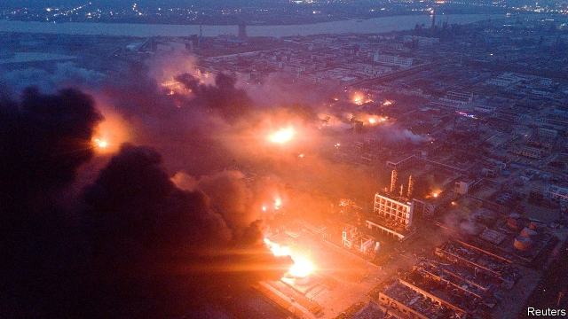

###### Industrial disaster

# A devastating explosion at a factory in China 

##### The local government is blamed for slack supervision 

 

> Mar 28th 2019 

AN EXPLOSION on March 21st at a pesticide factory in Xiangshui county, Jiangsu province, killed at least 78 people and injured more than 600 others. It was China’s deadliest industrial accident since 2015. The government blamed local officials and the company, Tianjiayi Chemical, for failing to learn lessons from safety violations at the plant. 

-- 

 单词注释:

1.devastate['devәsteit]:vt. 毁坏 [法] 使荒废, 毁灭, 掠夺 

2.slack[slæk]:n. 松弛, 松懈, 淡季, 闲散, 家常裤 a. 松弛的, 不流畅的, 疏忽的, 无力的, 呆滞的, 软弱的, 漏水的 adv. 马虎地, 缓慢地 vt. 放松, 使缓慢 vi. 松懈, 减弱, 松弛 

3.supervision[.sju:pә'viʒәn]:n. 监督, 管理 [经] 监督, 管理 

4.pesticide['pestisaid]:n. 杀虫剂 [化] 农药 

5.Jiangsu['dʒjɑ:ŋ'su:]:江苏(位于中国东部沿海、长江下游) 

6.violation[.vaiә'leiʃәn]:n. 违反, 违背, 妨碍 [法] 违犯, 违背, 违反 

