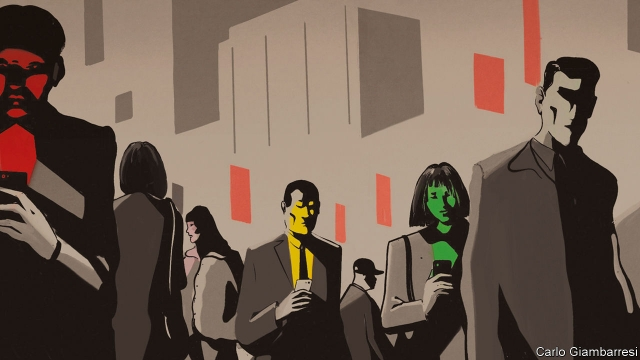

###### Keeping tabs

# China’s “social credit” scheme involves cajolery and sanctions 

##### Some people shrug it off, others worry 

 

> Mar 28th 2019 

JUST OVER a year ago, the eastern city of Suqian announced a plan to score the “trustworthiness” of every adult resident. Everyone would start with 1,000 points. They could get more for performing good deeds, such as voluntary work, giving blood, donating bone-marrow or being a model worker. Points would be deducted for bad behaviour such as defaulting on loans, late payment of utility bills, breaking the rules of the road or being convicted of a crime. Scores would be recalculated monthly and allow residents to be sorted into eight categories, from AAA (model citizen) to D (untrustworthy). 

Suqian calls the system “Xichu Points”, after the ancient kingdom of Western Chu to which the area once belonged. It appears to be up and running. A government office in the city offers leaflets explaining how it works. Residents can look up their rating by entering their identity-card number into a mini-app running on WeChat, a popular instant-messaging programme. Their score is indicated by a virtual pointer on a dial that is coloured green at one extreme and red at the other. Scorers at the green end can receive rewards, such as a discount of up to 80 yuan ($12) a month on local-transport passes and admission to hospital without having to pay a deposit. 

Such citizen-scoring schemes are still uncommon. But in recent years a growing number of towns and cities have been experimenting with them. Officials often describe them in ways that suggest a relationship with the central government’s efforts in recent years to set up a “social credit” scheme. Last October America’s vice-president, Mike Pence, called this “an Orwellian system premised on controlling virtually every facet of human life”. Those who see it this way often point to the scoring of citizens by cities, as well as a separate national project that involves putting people on government “blacklists”, as evidence. So far neither has proved as dystopian as Mr Pence suggests. In Suqian, it is hard to find anyone who has heard of Xichu Points, and harder still to find someone who says it has made any difference to them. But they have worrying dimensions. 

The central government began mulling plans for a social-credit system early this century, says Rogier Creemers of Leiden University in a paper on the topic. It was responding to rising public anger over officials’ failure to curb the dishonesty that had become rampant in many walks of life: everything from fraud and academic plagiarism to shoddy construction and the selling of dangerous fake goods. In a blueprint published in 2014 the government said the project would involve centralising data that it holds on citizens and businesses (the document set out broad plans for the years until 2020, but did not specify exactly what would be in place by that date). The authorities are issuing every company and organisation a social-credit registration number. For firms, this will replace the panoply of numbers they use to identify themselves to various agencies, such as the tax bureau and industry regulators. There is no known plan to create a system such as Xichu Points at the national level by giving all citizens a score based on their day-to-day behaviour. 

For now the data being collated nationally are being put to use in two main ways. The first is to aid the development of a financial credit-rating industry. This will probably result in a financial scoring-system similar to those widely used in other countries. The second is to tighten the enforcement of existing laws. China’s police can respond rapidly to perceived threats to the party’s grip. But in other domains the state’s power is more limited. People commonly fail to pay workers, defy court orders or default on debts by decamping to other provinces or starting new businesses in different industries. 

The blacklists are supposed to remedy this. Since 2013 the judiciary has been compiling the names of people who have defied a court order, for example by failing to pay debts or fines, or to issue an apology to an injured party. In 2016 other departments agreed to help penalise these people by preventing them from buying plane or bullet-train tickets or staying in luxury hotels, as well as joining the civil service, taking senior jobs in state-owned firms or starting companies in the food or drugs industries. More than 12m people are on this blacklist; they have been denied more than 17m plane tickets and 5m for bullet trains. They will remain on the list until courts are satisfied they have complied with orders. 

The government has since encouraged ministries and regulators to draw up their own blacklists of people and businesses who have broken rules (such as ones relating to health, safety or the environment). Those named will not all suffer sanctions as harsh and wide-ranging as those imposed on people blacklisted by courts. But they will be subject to greater scrutiny, and in some cases outright restrictions, when dealing with other arms of government. 

In 2015 and 2016 the central government encouraged 43 cities to carry out their own experiments with social credit. Most of them have done this mainly by ensuring better co-ordination between departments in order to help national schemes, such as the blacklists, work efficiently. But in a few places such as Suqian officials have devised other projects under the banner of social credit. These are aimed at nudging individuals and businesses to behave in a more civic-minded way. They use rewards, not punishments, to achieve this. 

In Suqian a person’s score is supposed to rise and fall according to published criteria—20 points for a blood donation, 20 points (at least) deducted for failing to pay a power bill, and so on. A city employee selling bus passes needs a moment to recall the details. She says very few people have enough “credit” to claim a discount on public transport (only 3,000 have, according to state media, in a city of nearly 5m people). When asked about how Xichu Points works, a nurse staffing a blood-donation bus also scratches her head. 

Scoring systems in other places have also proved unremarkable. In 2017 Hangzhou, a coastal city, released an app which claims to combine five categories of government-held data in order to produce a single number for each user. It is called Qianjiang Score, after a local river. High-scorers find it slightly easier to book municipal sports facilities, among other uninspiring gifts. Since late 2018 residents of Xiamen, a coastal city further south, have been encouraged to look up their “Egret Score”. High-achievers benefit from slightly cheaper parking and the right to borrow more library books. 

Officials in Suqian had begun trying to improve public behaviour long before the party leapt on the social-credit bandwagon. Their aim was to get Suqian recognised as a “civilised city” by the central government—an award that many local administrations yearn for. Billboards across the city advertise a list of 20 rules of etiquette. They include not wearing pyjamas in public, not staring at one’s phone while in company and not encouraging others to drink to excess. There are video screens at many road junctions displaying the names and images of jaywalkers caught by cameras that appear to recognise faces. On a recent weekday they were all being used to shame two people, a Mr Dai and a Mr Wang (their full names were masked). 

On one of Suqian’s main streets two city-management officers sit inside a booth identifying itself as a “Trustworthy Neighbourhood Service Centre”. One of their jobs—unconnected with the Xichu Points scheme—is to assess the integrity of shop owners along two central roads. Points are docked or added depending on how far proprietors succeed in keeping displays neat and surrounding pavements clear. Inspectors’ photos flash up on a big screen next to the booth. Offending items, such as unsightly sale signs, are circled in red. The screen also lists the shops in ranking order. The officers say that well-behaved ones can enjoy free advertising space on digital displays. A shopkeeper says that owners of low-scoring establishments risk being summoned for a lecture by officials. 

There is no sign that such schemes have strayed beyond the creepy paternalism that is often exhibited by local governments and that is just as often shrugged off by local residents. They look like little more than propaganda exercises aimed at emphasising the importance of “trustworthiness”, says Jeremy Daum, a Beijing-based fellow of Yale Law School. As for the national blacklists, the only way to land on them is by breaking the law, not by accumulating “bad credit”, he notes. 

But the way China is setting up systems relating to social credit appears open to abuse. In some places government offices that manage petitions submitted by citizens seeking redress of injustices say they will put people on blacklists if they “cause disturbances” while doing so. That seems open to arbitrary interpretation (local officials often treat small peaceful gatherings as disturbances). Appeals systems are supposed to be in place, but challenging government rulings is very rarely successful in China. The Xichu system does not seem fair, at least as it appears on paper: among rewards for the best-behaving citizens is “priority service” in emergency wards. One employee at a government office says that “of course” people with low Xichu scores can expect to suffer consequences. The Xichu system’s published rules do not specify what these might be. 

At the national level, too, the social-credit scheme has several disturbing aspects. China has a poor record of data security. Centralised databases could become honeypots for hackers. The blacklists raise questions about the proportionality of punishments. The government’s project may help curb some social ills about which the public grumbles, but it could also infringe on people’s rights. 

-- 

 单词注释:

1.tab[tæb]:n. 制表(键), 搭襻, 标号, 调整片, (易拉罐)拉环, 帐单, 标签, 制表符 [计] 标签, 制表符, TAB键 

2.cajolery[kә'dʒәulәri]:n. 诱骗, 甜言蜜语 

3.sanction['sæŋkʃәn]:n. 核准, 制裁, 处罚, 约束力 vt. 制定制裁规则, 认可, 核准, 同意 

4.Suqian[]:宿迁（中国地名）  

5.trustworthiness['trʌst.wә:ðinis]:n. 可信赖, 确实性 

6.donate['dәuneit]:v. 捐赠 

7.deduct[di'dʌkt]:vt. 扣除, 减去 [经] 扣除, 减去, 折扣 

8.default[di'fɒ:lt]:n. 违约, 不履行责任, 缺席, 默认值 v. 疏怠职责, 缺席, 拖欠, 默认 [计] 默认; 默认值; 缺省值 

9.convict[kәn'vikt]:n. 囚犯, 罪犯 vt. 宣告有罪, 使知罪 

10.recalculate[ri:'kælkjuleit]:vt. 重新计算, 重新估计 

11.AAA[]:[医] 急性焦虑发作 

12.untrustworthy[.ʌn'trʌstwә:ði]:a. 不能信赖的, 靠不住的 

13.chu[]:abbr. 摄氏热单位（Centigrade Heat Unit） 

14.leaflet['li:flit]:n. 小叶, 传单 [医] 小叶 

15.WeChat[]:[网络] 微信；微讯；腾讯微信 

16.pointer['pɒintә]:n. 指示物, 教鞭, 暗示, 指针 [计] 指针 

17.scorer['skɒ:rә]:n. 记录员, 刻痕者 

18.uncommon[.ʌn'kɒmәn]:a. 不寻常的, 非凡的, 罕有的 adv. 不平常地 

19.mike[maik]:vi. 偷懒, 游手好闲 n. 休息, 游手好闲, 扩音器, 话筒 

20.Orwellian[ɔ:'weliәn]:George Orwell的笔调或用字的, 受严格统治而失去人性的社会, 赞成上述社会的人 

21.premise['premis]:n. 前提, 房屋连地基, 上述各项 vt. 预先提出, 引出, 作为...的前提 vi. 作出前提 

22.facet['fæsit]:n. (多面体的)面, 方面, 琢面 [医] 小平面, 小面 

23.blacklist['blæklist]:n. 黑名单 

24.dystopian[dis'tәjpiәn]:a. 反面乌托邦的,反面假想国的  n. 反面乌托邦的鼓吹者(或描写者) 

25.mull[mʌl]:n. 软薄布, 混乱 vt. 研磨, 细想 vi. 深思熟虑 

26.rogier[]: [人名] 罗吉尔 

27.leiden['laidən]:n. 莱顿市（荷兰西部城市）；莱顿（大学名称） 

28.curb[kә:b]:n. 抑制, 勒马绳, 边石 vt. 抑制, 束缚, 勒住 

29.dishonesty[dis'ɒnisti]:n. 不诚实 [法] 不诚实, 诈欺, 不正 

30.rampant['ræmpәnt]:a. 猖獗的, 蔓生的, 猛烈的, 跃立作扑击状的 

31.fraud[frɒ:d]:n. 欺骗, 欺诈, 诡计, 骗子 [经] 欺诈, 舞弊, 骗子 

32.plagiarism['pleidʒiәrizm]:n. 剽窃, 抄袭, 剽窃物 [法] 抄袭, 剽窃, 剽窃作品 

33.shoddy['ʃɒdi]:a. 用长弹毛做的, 以次充好的 n. 长弹毛, 软再生毛, 赝品 

34.fake[feik]:n. 假货, 欺骗, 诡计 a. 假的 vt. 假造, 仿造 vi. 伪装 

35.blueprint['blu:'print]:n. 蓝图, 设计图, (周详的)计划 vt. 制成蓝图, 计划 

36.centralise['sentrәlɑiz]:vt. 形成中心, 把统治权集中于中央, 把...集中起来, 成为...的中心, 集中 

37.datum['deitәm]:n. 论据, 材料, 资料, 已知数 [医] 材料, 资料, 论据 

38.organisation[,ɔ: ^әnaizeiʃən; - ni'z-]:n. 组织, 团体, 体制, 编制 

39.registration[.redʒi'streiʃәn]:n. 登记, 挂号, 注册 [计] 登记; 定位; 对齐; 记录 

40.panoply['pænәpli]:n. 全套披甲, 全幅盔甲, 华服美饰 

41.regulator['regjuleitә]:n. 调整者, 校准者, 校准器, 调整器, 标准钟 [化] 调节剂; 调节器 

42.collate[kә'leit]:vt. 校对, 校勘 [计] 整理 

43.nationally['næʃәnәli]:adv. 作为整个民族, 举国一致地, 全国性地 

44.tighten['taitn]:vt. 勒紧, 使变紧 vi. 变紧, 绷紧 

45.enforcement[in'fɒ:smәnt]:n. 执行, 强制 [法] 实施, 加强, 厉行 

46.domain[dәu'mein]:n. 领域, 领土, 产业, 范围 [计] 域, 区域, 支配命令 

47.defy[di'fai]:vt. 藐视, 挑衅, 使落空 n. 挑战 

48.decamp[di'kæmp]:vi. 撤营, 逃走, 逃亡 [法] 撤退, 逃走, 逃亡 

49.judiciary[dʒu:'diʃiәri]:a. 司法的, 法院的, 法官的 n. 司法部, 司法系统, 法官 

50.penalise[]:vt. 对...处以刑罚/刑事惩罚, 惩罚, 处罚, 使处于严重不利地位 

51.comply[kәm'plai]:vi. 顺从, 依从 [法] 遵守, 承诺, 照做 

52.scrutiny['skru:tini]:n. 细看, 仔细检查, 监视, 选票检查 [经] 复查, 评核, 仔细检查 

53.outright['autrait]:a. 率直的, 完全的, 总共的, 直率的 adv. 完全地, 率直地, 立刻地, 一直向前 

54.efficiently[i'fiʃәntli]:adv. 生效, 能胜任, 有能力, 效率高, 有效 

55.nudge[nʌdʒ]:n. 用肘轻推, 推动, 讨厌家伙 

56.donation[dәu'neiʃәn]:n. 捐赠物, 捐款, 捐赠 [经] 赠品, 捐款, 捐赠 

57.staffing['stɑ:fiŋ]:[计] 人员指挥 [经] 配备职工 

58.unremarkable['ʌnri'mɑ:kәbl]:a. 不显著的, 平凡的, 不值得注意的 

59.hangzhou['hɑ:ŋ'dʒәj]:n. 杭州 

60.coastal['kәustәl]:a. 海岸的, 沿海的, 沿岸的 [法] 海岸的, 沿海的 

61.APP[]:[计] 应用, 应用程序; 相联并行处理器 

62.Qianjiang[]:潜江（中国地名）  

63.municipal[mju:'nisipl]:a. 市政的, 自治区的, 内政的 [经] 市政的, 市的 

64.uninspiring[ˌʌnɪnˈspaɪərɪŋ]:a. 引不起兴趣的, 无鼓舞作用的, 无指望的 

65.Xiamen['ʃjɑ:'men]:厦门[福建省](旧译Amoy) 

66.egret['i:gret]:n. 白鹭 

67.bandwagon['bænd.wægәn]:n. 乐队彩车, 流行 

68.civilise['sivilaiz]:vt. 开化, 使文明, (非正式)教化, 使文雅, 教育, 教导 vi. 变成文明社会 

69.yearn[jә:n]:vi. 渴望, 想念, 怀念, 同情 

70.billboard['bilbɒ:d]:n. 广告牌, 布告板 vt. 宣传 

71.etiquette[eti'ket]:n. 礼仪, 礼节, 成规 [法] 规则, 成规, 礼节 

72.pyjama[pә'dʒɑ:mә, pi-]:n. 睡衣裤, 宽松裤 

73.junction['dʒʌŋkʃәn]:n. 连接, 会合处, 交叉点 [医] 接[合]处, 接点.[接]界 

74.jaywalker['dʒeɪwɔ:kə(r)]: 乱穿马路的人 

75.dai[dai]:abbr. 直接存取情报（Direct Access Information） 

76.wang[]:n. 王（姓氏）；王安电脑公司 

77.trustworthy['trʌst.wә:ði]:a. 可信赖的 [法] 可信任的, 可靠的, 可信赖的 

78.integrity[in'tegriti]:n. 正直, 廉正, 完整 [计] 完整性 

79.proprietor[prә'praiәtә]:n. 所有者 [经] 所有人, 资本主, 业主 

80.unsightly[ʌn'saitli]:a. 不悦目的, 不雅观的, 难看的, 丑陋的 

81.advertising['ædvәtaiziŋ]:n. 广告业, 广告 a. 广告的 [计] 发广告 

82.summon['sʌmәn]:vt. 召唤, 召集, 号召, 振奋, 唤起, 鼓起 [经] 传唤, 传讯 

83.stray[strei]:n. 走失的家畜, 浪子 a. 迷途的, 偶然的 vi. 迷路, 彷徨, 流浪 

84.creepy['kri:pi]:a. 爬行的, 令人毛骨悚然的 

85.paternalism[pә'tә:nәlizm]:n. 家长式作风, 家长式统治 [经] 家长作风 

86.propaganda[.prɒpә'gændә]:n. 宣传, 宣传活动 [医] 宣传 

87.emphasise[]:vt. 强调, 重读, 加强...的语气, 着重 

88.jeremy['dʒerimi]:n. 杰里米（男子名） 

89.daum[]: [人名] 多姆 

90.Yale[jeil]:n. 耶鲁 

91.petition[pi'tiʃәn]:n. 请愿, 诉状, 陈情书, 申请, 祈求, 祷文 v. 正式请求, 恳求, 请愿 

92.redress[ri'dres]:n. 赔偿, 补救, 矫正 vt. 纠正, 赔偿, 救济 

93.injustice[in'dʒʌstis]:n. 不公平, 非正义的行为 [法] 不公正, 不公平, 权利侵害 

94.disturbance[dis'tә:bәns]:n. 扰乱, 不安, 忧虑 [化] 扰动; 干扰; 失调 

95.gathering['gæðәriŋ]:n. 聚集, 集中, 采集 [化] 富集 

96.ruling['ru:liŋ]:n. 判决, 裁定, 统治 a. 统治的, 支配的, 普遍的 

97.honeypot[ˈhʌnipɒt]:n. 装蜜的罐子; 极有吸引力的事物 

98.hacker['hækә]:[计] 计算机窃贼, 计算机新技术挑战者, 黑客 

99.proportionality[prә,pɔ:ʃә'næliti]:n. 比例性, 相称, 均衡性 [机] 比例, 均整 

100.grumble['grʌmbl]:n. 怨言, 满腹牢骚 vi. 抱怨, 发牢骚, 发隆隆声 vt. 抱怨 

101.infringe[in'frindʒ]:v. 破坏, 侵犯, 违反 

