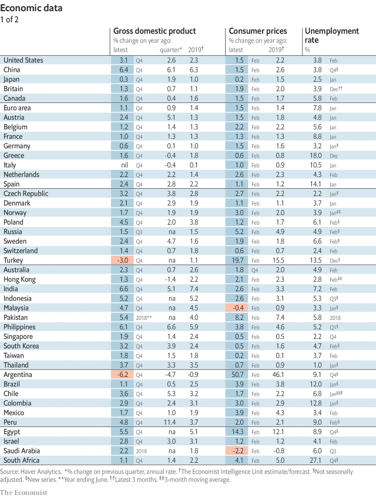
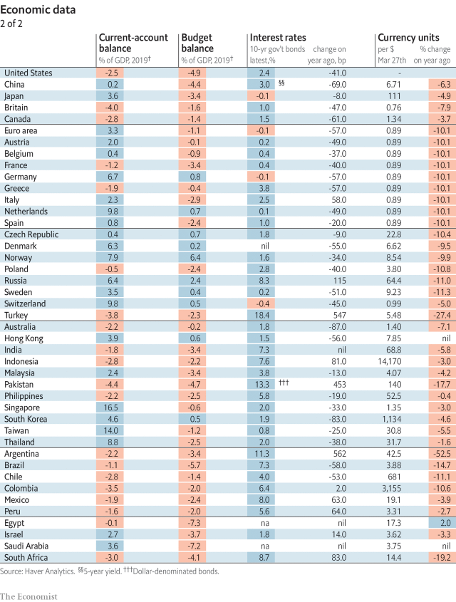
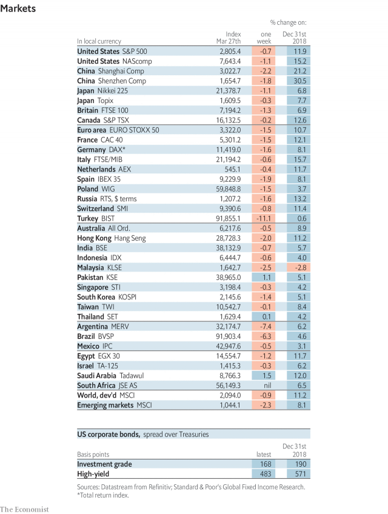
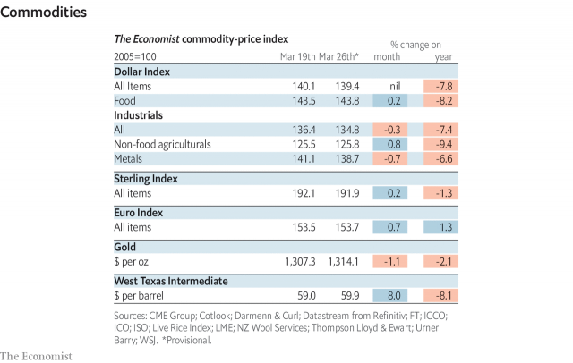

###### The Silly Isles

# Economic data, commodities and markets 

> Mar 28th 2019 

 

 

 

 

-- 

 单词注释:

1.isle[ail]:n. 小岛, 群岛 vt. 使成为岛状 vi. 住在岛屿上 

2.datum['deitәm]:n. 论据, 材料, 资料, 已知数 [医] 材料, 资料, 论据 

3.commodity[kә'mɒditi]:n. 农产品, 商品, 有用的物品 [经] 商品, 货物, 日用品 

