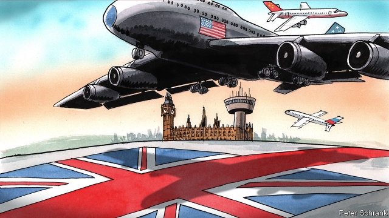

###### Charlemagne

# Britain’s neighbours fret that it could drift away 

##### And into the arms of non-European powers 

 

> Mar 28th 2019 

IMAGINE BRITAIN in a few months’ time, having left the EU without a deal. Markets and sterling are plummeting. The country has left the EU’s foreign-policy structures without any framework for future relations. Its government falls. A new prime minister scans the world for friends and picks up the phone to the White House, Zhongnanhai in Beijing or even Vladimir Putin’s Kremlin. 

Such an outcome is very unlikely: for a start, Theresa May could even now just squeeze her deal through. Yet European leaders and officials are spooked as they contemplate a no-deal Brexit, or even a hard one as Mrs May intends. This shapes their posture and reveals something of their wider state of mind. They reckon that an acrimonious divorce could make Britain desperate for trade deals with giant partners like America, China and others. And they fear, says Mark Leonard of the European Council on Foreign Relations, that over time those actors could exploit its weaknesses, imposing conditions that peel Britain away from Europe’s foreign-policy caravanserai and leave it in a position similar to that of Turkey: a semi-European player with unpredictable foreign entanglements. 

Donald Trump’s White House may want revisions to Britain’s policies on the Middle East, suggests one EU official; perhaps its withdrawal from the Iran nuclear deal. Rem Korteweg of the Clingendael Institute reports Dutch worries that American pressure in trade talks could also split Britain away from European sanctions and weapons-export policies. China’s designs on Britain cause even more apprehension. China has a record of using its weight in bilateral talks with European countries (particularly those in economic or diplomatic strife, like Italy and Hungary) for foreign-policy ends. “The Chinese will be ready. They have a clear feeling of the power ratio,” notes a senior EU diplomat. He suggests that the price of a trade deal could be British acquiescence to Beijing’s ambitions in the South China Sea. Others speculate that London could sign up to the “belt and road” infrastructure programme or further open its critical infrastructure to Chinese money. 

No-one expects an overnight transformation. The concern is more that Britain’s need for new trading partners and inward investment, and its absence from common EU forums, will over time pull it away from the European fold. Among the more lurid predictions are those by Marc Roche, Le Monde’s correspondent in London, who imagines Britain ending up as a “tax haven at Europe’s gates” and “China’s Trojan horse in Europe”. 

Britain has done little to dispel such anxieties. Its shambolic Brexit negotiations give EU panjandrums nightmares about British ministers with no experience but abundant neo-imperial fantasies parading into negotiating rooms with the Chinese and losing their shirts. Guff about “global Britain” and Theresa May’s earlier hints that she might use the country’s European defence commitments as bargaining chips, though long since abandoned, have heightened doubts. Some observers spy signs that London is softening certain foreign-policy positions ahead of post-Brexit talks: for instance by supporting Donald Trump’s withdrawal from the Intermediate-Range Nuclear Forces treaty. 

The continentals should not worry so much. Britain has always been a mercantile, semi-detached sort of European foreign-policy power. Brexit could accentuate the country’s relative openness to foreign cash but is not its cause. Beijing first declared a new Anglo-Chinese “golden age” in 2015 and seems to have since lost interest in the country as a backdoor to Europe. And even if a charlatan like Boris Johnson or an anti-Western leftist like Jeremy Corbyn ends up in Downing Street, Britain’s prime minister is constrained by Parliament, public opinion and the wider institutional establishment. All of these remain committed to the pre-Trump transatlantic order and close foreign-policy co-operation with continental Europe, as recent debates in the House of Commons on softening Brexit, or curbing its deleterious effects, have illustrated. The strength of Britain’s institutions, the size of its economy and its crucial role in NATO all make comparisons with Italy and Hungary unhelpful. Britain may be opportunistic, even cynical, in the aftermath of a rough Brexit. But it will remain an integral part of the Western alliance. And it is a bit rich to worry about the British when Germany remains in hock to Russian energy interests and Italy, not Britain, has just signed up to China’s belt and road plan. 

Still, European concerns to the contrary, no matter how overdone, are significant on two levels. First, they help shape the attitudes of the remaining 27 members of the EU to a no-deal Brexit. All are fed up with the talks. None is convinced that maintaining good commercial relations with Britain is worth pursuing talks indefinitely, or allowing it to cherry-pick the benefits of membership. But more than is realised in London, angst about a no-deal or otherwise fraught Brexit splitting the West and isolating Britain continues to stay the hand of even the most negotiation-weary European leaders. It motivated Angela Merkel’s successful insistence at the EU summit on March 21st that Britain be granted more time to pass its negotiated Brexit deal or to request an extension. It is a weak Britain’s strongest card. 

Second, Europe’s anxieties are symptomatic of the times. After years of complacency, it is slowly taking its own geopolitical situation more seriously. There is talk, though little action, about seeking “strategic autonomy” from America. The EU is increasing efforts to curb Russian-backed political interference and has introduced a screening mechanism for Chinese investments. At their summit on March 26th Mr Macron and Mrs Merkel chided Xi Jinping for trying to exploit Europe’s divisions. “They perceive a ring of countries on the EU’s fringes that are vulnerable to outside powers,” explains Jan Weidenfeld of MERICS, a think-tank in Berlin. The fear that Britain could join this ring says at least as much about the EU as it does about Britain itself. 

-- 

 单词注释:

1.Charlemagne['ʃɑ:lә'mein]:查理曼大帝(742-814, 世称 Charles the Great或Charles I, 768-814为法兰克王, 800-814为西罗马帝国皇帝) 

2.fret[fret]:n. 烦躁, 磨损, 焦急, 网状饰物 vi. 烦恼, 不满, 磨损 vt. 使烦恼, 腐蚀, 使磨损, 使起波纹 

3.EU[]:[化] 富集铀; 浓缩铀 [医] 铕(63号元素) 

4.sterling['stә:liŋ]:n. 英国货币, 标准纯银 a. 英国货币的, 标准纯银的, 含标准成分的 

5.plummete[]:[网络] 直线下降 

6.zhongnanhai[]:[网络] 中南海烟液；中国政府；帝国之脑 

7.Vladimir[vlɑ'dimɪr]:n. 弗拉基米尔（古罗斯弗拉基米尔-苏兹达里公国的古都） 

8.Kremlin['kremlin]:n. 克里姆林宫 [经] 克里姆林宫 

9.theresa[ti'ri:zә]:n. 特丽萨（女子名） 

10.spook[spu:k]:n. 幽灵, 鬼 vt. 惊吓, 鬼怪般地出没 vi. 惊吓而逃窜, 受惊 

11.contemplate['kɒntempleit]:vt. 注视, 沉思, 盘算 vi. 冥思苦想 

12.Brexit[]:[网络] 英国退出欧盟 

13.Mr['mistә(r)]:先生 [计] 存储器回收程序, 多重请求 

14.posture['pɒstʃә]:n. 姿势, 态度, 情形, 形势 vt. 作...的姿势 vi. 作姿势 

15.reckon['rekәn]:vt. 计算, 总计, 估计, 认为, 猜想 vi. 数, 计算, 估计, 依赖, 料想 

16.acrimonious[ækri'mәunjәs]:a. 尖刻的, 讥讽的, 激烈的 

17.leonard['lenәd]:n. 伦纳德（男子名） 

18.caravanserai[,kærә'vænsәrai]:n. 商队旅馆, 大旅舍 

19.unpredictable[.ʌnpri'diktәbl]:a. 不可预知的 

20.entanglement[in'tæŋglmәnt]:n. 纠缠, 卷入, 缠绕物 [化] 缠结 

21.withdrawal[wið'drɒ:l]:n. 提款, 撤退, 退回, 撤消, 退隐, 戒毒过程 [医] 戒除, 脱瘾 

22.Iran[i'rɑ:n]:n. 伊朗 

23.REM[rem]:眼的迅速跳动 [计] 识别存储器; DOS内部命令:可在批处理或CONFIG.SYS文件中加上注释行 

24.korteweg[]:[网络] 特威格；科得维克；特维格 

25.Clingendael[]:[网络] 荷兰国际关系研究所；荷兰克林根达尔；荷兰林根达尔 

26.Dutch[dʌtʃ]:n. 荷兰人, 荷兰语 a. 荷兰的 

27.sanction['sæŋkʃәn]:n. 核准, 制裁, 处罚, 约束力 vt. 制定制裁规则, 认可, 核准, 同意 

28.apprehension[.æpri'henʃәn]:n. 理解, 忧惧, 逮捕 [医] 领会 

29.bilateral[bai'lætәrәl]:a. 有两边的, 双边的, 双方的 [医] 两侧的 

30.diplomatic[.diplә'mætik]:a. 外交的, 老练的 [法] 外交的, 外交上的, 文献上的 

31.strife[straif]:n. 争吵, 竞争, 冲突 

32.Hungary['hʌŋgәri]:n. 匈牙利 

33.diplomat['diplәmæt]:n. 外交官, 有外交手腕的人 [法] 外交家, 外交官, 有权谋的人 

34.acquiescence[.ækwi'esәns]:n. 默许, 默认 [法] 默许, 默认 

35.speculate['spekjuleit]:vi. 深思, 推测, 投机 [经] 投机 

36.infrastructure['infrәstrʌktʃә]:n. 基础结构, 基础设施 [经] 基础设施 

37.forum['fɒ:rәm]:n. 论坛, 公开讨论的广场, 法庭, 讨论会 [法] 讨论会, 专题讨论, 公共论坛 

38.lurid['luәrid]:a. 火烧似的, 苍白的, 华丽的, 可怕的 

39.prediction[pri'dikʃәn]:n. 预言, 预报 [化] 预测 

40.marc[mɑ:k]:n. 榨渣 [计] 机器可读目录; 机读目录 

41.roche[]:n. 瑞士罗氏（制药企业） 

42.LE[]:[计] 小于或等于 

43.haven['heivn]:n. 港, 避难所, 安息所 vt. 安置...于港中, 庇护, 入港 

44.Trojan['trәudʒәn]:a. 特洛伊的, 特洛伊人的 n. 特洛伊人, 勤勉的人, 勇士 

45.dispel[dis'pel]:vt. 驱散, 驱逐 

46.shambolic[ʃæm'bɒlik]:a. 大混乱的 

47.negotiation[ni.gәuʃi'eiʃәn]:n. 谈判, 磋商, 交涉 [经] 谈判, 协商 

48.panjandrum[pæn'dʒændrәm]:n. 自命不凡的人, 架子十足的官吏 

49.nightmare['naitmєә]:n. 梦魇, 恶梦, 可怕的事物(或情景、人物) [医] 梦魇, 恶梦 

50.guff[gʌf]:n. 胡说, 废话 

51.chip[tʃip]:n. 屑片, 薄片, 碎片 vt. 削, 切, 削成碎片, 使摔倒, 凿 vi. 削下屑片 [计] 孔屑; 组件; 晶片; 芯片 

52.heighten['haitn]:vt. 增高, 提高, 加强 vi. 升高, 变大 

53.soften['sɒftn]:v. (使)变柔软, (使)变柔和 

54.continental[.kɒnti'nentl]:a. 大陆的, 洲的 n. 欧洲大陆人 

55.alway['ɔ:lwei]:adv. 永远；总是（等于always） 

56.mercantile['mә:kәntail]:a. 商业的, 商人的 [经] 商业的 

57.accentuate[æk'sentjueit]:vt. 以重音念, 强调, 重读 

58.openness['әupәnnis]:n. 公开；宽阔；率真 

59.backdoor[.bæk'dɒ:]:a. 秘密的 

60.charlatan['ʃɑ:lәtәn]:n. 庸医 [医] 庸医, 江湖医 

61.boris['bɔris]:n. 鲍里斯（男子名） 

62.johnson['dʒɔnsn]:n. 约翰逊（姓氏） 

63.leftist['leftist]:n. 左翼的人, 左派 a. 左派的 

64.jeremy['dʒerimi]:n. 杰里米（男子名） 

65.Corbyn[]:科尔宾（人名） 

66.constrain[kәn'strein]:vt. 强迫, 限制, 关押 

67.institutional[.insti'tju:ʃәnәl]:a. 制度的, 公共机构的, 学会的 [法] 组织机构的, 制度的, 公共机构的 

68.transatlantic[.trænsәt'læntik]:a. 横渡大西洋的, 大西洋彼岸的, 美国的 

69.curb[kә:b]:n. 抑制, 勒马绳, 边石 vt. 抑制, 束缚, 勒住 

70.deleterious[.deli'tiәriәs]:a. 有害的, 造成伤害的 [医] 有害的 

71.NATO['neitәj]:北大西洋公约组织, 北约组织 [经] 北大西洋公约组织 

72.unhelpful['ʌn'helpful]:a. 不起帮助作用的, 无用的, 无益的, 不予帮助的, 不予合作的 

73.opportunistic[.ɒpәtju:'nistik]:a. 机会主义的, 投机取巧的 

74.cynical['sinikәl]:a. 愤世嫉俗的, 讽刺的, 冷嘲的 

75.aftermath['ɑ:ftәmæθ]:n. 结果, 后果 [法] 后果, 结果 

76.integral['intigrәl]:n. 整体, 积分, 整数 a. 固有的, 整体的, 整数的, 积分的 [计] 积分 

77.alliance[ә'laiәns]:n. 联盟, 联合 [法] 同盟, 联盟, 联姻 

78.hock[hɒk]:n. 踝关节, 德国产白葡萄酒, 服刑所 vt. 典当, 割断踝腱使成残废 

79.overdo[.әuvә'du:]:vt. 做得过分, 过度, 夸张, 使过分劳累 vi. 过火 

80.indefinitely[]:adv. 无期限地 

81.membership['membәʃip]:n. 会员的资格, 全体会员, 会员数目 [法] 会员资格, 成员资格, 会籍 

82.angst[æŋst]:n. 焦虑, 疑惧 [医] 恐怖 

83.fraught[frɒ:t]:a. 含有...的, 伴着...的, 充满...的 

84.angela['ændʒilә]:n. 安吉拉（女子名） 

85.insistence[in'sistәns]:n. 坚持, 坚决主张 

86.symptomatic[.simptә'mætik]:a. 作为征候的, 症状的, 根据征候的 [医] 症状的 

87.complacency[kәm'pleisәnsi]:n. 满足, 自鸣得意, 自满 

88.geopolitical[,dʒi(:)әupә'litikәl]:[计] 地理的 

89.autonomy[ɒ:'tɒnәmi]:n. 自治, 自治权 [医] 自主性 

90.mechanism['mekәnizm]:n. 机械, 机构, 结构, 机理, 技巧 [化] 机理; 历程; 机构 

91.macron['mækrәn]:n. 长音符号 

92.merkel[]: [人名] 默克尔; [地名] [美国] 默克尔 

93.chide[tʃaid]:v. 斥责, 责骂 

94.fringe[frindʒ]:n. 边缘, 端, 流苏, 穗, 初步 vt. 加穗于, 加饰边于 a. 边缘的, 附加的 

95.vulnerable['vʌlnәrәbl]:a. 易受伤害的, 有弱点的, 易受影响的, 脆弱的, 成局的 [医] 易损的 

96.Weidenfeld[]:n. (Weidenfeld)人名；(德、罗)魏登费尔德；(英)韦登菲尔德 

97.Berlin[bә:'lin]:n. 柏林, (软质)柏林毛线 

