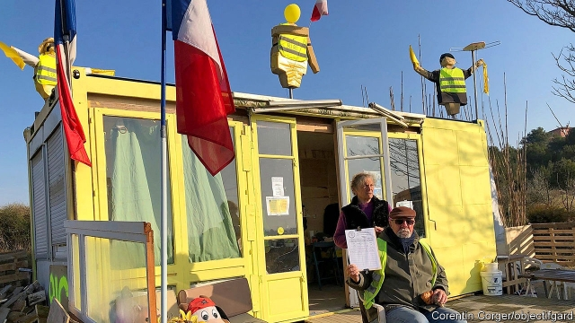

###### Among the gilets jaunes

# France’s yellow-jacket protests are smaller, but still fierce 

##### President Emmanuel Macron has undermined them by listening to voters’ complaints 

 

> Mar 28th 2019 

THE ROUNDABOUT on a ridge outside the Provençal town of Beaucaire is a pleasant enough spot. The sky is clear, the air is warm, and the view over the Rhône valley would be picturesque, were it not dominated by a giant cement works. On the roadside, a festive group of 30 or so gilets jaunes (yellow jackets) protesters has set up camp outside a yellow-painted shed. On the grassy bank, 11 yellow crosses have been planted in the earth—one for each of those who have died in accidents linked to the protests countrywide. 

“We have occupied this place every day, even over Christmas and New Year,” says Bernard, a pensioner, “and we’re not going to stop now.” As the working day draws to a close, more cars pull up, disgorging provisions and small children. Parasols are opened to shade a picnic table, and toys lie on the ground. If the gilets jaunes elsewhere have mostly left the roundabouts, or been forcibly moved from them, pockets such as this corner of southern France and nearby Avignon are holding out. 

Four months after the gilets jaunes protesters first emerged, what was originally a revolt against the rising tax on motor fuel has turned into a longer-running protest movement than the May 1968 student uprising. To be sure, the number of weekend demonstrators has dropped, from 280,000 last November to just 40,000 last weekend. And recent rioting in Paris, particularly violent on March 16th, has eroded public sympathy. Support for the gilets jaunes fell from 72% in December to 46% in March. Internal quarrels over whether to set up a political party, and insurrectional posturing by the movement’s more unhinged organisers, have also discredited the movement. So have the efforts of President Emmanuel Macron to meet some of the protesters’ demands. 

Yet the anger in parts of la France profonde has not been quelled. On the Beaucaire roundabout, the mood is defiant. The gilets jaunes know that, over in the 17th-century town hall, they have the implicit backing of the town’s mayor, Julien Sanchez, who is from Marine Le Pen’s populist National Rally (formerly National Front). He took part in the first gilets jaunes protest last year, and does not disguise his sympathy for them. Naturally, Mr Sanchez blames the violence, which has also marked protests in nearby Nîmes, not on the far right but on extreme-left “anti-fascists”, whose objective is “to sow chaos”. Moreover, he claims, however absurdly, that this suits Mr Macron. “If the government had wanted to stop the movement, it would have,” he says. “But this allows them to demonise it.” 

In reality, the failure to control the vandalism and arson attacks has undermined Mr Macron’s authority, and that of his interior minister, Christophe Castaner. And it has raised fresh questions about policing methods. The use of non-lethal police weapons during earlier protests—leading to at least 22 serious eye injuries—was denounced as excessive by the United Nations high commissioner for human rights. Yet Edouard Philippe, the prime minister, who last week fired the head of the Paris police, has now urged the police to clamp down more firmly on rioters. A tough “anti-hooligan” bill, contested by 50 deputies from Mr Macron’s own party, has been passed by parliament. 

Indeed, if Mr Macron’s poll numbers have recovered, it is despite the violence, and largely because of his marathon “great national debate”, designed to show that a leader seen as aloof and out of touch can in fact listen. The president has rolled up his shirt sleeves, taken notes, and spent over 50 hours listening to grievances. Nearly 2m contributions to the debate have been posted online, and thousands of local town-hall meetings organised. 

In Beaucaire, 55% of the town’s voters backed Ms Le Pen for president in the second round. When asked what he thinks of Mr Macron, one gilet jaune pulls his forefinger across his throat. Nonetheless the town hall held an evening debate, attended by many local gilets jaunes, who see Mr Sanchez as “one of us”. Complaints ranged from the perks given to former presidents, and a proposal to abolish the “useless” Senate, to the “advantages” Mr Macron hands out to “immigrants” rescued in the Mediterranean over “the French”. 

Indeed, if there is a recurring theme in this Mediterranean hinterland, where the National Front put down early roots, it is immigration—even though it was not one of Mr Macron’s original debate topics. Local gilets jaunes approve of Mr Sanchez’s decision to abolish “substitute meals” in Beaucaire’s schools, thus keeping pork on the menu, a tactic one commentator denounces as an “alibi for xenophobia”. Their local Facebook groups are filled with alarmist stories about uncontrolled immigration. Which is why, whatever emerges from Mr Macron’s great debate, the politician standing to gain the most from the gilets jaunes there is Ms Le Pen—so long as a new party does not split her vote. “Macron is letting in thousands of immigrants,” claims Eric, up on the roundabout. “And they get better benefits. We’re not interested in any gilets jaunes party, because it will just help him.” 

-- 

 单词注释:

1.gilet[dʒi'lei]:n. 背心, 马甲 

2.jaune[]:[网络] 汝拉 

3.emmanuel[i'mænjuәl]:n. 以马内利（耶稣基督的别称）；伊曼纽尔（男子名, 等于Immanuel） 

4.macron['mækrәn]:n. 长音符号 

5.undermine[.ʌndә'main]:vt. 在...下面挖, 渐渐破坏, 暗地里破坏 [法] 暗中破坏, 以阴谋中伤伤害 

6.Beaucaire[]:[地名] 博凯尔 ( 法 ) 

7.Rhône[]:[地名] 罗讷河 ( 法、瑞士 ) 

8.picturesque[.piktʃә'resk]:a. 生动的, 如画的, 独特的, 别致的, 栩栩如生的 

9.roadside['rәudsaid]:n. 路旁, 路边 a. 路边的 

10.festive['festiv]:a. 庆祝的, 喜庆的, 欢乐的 

11.protester[]:n. 抗议者, 持异议者, 拒付者 [经] 反对者 

12.grassy['græsi]:a. 草绿色的, 象草的, 长满草的 

13.countrywide['kʌntriwaid]:a. 全国范围的 

14.bernard[bә:'nɑ:d, 'bә:nәd]:n. 伯纳德（男子名） 

15.pensioner['penʃәnә(r)]:n. 领取抚恤金者, (英国剑桥大学的)自费生, 为金钱所收买的人, 帮佣 [法] 领取退休金者, 领取抚恤金者 

16.disgorge[dis'gɒ:dʒ]:vt. 吐出, 流注, 被迫交出 vi. 呕吐 

17.parasol['pærәsɒl]:n. 阳伞, 伞翼机 

18.forcibly['fɒ:sәbli]:adv. 强制地, 用力地 

19.avignon[.ævi:n'jәuŋ]:n. 阿维尼昂绸 

20.originally[ә'ridʒәnli]:adv. 本来, 原来, 最初, 就起源而论, 独创地 

21.uprise[ʌp'raiz]:n. 升起, 起立, 上山坡, 出现 vi. 上升, 起义, 出现 

22.demonstrator['demәnstreitә]:n. 论证者, 证明者, 指示者, 示威者 [医] 示教者 

23.riot['raiәt]:n. 暴动, 喧闹, 放纵 vi. 发动, 暴动, 纵情, 放荡 vt. 浪费, 挥霍 

24.erode[i'rәud]:vt. 腐蚀, 侵蚀 vi. 受腐蚀 

25.insurrectional[]:a. 起义的, 造反的, 暴动的 

26.posture['pɒstʃә]:n. 姿势, 态度, 情形, 形势 vt. 作...的姿势 vi. 作姿势 

27.unhinge[.ʌn'hindʒ]:vt. 取下...的绞链, 拉开, 搅乱, 使分开 

28.discredit[dis'kredit]:n. 无信用, 丢脸, 不名誉 vt. 不信, 怀疑, 使丢脸 

29.La[lɔ:, lɑ:]:[医] 镧(57号元素) 

30.profonde[prәu'fɔnd]:魔术师上衣尾部的特殊口袋 

31.quell[kwel]:vt. 压制, 平息, 减轻 

32.defiant[di'faiәnt]:a. 挑衅的, 目中无人的 

33.implicit[im'plisit]:a. 暗示的, 含蓄的, 固有的, 绝对的 [经] 不讲明的, 含蓄的 

34.Julien[]:n. 朱利安（女子名）；于连（男子名） 

35.Sanchez[]:n. 桑切斯（姓氏） 

36.LE[]:[计] 小于或等于 

37.Populist['pɔpjulist]:n. 民粹派的成员 

38.rally['ræli]:n. 重振旗鼓, 集合, 群众集会, 跌停回升 v. 重整旗鼓, 集合, 恢复精神, 团结, 挖苦, 嘲笑 

39.formerly['fɒ:mәli]:adv. 从前, 以前 

40.chao[]:n. 钞（货币） 

41.absurdly[әb'sә:dli]:adv. 荒谬地, 荒唐地, 愚蠢地 

42.demonise['di:mәnaiz]:vt.<主英>=demonize 

43.vandalism['vændәlizm]:n. 故意毁坏文物的行为, 破坏他人财产的行为 

44.arson['ɑ:sәn]:n. 纵火, 纵火罪 [法] 纵火, 放火 

45.Christophe[]:n. 克里斯多夫（男子名） 

46.denounce[di'nauns]:vt. 告发, 抨击, 谴责 [法] 谴责, 斥责, 告发 

47.commissioner[kә'miʃәnә]:n. 委员, 理事, 行政长官 [法] 委员, 政府的特派员, 地方地官 

48.Edouard[]:n. (Edouard)人名；(俄)爱德华 

49.Philippe[]:菲力浦（人名）；百达翡丽手表 

50.clamp[klæmp]:n. 夹钳 vt. 夹紧, 强加 

51.rioter['raiәtә]:n. 暴民, 暴徒, 纵情享乐者 [法] 暴徒, 骚乱者, 暴动者 

52.aloof[ә'lu:f]:a. 远离的, 冷淡的 adv. 远离, 冷漠超然地 

53.grievance['gri:vәns]:n. 委屈, 冤情, 苦况 [经] 不满(对雇用条件的) 

54.online[]:[计] 联机 

55.voter['vәutә]:n. 选民, 投票人 [法] 选民, 选举人, 投票人 

56.forefinger['fɒ:fiŋgә]:n. 食指 [医] 食指, 示指 

57.nonetheless[,nʌnðә'les]:conj. 然而, 尽管, 不过 adv. 不过, 仍然, 尽管如此, 然而 

58.perk[pә:k]:vi. 昂首, 振作, 举止高傲, 神气活现, 滤煮 vt. 竖起, 打扮, 使振作, 滤煮 n. 小费 

59.recur[ri'kә:]:vi. 复发, 回到, 重现, 再来, 诉诸, 采用, 循环 

60.hinterland['hintәlænd]:n. 内地, 腹地, 偏僻地区 [经] 腹地 

61.tactic['tæktik]:n. 一项战术, 一条策略 a. 战术的, 顺序的, 排列的 

62.commentator['kɔmenteitә]:n. 评论员, 实况广播员, 注释者, 时事评论员 

63.alibi['ælibai]:n. 不在犯罪现场, 托辞 v. 为...辩解 

64.xenophobia[,zenә'fәubiә]:n. 无端畏惧和憎恨外国人/陌生人, 对外国人的畏惧和憎恨 [医] 生客恐怖 

65.facebook[]:n. 脸谱网 

66.alarmist[ә'lɑ:mist]:n. 轻事重报者, 杞人忧天者 

67.uncontrolled[.ʌnkәn'trәuld]:a. 不受抑制的, 不受控制的, 自由的 

68.eric['erik]:abbr. 科教资源信息中心（Educational Resources Information Center）；电子遥控与独立控制（Electronic Remote and Independent Control） 

