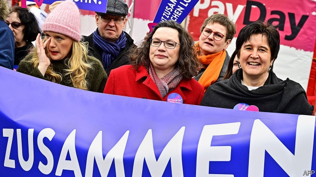
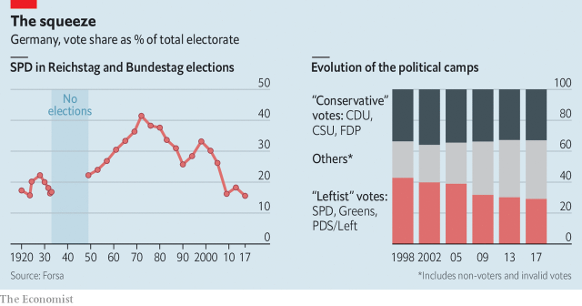

###### Left behind

# Germany’s struggling Social Democrats 

##### Germany’s oldest political party cannot find a way out of the mire 

 

> Mar 28th 2019 

FEW POLITICAL PARTIES have a history like that of Germany’s Social Democrats (SPD). Founded in the late 19th century, the SPD heroically if briefly resisted Hitler’s rise. After the war it reinvented itself as a big-tent Volkspartei (people’s party). In office it modernised West Germany, soothed cold-war tensions and inspired similar movements abroad. In 1998 it still commanded over 40% of the vote. 

It has had a rough time since. After a losing to Angela Merkel’s centre-right Christian Democrats (CDU) in 2005, a string of poor results reached a nadir in 2017, when the SPD took barely 20% of the vote, its worst result since the war. After an agonised internal debate, the party agreed to rejoin the coalition in which it had served with the CDU (and its sister party, the Christian Social Union) since 2013. That failed to arrest the slide. Today the party languishes behind the Greens and has vied for third place with the hard-right Alternative for Germany (AfD). In parts of Germany it has shrivelled to almost nothing. 

The decline of social democracy across Europe is well documented. The institutions, especially organised labour, that in West Germany’s case funnelled millions of votes to the SPD in the glory years of the late 1960s and 1970s (see chart) have withered. In a fragmented society it is harder to build the blue- and white-collar coalitions that delivered the party’s most recent victories, to Gerhard Schröder, Mrs Merkel’s predecessor. Outside Iberia and Britain, social-democratic parties are struggling almost everywhere in Europe. Yet the SPD’s history and influence mean its distress stands out. 

 

During the long Merkel years the SPD has found it hard to establish an identity. It chalked up victories in government, such as the introduction of a national minimum wage in 2015, but failed to get much credit for them. Today just 16% of German voters say the SPD has the strongest imprint on the coalition, next to 62% for the CDU/CSU. “It’s a deep-rooted rejection of the present government,” says Kevin Kühnert, head of the SPD’s youth wing, who led a campaign against rejoining the coalition last year. 

People are another problem. Andrea Nahles (pictured), the SPD’s leader, is a canny strategist but unpopular with colleagues and voters. Olaf Scholz, the vice-chancellor and finance minister, exudes competence and ambition but struggles to shake off his robotic “Scholz-omat” reputation. In matchups, both lose to Annegret Kramp-Karrenbauer, who took over from Mrs Merkel as CDU boss in December. The SPD got through eight leaders during Mrs Merkel’s 18 years at the top of the CDU. 

Yet its problems run deeper than people. Most trace them to Mr Schröder’s labour-market reforms, especially “Hartz IV”, which toughened rules on unemployment benefits. The policy is often credited with helping create a jobs miracle, but it infuriated the party’s base in areas such as the post-industrial Ruhr. The SPD lost over 10m voters between 1998 and 2009, and arguments festered among those who stayed. 

To heal the wounds, last month Ms Nahles proposed replacing Hartz IV with a “citizens’ payment”, extending the period in which a portion of previous salaries is paid to claimants, and raising the minimum wage. This has lifted the party’s spirits, as has a (more realistic) push for bigger state pensions. “Our profile in government is now sharper, and I appreciate it,” says Malu Dreyer, the SPD premier of Rhineland-Palatinate. The polling bump earned by this moderate leftward tilt quickly vanished. Yet party leaders think they have found a sweet spot in which they can pick fights with the CDU on selected issues, brandishing their social-justice credentials without angering voters by paralysing the government. Papers on a jobs-friendly climate policy, elderly care and social cohesion are promised later this year. 

The leadership hopes to bolster morale before a review of the coalition at the end of the year, which could offer party hacks who never wanted to rejoin the government a chance to pull out. For the moment Ms Nahles’s efforts have calmed people’s nerves. But the mood could turn jittery again should the SPD do badly in elections this year. Losing power in Bremen (which votes in May) and Brandenburg (September) would be especially painful. 

The strategy may see off the internal critics for a while. But the appeal of softening welfare rules is limited when unemployment is below 4%; boosting pensions does little for younger voters, just 9% of whom believe the SPD best serves their interests. “I was born in 1985, where’s the social system for me?” asks Laura-Kristine Krause, a party member and political activist. On other issues the SPD can resemble a think-tank more than a power-hungry party. There are good ideas floating around the party’s brains trusts on matters like automation and the future of work, but little apparent appetite to translate them into a coherent set of vote-winning policies. 

The picture is yet dimmer on foreign policy. As Germany comes under pressure from allies, above all America, to meet its NATO responsibilities, the SPD spies an opportunity to market itself as the “party of peace”, opposing big rises in defence spending and a relaxation of arms-export rules. The SPD’s slogan for the European elections, “Europe is the answer”, sits awkwardly with the irritation its foreign policy stirs in its EU partners, especially France. No matter; the party is in line with voters’ instincts. “You need something for the heart as well as the brain,” says an insider. 

Immigration and identity politics, however, present trickier terrain. Leaders hope that as the dust settles from the refugee crisis of 2015-16 they can steer the national conversation on to social and labour issues. But immigration remains German voters’ top priority. This speaks to perhaps the SPD’s broadest problem. More than any other party it has literally shed votes left (The Left), right (AfD) and centre (Greens, CDU and the liberal Free Democrats). That makes it hard to alight on a single strategy to win people back: trying to seduce AfD voters with a tougher line on migration, for example, alienates defectors to the Greens. 

Party bigwigs accept that the days of 40% support are gone for good. But with 25% of the vote (not completely impossible), it might lead a leftist coalition with the Greens and The Left, although their collective support has shrunk considerably (see chart). Others want to hug the FDP closer. Yet all this is for the future. For now the SPD is stuck in a grim present, torn between constituencies, lacking leadership and bereft of election-winning ideas. 

-- 

 单词注释:

1.democrat['demәkræt]:n. 民主人士, 民主主义者, 民主党党员 [经] 民主党 

2.cannot['kænɒt]:aux. 无法, 不能 

3.mire[maiә]:n. 泥沼, 泥泞 vt. 使陷于泥泞, 使陷入困境 vi. 掉进泥坑 

4.spd[]:abbr. 电涌保护器；补充石油税；统计过程诊断（Statistical Process Diagnosis） 

5.heroically[hə'rəʊɪklɪ]:adv. 英雄地; 超人地; 冒险地; 庞大地 

6.briefly['brifli]:adv. 简短地, 扼要地, 简明地, 简单地 

7.reinvent[.ri:in'vent]:vt. 重新使用；彻底改造；重复发明（在不知他人已发明的情况下） 

8.modernise['mɔdәnaiz]:vt.vi. (使)现代化, (使)适应现代需要 vi. 用现代方法 

9.soothe[su:ð]:vt. 缓和, 使安静, 安慰, 奉承 vi. 起安慰作用 

10.angela['ændʒilә]:n. 安吉拉（女子名） 

11.CDU[]:abbr. 中央显示器（Central Display Unit）；海防搜索潜艇雷达（Coast Defense radar for detecting U-boats） 

12.nadir['nei.diә]:n. 天底, 最低点 

13.agonise['æ^әnaiz]:v. 烦恼, 挣扎 

14.rejoin[ri'dʒɒin]:vt. 使再结合, 再加入, 回答 vi. 重新聚合, 回答, 第二次答辩 

15.coalition[.kәuә'liʃәn]:n. 结合体, 结合, 联合 [经] 联合, 联盟 

16.languish['læŋgwiʃ]:vi. 憔悴, 凋萎, 苦思 

17.vie[vai]:vi. 争, 竞争, 争胜 vt. 提出...来竞争, 以...作较量 

18.afd[]:abbr. 自动装填装置（Automatic Feeding Device） 

19.shrivel['ʃrivl]:v. (使)起皱纹, (使)枯萎, (使)束手无策 

20.funnel['fʌnl]:n. 漏斗, 漏斗状的东西, 烟囱 [化] 漏斗 

21.wither['wiðә]:vt. 使凋谢, 使消亡, 使畏缩 vi. 枯萎, 衰退 

22.Gerhard[]:n. 格哈德（男子名）；格哈德（姓氏） 

23.Mr['mistә(r)]:先生 [计] 存储器回收程序, 多重请求 

24.predecessor[.predi'sesә]:n. 前任, 先辈, 前身 [医] 初牙, 前辈, 祖先 

25.iberia[ai'biәriә]:n. 伊比利亚；伊伯利亚半岛 

26.merkel[]: [人名] 默克尔; [地名] [美国] 默克尔 

27.voter['vәutә]:n. 选民, 投票人 [法] 选民, 选举人, 投票人 

28.imprint[im'print]:vt. 印, 铭刻 n. 印, 印记, 特征, 痕迹, 版本说明 

29.rejection[ri'dʒekʃәn]:n. 拒绝, 抛弃, 驳回, 被抛弃的东西, 呕出物 [化] 报废; 拒收 

30.kevin['kenin]:n. 凯文（男子名） 

31.andrea['ændriә,ɑ:n'dreiә]:n. 安德里亚（男子名） 

32.Nahles[]:纳勒斯 

33.canny['kæni]:a. 精明的, 谨慎的, 节约的 

34.strategist['strætidʒist]:n. 战略家 

35.unpopular['ʌn'pɔpjulә]:a. 不得人心的, 不受欢迎的, 不流行的 

36.olaf['әulәf, 'ɔl-]:n. 奥拉夫（男子名） 

37.scholz[]:n. (Scholz)人名；(瑞典)斯科尔茨；(英)肖尔茨 

38.exude[ig'zju:d]:v. (使)流出, (使)渗出 

39.robotic[rәu'bɔtik]:a. 自动的；机器人的, 像机器人的 

40.matchup['mætʃ,ʌp]:n. 火柴, 比赛, 竞赛, 匹配, (足球, 捧球, 蓝球)比赛 v. 相配, 相称, 比赛, 相比, 匹配 

41.hartz[]: [人名] 哈茨 

42.iv[]:abbr. 输入阀；交互式视讯；自变量（Independent Variable） 

43.toughen['tʌfn]:v. (使)变坚韧, (使)变顽强 

44.infuriate[in'fjuәrieit]:a. 狂怒的 vt. 激怒 

45.Ruhr[ruә]:鲁尔(联邦德国一地区) 

46.fester['festә]:vi. 溃烂, 生脓 vt. 使溃烂 n. 脓疮, 溃烂 

47.claimant['kleimәnt]:n. 提出要求者, 原告 [经] 索赔人, 债权人 

48.realistic[riә'listik]:a. 现实的, 逼真的, 现实主义的, 实在论的 

49.profile['prәufail]:n. 侧面, 轮廓, 传略 vt. 描绘...轮廓, 写...的传略 [计] 提问档; 剖面图法; 剖面法 

50.Sharpe['ʃa:p]:n. 夏普指数；夏普指标；夏普（人名） 

51.malu[]:n. (Malu)人名；(意、刚(金)、肯)马卢 

52.Dreyer[]:n. 德雷尔（人名） 

53.bump[bʌmp]:n. 撞击, 肿块 vt. 碰撞 vi. 撞, 颠簸而行 

54.leftward['leftwәd]:a. 左方的, 左侧的 adv. 在左方, 在左手 

55.tilt[tilt]:n. 倾斜, 倾向, 船篷, 车篷 vt. 使倾斜, 使倾侧, 用帆布篷遮盖 vi. 倾斜, 翘起, 冲, 评击 [计] 倾斜 

56.quickly['kwikli]:adv. 很快地 

57.brandish['brændiŋ]:vt. 挥, 挥舞 n. 挥舞 

58.credential[kri'denʃәl]:n. 国书, 凭据, 证明书 [经] 凭证, 证书 

59.paralyse['pærәlais]:vt. 使麻痹, 使瘫痪, 使无力, 使气馁, 终止 [医] 使麻痹, 使瘫痪 

60.cohesion[kәu'hi:ʒәn]:n. 结合, 黏聚, 内聚 [计] 内聚性 

61.bolster['bәulstә]:n. 支持, 长枕 vt. 支持, 支撑 

62.morale[mɒ'rɑ:l]:n. 士气, 道德 

63.hack[hæk]:n. 劈, 砍, 砍痕, 出租车, 干咳, 晒架, 鹤嘴锄 vt. 劈, 砍, 出租, 用旧 vi. 劈, 砍, 干咳, 驾驶出租车 a. 出租的 

64.jittery['dʒitәri]:a. 极度紧张不安的 

65.bremen[]:n. 不来梅港市（德国地名） 

66.Brandenburg['brændənbə:ɡ]:n. 勃兰登堡（德国城市） 

67.soften['sɒftn]:v. (使)变柔软, (使)变柔和 

68.krause[]:n. (Krause)人名；(英)克劳斯；(西)克劳塞；(德、捷、波、瑞典、芬)克劳泽 唇压肌 

69.activist['æktivist]:n. 激进主义分子 

70.coherent[kәu'hiәrәnt]:a. 互相耦合的, 清晰的, 明了的，凝聚性的, 连贯的 

71.ally['ælai. ә'lai]:n. 同盟者, 同盟国, 助手 vt. 使联盟, 使联合, 使有关系 vi. 结盟 

72.NATO['neitәj]:北大西洋公约组织, 北约组织 [经] 北大西洋公约组织 

73.relaxation[.ri:læk'seiʃәn]:n. 松弛, 放松, 减轻, 缓和, 休息, 休养 [化] 松弛; 驰豫 

74.awkwardly[]:adv. 笨拙地；无技巧地 

75.irritation[.iri'teiʃәn]:n. 刺激, 烦恼, 刺激物 [医] 刺激[作用], 兴奋 

76.EU[]:[化] 富集铀; 浓缩铀 [医] 铕(63号元素) 

77.insider['in'saidә]:n. 内部的人, 权威人士, 知道内情的人 [经] 熟悉内情者 

78.politic['pɒlitik]:a. 精明的, 明智的, 策略的 

79.tricky['triki]:a. 狡猾的, 机敏的 

80.terrain['terein]:n. 地带, 地区, 地形, 领域, 范围 

81.refugee[.refju'dʒi:]:n. 难民, 流亡者 [法] 避难者, 流亡者, 难民 

82.literally['litәrәli]:adv. 逐字地, 按照字面上地, 不夸张地 

83.alight[ә'lait]:vi. 落下, 偶然发现 a. 点着的 

84.seduce[si'dju:s]:vt. 唆使, 怂恿, 引诱, 诱奸 [法] 勾引, 诱惑, 诱奸 

85.migration[mai'greiʃәn]:n. 移民, 移往, 移动 [计] 迁移 

86.alienate['eiljәneit]:vt. 使疏远, 离间, 转让 [法] 转让, 让与, 疏远 

87.defector[di'fektә]:n. 背叛者, 叛离者 [法] 变节分子, 背叛者, 开小差者 

88.bigwig['bigwig]:n. 要人, 大亨 

89.leftist['leftist]:n. 左翼的人, 左派 a. 左派的 

90.considerably[kәn'sidәrәbli]:adv. 非常地, 很, 颇 

91.FDP[]:abbr. 光纤分布点（Fiber Distribution Point）；飞行数据处理器（Flight Data Processor） 

92.grim[grim]:a. 冷酷的, 坚强的, 残忍的, 可怕的, 讨厌的 

93.constituency[kәn'stitjuәnsi]:n. 选民, 顾客, 读者 [法] 选区, 全体选民, 选区内的选民 

94.bereave[bi'ri:v]:vt. 使孤寂, 使丧失, 使失去 

