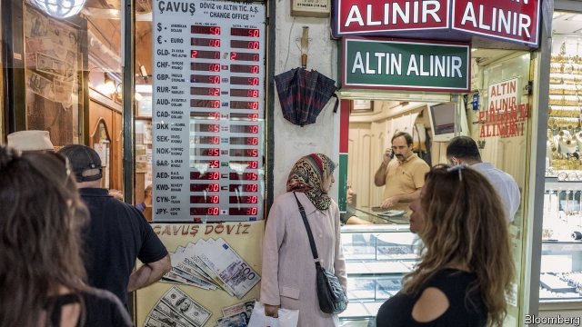

###### Of vegetables and nuts

# Turkey’s President Erdogan accuses the West of terrorism 

##### He is angry with vegetable-dealers too 

 

> Mar 28th 2019 

TURKEY’S PRESIDENT, Recep Tayyip Erdogan, once spoke of terrorist acts committed with a pen. Ahead of local elections, he has turned his attention to those committed with vegetables. “They’ve made aubergine, tomato, potato and cucumber prices increase,” he told a rally last month, referring to wholesalers suspected of hoarding. “They are spreading terror.” 

Despite the government’s attempts to distract voters, the economy will weigh heavily on the minds of most Turks when they elect mayors and councillors on March 31st. Overall, Mr Erdogan’s ruling Justice and Development (AK) party has done well in this area. Since 2002, when AK first came to power, the economy has expanded by an annual average of 5%. Millions of Turks have propelled themselves out of poverty. But the wave of credit that companies and consumers have been riding over the past decade, often with reckless abandon, has come crashing down. In one year the Turkish lira has plunged in value by about 30%, stoking the worst inflation since AK came to power. Interest-rate hikes have stymied growth. It is now officially in recession. 

Fears of turbulence resurfaced last week, when news that the central bank had burned through $6bn in foreign reserves in a couple of weeks caused the biggest one-day fall in the lira since last summer. Mr Erdogan responded by threatening currency speculators. The banking authority opened an investigation into JP Morgan after the bank advised clients to dump the lira. Local banks were reportedly instructed to stop lending the currency on offshore markets to prevent more short-selling. The lira recovered, but foreign investors responded by dumping Turkish stocks and bonds. 

AK will prevail in the elections, but there may be hiccups. Most eyes are on Ankara, the capital, where an opposition candidate, Mansur Yavas, has been polling ahead of AK’s nominee, Mehmet Ozhaseki. Taking a break from his campaign, Mr Yavas says a vote for him is a vote against economic mismanagement and corruption. 

Mr Erdogan and his allies want to teach Mr Yavas a lesson. Earlier this month, the pro-government press dug up old allegations linking the mayoral hopeful to a counterfeit cheque. Days later, prosecutors launched an investigation. Mr Erdogan has since threatened that Mr Yavas will pay “a heavy price” after the elections, suggesting he may be removed from office. 

Mr Erdogan has indeed used every weapon in his arsenal to galvanise his religious base. At rallies, he has falsely accused the West of playing a role in the recent mosque attack in New Zealand, the opposition of taking orders from terrorists, and feminist protesters of booing the call to prayer. (They were actually booing police who doused them with tear gas.) A week before the election, the president proposed converting Hagia Sophia, the Byzantine cathedral turned into a mosque by the Ottomans and into a museum by Ataturk, back into a mosque again. 

Turkey’s president has campaigned as if his future depended on the local elections. It does not. Barring a truly calamitous showing and calls for an early general election, Mr Erdogan will not face another vote for up to four years. But he will have to face millions of Turks who care less about the conspiracies their leader conjures up than they do about the economy. 

-- 

 单词注释:

1.erdogan[]:[网络] 埃尔多安；土耳其总理埃尔多安；艾尔多安 

2.terrorism['terәrizm]:n. 恐怖主义, 恐怖统治, 恐怖状态 [法] 胁迫, 暴政, 恐怖政治 

3.recep[]:n. (Recep)人名；(土)雷杰普 

4.tayyip[]:[网络] 塔伊普 

5.terrorist['terәrist]:n. 恐怖分子 [法] 恐怖份子, 恐怖主义 

6.aubergine['әubәʒi:n]:n. 茄子 

7.rally['ræli]:n. 重振旗鼓, 集合, 群众集会, 跌停回升 v. 重整旗鼓, 集合, 恢复精神, 团结, 挖苦, 嘲笑 

8.wholesaler['hәulseilә]:n. 批发商 [经] 批发商 

9.hoard[hɒ:d]:n. 贮藏物, 密藏的金钱 v. 囤积, 贮藏 

10.distract[dis'trækt]:vt. 转移, 分心, 使发狂 

11.voter['vәutә]:n. 选民, 投票人 [法] 选民, 选举人, 投票人 

12.Turk[tә:k]:n. 土耳其人, 土耳其马 

13.councillor['kaunsilә]:n. 地方议会成员, 议会委员, 顾问, 评议员, 参赞 [法] 议员, 评议员, 顾问 

14.AK[]:[计] 确认, 肯定, 收悉 

15.propel[prәu'pel]:vt. 推进, 驱使 [机] 推进 

16.reckless['reklis]:a. 不介意的, 大意的, 鲁莽的, 不顾后果的 [法] 不注意的, 粗心大意的, 鲁莽的 

17.Turkish['tә:kiʃ]:n. 土耳其语 a. 土耳其的, 土耳其人的, 土耳其语的 

18.lira['liәrә]:n. 里拉 

19.stoke[stәuk]:v. 司炉, (使)大吃 

20.inflation[in'fleiʃәn]:n. 胀大, 夸张, 通货膨胀 [化] 充气吹胀; 膨胀 

21.hike[haik]:n. 徒步旅行, 远足, 涨价, 提高 vi. 步行, 徒步旅行, 上升 vt. 使高涨, 拉起 

22.stymy[]:n. (喻)困难的境地 vt. 使(球)处于困难的位置, 使为难, 使处困境, 妨碍, 阻挠, 阻碍 

23.officially[ә'fiʃәli]:adv. 作为公务员, 职务上, 官方地 

24.recession[ri'seʃәn]:n. 后退, 凹处, 衰退, 归还 [医] 退缩 

25.turbulence['tә:bjulәns]:n. 混乱, 动荡, 骚乱, 紊流 [化] 湍流; 紊流 

26.resurface[ri:'sә:fis]:vi. 重铺路面 vi. 重新露面 

27.speculator['spekjuleitә]:n. 投机者, 投机商人, 思索者 [经] 投机买卖者, 投机商 

28.JP[]:n. 治安官, 地方司法官 [计] 作业处理器 

29.Morgan['mɒ:gәn]:n. 摩根马 

30.client['klaiәnt]:n. 客户, 顾客, 委托人 [计] 客户, 客户机, 客户机程序 

31.reportedly[ri'pɒ:tidli]:adv. 根据传说, 根据传闻, 据报道 

32.investor[in'vestә]:n. 投资者 [经] 投资者 

33.hiccup['hikʌp]:n. 打嗝 v. 打嗝 

34.Ankara['æŋkәrә]:n. 安卡拉(土耳其首都) 

35.opposition[.ɒpә'ziʃәn]:n. 反对, 敌对, 相反, 在野党 [医] 对生, 对向, 反抗, 反对症 

36.mansur[mæn'suə]: [地名] [尼日利亚] 曼苏尔 

37.Yavas[]:[地名] 亚瓦斯河 ( 俄 ) 

38.nominee[.nɒmi'ni:]:n. 被提名者, 被任命者 [经] 被指定人 

39.Mehmet[]:n. (Mehmet)人名；(土)穆罕默德 

40.mismanagement[]:n. 管理不善；处置失当 

41.corruption[kә'rʌpʃәn]:n. 腐败, 堕落, 贪污 [计] 论误 

42.ally['ælai. ә'lai]:n. 同盟者, 同盟国, 助手 vt. 使联盟, 使联合, 使有关系 vi. 结盟 

43.allegation[.æli'geiʃәn]:n. 断言, 主张, 申辩 [法] 声明, 事实陈述, 断言 

44.mayoral['mєәrәl]:a. 市长的 

45.counterfeit['kauntәfit]:n. 赝品, 伪造品 a. 假冒的, 假装的 v. 仿造, 伪装, 假装 

46.prosecutor['prɒsikju:tә]:n. 实行者, 告发者, 公诉人 [法] 原告, 起诉人, 检举人 

47.arsenal['ɑ:snәl]:n. 兵工厂, 军械库 [机] 兵工厂 

48.galvanise['^ælvәnaiz]:vt. 通电流于, 给...镀锌, 电镀, 刺激, 使兴奋, 激动, 激励, 惊起 

49.falsely['fɒ:lsli]:adv. 虚伪地, 错误地, 不实地 

50.mosque[mɒsk]:n. 清真寺 

51.zealand['zi:lәnd]:n. 西兰岛（丹麦最大的岛） 

52.feminist['feminist]:n. 男女平等主义者 

53.protester[]:n. 抗议者, 持异议者, 拒付者 [经] 反对者 

54.boo[bu:]:v. 嘘(某人), 喝倒彩 interj. 嘘 

55.douse[daus]:vt. 插入水中, 浇(或洒、泼)水在...上, 熄(灯、火等), 平息 vi. 浸泡 n. 泼洒 

56.hagia[]:[网络] 圣诞节 

57.sophia[sә'faiә]:n. 索菲娅（女子名） 

58.Byzantine[bi'zæntain]:a. 拜占庭帝国的, 拜占庭式的 

59.ottoman['ɔtәmәn]:a. 土耳其人的；土耳其民族的；土耳其帝国的（等于Turkish） 

60.Ataturk[]:阿塔图尔克（人名） 

61.calamitous[kә'læmitәs]:a. 灾难性的, 不幸的 

62.les[lei]:abbr. 发射脱离系统（Launch Escape System） 

63.conspiracy[kәn'spirәsi]:n. 同谋, 阴谋, 阴谋集团 [法] 阴谋, 通谋, 共谋 

64.conjure['kʌndʒә]:vt. 念咒文召唤, 变戏法, 想象 vi. 变戏法, 施魔法 

