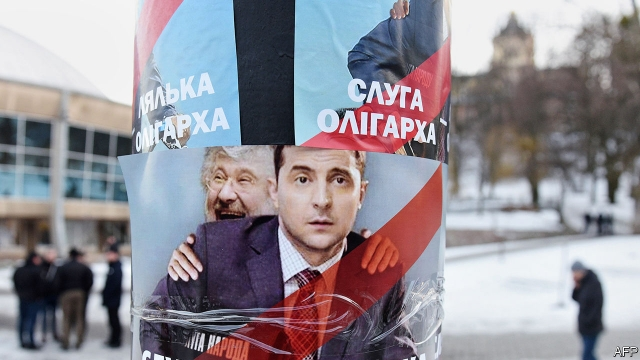

###### Candyman v comic

# Ukraine heads for the polls, with a comedian leading 

##### Voters are so fed up they might pick a man who played a president on TV 

 

> Mar 28th 2019 

THE MOST encouraging thing about Ukraine’s presidential election is that nobody knows who is going to win. In that sense, democracy in Ukraine is healthy—certainly more so than in its post-Soviet neighbours Russia and Belarus. The latest polls show Volodymyr Zelensky, a comedian-cum-candidate, leading, with the support of some 30% of the voters who have made up their minds. Petro Poroshenko, the incumbent president, and Yulia Tymoshenko, a former prime minister, are running neck-and-neck for second place. Yury Boyko, a former energy minister, and Anatoly Hrytsenko, a former defence minister, trail a distant fourth and fifth. A quarter of voters remain undecided. With none of the nearly 40 candidates likely to garner the majority needed for a victory in the first round on March 31st, the two front-runners will face off on April 21st. 

Yet the campaign’s competitiveness masks other ailments. Accusations of vote-buying are flying; Ukraine’s oligarchs continue to exert outsize influence through their media empires. The result’s uncertainty also reflects deep frustration among the people. The Maidan revolution, which overthrew President Viktor Yanukovych five years ago, offered the chance of straightening out Ukraine’s crooked politics. Some reforms have indeed been implemented and a course towards integration with the West has been set. Unlike past elections, this one is not a contest between those favouring closer ties with the West and Russia respectively, thanks largely to Vladimir Putin’s seizure of Crimea, a Ukrainian peninsula, and incursion into the east of the country in 2014. 

Nonetheless, corruption and special interests remain entrenched. Ukraine’s citizens now have less faith in their government than those of any other country, according to Gallup, a polling firm: just 9% have confidence in it and 91% believe it is thoroughly corrupt. 

That distrust of the establishment explains Mr Zelensky’s appeal. One of the country’s most popular actors, he is best known for “Servant of the People”, a TV series in which he plays a schoolteacher who vaults to the presidency after a video of his rant about corruption goes viral. Mr Zelensky has borrowed the show’s title for the name of his political party, and has styled his candidacy after his character, often blurring the lines between make-believe and reality. His vague policy positions, lack of experience and murky ties to the oligarch Ihor Kolomoisky, whose television channel airs Mr Zelensky’s shows and has promoted his candidacy, have not turned off voters desperate for a new face. As a Western diplomat says: “Even if a chair ran, people would vote for it.” 

It would be hard to find two faces in Ukrainian politics older than Mr Poroshenko and Ms Tymoshenko. A confectionery mogul and former minister who came to office in 2014 promising to root out corruption, Mr Poroshenko has been dogged by allegations of graft against his entourage since then. His campaign has focused on nation-building and security issues. Ms Tymoshenko, who earned the moniker “the gas princess” while running a lucrative gas-importing business in the 1990s, has run on the unconvincing slogan of a “New Course”. Her most potent rallying cry has been opposition to recent gas-price hikes. Both hope that demography will work in their favour: Mr Zelensky’s support is strongest among younger voters, the least likely to turn out. Mr Poroshenko and Ms Tymoshenko rely upon older, more active voters. They are also counting on the large bloc of undecideds to put fear of the unknown ahead of anger at the status quo. 

-- 

 单词注释:

1.candyman[]:n. 杀人蜂（或译追命传说, 电影名）；甜心宝贝（或译甜蜜爱人, 歌曲名） 

2.V[vi:]:[计] 溢出, 变量, 向量, 检验, 虚拟, 垂直 [医] 钒(23号元素) 

3.comic['kɒmik]:n. 连环漫画, 喜剧演员, 滑稽的人 a. 滑稽的, 有趣的, 喜剧的 

4.ukraine[ju(:)'krein]:n. 乌克兰（原苏联一加盟共和国, 现已独立） 

5.comedian[kә'mi:djәn]:n. 喜剧演员 

6.voter['vәutә]:n. 选民, 投票人 [法] 选民, 选举人, 投票人 

7.presidential[.prezi'denʃәl]:a. 总统制的, 总统的, 首长的, 统辖的 [法] 总统的, 议长的, 总经理的 

8.Belarus['belərəs]:n. 白俄罗斯, 白俄罗斯共和国 

9.volodymyr[]:[网络] 昊宇 

10.zelensky[]:[网络] 泽伦斯基 

11.petro[]:n. 佩特罗（女子名）；[宗]（希）彼得（男子名, 涵义为石头） 

12.Poroshenko[]:[网络] 波罗申科 

13.incumbent[in'kʌmbәnt]:a. 现任的, 依靠的, 负有义务的 n. 领圣俸者, 在职者 

14.yulia[]:[网络] 尤利娅；尤莉娅；尤利亚 

15.tymoshenko[]:[网络] 季莫申科；总理季莫申科；乌克兰前总理季莫申科 

16.Yury[]:n. (Yury)人名；(俄)尤里；(法)于里 

17.boyko[]: [人名] 博伊科 

18.Anatoly[]:n. (Anatoly)人名；(乌克、俄)阿纳托利 

19.Hrytsenko[]:格里岑科 

20.undecided[.ʌndi'saidid]:a. 未定的, 不明确的 

21.garner['gɑ:nә]:n. 谷仓, 积蓄 vt. 储存, 贮藏 

22.competitiveness[]:[经] 竞争 

23.ailment['eilmәnt]:n. 病痛, 疾病 [医] 疾病 

24.accusation[ækju:'zeiʃәn]:n. 控告, 指控, 指责 [法] 控告, 起诉, 告发 

25.oligarch['ɒligɑ:k]:n. 寡头政治执政者 

26.outsize['autsaiz]:a. 特大的 n. 特大号 

27.uncertainty[.ʌn'sә:tnti]:n. 不确定, 不可靠, 不确定的事物 [化] 不确定度 

28.frustration[frʌs'treiʃәn]:n. 挫折, 顿挫 [医] 挫折 

29.maidan[mai'dɑ:n]:n. <印> 练兵场, 操场 

30.overthrow[.әuvә'θrәu]:n. 推翻, 瓦解, 倾覆 vt. 打倒, 推翻, 倾覆 

31.Viktor[]:维克托（人名） 

32.yanukovych[]:[网络] 亚努柯维奇 

33.straighten['streitn]:vt. 弄直, 整顿, 清理, 使改正 vi. 直起来, 改正, 好转 

34.crook[kruk]:n. 钩, 弯曲部分, 坏蛋 vt. 使弯曲, 诈骗 vi. 弯曲 

35.politic['pɒlitik]:a. 精明的, 明智的, 策略的 

36.integration[.inti'greiʃәn]:n. 综合, 与环境协调的行为, 集成 [化] 集成; 整合 

37.Vladimir[vlɑ'dimɪr]:n. 弗拉基米尔（古罗斯弗拉基米尔-苏兹达里公国的古都） 

38.seizure['si:ʒә]:n. 捕获, 夺取, 占领, 捕获物, 没收, 充公 [医] 发作; 癫痫发作 

39.Crimea[krai'miә]:n. 克里米亚, 克里米亚半岛 

40.ukrainian[ju(:)'kreinjәn]:a. 乌克兰的；乌克兰人的 

41.incursion[in'kә:ʃәn]:n. 侵入, 侵略, 奇袭 

42.nonetheless[,nʌnðә'les]:conj. 然而, 尽管, 不过 adv. 不过, 仍然, 尽管如此, 然而 

43.corruption[kә'rʌpʃәn]:n. 腐败, 堕落, 贪污 [计] 论误 

44.entrench[in'trentʃ]:vt. 围以壕沟, 防护, 保卫, 使处于牢固地位 vi. 掘壕, 侵犯 

45.les[lei]:abbr. 发射脱离系统（Launch Escape System） 

46.Gallup['^ælәp]:n. 盖洛普（姓氏）；盖洛普（George Horace, 1901-美国统计学家, 盖洛普民意测验的创始人） 

47.thoroughly['θʌrәli]:adv. 彻底地, 绝对地, 透彻地, 详尽地, 周到地, 完全地, 完善地, 全面地 

48.distrust[dis'trʌst]:n. 不信任 vt. 不信任 

49.sery[]:n. (Sery)人名；(俄)谢雷；(科特)塞里 

50.schoolteacher['sku:lti:tʃә]:n. 教师 

51.vault[vɒ:lt]:n. 拱顶, 窖, 地下室, 撑竿跳, 穹窿 vt. 做成圆拱形, 撑竿跳过 vi. 成穹状弯曲, 跳跃 

52.presidency['prezidәnsi]:n. 总统职权, 总裁职位 

53.rant[rænt]:v. 咆哮, 痛骂 n. 咆哮, 大话 

54.viral['vairәl]:a. 病毒的, 病毒引起的 [医] 病毒的 

55.candidacy['kændidәsi]:n. 候选人的地位, 候选资格 [法] 候选人的身份, 资格 

56.blur[blә:]:vt. 使模糊, 弄脏 vi. 弄脏, 模糊 

57.murky['mә:ki]:a. 黝暗的, 阴沉的, 朦胧的 

58.ihor[]:[网络] 至尊铭 

59.diplomat['diplәmæt]:n. 外交官, 有外交手腕的人 [法] 外交家, 外交官, 有权谋的人 

60.confectionery[kәn'fekʃәnәri]:n. 甜食, 糕饼制造业, 糖果店 [建] 糖食店 

61.mogul[mәu'^ʌl, 'mәu^ʌl]:n. 大人物, 有权势的人 

62.allegation[.æli'geiʃәn]:n. 断言, 主张, 申辩 [法] 声明, 事实陈述, 断言 

63.graft[grɑ:ft]:n. 嫁接, 贪污 v. 嫁接, 移植, 贪污 

64.entourage[,ɔntu'rɑ:ʒ]:n. 全体随行人员, 陪同人员 

65.moniker['mɔnikә(r)]:n. 名字, 绰号 

66.lucrative['lu:krәtiv]:a. 有利益的, 获利的, 合算的 

67.unconvincing[ʌnkәn'vinsiŋ]:a. 不足以令人相信的 

68.potent['pәutnt]:a. 有力的, 有说服力的, 有效的 [医] 有力的, 有性交能力的 

69.rally['ræli]:n. 重振旗鼓, 集合, 群众集会, 跌停回升 v. 重整旗鼓, 集合, 恢复精神, 团结, 挖苦, 嘲笑 

70.opposition[.ɒpә'ziʃәn]:n. 反对, 敌对, 相反, 在野党 [医] 对生, 对向, 反抗, 反对症 

71.hike[haik]:n. 徒步旅行, 远足, 涨价, 提高 vi. 步行, 徒步旅行, 上升 vt. 使高涨, 拉起 

72.demography[di:'mɒgrәfi]:n. 人口统计学 [医] 人口学, 人口统计学 

73.bloc[blɒk]:n. 集团 

74.statu[]:[网络] 状态查看；雕像；特级雪花白 

75.quo[]:vt. [古]说 

