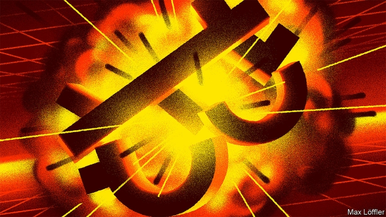
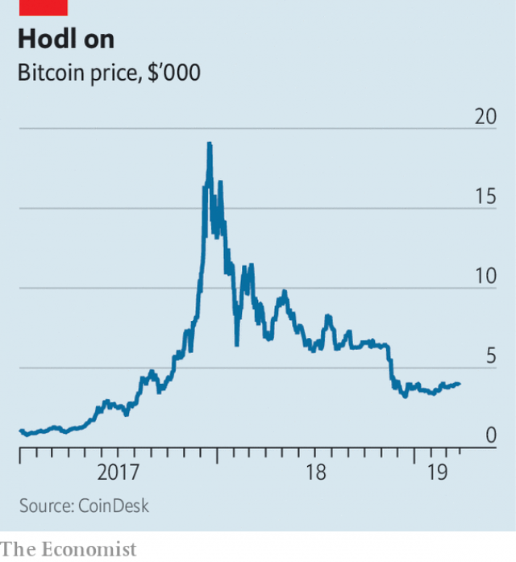

###### Can cryptocurrencies recover?

# Flaws in Bitcoin make a lasting revival unlikely 

##### The latest boom and bust invite comparisons with past financial manias 

 

> Mar 28th 2019 

“BE MORE BRENDA,” said the ads for CoinCorner, a cryptocurrency exchange. They appeared on London’s Underground last summer, featuring a cheery pensioner who had, apparently, bought Bitcoins in just ten minutes. It was bad advice. Six months earlier a single Bitcoin cost just under $20,000. By the time the ads appeared, its value had fallen to $7,000. These days, it is just $4,025 (see chart). 

While the price was soaring, big financial institutions such as Barclays and Goldman Sachs flirted with opening cryptocurrency-trading desks. Brokerages sent excited emails to their clients. The Chicago Board Options Exchange (CBOE), one of the world’s leading derivatives exchanges, launched a Bitcoin futures contract. Hundreds of copycat cryptocurrencies also soared, some far outperforming Bitcoin itself. Ripple rose by 36,000% during 2017. 

The bust has been correspondingly brutal. Those who bought near the top were left with one of the world’s worst-performing assets. Cryptocurrency startups fired employees; banks shelved their products. On March 14th the CBOE said it would soon stop offering Bitcoin futures. Bitmain, a cryptocurrency miner, appears to have pulled a planned IPO. (Miners maintain a cryptocurrency’s blockchain—a distributed transaction database—using huge numbers of specialised computers, and are paid in newly minted coins). 

 

The speed with which the bubble inflated and then popped invites comparisons with past financial manias, such as the Dutch tulip craze in 1636-37 and the rise and collapse of the South Sea Company in London in 1720. Cryptocurrency enthusiasts like to claim a more flattering comparison—with the 1990s dotcom bubble. They point out that, despite the froth, viable businesses emerged from that episode. But the cryptocurrency fiasco has exposed three deep and related problems: the extent of genuine activity is hugely exaggerated; the technology does not scale well; and fraud may be endemic. 

Consider the overstatement of activity, first. Ten years after their invention, using cryptocurrencies to pay for goods and services remains a niche pastime. Bitcoin is the original cryptocurrency and still the most popular. In January Satoshi Capital Research, a cryptocurrency firm, declared that Bitcoin transactions in 2018 added up to $3.3trn, more than six times the volume handled by PayPal. But such figures include an awful lot of double-counting, mostly related to the way Bitcoin handles change, says Kim Grauer at Chainalysis, a firm that analyses Bitcoin’s blockchain. Strip that out, and Chainalysis reckons that Bitcoin accounted for around $812bn of genuine transfers of value. 

Of that, Ms Grauer reckons, only a fraction was used to buy things. Around $2.4bn went to merchant-service providers, which handle payments for businesses—a piffling sum compared with the $15trn of transactions in 2017 on Alipay and WeChat Pay, two Chinese payment apps. Darknet markets, which sell stolen credit-card details, recreational drugs, cheap medicines and the like, made up $605m, and gambling sites $857m. Most of the rest was related to speculation. 

Even for speculators, business is less brisk than it seems. “Wash trading”, in which traders buy and sell to each other (or themselves) to create the illusion of volume, is widespread. Bitwise Asset Management, a cryptocurrency-fund manager, analysed 81 cryptocurrency exchanges for a presentation on March 20th to the Securities and Exchange Commission, an American financial regulator. The firm estimated that 95% of trading volume could be artificial. The Justice Department is investigating claims of price manipulation. 

The second problem is that the technology is too clunky to operate at scale. Cryptocurrencies are unlikely ever to achieve mass adoption, says Nicholas Weaver, a computer scientist at the University of California, Berkeley. Unlike Alipay or WeChat Pay, cryptocurrencies are intended as new financial systems rather than extensions to the current one. But they have serious design flaws. 

Bitcoin’s pseudonymous creator, Satoshi Nakamoto, wanted it to be resistant to control by tyrannical governments and banks. Payment records are therefore not held centrally, but broadcast to all users. A new batch of Bitcoin is issued every ten minutes on average. That limits the network to processing about seven transactions per second (Visa, by contrast, can handle tens of thousands per second). In 2017, as the crypto-bubble was inflating, the system became clogged. To ensure that transactions went through, users had to pay miners—at one point, as much as $50 per transaction. 

Moreover, Bitcoin is designed such that only 21m Bitcoins will ever be created, making it inherently deflationary. Mining, essentially a self-adjusting lottery in which participants compete to buy tickets, is energy-hungry. At the height of the boom it was thought to consume as much electricity as Ireland (these days, it merely consumes as much as Romania). 

The final problem is fraud. Transactions are irreversible—a boon for con-artists. Ponzi schemes are common, as is incompetence. Cryptocurrency exchanges often collapse or are hacked. In February QuadrigaCX, a Canadian exchange, filed for bankruptcy, saying it had lost $165m in deposits when its founder, Gerard Cotton, died, since only he had known the encryption keys protecting QuadrigaCX’s deposits. But on March 1st Ernst & Young, which was appointed to handle the bankruptcy, said that the deposit addresses seem to have been empty for at least eight months before the date Mr Cotton is said to have died. 

Attempts are under way to get round some of these limitations. Some Bitcoin enthusiasts are testing an add-on called the Lightning Network, which tries to speed things up by moving many transactions off the blockchain. Stablecoins, whose value is supposedly pegged to something else, are touted as a way to rein in speculation. Once again, promise often falls short of reality. On March 14th Tether, the most popular stablecoin, with $2bn-worth in circulation, said that it might not be fully backed with dollars after all. None has achieved even Bitcoin’s limited take-up. 

Most fans simply want cryptocurrency prices to start rising again. In 2017 John McAfee, a cryptocurrency enthusiast who made his money in antivirus software, said that if Bitcoin was not worth $1m in 2020 he would eat an intimate part of his anatomy on television. On March 20th he tweeted that losing that bet was “not mathematically possible”. Last year Jack Dorsey, Twitter’s boss, said he thinks Bitcoin will be the world’s “single currency” within a decade. Facebook is working on some kind of cryptocurrency project. Market analysts and pundits provide cheery reassurance that the currency will soon soar again. 

Mr Weaver is sceptical, at least in the short term. The very visible boom and bust, and more attention from regulators, have probably cut the number of willing new punters, he says. But boosters are trying their best. They have taken to referring to the post-bust period as a “crypto winter”. The intended analogy is with artificial intelligence: the “AI winters” were funding crunches in the 1970s and 1980s after hype outstripped reality. The implication is that, one day, summer will return. 

-- 

 单词注释:

1.cryptocurrencies[]:加密数字货币（cryptocurrency的复数形式） 

2.flaw[flɒ:]:n. 缺点, 裂纹, 瑕疵, 一阵狂风 [化] 划痕; 裂缝; 裂纹 

3.bitcoin[]:[网络] 比特币；虚拟货币比特币；位元币 

4.revival[ri'vaivl]:n. 复兴, 复活, 恢复精神, 苏醒 [医] 复苏, 回生, 精神重振 

5.bust[bʌst]:n. 半身像, 胸部, 失败, 殴打 vt. 使爆裂, 使破产 vi. 爆裂, 破产 [计] 操作错 

6.mania['meiniә]:n. 狂躁, 热衷, 狂热 [医] 躁狂, 狂 

7.brenda['brendә]:n. 布伦达（女子名） 

8.cryptocurrency[]:加密货币 

9.cheery['tʃiәri]:a. 愉快的 

10.pensioner['penʃәnә(r)]:n. 领取抚恤金者, (英国剑桥大学的)自费生, 为金钱所收买的人, 帮佣 [法] 领取退休金者, 领取抚恤金者 

11.apparently[ә'pærәntli]:adv. 表面上, 清楚地, 显然地 

12.BitCoins[]:[网络] 比特币 

13.soar[sɒ:]:n. 高扬, 翱翔 vi. 往上飞舞, 高耸, 翱翔 

14.barclay['bɑ:kli]:n. 巴克利（姓氏, 男子名） 

15.goldman[]:n. 高曼（姓氏） 

16.Sachs[zaks]:n. 萨克斯（汽车零配件生产厂商） 

17.flirt[flә:t]:n. 卖弄风骚的人, 急动, 急扔 vt. 忽然弹出, 轻快摆动, 挥动 vi. 调情, 玩弄, 摆动, 轻率地对待 

18.brokerage['brәukәridʒ]:n. 经纪人, 回扣, 佣金, 中间人业务 [经] 经纪业, 佣金, 手续费 

19.client['klaiәnt]:n. 客户, 顾客, 委托人 [计] 客户, 客户机, 客户机程序 

20.Chicago[ʃi'kɑ:gәu]:n. 芝加哥 

21.cboe[]:abbr. Chicago Board Options Exchange 芝加哥期权交易所 

22.derivative[di'rivәtiv]:a. 引出的, 派生的 n. 引出之物, 派生物, 衍生字 

23.copycat['kɒpikæt]:n. 模仿者 

24.outperform[.autpә'fɔ:m]:vt. 胜过；做得比……好 

25.ripple['ripl]:n. 涟波, 涟漪, 波纹, 粗钢梳 vt. 使起涟漪 vi. 起微波, 起潺潺声 

26.correspondingly[]:adv. 相应地, 相对地 

27.brutal['bru:tәl]:a. 残忍的, 野蛮的, 不讲理的 

28.asset['æset]:n. 资产, 有益的东西 

29.cryptocurrency[]:加密货币 

30.startup[]:[计] 启动 

31.shelve[ʃelv]:vt. 放置架子上, 搁置 vi. 渐渐倾斜 

32.transaction[træn'sækʃәn]:n. 交易, 办理, 学报, 和解协议 [计] 事务处理 

33.specialise['speʃә,laiz]:vt. 特加指明, 列举, 使专门化, 限定...的范围 vt.vi. (使)特化, (使)专化 vi. 成为专家, 专务, 专攻, 专门研究, 逐条详述 

34.mint[mint]:n. 薄荷, 造币厂, 巨额 vt. 铸造, 铸币, 制造 

35.inflate[in'fleit]:vt. 使膨胀, 使得意, 使通货膨胀, 使充气 vi. 充气, 膨胀 

36.Dutch[dʌtʃ]:n. 荷兰人, 荷兰语 a. 荷兰的 

37.tulip['tju:lip]:n. 郁金香 

38.craze[kreiz]:n. 狂热, 大流行 v. (使)发狂, (使)开裂 

39.enthusiast[in'θju:ziæst]:n. 热心家, 狂热者, 爱好者 

40.flatter['flætә]:vt. 奉承, 阿谀, 使高兴 [机] 平面锤 

41.dotcom['dɒtkɒm]:n. 网站 

42.froth[frɒθ]:n. 泡, 泡沫, 琐物 vt. 使生泡沫 vi. 发泡, 吹泡 

43.viable['vaiәbl]:a. 能养活的, 能生长发育的 [医] 有活力的, 有生机的 

44.fiasco[fi'æskәu]:n. 惨败, 大失败 

45.hugely['hju:dʒli]:adv. 巨大地, 非常地 

46.fraud[frɒ:d]:n. 欺骗, 欺诈, 诡计, 骗子 [经] 欺诈, 舞弊, 骗子 

47.endemic[en'demik]:n. 地方病 a. 某地(或某些人中)流行的, 地方的 

48.overstatement[]:[经] 估值过高, 夸大 

49.niche[nitʃ]:n. 壁龛 vt. 放入壁龛, 安顿 

50.satoshi[]:n. (Satoshi)人名；(日)禅洲(姓) 

51.paypal[]:n. 贝宝（全球最大的在线支付平台） 

52.kim[]:n. 金姆（人名） 

53.grauer[]: [人名] 格劳尔 

54.blockchain[blɒkt'ʃeɪn]:na. (脚踏车等的)车链 [网络] 块环链；数据块链；资料块链 

55.reckon['rekәn]:vt. 计算, 总计, 估计, 认为, 猜想 vi. 数, 计算, 估计, 依赖, 料想 

56.provider[prә'vaidә]:n. 供应者, 供养人, 伙食承办人 [计] 提供器 

57.piffle['pifl]:vi. 做蠢事, 讲废话, 胡扯 n. 愚蠢行动, 废话 

58.alipay[]:n. 支付宝 

59.WeChat[]:[网络] 微信；微讯；腾讯微信 

60.APP[]:[计] 应用, 应用程序; 相联并行处理器 

61.darknet[]:[网络] 暗网；黑暗网路；黑暗网络 

62.recreational[.rekri'eiʃәnәl]:a. 消遣的, 娱乐的 

63.gamble['gæmbl]:n. 赌博, 冒险 v. 赌博, 孤注一掷 

64.speculation[.spekju'leiʃәn]:n. 沉思, 推测, 投机 [经] 投机交易, 买空卖空 

65.speculator['spekjuleitә]:n. 投机者, 投机商人, 思索者 [经] 投机买卖者, 投机商 

66.les[lei]:abbr. 发射脱离系统（Launch Escape System） 

67.trader['treidә]:n. 商人, 商船 [经] 交易者, 商船 

68.bitwise[]:[计] 按位 

69.asset['æset]:n. 资产, 有益的东西 

70.regulator['regjuleitә]:n. 调整者, 校准者, 校准器, 调整器, 标准钟 [化] 调节剂; 调节器 

71.manipulation[mә.nipju'leiʃәn]:n. 操作, 处理 [化] (用手)操作; 使用 

72.clunky[ˈklʌŋki]:a. 粗笨的；笨重的 

73.cryptocurrencies[]:加密数字货币（cryptocurrency的复数形式） 

74.adoption[ә'dɒpʃәn]:n. 采用, 采纳, 收养 [法] 收养, 采纳, 采用 

75.nicholas['nikәlәs]:n. 尼古拉斯（男子名） 

76.weaver['wi:vә]:n. 织布者, 织工 

77.California[.kæli'fɒ:njә]:n. 加利福尼亚 

78.berkeley['bɑ:kli, 'bә:kli]:n. 伯克利（姓氏）；贝克莱（爱尔兰主教及哲学家）；伯克利（美国港市） 

79.pseudonymous[sju:'dɒnәmәs]:a. 使用笔名的, 使用假名的 

80.Creator[kri:'eitә(r)]:n. 上帝, 创造者, 创作者 

81.nakamoto[]:[网络] 中本；修平 

82.tyrannical[tai'rænikl]:a. 暴虐的, 暴君的, 残暴的 

83.centrally['sentrәli]:adv. 在中心, 在中央 

84.batch[bætʃ]:n. 一次所烘的面包, 一次所制之量, 一组, 批, 成批, 分批 v. 成批, 分批处理 [计] 一批 

85.tens[]:十位 

86.clog[klɒg]:n. 障碍, 脚坠 v. 障碍, 阻塞 

87.inherently[in'hiәrәntli]:adv. 内在地, 生来地, 固有地 [计] 固有的 

88.deflationary[di'fleiʃәnәri]:a. 通货紧缩的 [经] 紧缩(通货)的 

89.essentially[i'senʃәli]:adv. 本质上, 本来 

90.lottery['lɒtәri]:n. 奖券, 彩票, 运气 [经] 抽彩给奖法 

91.participant[pɑ:'tisipәnt]:n. 参加者, 参与者 a. 有份的, 参加的, 参与的 

92.Romania[rәu'meinjә]:n. 罗马尼亚 

93.boon[bu:n]:n. 恩惠 

94.ponzi[]:[网络] 庞氏；庞兹；旁氏 

95.incompetence[in'kɔmpitәns]:n. 不胜任, 不够格, 不合格, 不适合, 无能力, 不熟练, 无资格 [医] 机能不全, 闭锁不全, 关闭不全 

96.hack[hæk]:n. 劈, 砍, 砍痕, 出租车, 干咳, 晒架, 鹤嘴锄 vt. 劈, 砍, 出租, 用旧 vi. 劈, 砍, 干咳, 驾驶出租车 a. 出租的 

97.bankruptcy['bæŋkrәptsi]:n. 破产者 [经] 破产, 倒闭 

98.founder['faundә]:n. 创立者, 建立者 vt. 使沉没, 使摔倒, 弄跛, 浸水, 破坏 vi. 沉没, 摔到, 变跛, 倒塌, 失败 

99.gerard['dʒerɑ:d,dʒә'rɑ:d]:n. 杰勒德（男子名, Gerald的异体） 

100.encryption[-'kripʃən]:[计] 加密 

101.Ernst[ɛrnst]:n. 恩斯特（人名）；艾伦斯特（人名） 

102.supposedly[sә'pәuzidli]:adv. 想象上, 看上去像, 被认为是, 恐怕, 按照推测 

103.peg[peg]:n. 钉, 桩, 栓, 藉口, 销子, 借口 vt. 钉木钉, 固定, 限制, 使受约束 vi. 坚持不懈地奋力于, 疾行 

104.tout[taut]:vi. 招徕顾客, 兜售物品 vt. 招徕, 刺探...情报 n. 兜售者, 侦查者 

105.tether['teðә]:n. 系绳, 系链, 界限, 范围 vt. 栓, 束缚, 限制 

106.circulation[.sә:kju'leiʃәn]:n. 流通, 循环, 发行量 [化] 环流 

107.fully['fuli]:adv. 十分地, 完全地, 充分地 

108.john[dʒɔn]:n. 盥洗室, 厕所, 嫖客 

109.mcafee[]:n. Network Associates; Inc (NYSE: NET) 的总部位于加州圣克拉拉; 二是 McAfee Network Protection 解决方案; [人名] 麦卡菲; [地名] [美国] 麦卡菲 

110.antivirus[]:n. 抗病毒素 [医] 细菌滤液 

111.anatomy[ә'nætәmi]:n. 剖析, 解剖学, 骨骼, 结构 [医] 解剖学, 解剖 

112.tweet[twi:t]:vi. 啁啾 n. 小鸟叫声 

113.mathematically[ˌmæθə'mætɪklɪ]:adv. 算术地 

114.jack[dʒæk]:n. 插座, 千斤顶, 男人 vt. 抬起, 提醒, 扛举, 增加, 提高, 放弃 a. 雄的 [计] 插座 

115.dorsey[]:n. 多尔西（姓） n. 多尔西（美国地名） 

116.facebook[]:n. 脸谱网 

117.analyst['ænәlist]:n. 分析者, 精神分析学家 [化] 分析员; 化验员 

118.pundit['pʌndit]:n. 学者, 梵文学者, 博学的印度人, 权威 

119.reassurance[.ri:ә'ʃurәns]:n. 安心, 放心, 再保证 

120.punter['pʌntә]:n. 用篙撑船的人, 船夫, 赌博者 

121.booster['bu:stә]:n. 向前推的人, 支持者, 后援者, 升压器 [化] 爆管; 扩爆药; 传爆药; 升压机; 增压装置; 升压器; 助促进剂 

122.crypto['kriptәu]:n. 秘密成员, 秘密赞同者 

123.analogy[ә'nælәdʒi]:n. 相似, 类似 [计] 模拟 

124.crunch[krʌntʃ]:v. 嘎吱嘎吱的咬嚼, 压碎, 嘎吱嘎吱地踏过 n. 咬碎, 咬碎声 

125.hype[haip]:n. 大肆宣传；皮下注射 

126.outstrip[.aut'strip]:vt. 追过, 胜过, 凌驾 

