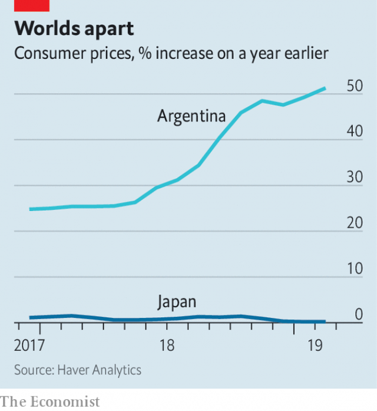

###### Exceptions and rules

# How Argentina and Japan continue to confound macroeconomists 

##### Bold new policy frameworks have failed to break long-standing habits 

 

> Mar 28th 2019 

MANY PEOPLE make fun of macroeconomics. But any theory that must explain both Argentina and Japan deserves sympathy. Why, in particular, is inflation so stubbornly high in one and low in the other? In Argentina, consumer prices were 50% higher in February than a year earlier, the fastest increase since 1991. In Japan over the same period, inflation was less than 0.2%, equalling the lowest rate since 2016. 

The inertia in both countries is puzzling. Inflation has stayed low in Japan despite a drum-tight labour market (unemployment has remained at 2.5% or below for over a year) and high in Argentina despite a fast-shrinking economy: its GDP contracted by more than 6% year-on-year in the fourth quarter of 2018. 

The two countries, of course, have long mystified economists. In 1950 Argentina’s GDP per person was three times that of Japan, according to the Maddison Project database. The Eva Perón charitable foundation, run by the president’s wife, shipped 100 tonnes of relief supplies to the war-battered Japanese. Thousands of Japanese migrated in the opposite direction, creating a population of 23,000 Nipo-Argentinos by the end of the 1960s. 

But the two countries’ economic paths went on to cross decisively. Japan’s GDP per person eclipsed Argentina’s around 1970 and is now about twice as high, measured at purchasing-power parity. Its success and Argentina’s failure defied predictions. Simon Kuznets, who won the Nobel prize in economics in 1971 for his work on growth, put it best: there are four types of countries in the world—developed, undeveloped, Japan and Argentina. 

 

Policymakers in both countries have tried hard to make them macroeconomically “normal”. After Shinzo Abe became Japan’s prime minister in 2012, the central bank promised to raise inflation to 2% in about two years by expanding its asset purchases. And after Mauricio Macri won Argentina’s presidency at the end of 2015, the central bank promised to raise interest rates enough to bring inflation down below 17% in 2017 and 12% in 2018, paving the way for an inflation target of 5% thereafter. 

In both cases, these bold new policy frameworks seemed to offer a decisive break with a sorry past. In Japan, previous central-bank officials had resigned themselves to mild deflation or even welcomed it, redefining failure as success. In Argentina, the previous government had responded to high inflation by simply fiddling the figures, misreporting failure as success. 

But the early optimism has faltered. Both governments have been forced to revisit their targets and their instruments for achieving them. When price pressures proved more stubborn than Argentina expected in 2017, the government relaxed its unachievable inflation targets to bring them closer in line with reality. But that tweak led investors to lose faith in the authorities’ resolve to tackle rising prices. In Japan, many commentators think the central bank should lower its seemingly unreachable 2% inflation target to something more achievable. But just as investors overinterpret evidence of slackening in Argentina, they pounce on any sign of tightening in Japan. Any tweak in the central bank’s target will probably be misinterpreted as a change in its policy, rather than an acknowledgment of reality. Given their track records, neither central bank enjoys the benefit of the doubt. 

Indeed, memories of the past create self-fulfilling prophecies. The holders of Argentine currency bear many scars, including hyperinflation, devaluation, redenomination, and the corralito that froze their deposits in 2001. The yen, by contrast, is seen as a safe haven. When trouble strikes, investors are quick to flee from Argentina’s currency, whereas the Japanese are quick to flee into theirs. Recent drops in the peso, which has fallen by over 10% so far this year after plunging by 50% last year, are one cause of inflation’s recent resurgence. Periodic appreciations of the yen have had the opposite effect in Japan. 

The sorry track records of each central bank also diminish their influence over wage negotiations. In both countries, workers demand that their pay keeps pace with the price pressures they feel, not the inflation the central bank promises. During the spring shunto (or wage offensive), Japan’s big companies and unions thrash out wage deals that set a benchmark for other parts of the economy. Companies like Panasonic, Hitachi and Toshiba have this year offered increases in base pay of only 0.3%, according to Capital Economics, a research firm. 

Argentina has a similar set of negotiations known as paritarias. Some economists expect them to yield wage increases of 30-35% this year, which will help keep inflation uncomfortably high. In parts of Argentina the school year, which begins in March, was delayed by striking teachers demanding salary increases to offset last year’s inflation and this year’s, whatever it turns out to be. 

Argentina’s inflationary tendencies reflect its long struggle to live within its means. Japan’s deflationary bent reflects a struggle to live up to them. Argentina’s national saving rate has averaged only 17% of GDP over the past 30 years, too low to meet its ambitions for investment. As a consequence, it has recorded a deficit in its current account with the rest of the world in 30 of the past 40 years. Japan, on the other hand, has run a surplus since 1981 and is now the world’s biggest net international creditor. Despite some signs of change (see article), Japan’s corporations still hoard cash and other financial assets, rather than splashing out on the higher wages or dividends a rich economy can afford. 

There are four types of countries in the world: developed, undeveloped—and economies in each of those two categories who think they are in the other. 

-- 

 单词注释:

1.Argentina[.ɑ:dʒәn'ti:nә]:n. 阿根廷 

2.confound[kәn'faund]:vt. 使混淆, 使狼狈, 挫败 

3.macroeconomist[,mækrəʊɪ'kɒnəmɪst]:n. 宏观经济学家 

4.macroeconomic[-mik]:n. 整体经济 

5.inflation[in'fleiʃәn]:n. 胀大, 夸张, 通货膨胀 [化] 充气吹胀; 膨胀 

6.stubbornly[]:adv. 倔强地；顽固地 

7.les[lei]:abbr. 发射脱离系统（Launch Escape System） 

8.inertia[i'nә:ʃә]:n. 惯性, 惰性, 迟钝 [化] 惯性 

9.inflation[in'fleiʃәn]:n. 胀大, 夸张, 通货膨胀 [化] 充气吹胀; 膨胀 

10.mystify['mistifai]:vt. 使神秘化, 使难解, 迷惑 [计] 变幻线 

11.economist[i:'kɒnәmist]:n. 经济学者, 经济家 [经] 经济学家 

12.Maddison[]:麦迪逊（姓氏） 

13.eva['i:vә]:n. 伊娃（女子名） 

14.charitable['tʃæritәbl]:a. 大慈大悲的, 宽厚的, 慈善的 [法] 慈善的, 慷慨的, 宽恕的 

15.tonne[tʌn]:n. 吨, 公吨 [经] 吨 

16.migrate['maigreit]:vi. 移动, 移往, 随季节而移居 [计] 迁移程序 

17.decisively[]:adv. 果断地；决然地 

18.eclipse[i'klips]:n. 日食, 月食, (地位名誉等的)消失 vt. 引起日食, 引起月食, 使黯然失色 

19.parity['pærәti]:n. 同等, 同位, 平价, 奇偶性 [计] 奇偶性 

20.defy[di'fai]:vt. 藐视, 挑衅, 使落空 n. 挑战 

21.prediction[pri'dikʃәn]:n. 预言, 预报 [化] 预测 

22.simon['saimәn]:n. 西蒙（男子名） 

23.kuznets[]: [人名] 库兹涅茨 

24.Nobel['nәubel]:n. 诺贝尔 

25.undeveloped[.ʌndi'velәpt]:a. 未充分发育的, 未开发的 

26.policymaker['pɔlisi.meikә]:n. 政策制定者；决策人 

27.macroeconomically[]:[网络] 宏观经济 

28.shinzo[]:[网络] 晋三；爆裂战士战蓝宝；神像 

29.abe[eib]:n. 亚伯（男子名, 等于Abraham） 

30.asset['æset]:n. 资产, 有益的东西 

31.Mauricio[]:n. 毛利西奥（男子名） 

32.macri[]: [人名] 麦克里 

33.presidency['prezidәnsi]:n. 总统职权, 总裁职位 

34.thereafter[.ðєәr'æftә]:adv. 其后, 从那时以后 

35.decisive[di'saisiv]:a. 决定性的, 坚定的, 果断的 

36.deflation[di'fleiʃәn]:n. 放气, 缩小, 通货紧缩 [医] 放气, 解除气胀 

37.redefine[.ri:di'fain]:vt. 重新定义 [计] 重新定义 

38.fiddle['fidl]:n. 小提琴, 提琴类乐器 vt. 虚度时光, 拉小提琴 vi. 拉小提琴, (无目的地)拨弄, 瞎搞 

39.misreport[,misri'pɔ:t]:[法] 谎报, 误报, 报导不实 

40.optimism['ɒptimizm]:n. 乐观主义, 乐观, 乐天 [医] 乐观主义, 乐观 

41.falter['fɒ:ltә]:vt. 支吾地说 vi. 支吾, 蹒跚地走 n. 颤抖, 支吾, 踌躇 

42.revisit[ri:'vizit]:vt. 再访, 重游, 重临 n. 再访问 

43.unachievable[ˌʌnəˈtʃi:vəbl]:a. 不可实现的 

44.tweak[twi:k]:n. 拧, 扭, 焦急 vt. 扭, 开足马力 

45.investor[in'vestә]:n. 投资者 [经] 投资者 

46.tackle['tækl]:n. 工具, 复滑车, 滑车, 装备, 扭倒 vt. 固定, 处理, 抓住 vi. 扭倒 

47.commentator['kɔmenteitә]:n. 评论员, 实况广播员, 注释者, 时事评论员 

48.seemingly['si:miŋli]:adv. 看来似乎, 表面上看来 

49.unreachable[ʌn'ri:tʃәbl]:a. 不能到达的, 不能得到的 [计] 执行不到的 

50.achievable[ә'tʃi:vәbl]:a. 做得成的, 可完成的, 可有成就的 

51.overinterpret[]:[网络] 过度诠释 

52.slacken['slækәn]:vt. 使松弛, 放松, 放慢 vi. 变松弛, 减弱, 松劲 

53.pounce[pauns]:n. 猛扑, 爪 vi. 猛扑, 突袭 vt. 扑住 

54.tighten['taitn]:vt. 勒紧, 使变紧 vi. 变紧, 绷紧 

55.misinterpret[.misin'tә:prit]:vt. 曲解 

56.acknowledgment[әk'nɔlidʒmәnt]:n. 承认, 答谢, 认可, 谢礼, 收到的通知, 收到的回音, 谢意 [计] 肯定, 确认认可 

57.prophecy['prɒfәsi]:n. 预言, 预言能力 

58.holder['hәuldә]:n. 持有人, 所有人, 支持物 [化] 夹持器; 夹具; 贮罐 

59.argentine['ɑ:dʒәntain]:n. 银, 银白色金属, 银白色鱼鳞, 阿根廷人 a. 银的, 银色的, 阿根廷的 

60.hyperinflation[,haipәrin'fleiʃәn]:n. 恶性通货膨胀 

61.devaluation[,di:vælju'eiʃәn]:n. 降低价值, 贬值 [经] 贬值 

62.redenomination[ri:diˌnɔmiˈneiʃən]:n. 重定货币单位 

63.corralito[]: 

64.yen[jen]:n. 日元(日本货币单位), 渴望, 嗜好 vi. 渴望 

65.haven['heivn]:n. 港, 避难所, 安息所 vt. 安置...于港中, 庇护, 入港 

66.peso['peisәu]:n. 比索 [经] 比索 

67.resurgence[ri'sә:dʒәns]:n. 再起, 复活, 再现 

68.periodic[.piәri'ɒdik]:a. 周期的, 定期的, 间歇(性)的, 循环的, 用完整句的, 高碘的 [医] 周期性的 

69.diminish[di'miniʃ]:v. (使)减少, (使)变小 

70.negotiation[ni.gәuʃi'eiʃәn]:n. 谈判, 磋商, 交涉 [经] 谈判, 协商 

71.shunto[]:[网络] 春斗 

72.offensive[ә'fensiv]:a. 令人不快的, 侮辱的, 攻击性的 [法] 攻击的, 进攻的, 冒犯的 

73.thrash[θræʃ]:vt. 打, 使逆行, 胜过, 推敲, 鞭打 vi. 打谷, 痛打, 剧烈扭动, 逆行 n. 打谷, (划水)鞭状动作 

74.benchmark[]:[计] 基准程序; 基准 

75.panasonic[]:n. 日本松下公司 

76.Hitachi[hi'tɑ:tʃi]:[计] 日立网络体系结构 

77.toshiba[]:n. 东芝（公司名, 财富500强公司之一, 总部所在地日本, 主要经营电子电气） 

78.uncomfortably[ʌnˈkʌmftəbli]:adv. 不舒适地, 不自在地, 令人不快地 

79.offset['ɒ:fset]:n. 抵消, 把...并列, 旁系, 支管, 用胶印法印 vt. 弥补, 抵消, 胶印 vi. 装支管 n. 偏移量 [计] 偏移量 

80.inflationary[in'fleiʃәnәri]:a. 通货膨胀的, 通货膨胀倾向的 

81.deflationary[di'fleiʃәnәri]:a. 通货紧缩的 [经] 紧缩(通货)的 

82.deficit['defisit]:n. 赤字, 不足额 [医] 短缺 

83.creditor['kreditә]:n. 债权人 [法] 债权人, 债主, 贷方 

84.hoard[hɒ:d]:n. 贮藏物, 密藏的金钱 v. 囤积, 贮藏 

85.dividend['dividend]:n. 被除数, 股利 [计] 被除数 

