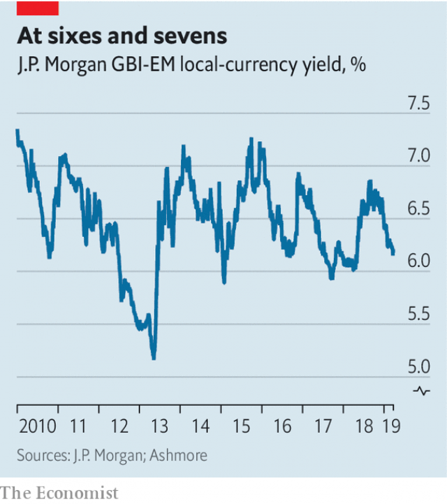

###### Buttonwood

# How emerging-market local-currency bonds might fit in your portfolio 

##### Their appeal lies in their distinctiveness 

 

> Mar 30th 2019 

IN THE FIRST episode of “Cheers”, a 1980s television comedy, Diane Chambers, a graduate student, intends to elope with Sumner Sloan, a literature professor. In stark contrast to the genial barflies at Cheers, a Boston watering-hole, Sloan is well-educated and middle-class—but also, it turns out, vain and deceitful. He’s goofy, says Sam Malone, the bartender whose on-off romance with Diane is the show’s dramatic axis. “He’s everything you’re not,” she retorts. 

And so is Diane. That she and Sam are dissimilar in personality and social background is one reason why “Cheers” is so funny. The yoking of opposites is a dependable ploy in situation comedies. It is also a useful trick in investing. The injunction not to put all your eggs in one basket can be found in any finance textbook. But there is more to diversification than that. The ideal diversifier is not just something other than what you own, but something that contrasts with it. 

Suppose your investments are tilted heavily towards the S&P 500 index of America’s leading shares, a principal character in global capital markets. Where can you find a Diane Chambers to balance your Sam Malone? Emerging-market government bonds in the issuer’s own currency may be the contrast you are seeking. They are not stocks, they are not denominated in dollars and they are not widely owned by foreigners. They are everything your existing portfolio is not. 

Investing in emerging markets opens up a broader set of opportunities. GDP growth is generally faster, as there is greater scope to benefit from existing know-how than in rich economies. The business cycle is different, too. There is a spectrum of risk assets to choose from. The cautious prefer hard-currency bonds, which pay in dollars and are issued by governments and firms. 

Further along the spectrum are racier bets. Shares carry the same hazards in emerging markets as anywhere else. Stockholders are behind bondholders in the queue to be paid, should earnings falter. But there is an additional exchange-rate risk: a fall in local currencies would be a money-loser for rich-world investors. 

For those willing to take on foreign-exchange risk, government bonds issued in local currency might have more appeal. Government bonds are in general a hedge against equity risk. And while indices of emerging-market stocks lean heavily towards Asia, and thus to China’s supply-chain, bond indices have broader regional balance, says Yacov Arnopolin of PIMCO, a big bond firm. Expected returns are decent. For instance, the yield on the J.P. Morgan GBI-EM index of biggish issuers is 6.2% (see chart). That is considerably higher than the yield on Treasury bonds. 

 

This yield spread is a buffer against currency risk. A bet on local-currency bonds is in essence a bet against the dollar. Ideally you would gain on both the bonds and the currency. But at the very least, you hope the “carry” (extra yield) will make up for any exchange-rate losses. An important consideration is whether the currencies you are buying into are overvalued. It is not obvious that they are. Real exchange rates in most big emerging markets are either close to their ten-year averages or below them. 

A burst of inflation would alter the calculation. Currencies would then need to fall to keep the real exchange rate steady and exports competitive. Yet there has been a notable drop in inflation in emerging markets. Partly this is down to the adoption of inflation targets by central banks; partly it is more disciplined fiscal policy, says Jan Dehn of Ashmore, a fund manager. Of the 25 emerging markets listed on the indicators page of The Economist, only three (Argentina, Egypt and Turkey) have inflation in double digits. For most, it is below 3%. 

Of course, the fate of the dollar is also a key consideration. Shifts in risk appetite will make the dollar jumpy. It tends go up against most currencies when traders fret about the world economy. But the Federal Reserve has indicated that it is not inclined to raise interest rates in America for a while. That militates against further dollar strength. 

To buy local-currency bonds is to bet on a falling dollar. That might seem reckless. In fact, such bonds are a counterweight to the typical equity portfolio, which is groaning with American stocks and thus heavily exposed to dollar risk. They tend to have a low weight in rich-world bond portfolios, says Mr Dehn. Local-currency bonds sit as awkwardly among “safe” Treasuries or Bunds as Sumner Sloan in a blue-collar Boston bar. In short, they are quite unlike everything you already own. 

-- 

 单词注释:

1.buttonwood['bʌtnwʊd]: 美洲悬铃木 

2.portfolio[pɒ:t'fәuliәu]:n. 皮包, 公文包, 部长职务, 有价证券财产目录, 艺术代表作选辑 [法] 公文包, 文件夹, 阁员职务 

3.distinctiveness[dɪ'stɪŋktɪvnɪs]: 特殊[独特]性 

4.diane[dai'æn]:n. 黛安（等于Diana, 女子名） 

5.elope[i'lәup]:vi. 私奔, 潜逃 [法] 私奔, 弃职, 逃亡 

6.sumner['sʌmnә]:n. 萨姆纳（男子名） 

7.sloan[slәun]:n. 斯隆（姓氏）；麻省理工学院斯隆商学院 

8.stark[stɑ:k]:a. 僵硬的, 完全的, 刻板的, 明显的, 荒凉的, 结实的 adv. 突出地, 简直, 全然 

9.genial['dʒi:njәl]:a. 和蔼的, 亲切的, 友善的 [医] 颏的 

10.barfly['bɑ:flai]:n. 常赴酒吧的人, 酒鬼 

11.Boston['bɒstәn]:n. 波士顿 

12.deceitful[di'si:tful]:a. 欺诈的 

13.goofy['gu:fi]:a. 愚笨的, 傻瓜的 

14.SAM[sæm]:[计] 安全性帐户管理器 

15.malone[mә'lәun]:n. 马龙 

16.bartender['bɑ:.tendә]:n. 酒保, 酒吧侍者 

17.romance[rәu'mæns]:n. 冒险故事, 浪漫史, 传奇文学 vi. 写传奇, 作空想, 虚构 

18.retort[ri'tɒ:t]:n. 反驳, 顶嘴, 蒸馏器, 曲颈甑 vi. 反驳, 回嘴, 反击 vt. 反击, 反驳, 蒸馏 

19.dissimilar[di'similә]:a. 不同的, 相异的 

20.yoke[jәuk]:n. 轭, 牛轭, 束缚 vt. 给...上轭, 连接, 结合, 使匹配 vi. 结合, 匹配 [计] 磁轭; 磁头组; 偏转线圈 

21.dependable[di'pendәbl]:a. 可信任的, 可靠的, 可信赖的 

22.ploy[plɒi]:n. 手段, 活动, 玩乐 

23.injunction[in'dʒʌŋkʃәn]:n. 命令, 禁令, 劝告 [经] 指令, 禁令 

24.diversification[daivә:sifi'keiʃәn]:n. 变化, 多样化 [经] 分散 

25.diversifier[daɪ'vɜ:sɪfaɪə]: 分散经营者 

26.tilt[tilt]:n. 倾斜, 倾向, 船篷, 车篷 vt. 使倾斜, 使倾侧, 用帆布篷遮盖 vi. 倾斜, 翘起, 冲, 评击 [计] 倾斜 

27.denominate[di'nɒmineit]:vt. 命名 

28.spectrum['spektrәm]:n. 光谱, 范围, 系列 [化] 光谱 

29.asset['æset]:n. 资产, 有益的东西 

30.racy['reisi]:a. 保持原味的, 活泼的, 生动的, 为竞赛设计的 

31.stockholder['stɒkhәuldә]:n. 股东 [法] 股东, 股票持有者, 股票所有人 

32.bondholder['bɒndhәuldә]:n. 债券持有人 [法] 公债持有人, 债券持有人, 公债证书所有者 

33.earning['ә:niŋ]:n. 收入（earn的现在分词） 

34.falter['fɒ:ltә]:vt. 支吾地说 vi. 支吾, 蹒跚地走 n. 颤抖, 支吾, 踌躇 

35.investor[in'vestә]:n. 投资者 [经] 投资者 

36.equity['ekwiti]:n. 公平, 公正 [经] 权益, 产权 

37.regional['ri:dʒәnәl]:a. 地方的, 地域性的 [医] 区的, 部位的 

38.yacov[]:[网络] 亚科夫 

39.pimco[]:[网络] 太平洋投资管理公司；太平洋资产管理公司；太平洋投资公司 

40.JP[]:n. 治安官, 地方司法官 [计] 作业处理器 

41.Morgan['mɒ:gәn]:n. 摩根马 

42.biggish['bigiʃ]:a. 较大的, 颇大的 

43.issuer['iʃjuә]:n. 发行者 [法] 发行人, 发布人 

44.considerably[kәn'sidәrәbli]:adv. 非常地, 很, 颇 

45.treasury['treʒәri]:n. 国库, 宝库, 财政部, 国库券 [经] 库存, 国库, 金库 

46.buffer['bʌfә]:n. 缓冲器, 缓冲区 vt. 缓冲 [计] 缓冲区, 缓冲器 

47.essence['esns]:n. 实质, 本质, 香精 [化] 香精 

48.ideally[ai'diәli]:adv. 完美地, 理想地 

49.overvalue[.әuvә'vælju:]:vt. 估价过高, 过分尊重, 估计过高 

50.inflation[in'fleiʃәn]:n. 胀大, 夸张, 通货膨胀 [化] 充气吹胀; 膨胀 

51.notable['nәutәbl]:n. 著名人士, 值得注意之事物 a. 值得注意的, 显著的 

52.adoption[ә'dɒpʃәn]:n. 采用, 采纳, 收养 [法] 收养, 采纳, 采用 

53.fiscal['fiskәl]:a. 财政的, 国库的 [经] 财政上的, 会计的, 国库的 

54.dehn[]: [人名] 德恩 

55.Ashmore[]:安石（英国出资监管企业） 

56.indicator['indikeitә]:n. 指示器, 指示剂, 指标 [计] 指示器 

57.economist[i:'kɒnәmist]:n. 经济学者, 经济家 [经] 经济学家 

58.Argentina[.ɑ:dʒәn'ti:nә]:n. 阿根廷 

59.Egypt['i:dʒipt]:n. 埃及 

60.digit['didʒit]:n. 数字, 位数, 指头 [计] 数位; 位 

61.jumpy['dʒʌmpi]:a. 跳跃的, 跳动的, 神经质的 

62.trader['treidә]:n. 商人, 商船 [经] 交易者, 商船 

63.fret[fret]:n. 烦躁, 磨损, 焦急, 网状饰物 vi. 烦恼, 不满, 磨损 vt. 使烦恼, 腐蚀, 使磨损, 使起波纹 

64.militate['militeit]:vi. 产生作用(或影响) 

65.reckless['reklis]:a. 不介意的, 大意的, 鲁莽的, 不顾后果的 [法] 不注意的, 粗心大意的, 鲁莽的 

66.counterweight['kauntәweit]:n. 平衡物, 平衡力, 秤锤 [机] 配重 

67.awkwardly[]:adv. 笨拙地；无技巧地 

68.treasury['treʒәri]:n. 国库, 宝库, 财政部, 国库券 [经] 库存, 国库, 金库 

69.bund[bʌnd, bʌnt]:(政治上的)同盟, 联盟 

