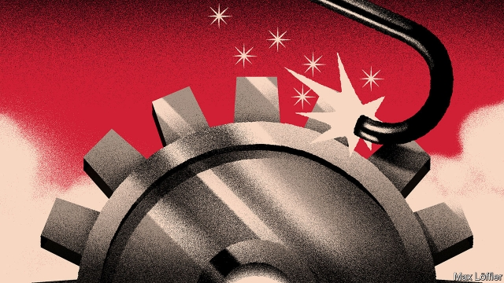

###### Free exchange

# Slower growth in ageing economies is not inevitable 

##### But avoiding it means tough policy choices 

 

> Mar 28th 2019 

FOR THE first time in history, the Earth has more people over the age of 65 than under the age of five. In another two decades the ratio will be two-to-one, according to a recent analysis by Torsten Sløk of Deutsche Bank. The trend has economists worried about everything from soaring pension costs to “secular stagnation”—the chronically weak growth that comes from having too few investment opportunities to absorb available savings. The world’s greying is inevitable. But its negative effects on growth are not. If older societies grow more slowly, that may be because they prefer familiarity to dynamism. 

Ageing slows growth in several ways. One is that there are fewer new workers to boost output. Workforces in some 40 countries are already shrinking because of demographic change. As the number of elderly people increases, governments may neglect growth-boosting public investment in education and infrastructure in favour of spending on pensions and health care. People in work, required to support ever more pensioners, must pay higher taxes. But the biggest hit to growth comes from weakening productivity. A study published in 2016, for example, examined economic performance across American states. It found that a rise of 10% in the share of a state’s population that is over 60 cuts the growth rate of output per person by roughly half a percentage point, with two-thirds of that decline due to weaker growth in productivity. 

Why are older economies less productive? The answer is not, as one might suppose, that older workers are. Though some capabilities, notably physical ones, deteriorate with age, the overall effect is not dramatic. A study of Germany’s manufacturing sector published in 2016 failed to detect a drop-off in productivity in workers up to the age of 60. Companies can tweak employees’ roles as they get older in order to make best use of the advantages of age, such as extensive experience and professional connections. 

Furthermore, if weak productivity growth was caused by older workers producing less, pay patterns should reflect that. Wages would tend to rise at the beginning of a career and fall towards its end. But that is not what usually happens. Rather, according to a recent paper by economists at Moody’s Analytics, a consultancy, wages are lower for everyone in companies with lots of older workers. It is not older workers’ falling productivity that seems to hold back the economy, but their influence on those around them. That influence is potent: the authors reckon that as much as a percentage point of America’s recent decline in annual productivity growth could be associated with ageing. 

How this influence makes itself felt is unclear. But the authors suggest that companies with more older workers might be less eager to embrace new technologies. That might be because they are reluctant to make investments that would require employees to be retrained, given the shorter period over which they could hope to make a return on that training for those near the end of their careers. Or older bosses might be to blame. Research indicates that younger managers are more likely to adopt new technologies than are older ones. This may seem obvious: older people’s greater aversion to new technology is a cliché. And at least anecdotally, greying industries do seem more averse to change. 

If the evidence suggested that ageing economies struggled primarily because of slow-growing labour forces and fast-growing pension costs, it would make sense to focus policy efforts on keeping people in work longer—by raising retirement ages, for example. But if, as seems to be the case, reticence to embrace new technologies is a bigger issue, other goals should take priority—in particular, boosting competition. In America, increasing industrial concentration and persistently high profits are spurring renewed interest in antitrust rules. The benefits of breaking up powerful firms and increasing competition might be even bigger than thought, if conservative old firms are thereby spurred to make better use of newer technologies. 

There are other measures that could help. Removing barriers to job-switching, for example by making benefits more portable, could shorten average tenures and help stop companies’ cultures becoming ossified. Best of all would be more immigration. An influx of young foreign workers would address nearly all the ways in which population ageing depresses growth. It would not only expand the labour force and create new taxpayers, but would mean more and younger companies, and greater openness to new technologies. And there would be plenty of willing takers in poorer countries with younger populations. 

Societies with lots of older workers are also societies with lots of older voters, however. Those voters are, on average, more politically conservative than younger people, and less likely to support increased immigration. People of all ages would gain from policies that boosted growth and productivity. But given the choice between a dynamic but unfamiliar society and a static but familiar one, older countries tend to opt for the second. In hindsight, the demographic boom that coincided with industrialisation in rich countries may have had an underappreciated benefit: it created a big constituency in favour of embracing new technologies and the opportunities they provided. 

Technology may at some point overcome the stifling effect of ageing. In a new paper Daron Acemoglu of the Massachusetts Institute of Technology and Pascual Restrepo of Boston University find that when young workers are sufficiently scarce, manufacturers invest in more automation, and experience faster productivity growth as a result. Robots have yet to make a big impact in the service sector and beyond, but as their capabilities improve and jobs for younger people go begging that may change. The world could use more flexibility and productivity now. But stagnation may end eventually, once the robots are promoted to management. 

-- 

 单词注释:

1.torsten[]:n. (Torsten)人名；(德、芬、瑞典)托尔斯滕 

2.deutsche[]:n. 德意志联邦共和国马克 

3.economist[i:'kɒnәmist]:n. 经济学者, 经济家 [经] 经济学家 

4.soar[sɒ:]:n. 高扬, 翱翔 vi. 往上飞舞, 高耸, 翱翔 

5.secular['sekjulә]:n. 修道院外的教士 a. 世俗的, 现世的, 长期的 

6.chronically['krɒnikli]:adv. 慢性地, 长期地, 习惯性地 

7.familiarity[fә.mili'æriti]:n. 熟悉, 精通, 亲密 

8.dynamism['dainәmizm]:n. 物力论, 力本说 [医] 动力说, 动力病原论 

9.demographic[.demә'græfik]:a. 人口统计的 [法] 人口统计的, 人口学的 

10.infrastructure['infrәstrʌktʃә]:n. 基础结构, 基础设施 [经] 基础设施 

11.pensioner['penʃәnә(r)]:n. 领取抚恤金者, (英国剑桥大学的)自费生, 为金钱所收买的人, 帮佣 [法] 领取退休金者, 领取抚恤金者 

12.productivity[.prәudʌk'tiviti]:n. 生产力 [经] 生产率, 生产能力 

13.les[lei]:abbr. 发射脱离系统（Launch Escape System） 

14.capability[.keipә'biliti]:n. 能力, 性能, 约束力 [化] 能力 

15.notably['nәjtbәli]:adv. 显著地, 著名地, 尤其, 特别 

16.deteriorate[di'tiәriәreit]:v. (使)恶化 

17.manufacturing[.mænju'fæktʃәriŋ]:n. 制造业 a. 制造业的 

18.sector['sektә]:n. 扇形, 部门, 部分, 函数尺, 象限仪, 段, 区段 vt. 把...分成扇形 [计] 扇面; 扇区; 段; 区段 

19.tweak[twi:k]:n. 拧, 扭, 焦急 vt. 扭, 开足马力 

20.analytic[.ænә'litik]:a. 分析的, 善于分析的, 解析的 [医] 分析的 

21.consultancy[]:n. 商量, 协商, 磋商, 会诊, 与...商量, 咨询, 请教, 找(医生)看病, 查阅, 考虑 [经] 咨询业务, 咨询服务 

22.reckon['rekәn]:vt. 计算, 总计, 估计, 认为, 猜想 vi. 数, 计算, 估计, 依赖, 料想 

23.unclear[.ʌn'kliә]:a. 不易了解的, 不清楚的, 含混的 

24.retrain[ri:'trein]:vt. 重新训练, 再训练 

25.aversion[ә'vә:ʃәn]:n. 厌恶, 讨厌的事, 讨厌的人 [医] 厌恶, 移转, 移位 

26.anecdotally[]:adv. anecdotal的变形 

27.averse[ә'vә:s]:a. 不愿意的, 反对的 

28.retirement[ri'taiәmәnt]:n. 退休, 隐居, 撤退 [经] 退休, 退股, (固定资产)报废 

29.reticence['retisns]:n. 无言, 沉默, 勉强 

30.persistently[pə'sɪstəntlɪ]:adv. 坚持地; 固执地; 一个劲儿 

31.antitrust[.ænti'trʌst]:a. 反托拉斯的 [法] 反托拉斯的 

32.shorten['ʃɒ:tn]:vt. 弄短, 缩短, 减少 vi. 缩小, 变短 

33.tenure['tenjuә]:n. 享有, 保有期 [经] (财产,职位等的)占有, 占有权 

34.ossify['ɒsifai]:vt. 使骨化, 使硬化, 使僵化 vi. 骨化, 硬化, 变得极端保守 

35.influx['inflʌks]:n. 流入, 河口, 汇集 [医] 注入, 流入 

36.taxpayer['tækspeiә]:n. 纳税人 [法] 纳税人, 纳税义务人 

37.openness['әupәnnis]:n. 公开；宽阔；率真 

38.taker['teikә]:n. 取者, 捕者, 接受者, 收取者 [法] 受者, 收票人, 接受打赌的人 

39.voter['vәutә]:n. 选民, 投票人 [法] 选民, 选举人, 投票人 

40.politically[]:adv. 政治上 

41.unfamiliar[.ʌnfә'miljә]:a. 不熟悉的 

42.opt[ɒpt]:vi. 选择 

43.hindsight['haindsait]:n. 枪的表尺, 事后聪明 

44.coincide[.kәuin'said]:vi. 一致, 符合 [化] 重合 

45.industrialisation[ɪndʌstrɪəlaɪzeɪ'ʃən]:n. 工业化 

46.underappreciated[,ʌndәrә'pri:ʃieitid]:a. 未得到正确评价的, 未受到充分赏识(或欣赏)的 

47.constituency[kәn'stitjuәnsi]:n. 选民, 顾客, 读者 [法] 选区, 全体选民, 选区内的选民 

48.stifle['staifl]:vt. 使窒息, 抑止, 扼杀 vi. 窒息, 被扼杀 

49.daron[]: [人名] 达龙 

50.Acemoglu[]:[网络] 阿西莫格鲁；阿斯莫格鲁；阿西墨格鲁 

51.Massachusetts[.mæsә'tʃu:sits]:n. 麻萨诸塞州 

52.pascual['pæskjjәl]:a. 牧场的, 长在牧场的 

53.restrepo[]: [地名] [哥伦比亚] 雷斯特雷波 

54.Boston['bɒstәn]:n. 波士顿 

55.flexibility[.fleksi'biliti]:n. 弹性, 适应性 [计] 灵活性; 适应性 

56.stagnation[stæg'neiʃәn]:n. 淤塞, 停滞 [医] 停滞, 滞留, 郁积 

