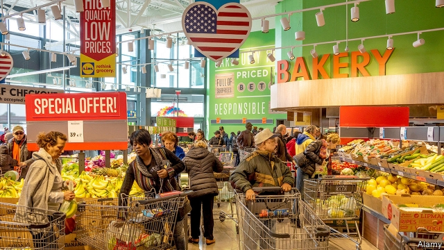
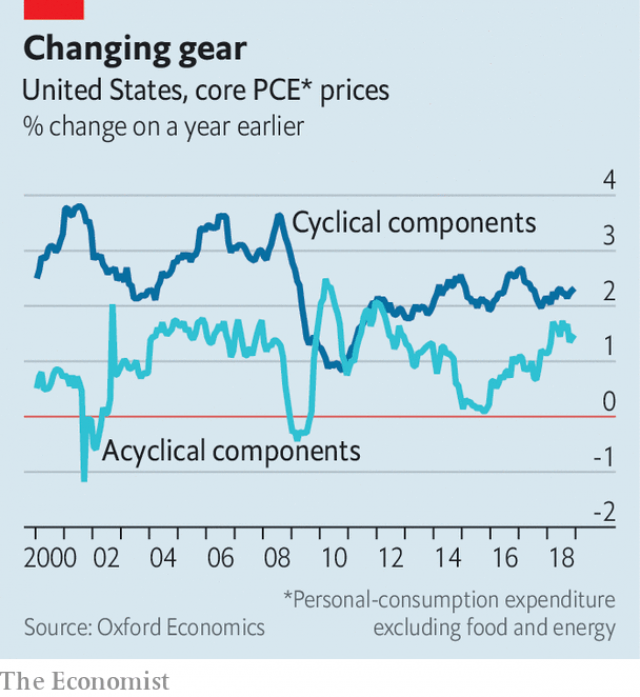

###### Keep it up

# Why is inflation in America so low? 

##### The puzzle that never really went away 

 

> Mar 28th 2019 

ALMOST TEN years into the recovery from the financial crisis, American monetary-policymakers are still finding that inflation is strangely quiescent. Every time price pressures seem to build, they then dissipate. The latest peak was in July 2018. Inflation as measured by the personal consumption expenditure (PCE) index, which the Federal Reserve tries to pin at 2%, was at 2.4%, and, in a rare heated moment—by the standards of the past decade—consumer-price inflation hit 2.9%. But since then, even as unemployment has stayed low, both measures have sagged to below 2% once again. 

The absence of stronger inflationary pressure has been a little bruising for the Fed. It has long predicted that upward price pressures would result from the economy—and in particular, the labour market—pushing against its natural limits. In preparation for that event, it has raised interest rates nine times since December 2015. Along the way it has explained dips in inflation as temporary. But self-doubt has grown all the while. Weakness in inflation is one reason that rate rises are on hold today, with Jerome Powell, the Fed’s chair, emphasising the need for patience. 

Inflation is notoriously noisy, and therefore tricky to forecast. Energy prices, which are volatile, are responsible for much of the fall since last July. Core PCE inflation, which strips out food and energy, also rose in mid-2018—to 2%, exactly where the Fed wants it. But its subsequent fall has been small: a tenth of a percentage point between July and December. 

The risk is that this trend, though gentle, proves to be persistent. Figures for January were due to be released on March 29th, after The Economist went to press. The Cleveland Fed estimates that they will show another slight fall. 

Falling core inflation can suggest a weakening economy. But only some components of inflation are procyclical. Restaurant meals, furniture and housing all seem to get pricier more quickly in booms. Other prices—like those of health care, financial services, clothes and transport—seem to follow their own tune. The increase in core PCE inflation in the first half of 2018 was mainly driven by such “acyclical” prices, according to an analysis by Adam Shapiro of the San Francisco Fed. Around half of the rise was caused by changes in prices of mobile-phone contracts and heftier charges and fees for financial services, a category that includes levies on credit-cards and cash machines. 

 

What goes up can come down. A similar exercise by Gregory Daco of Oxford Economics, a consultancy, finds that the fall in core inflation since mid-2018 also reflects the acyclical part of the inflation mix. The cyclical component of inflation, meanwhile, has not much changed. It remains 0.7 percentage points below the average for 2004-07 (see chart). Amid signs of a slowdown in economic growth, there are even some indications that this component could be weakening. Rental costs for housing (including imputed rents) have shown some signs of moderating, for example, having previously been galloping upwards. 

In combination, these pieces of research suggest that underlying inflationary pressure did not subside in the second half of 2018, because it was never there in the first place. But that poses a bigger puzzle: why has the cyclical component of inflation been so muted, given the apparent strength of America’s labour market? That is the question for economists to tackle—ideally before it becomes moot. 

-- 

 单词注释:

1.inflation[in'fleiʃәn]:n. 胀大, 夸张, 通货膨胀 [化] 充气吹胀; 膨胀 

2.strangely['streindʒli]:adv. 奇妙地, 奇怪地, 不可思议地 

3.quiescent[kwai'esnt]:a. 静止的, 不活动的, 寂静的 [医] 静息的, 静止的 

4.dissipate['disipeit]:vt. 散失, 驱散, 浪费 vi. 消散, 放荡 

5.inflation[in'fleiʃәn]:n. 胀大, 夸张, 通货膨胀 [化] 充气吹胀; 膨胀 

6.pce[]:abbr. 个人消费支出（Personal Consumption Expenditures）；测温锥等值（Pyrometric Cone Equivalent）；穿孔卡片机（Punched Card Equipment）；熔锥鉴定法（Pyrometric Cone Evaluation） 

7.sag[sæg]:vi. 下垂, 倾斜, 萎靡, 萧条, 变得乏味 vt. 使下垂 n. 下垂, 倾斜, 萧条 [计] 系统分析组, 语法分析生成程序, 电压下降 

8.inflationary[in'fleiʃәnәri]:a. 通货膨胀的, 通货膨胀倾向的 

9.jerome[dʒә'rәum]:n. 杰罗姆（男子名） 

10.powell['pәuәl, 'pauәl]:n. 鲍威尔（英国物理学家） 

11.emphasise[]:vt. 强调, 重读, 加强...的语气, 着重 

12.notoriously[]:adv. 臭名昭著的, 声名狼藉的 

13.tricky['triki]:a. 狡猾的, 机敏的 

14.volatile['vɒlәtail]:a. 挥发性的, 可变的, 不稳定的, 飞行的, 轻快的, 爆炸性的 n. 有翅动物, 挥发物 [计] 易失的 

15.persistent[pә'sistәnt]:a. 固执的, 坚持的, 持续的, 作用持久的 [法] 坚持的, 固执的, 持续的 

16.economist[i:'kɒnәmist]:n. 经济学者, 经济家 [经] 经济学家 

17.Cleveland['kli:vlәnd]:n. 克利夫兰 

18.procyclical[]:扩大经济週期 

19.pricy['praisi]:a. 昂贵的, 价格高的 

20.quickly['kwikli]:adv. 很快地 

21.acyclical[]:[网络] 非周期性；非周期性的 

22.Adam['ædәm]:n. 亚当 [计] 自动直接存取管理 

23.shapiro[ʃә'pirәu]:n. 夏皮罗（姓氏） 

24.san[sɑ:n]:abbr. 存储区域网（Storage Area Networking） 

25.francisco[fræn'siskәu]:n. 弗朗西斯科（男子名, 等于Francis） 

26.hefty['hefti]:a. 重的, 肌肉发达的 

27.levy['levi]:n. 税款, 所征的人数, 征收 vi. 征税, 课税 vt. 征收, 强求, 召集 

28.gregory['^re^әri]:n. 格雷戈里（男子名, 古代罗马教皇之名） 

29.Oxford['ɒksfәd]:n. 牛津, 牛津大学 

30.consultancy[]:n. 商量, 协商, 磋商, 会诊, 与...商量, 咨询, 请教, 找(医生)看病, 查阅, 考虑 [经] 咨询业务, 咨询服务 

31.cyclical['siklik(e)l]:a. 周期的, 轮转的, 循环的, 轮列的, 轮卷的, 环状的, 环的, 组诗的, 始末的 [计] 循环的 

32.amid[ә'mid]:prep. 在其间, 在其中 [经] 在...中 

33.slowdown['slәudaun]:n. 降低速度, 减速 

34.rental['rentl]:n. 租费, 租金收入 a. 租赁的, 收取租金的 

35.impute[im'pju:t]:vt. 归罪, 使负责, 嫁祸于 

36.gallop['gælәp]:n. 疾驰, 飞奔 vi. 飞驰, 急速进行, 急急忙忙地说 vt. 使飞跑, 迅速运输 

37.underlie[.ʌndә'lai]:vt. 位于...之下, 成为...的基础 

38.subside[sәb'said]:vi. 沉淀, 沉降, 平息 

39.economist[i:'kɒnәmist]:n. 经济学者, 经济家 [经] 经济学家 

40.moot[mu:t]:n. 大会, 模拟案件, 辩论会 a. 未决议的, 无实际意义的 vt. 讨论, 争论 

