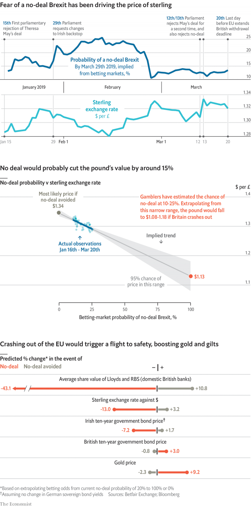

###### Brexit and the markets

# A no-deal Brexit would send sterling to its lowest level since 1985 

##### How political betting markets can predict financial asset prices 

 

> Mar 28th 2019 

REGARDLESS OF WHAT they tell you, traders struggle to explain short-term fluctuations in the value of currencies. Recently, however, the pound has become an exception. Every time it seems more likely that Britain will leave the EU without a deal, sterling falls against the dollar. 

The strength of this link can be measured statistically, thanks to a helpful proxy for the odds of no-deal. On January 16th a market opened on Betfair Exchange, a betting website, on whether Britain will crash out by March 29th, the original Brexit deadline. Punters have bet £3.9m ($5.1m). 

On March 21st the EU extended this deadline, causing the chances of no-deal by the end of March to fall to near zero. But for the 64 days between the opening of the market and the granting of the extension, the odds seemed to mirror the exchange rate. For each ten-percentage-point rise in the probability of no-deal, the pound lost $0.02, and vice versa. As sterling moved between $1.28 and $1.33, it was possible to predict the exchange rate from Betfair's odds with an average error of just one cent. 

This correlation is robust enough to allow for educated guesses about where the pound might land if Britain crashes out. If the same relationship were to hold, in the event of no-deal, there would be a 95% chance sterling would fall from its current price of $1.32 to between $1.08 (last reached in 1985) and $1.18. The most likely value would be $1.13. 

The same method can be applied to other markets with strong links to no-deal odds. Among the assets we tested, the biggest winner from no-deal would be gold, with an expected gain of 9%. The worst losers would be domestic British banks, which are heavily exposed to the housing market. For each rise of ten percentage points in Betfair's no-deal price, the average share price of Lloyds and RBS has fallen by 5.4% of their current value. This implies that no-deal would cut them nearly in half. 

Surprisingly, the method finds that no-deal would set British and Irish bonds on opposite paths. A crash-out would hit Ireland's debt hard, causing the gap between its interest rate and Germany's to rise from 0.6 percentage points to 1.4. In contrast, British yields would fall from 1.0% to 0.6%. 

One cause of this divergence is that Britain, unlike Ireland, sets its own monetary policy. Facing an adverse shock, the Bank of England can cut interest rates and use quantitative easing, boosting bond prices. The European Central Bank, however, sets policy for the entire EUro zone, not just for countries such as Ireland that would be particularly badly harmed by no-deal. 

Our figures are uncertain. Correlations that look robust within a small range of no-deal prices could fail outside it. But unless no-deal becomes more likely, forecasts of its impact require tenuous assumptions. As George Box, a statistician, said, all models are wrong, but some are useful. 

-- 

 单词注释:

1.Brexit[]:[网络] 英国退出欧盟 

2.sterling['stә:liŋ]:n. 英国货币, 标准纯银 a. 英国货币的, 标准纯银的, 含标准成分的 

3.asset['æset]:n. 资产, 有益的东西 

4.trader['treidә]:n. 商人, 商船 [经] 交易者, 商船 

5.fluctuation[.flʌktʃu'eiʃәn]:n. 变动, 波动, 动摇 [化] 涨落; 起伏; 波动; 脉动 

6.EU[]:[化] 富集铀; 浓缩铀 [医] 铕(63号元素) 

7.statistically[]:adv. 用统计的方法, 统计学上 

8.proxy['prɒksi]:n. 代理, 代理人, 委托书 [经] 代理人, 代表权, 授权书 

9.odds[ɒdz]:n. 可能性, 几率, 机会, 胜算, 不平等 

10.punter['pʌntә]:n. 用篙撑船的人, 船夫, 赌博者 

11.versa[]:a. 反的 

12.correlation[.kɒrә'leiʃәn]:n. 相互关系, 相关, 关联 [医] 相关, 联系 

13.robust[rәu'bʌst]:a. 健康的, 强健的, 要用力气的, 坚定的, 粗野的 [计] 健壮性 

14.loser['lu:zә]:n. 失败者, 遗失者 [法] 失败者, 失物者, 遗失者 

15.lloyd[lɔid]:n. 劳埃德（男子名） 

16.RB[]:[计] 归偏制 [医] 铷(37号元素) 

17.divergence[dai'vә:dʒәns]:n. 分歧 [计] 分散度 

18.monetary['mʌnitәri]:a. 货币的, 金钱的 [经] 货币的, 金融的 

19.adverse['ædvә:s]:a. 不利的, 敌对的, 相反的, 逆的 [法] 相反的, 敌对的, 逆的 

20.quantitative['kwɒntitәtiv]:a. 数量的, 定量的 [医] 定量的, 数量的 

21.euro['juәrәu]:n. 欧元（欧盟的统一货币单位） 

22.tenuous['tenjuәs]:a. 稀薄的, 微细的, 纤细的, 脆弱的 [医] 细薄的, 纤细的 

23.george[dʒɔ:dʒ]:n. 乔治（男子名）；自动操纵装置；英国最高勋爵勋章上的圣乔治诛龙图 

24.statistician[.stæti'stiʃәn]:n. 统计员, 统计学家 [经] 统计家 

