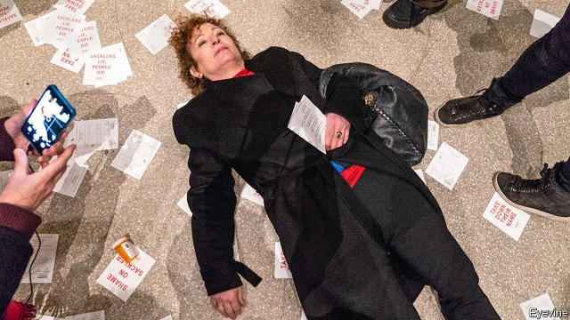

###### Gifts rapped

# How Sackler cash made museums a target for protests 

##### Woke art-lovers prefer galleries untainted by donors they dislike 

 

> Mar 28th 2019 

VISITORS TO THE Solomon R. Guggenheim Museum in New York witnessed an unexpected performance on February 9th. Dozens of activists who had been summoned by social media unfolded four red banners from the Guggenheim’s corkscrew balconies. In big black letters they read: “400,000 dead”, “200 dead each day”, “Shame on Sackler” and “Take down their name”. A cloud of white confetti was hurled from the top of the rotunda, each piece of paper a medical prescription. 

The drug named in the prescription blizzard, OxyContin, is implicated in America’s terrible opioid crisis. Many states have filed lawsuits against its maker, Purdue Pharma, arguing that it bears some responsibility for thousands of deaths. On March 26th the firm settled a case brought by Oklahoma for $270m. 

Purdue Pharma’s conduct is a problem for the Guggenheim and other museums because the firm is owned by members of the Sackler family, who are among the world’s biggest cultural philanthropists. Activists led by Nan Goldin, an art photographer who became addicted to OxyContin following an injury to her wrist, are trying to shame museums into turning their backs on the Sacklers’ money. She argues that the family ought to be paying for the treatment of addicts instead. 

A few days after the Guggenheim protest, the campaign came to London. Ms Goldin told the National Portrait Gallery that she would boycott a prestigious retrospective of her work if the museum accepted an offer of £1m ($1.3m) from the Sacklers. By March 25th the Museum of South London had returned a gift from the family. The Tate galleries and the Guggenheim announced that they would no longer accept Sackler money. Ms Goldin threatened that another London gallery, widely believed to be the Victoria & Albert Museum (V&A), would be the target of her next protest. Dame Theresa Sackler, whose late husband was one of the owners of Purdue Pharma, has been a trustee of the V&A since 2011. Her family trust paid for the museum’s new £2m Sackler Courtyard. 

The speed at which the campaign has moved is a tribute to Ms Goldin’s group, PAIN (“Prescription Addiction Intervention Now”). It also says something about museums in America and—especially—Britain. Because of changes to their funding, and because their mission has changed, museums have become far more vulnerable to campaigners. 

Politicians have long smiled on museums. They have encouraged new ones to open, often hoping that they will revitalise neglected towns, as the Guggenheim Museum Bilbao did in the 1990s. Since the financial crisis, however, state funding has become stingier. In the decade to 2017 (the latest year for which figures are available) public spending on museums and galleries in Britain fell by 30% in real terms. British museums are in a particular fix because the government has been committed to the idea that visitors should be allowed free entry to permanent collections. Even tourists from other countries get in for nothing. By contrast, when the Metropolitan Museum of Art in New York faced a funding shortfall a year ago, it began charging visitors from outside New York State $25 each. 

Small provincial museums have often dealt with the financial squeeze by cutting costs. But national ones have moved towards the American model, by soliciting donations from private and corporate donors—“a way for the rich to launder their souls”, as one director cynically puts it. 

Museums trusteeships in America are a route to social advancement as well as a civic duty. It costs at least $10m to join the board of the Metropolitan Museum of Art, and trustees are urged to give more. The Met’s 75 trustees have a combined worth of more than $50bn. “Give, get or get off” is the unofficial mantra of most American museum boards (“get” means persuading a company or rich friend to stump up). 

America’s large museum boards reflect that country’s tax breaks for charity and its tradition of giving to local institutions. In Britain, by contrast, the circle of major donors is tiny. One chair of a museum in London counts no more than eight big donors. The most important is Len Blavatnik, an industrialist born in Ukraine, who responded in 2017 when Tate Modern found that its new Switch House extension had left it with a £30m funding shortfall. Soon after it opened, the Switch House was renamed the Blavatnik Building. 

At the same time, museums have tried to make themselves more relevant and edgy. Benjamin Ives Gilman, for 30 years secretary of the Boston Museum of Fine Arts, used to describe the museum as “in essence a temple”. Now, says Sir Nicholas Serota, a former director of the Tate galleries, they are “a forum for debate as much as a treasure box”. 

Attracting young visitors is a priority for all museums. Most have a director of “public engagement” whose job it is to bring them in. The Tate, one of the leaders, has created Tate Forum, a “peer-led” youth project that combines museum talks with open debates. Many museums have stopped disapproving of mobile phones; the Brooklyn Museum even encourages visitors to text questions to curators. Teenagers flock to sleepovers in the British Museum’s Egyptian galleries. 

Young people are quick to signal what they like—and what they don’t. Having worked so hard to engage with them and solicit their views, the museums should perhaps not be too surprised when their customers turn on their donors. 

-- 

 单词注释:

1.rap[ræp]:n. 轻敲, 拍击, 责骂, 无价值的东西 vt. 轻敲, 厉声说出, 叱责, 抢走, 使着迷 vi. 敲击, 发敲击声, 交谈, 同情 [计] 随机存取程序, 资源分配处理器, 常驻汇编程序 

2.sackler[]: [人名] 萨克勒 

3.untainted['ʌn'teintid]:a. 没有污点的, 清白无瑕的 

4.donor['dәunә]:n. 捐赠人 [化] 给体; 供体 

5.Solomon['sɒlәmәn]:n. 所罗门(古以色列国王), 聪明人, 贤人 [计] 所罗门阵列处理机 

6.R[ɑ:(r)]:[计] 半径, 比例, 读, 接收, 寄存器, 复位, 电阻, 程式 

7.Guggenheim['^j^әnhaim]:n. <口> = Guggenheim fellowship 

8.york[jɔ:k]:n. 约克郡；约克王朝 

9.unexpect[]:[网络] 意想不到；使意外 

10.activist['æktivist]:n. 激进主义分子 

11.summon['sʌmәn]:vt. 召唤, 召集, 号召, 振奋, 唤起, 鼓起 [经] 传唤, 传讯 

12.corkscrew['kɒ:kskru:]:n. 拔塞钻 a. 螺旋形的 vt. 硬拉出, 探听 vi. 曲折行进 

13.confetti[kәn'feti]:n. 糖果, 五彩纸屑 

14.hurl[hә:l]:n. 用力的投掷 vt. 用力投掷, 发射, 愤慨地说出, 丢下 vi. 猛投, 猛掷 

15.rotunda[rәu'tʌndә]:n. 圆形建筑, 圆形大厅 

16.blizzard['blizәd]:n. 大风雪, 暴风雪 

17.oxycontin[]: [医]盐酸羟考酮控释片剂<镇痛药> 

18.implicate['implikeit]:vt. 涉及, 含意, 暗示, 牵连 n. 包含的东西 

19.opioid[əʊ'pi:əʊɪd]:a. 类鸦片（引起）的 n. 类鸦片活性肽 

20.lawsuit['lɒ:sju:t]:n. 诉讼 [法] 诉讼, 诉讼案件 

21.maker['meikә]:n. 制造者, 上帝 [经] 制造者, 出票人 

22.purdue[]:n. 普杜大学（美国一所大学） 

23.pharma[]:n. 制药公司 

24.Oklahoma[.әuklә'hәumә]:n. 俄克拉何马 

25.cultural['kʌltʃәrәl]:a. 文化的, 教养的, 修养的 [医] 培养的 

26.philanthropist[fi'lænθrәpist]:n. 慈善家, 博爱主义者, 乐善好施的人 [法] 慈善家, 博爱主义者 

27.nan[næn]:n. 奶奶（小孩儿语）；印度, 巴基斯坦式的微微发酵的面包 

28.goldin[]: [人名] 戈尔丁 

29.addict[ә'dikt]:vt. 使沉溺, 使上瘾 n. 入迷的人, 上瘾者 

30.prestigious[pre'stidʒiәs]:a. 享有声望的 

31.retrospective[.retrә'spektiv]:a. 回顾的, 怀旧的, 在后面的 n. 回顾展 

32.sackler[]: [人名] 萨克勒 

33.tate[teit]:n. 塔特（姓氏） 

34.victoria[vik'tɔ:riә]:n. 维多利亚（女子名） 

35.albert['ælbәt]:n. 艾伯特（男子名） 

36.dame[deim]:n. 夫人 

37.theresa[ti'ri:zә]:n. 特丽萨（女子名） 

38.trustee[.trʌs'ti:]:n. 受托人, 理事 [计] 委托者 

39.tribute['tribju:t]:n. 贡物, 礼物, 颂辞 

40.addiction[ә'dikʃәn]:n. 入迷, 瘾 [医] 瘾, 癖嗜 

41.intervention[.intә'venʃәn]:n. 插入, 介入, 调停 [经] 干预 

42.vulnerable['vʌlnәrәbl]:a. 易受伤害的, 有弱点的, 易受影响的, 脆弱的, 成局的 [医] 易损的 

43.campaigner[kæm'peinә]:n. 从军者, 老兵, 竞选者 

44.revitalise[]:vt. 使有新的活力, 使新生, 使恢复元气 

45.bilbao[bil'bɑ:әu]:n. 毕尔巴鄂（地名, 西班牙港口） 

46.stingier[ˈstɪndʒi:ə]:a. 小气的, 吝啬的( stingy的比较级 ) 

47.metropolitan[.metrә'pɒlitn]:n. 大都市居民, 都主教, 宗主国的公民 a. 大都市的, 都主教区的, 宗主国的 

48.shortfall['ʃɒ:tfɒ:l]:n. 不足, 不足量 [经] 缺少, 不足, 亏舱运费 

49.provincial[prә'vinʃәl]:n. 外地人, 粗野的人 a. 省的, 外地的, 偏狭的 

50.solicit[sә'lisit]:v. 请求, 乞求, 招揽, 征求 

51.donation[dәu'neiʃәn]:n. 捐赠物, 捐款, 捐赠 [经] 赠品, 捐款, 捐赠 

52.corporate['kɒ:pәrit]:a. 社团的, 合伙的, 公司的 [经] 团体的, 法人的, 社团的 

53.launder['lɒ:ndә]:n. 流水槽 v. 洗衣, 烫衣 

54.cynically[]:adv. 爱嘲笑地；冷笑地 

55.trusteeship[trʌs'ti:ʃip]:n. 托管制度, 托管人职责 

56.advancement[әd'vɑ:nsmәnt]:n. 前进, 进步, 提升 [医] 徙前术 

57.civic['sivik]:a. 市的, 市民的, 公民的 [法] 公民的, 市民的, 公民资格的 

58.unofficial[.ʌnә'fiʃәl]:a. 非正式的, 非官方的 [化] 非法定的; 未入药典的 

59.mantra['mʌntrә, 'mæn-]:颂歌, 咒语(尤指四吠陀经典内作为咒文或祷告唱念的) 

60.stump[stʌmp]:n. 残株, 树桩, 烟蒂, 讲演台 vt. 砍断, 挑战, 难住 vi. 蹒跚而走 

61.len[]:n. 伦恩（男子名） 

62.industrialist[in'dʌstriәlist]:n. 企业家, 实业家 [经] 实业家, 工业主义者 

63.ukraine[ju(:)'krein]:n. 乌克兰（原苏联一加盟共和国, 现已独立） 

64.rename[.ri:'neim]:vt. 重新命名, 再命名, 给...改名 [计] 重命名; DOS内部命令:更改文件名 

65.edgy['edʒi]:a. 刀口锐利的, 尖利的, 急躁的 

66.benjamin['bendʒәmin]:[医] 安息香 

67.Ives[aivz]:艾夫斯(①姓氏,男子名②Charles Edward,1874-1954,美国作曲家 ③James Merritt, 1824-1895, 美国石印家) 

68.Gilman[]:n. (Gilman)人名；(英、俄)吉尔曼；(西)希尔曼 

69.Boston['bɒstәn]:n. 波士顿 

70.essence['esns]:n. 实质, 本质, 香精 [化] 香精 

71.nicholas['nikәlәs]:n. 尼古拉斯（男子名） 

72.serota[]:[网络] 馆长塞罗塔 

73.forum['fɒ:rәm]:n. 论坛, 公开讨论的广场, 法庭, 讨论会 [法] 讨论会, 专题讨论, 公共论坛 

74.engagement[in'geidʒdmәnt]:n. 诺言, 约会, 婚约, 交战 [医] 衔接 

75.forum['fɒ:rәm]:n. 论坛, 公开讨论的广场, 法庭, 讨论会 [法] 讨论会, 专题讨论, 公共论坛 

76.Brooklyn['bruklin]:n. 布鲁克林区(纽约行政区) 

77.curator[kjuә'reitә]:n. 管理者, 经理, 主管人, 掌管者, 馆长, 大学学监, 监护人, 保护人 [经] 临时监护人 

78.sleepover[ˈsli:pəʊvə(r)]:n. 就是孩子到别的小朋友家过夜。 

