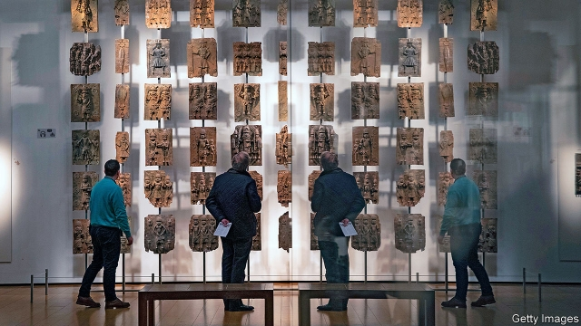
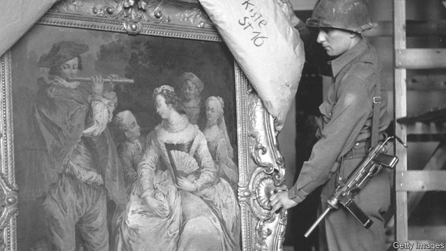

###### Art of Africa

# The clamour to return artefacts taken by colonialists 

##### Former colonies want their cultural treasures back 

 

> Mar 28th 2019 

IN THE NEW Museum of Black Civilisations in Dakar, two vitrines display a French-made sword, a Koran and a pair of scruffy leather sandals. They were taken from Hadj Omar Tall, a Sufi military commander who briefly formed an empire that stretched across Guinea, Mali and Senegal. Hadj Omar gained a heroic reputation fighting the French in west Africa until he was killed in 1864. His personal effects were seized as war booty and eventually bequeathed to various French museums. They have been returned, temporarily, for the Dakar museum’s opening. “It’s the third time they’ve lent us what is ours,” sniffs the director, Hamady Bocoum. 

In November 2017 President Emmanuel Macron of France electrified an audience of students and faculty at the University of Ouagadougou in Burkina Faso. Claiming to speak in the name of youth, he said: “I cannot accept that a large share of several African countries’ cultural heritage be kept in France…Within five years I want the conditions to exist for temporary or permanent returns of African heritage to Africa.” In minutes the first French president born after the colonial period had smashed the conventional justification for refusing to return artworks. Public collections in France and elsewhere in Europe are generally held to be “inalienable”. They belong to the state or, in the case of the British Museum, are held by its trustees on behalf of Parliament. They cannot be given back. 

Around the time of his speech, Mr Macron commissioned two academics—Felwine Sarr, a radical Senegalese scholar and essayist, and Bénédicte Savoy, a French art historian specialising in the restitution of art looted by Napoleon—to advise the government on how to share the art in its possession more widely. If French museum directors were shocked at not having been consulted before Mr Macron made his speech, they were even more surprised when the report came out last November. The authors concluded that 95% of Africa’s cultural heritage is held outside the continent. Most of it was looted, stolen, bought under duress or borrowed and never returned, they said. They argued that objects should go back, starting with those that were carried off as booty during raids. 

Western museums were appalled. Jean-Jacques Aillagon, a former French culture minister, complained to Le Figaro: “Their recommendations would have the effect of emptying French museums of their African collections, placing in their stead physical or virtual copies!” Hartwig Fischer, director of the British Museum, which faces restitution claims from Nigeria for the Benin Bronzes (pictured above) as well as from Turkey and Greece, made no public comment. But over the winter he has repeatedly said to friends: “The report is not helpful. Not helpful at all.” 

It is not the first time that Western museums have been asked to hand over treasures. One of the oldest disputes is between Britain and Greece over the marble statuary that was removed from the Parthenon in Athens by Lord Elgin and sold to the British government in 1816 to become the centrepiece of the British Museum. During the second world war, when Britain needed Greece’s help, the Foreign Office drafted a scheme for their return. The plan was shelved when the danger passed. Germany’s government has asked Russian museums to return some of the vast haul stolen at the end of the second world war; the Russians have declined. 

Some restitution has taken place. The Smithsonian museums in America have repatriated thousands of funerary and sacred objects to Native American tribes. Human remains have been returned to Australia, New Zealand and Polynesia. Yet, with the exception of Sara “Saartjie” Baartman, who was brought from South Africa to Europe in the early 19th century and exhibited in a freak show as the “Hottentot Venus” and whose remains were returned for burial in 2002, few objects have been given back to African countries. 

But artists have not let the issue rest. Restitution was the theme of the latest documenta, a contemporary art show held every five years, most recently in Kassel and Athens. “Le Silence du Totem”, a novel of 2018 by the Senegalese writer Fatoumata Sissi Ngom, is about the discovery of a sculpture in a Paris museum. In the stupendously popular film “Black Panther”, an artefact looted from the fictional kingdom of Wakanda is stolen back from the “Museum of Great Britain”. And two developments—one originating in Europe, the other in Africa—are making demands for restitution harder to resist. 

In 1998 representatives of 44 countries gathered in Washington, DC, to discuss how the heirs of Jewish collectors could lay claim to the artworks that had been stolen by the Nazis and their agents—often known as Raubkunst. Gradually the debate spread to what Nicholas Thomas, director of the Cambridge Museum of Archaeology and Anthropology, calls “colonial Raubkunst”. That refers to the untrammelled accumulation of ethnographic collections from Germany’s colonial empire: Togo, Cameroon, mainland Tanzania and former South-West Africa (now Namibia and part of Botswana). 

A German museum due to open this year, the Humboldt Forum, has turned an academic row into a public one. A throwback to an old Prussian museum project, the Humboldt Forum will house, among others, objects from the Ethnological Museum of Berlin, Germany’s biggest ethnographic collection. Ms Savoy, one of the co-authors of the Macron report, has lived in Berlin for nearly 25 years. In July 2017 she resigned from the Humboldt Forum’s advisory board in protest at what she regarded as the less than rigorous research being done on its ethnographic collections. “I want to know how much blood is dripping from each artwork,” she wrote. “Without this research, no Humboldt Forum and no ethnological museum should open.” 

Ms Savoy and Mr Sarr’s report for the French government has a German flavour. Long-term museum-to-museum loans, as Mr Macron had suggested, were not the solution, the authors argued. Nor was it sufficient to assume that a gap in the provenance of an object might mean that the object had been acquired in good faith. Just as has happened with artworks whose ownership could not be accounted for during the Nazi period, the report insists that unless an African object can conclusively be proven to have been purchased in good faith on both sides, it should be returned. 

In 1973 Mobutu Sese Seko, the president of Zaire (now the Democratic Republic of Congo), made one of the earliest public demands for the restitution of African artworks. He pleaded before the UN General Assembly in New York for the return of stolen objects, “so that we can teach our children and our grandchildren the history of their countries.” The Africa Museum at Tervuren, in Belgium, duly sent back 144 pieces. Almost all of these quickly found their way back on to the market in Europe, having been stolen, says the director, Guido Gryseels. 

For decades European curators have cited that episode as one of the prime reasons why their treasures should not be returned to Africa. Corruption is not the only danger: Islamist terrorism poses a threat to art across the Sahel as it did in Iraq. Resources are a problem, too. In Ouagadougou, the city where Mr Macron gave his speech in 2017, the national museum is made up of half a dozen small buildings set across 28 acres of grassland. It has only enough of a collection to fill one room. There are more cattle outside than historical artefacts inside. 

Tanzania has so far refused to engage with the idea, promoted by Germany’s Green Party, that the museums in Berlin should return 20,000 ethnographic artefacts seized when Tanganyika was a German colony before the first world war, saying it has nowhere to store them. Joseph Kabila, who has just stepped down as Congo’s president, said last December that the government would formally request the return of all its treasures from Belgium once a new national museum, paid for by South Korea, opens later this year. Until then, “Where would we put all those objects? We don’t have space here,” says Paul Bakua-Lufu, the director-general of museums. 

 

But other countries are doing better. Ivory Coast is asking for the return of 100 objects from France, and says it has the galleries to display them. A new museum has been opened with UNESCO’s help in Gao in Mali; another will open soon in Timbuktu, says Salia Malé, director of Mali’s National Museum. Benin, which is requesting the return of works looted from the royal palaces of Abomey by French soldiers in 1892, is building three new museums. 

The greatest steps forward have been in Senegal and Nigeria. In Mr Bocoum’s Museum of Black Civilisations in Dakar, which China built as a gift to Senegal for €35m ($40m), four floors of exhibitions cover everything from palaeontology to contemporary West African fashion. A gallery on the Abrahamic religions is there to show that Christianity and Islam can co-exist peacefully. “Non à la Charia à Tombouctou”, a contemporary textile-and-embroidery work by Abdoulaye Konaté, a Cuban-trained artist from Mali, shows the skyline of Timbuktu with a sword hovering above. Mr Bocoum believes art can be a unifying force. He would like artists and young people to come to the museum, not just to see art made in West Africa but to have the experience, as visitors in Europe do, of seeing the connections between artworks from different continents and civilisations—to prove that “what unites us is stronger than what divides us,” he says. 

In Nigeria the Edo state government and royal court plan to build a museum in Benin City to house the treasures that were looted during a punitive expedition in 1897. More than 1,000 of the Benin Bronzes found their way into museums in Europe and America; the largest portion is in the British Museum. The state government will soon begin a feasibility study for the new building, which will include galleries and a research institute. “These works are our ambassadors,” says the executive governor of Edo State, Godwin Obaseki. “They represent who we are.” 

-- 

 单词注释:

1.clamour['klæmә]:n. 喧闹 v. 大声地要求 

2.artefact['ɑ:tifækt]:n. 人工制品, 制造物, 人为现象, 膺象, 矫作物, 古代文物 [医] 人为现象, 人工产物 

3.colonialist[kә'lәjnjәlist]:n. 殖民主义者 [法] 殖民主义者 

4.cultural['kʌltʃәrәl]:a. 文化的, 教养的, 修养的 [医] 培养的 

5.civilisation[,sivilai'zeiʃən;-li'z-]:n. 文明, 文明世界, 文化, 开化, 教化 

6.dakar['dækә]:n. 达喀尔（塞内加尔首都） 

7.vitrine[vi'tri:n]:n. 陈列用玻璃橱窗 

8.Koran[kɒ'rɑ:n]:n. <<可兰经>> 

9.scruffy['skrʌfi]:a. 不整齐的, 肮脏的, 破旧的, 褴褛的 

10.sandal['sændl]:n. 凉鞋, 拖鞋, 檀香木 vt. 穿以便鞋 

11.hadj[hædʒ]:n. 赴麦加(Mecca)朝圣 

12.omar['әjmɑ:(r)]:n. 奥马尔（男子名） 

13.sufi['su:fi]:n. 苏非派 

14.briefly['brifli]:adv. 简短地, 扼要地, 简明地, 简单地 

15.guinea['gini]:n. 几内亚 

16.Mali['mɑ:li]:n. 马里 

17.Senegal[,seni'^ɔ:l]:n. 塞内加尔 

18.booty['bu:ti]:n. 战利品, 获得之物 [法] 赃物, 掳获物, 战利品 

19.bequeath[bi'kwi:ð]:vt. 遗赠, 遗留 [法] 遗赠, 遗留...给 

20.temporarily['tempәrәrәli]:adv. 暂时, 一时, 临时 

21.hamady[]:[网络] 阿马蒂 

22.emmanuel[i'mænjuәl]:n. 以马内利（耶稣基督的别称）；伊曼纽尔（男子名, 等于Immanuel） 

23.macron['mækrәn]:n. 长音符号 

24.electrify[i'lektrifai]:vt. 通电, 上电, 使带电, 使电气化 [医] 起电, 带电 

25.Ouagadougou[,wɑ:^ә'du:^u:]:瓦加杜古[布基纳法索首都] 

26.burkina[]:[网络] 布基纳法索；布加纳法索；布基纳法索地图 

27.Faso[]:n. (Faso)人名；(意)法索 

28.cannot['kænɒt]:aux. 无法, 不能 

29.heritage['heritidʒ]:n. 遗产, 祖先遗留物, 继承物 [医] 遗传性 

30.colonial[kә'lәunjәl]:a. 殖民的, 殖民地的 [法] 殖民地居民 

31.justification[.dʒʌstifi'keiʃәn]:n. 辩护, 证明正当, 释罪 [计] 调整 

32.artwork['ɑ:twә:k]:n. 插图, 艺术作品 [计] 原图 

33.inalienable[in'eiljәnәbl]:a. 不能让与的, 不能转售的, 不能夺取的, 不可分割的 

34.trustee[.trʌs'ti:]:n. 受托人, 理事 [计] 委托者 

35.sarr[]:[网络] 萨尔；萨尔大叔 

36.Senegalese['seni^әli:z]:n. 塞内加尔人 

37.essayist['eseiist]:n. 随笔作家, 评论家 

38.savoy[sә'vɔi]:n. [植]皱叶甘兰 

39.historian[hi'stɒ:riәn]:n. 历史学家, 记事者 

40.specialise['speʃә,laiz]:vt. 特加指明, 列举, 使专门化, 限定...的范围 vt.vi. (使)特化, (使)专化 vi. 成为专家, 专务, 专攻, 专门研究, 逐条详述 

41.restitution[.resti'tju:ʃәn]:n. 归还, 偿还, 赔偿 [医] 整复, 恢复, 转回(胎头) 

42.loot[lu:t]:n. 赃物, 洗劫, 抢夺 v. 洗劫, 抢夺 

43.duress[djuә'reis]:n. 强迫, 监禁 [法] 强迫, 威胁, 监禁 

44.appall[ә'pɒ:l]:vt. 使丧胆, 使惊骇 

45.LE[]:[计] 小于或等于 

46.stead[sted]:n. 代替, 接替, 有利, 用处, 好处 vt. 对...有利 

47.hartwig[]: [人名] 哈特维希 

48.Fischer['fiʃə]:n. 费舍尔（诺贝尔化学奖获得者） 

49.Nigeria[nai'dʒiriә]:n. 尼日利亚 

50.Benin[be'nin]:贝宁湾(几内亚湾一部分,靠西非的尼日利亚、贝宁和多哥等国) 

51.statuary['stætjuәri]:n. 雕像, 雕像艺术, 雕像家 a. 雕像的, 雕像用的 

52.Parthenon['pɑ:θinәn]:n. 帕台农神殿 

53.Athens['æθәns]:n. 雅典(希腊首都) 

54.elgin['elgin]:n. 埃尔金大理石雕；埃尔金（人名, 或地名, 指美国伊利诺伊州的一个城市）；爱而近（手表品牌名） 

55.centrepiece['sentәpi:s]:n. 中心装饰品 

56.shelve[ʃelv]:vt. 放置架子上, 搁置 vi. 渐渐倾斜 

57.haul[hɒ:l]:n. 用力拖拉, 拖运, 强拉, 捕获量, 拖运距离 vi. 拖, 拉, 改变方向, 改变主意 vt. 拖拉, 拖运 

58.Smithsonian[]:n. 史密森尼（美国博物馆）；史密森学会 

59.repatriate[ri:'pætrieit]:vt. 把...遣返 vi. 回国 n. 被遣返回国者 

60.funerary['fju:nәrәri]:a. 葬礼的, 埋葬的 

61.zealand['zi:lәnd]:n. 西兰岛（丹麦最大的岛） 

62.Polynesia[.pɒli'ni:ʒiә]:n. 波利尼西亚 

63.Sara['sɑ:rә]:n. 萨拉族, 萨拉人 

64.saartjie[]:[网络] 萨特杰 

65.baartman[]:[网络] 巴特曼 

66.freak[fri:k]:n. 畸形人, 畸形物, 不正常的事物, 反复无常 a. 奇异的, 反常的 

67.Hottentot['hɔtntɔt]:n. (西南非洲的)霍屯督人[语] a. 霍屯督人[语]的 

68.Venus['vi:nәs]:n. 维纳斯(爱与美的女神), 金星 

69.restitution[.resti'tju:ʃәn]:n. 归还, 偿还, 赔偿 [医] 整复, 恢复, 转回(胎头) 

70.documenta[]:[网络] 卡塞尔文献展；卡塞尔文件展；卡塞尔文件大展 

71.Kassel['kæsәl, 'kɑ:s-]:卡塞尔[德意志联邦共和国东部城市] 

72.totem['tәutәm]:n. 图腾, 标志物, 崇拜物 

73.fatoumata[]:[网络] 法芏玛打 

74.sissi[]:n. 茜茜公主（电影名称） 

75.ngom[]:n. (Ngom)人名；(中非)恩戈姆 

76.stupendously[stju:'pendəslɪ]:adv. 惊人地, 巨大地 

77.panther['pænθә]:n. 豹, 黑豹, 美洲豹 

78.fictional['fikʃәnl]:a. 虚构的, 编造的, 小说式的 [法] 拟制的, 假定的, 虚构的 

79.Wakanda[]:[网络] 内在的神秘力量；干达；坎达国 

80.Washington['wɒʃiŋtn]:n. 华盛顿 

81.DC[]:直流电 [计] 数据单元, 数据中心, 数据代码, 数据通信, 数据控制, 数字控制, 直流 

82.collector[kә'lektә]:n. 收集家, 收取款项的人 [化] 集电极; 捕收剂 

83.Nazi['nɑ:tsi]:n. 纳粹党人 a. 纳粹党的 

84.nicholas['nikәlәs]:n. 尼古拉斯（男子名） 

85.thoma[]:n. (Thoma)人名；(阿尔巴、阿拉伯)索玛；(英、德、罗、匈、捷、塞、瑞典)托马 

86.Cambridge['keimbridʒ]:n. 剑桥 

87.archaeology[.ɑ:ki'ɒlәdʒi]:n. 考古学 

88.anthropology[.ænθrә'pɒlәdʒi]:n. 人类学 [医] 人类学 

89.untrammelled[]:a. 不受限制的, 自由自在的, 不受妨碍的 

90.accumulation[ә.kju:mju'leiʃәn]:n. 积聚, 累积, 积聚物 [医] 蓄积, 累积 

91.ethnographic[ˌeθnə'ɡræfɪk]:a. 人种志的 

92.togo['tәu^әu]:n. 多哥（西非国家） 

93.Cameroon['kæmәru:n]:n. 喀麦隆 

94.Tanzania[.tænzә'ni:ә]:n. 坦桑尼亚 

95.Namibia[nә'mi:biә]:n. 纳米比亚 

96.botswana[bɔt'swɑ:nә]:n. 博茨瓦纳（非洲中南部国家） 

97.Humboldt['hʌmbәult]:洪堡, 洪保德(①姓氏 ②Baron Friedrich Heinrich Alexander von, 1769-1858, 德国自然科学家、自然地理学家、著述家、政治家, 近代气候学、植物地理学、地球物理学的创始人之一 ③Baron Wilhelm von, 1767-1835, 德国语言学家、外交官) 

98.forum['fɒ:rәm]:n. 论坛, 公开讨论的广场, 法庭, 讨论会 [法] 讨论会, 专题讨论, 公共论坛 

99.throwback['θrәubæk]:n. 掷回, 挫折, 阻止 [医] 返祖者, 隔代遗传者 

100.Prussian['prʌʃәn]:a. 普鲁士的, 普鲁士语的, 普鲁士式的 n. 普鲁士人, 普鲁士语 

101.ethnological[,eθnәu'lɔdʒikәl]:a. 民族的, 人种学的 

102.Berlin[bә:'lin]:n. 柏林, (软质)柏林毛线 

103.advisory[әd'vaizәri]:a. 顾问的, 咨询的, 劝告的 [法] 劝告的, 忠告的, 咨询的 

104.les[lei]:abbr. 发射脱离系统（Launch Escape System） 

105.rigorous['rigәrәs]:a. 严厉的, 严酷的, 严格的, 苛刻的, 严密的, 精确的 

106.ethnological[,eθnәu'lɔdʒikәl]:a. 民族的, 人种学的 

107.provenance['prɒvәnәns]:n. 起源, 出处 

108.Nazi['nɑ:tsi]:n. 纳粹党人 a. 纳粹党的 

109.conclusively[]:adv. 最后, 释疑, 确定性, 结论性 

110.Mobutu[]:n. (Mobutu)人名；(刚(金))蒙博托 

111.sese[]: [医]觉 

112.seko[]:[网络] 赛高；西科；新功 

113.Zaire[zә'i:rә]:n. 扎伊尔 [医] 流行性霍乱 

114.Congo['kɔŋ^әu]:n. 刚果, 刚果河, 工夫茶 [建] 刚果, 直接刚果红 

115.plead[pli:d]:vi. 辩护, 恳求 vt. 为...辩护, 提出...借口, 托称, 恳求 

116.UN[ʌn]:pron. 家伙, 东西 [经] 联合国 

117.york[jɔ:k]:n. 约克郡；约克王朝 

118.tervuren[]:[网络] 特弗伦犬；特尔菲伦；比利时 

119.duly['dju:li]:adv. 恰当地, 充分地, 适当地, 及时地 

120.quickly['kwikli]:adv. 很快地 

121.Guido['^aidәj]:n. <美>太空飞行工程师,导航控制中心负责人 

122.curator[kjuә'reitә]:n. 管理者, 经理, 主管人, 掌管者, 馆长, 大学学监, 监护人, 保护人 [经] 临时监护人 

123.cite[sait]:vt. 引用, 引证, 表彰 [建] 引证, 指引 

124.corruption[kә'rʌpʃәn]:n. 腐败, 堕落, 贪污 [计] 论误 

125.Islamist[iz'lɑ:mist]:n. 伊斯兰教主义者；回教教徒 

126.terrorism['terәrizm]:n. 恐怖主义, 恐怖统治, 恐怖状态 [法] 胁迫, 暴政, 恐怖政治 

127.Sahel['sɑ:hel]:荒漠草原(西非) 

128.Iraq[i'rɑ:k]:n. 伊拉克 

129.grassland['græslænd]:n. 牧草地, 草原 

130.Tanganyika[,tæŋ^ә'nji:kә]:n. 坦噶尼喀(坦桑尼亚的一部分,在非洲东部),坦噶尼喀湖 

131.Joseph['dʒәuzif]:n. 约瑟夫（男子名）；约瑟（圣经中雅各的第十一子） 

132.kabila[]:[网络] 卡比拉 

133.formally['fɒ:mәli]:adv. 正式地, 形式上 

134.Korea[kә'riә]:n. 朝鲜, 韩国 

135.paul[pɔ:l]:n. 保罗（男子名） 

136.ivory['aivәri]:n. 象牙, 乳白色 a. 象牙制的, 乳白色的 

137.gao[]:abbr. 总审计局（General Accounting Office）；决算总局（General Accounting Office） 

138.Timbuktu[]:廷巴克图 

139.salia[]:[网络] 赛莱拉 

140.Abomey[,æbə'mei; ə'bɔmi]:n. 阿波美（贝宁南部城市） 

141.palaeontology[,pæliɔn'tɔlәdʒi]:n. 古生物学 

142.Abrahamic[]:亚伯拉罕（人名） 

143.Christianity[.kristʃi'æniti]:n. 基督教, 基督教精神 

144.Islam['izlɑ:m]:n. 伊斯兰教 

145.peacefully[]:adv. 平静地 

146.non[nɔn]:adv. 非, 不 

147.La[lɔ:, lɑ:]:[医] 镧(57号元素) 

148.Tombouctou[,tәjŋbu:k'tu:]:<法>=Timbuktu 

149.abdoulaye[]:n. (Abdoulaye)人名；(几、塞内、马里、喀、乍、阿拉伯)阿卜杜拉耶；(尼日尔)阿卜杜拉耶 

150.skyline['skailain]:n. 天涯, 地平线, 空中轮廓线 

151.hover['hʌvә]:vi. 盘旋, 翱翔, 徘徊 vt. 孵 n. 翱翔 

152.unify['ju:nifai]:v. 统一, 使成一体 

153.edo['edәj]:n. 埃多族（居尼日利亚南部）；埃多人；埃多语 

154.punitive['pju:nitiv]:a. 刑罚的, 惩罚性的 [法] 刑罚的, 惩罚性的, 结予惩处的 

155.expedition[.ekspi'diʃәn]:n. 远征, 探险队, 迅速 

156.feasibility[.fi:zә'biliti]:n. 可行性, 可能性 [化] 可行性 

157.Godwin['^ɔdwin]:n. 戈德温(m.) 

